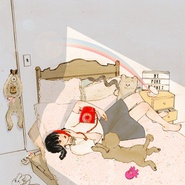
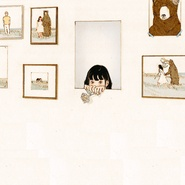

Miss.M
============================

|  |  |
| :--: | :-- |
| [ Miss.M](https://i.xiami.com/missm) | **播放数**: 1007218 **粉丝数**: 394 **评论数**: 30 **地区**: United States of America 美国 **风格**: 流行 Pop, 灵魂乐 Soul, 爵士 Jazz, 当代节奏布鲁斯 Contemporary R&B, 当代唱作人 Contemporary Singer-Songwriter  |

## 档案

## 专辑

| 名称 | 语种 | 唱片公司 | 发行时间 | 专辑类别 | 专辑风格 |
| :--: | :-- | :-- | :-- | :-- | :-- |
| [ glittery](./albums/5022312527.md) | 英语 | 独立发行 | 2020年12月25日 | EP, 单曲 | 流行 Pop, 欧美流行 Western Pop, 乡村民谣 Country Folk |
| [ ocean eyes](./albums/5022012816.md) | 英语 | 独立发行 | 2020年11月24日 | EP, 单曲 | 流行 Pop, 欧美流行 Western Pop, 根源唱作人 Singer-Songwriter |
| [ Dynamite](./albums/5021347695.md) | 英语 | 独立发行 | 2020年08月22日 | EP, 单曲 | 流行 Pop, 欧美流行 Western Pop, 韩国流行 K-Pop |
| [ 나빠 (NAPPA)](./albums/5021147397.md) | 韩语 | 独立发行 | 2020年07月20日 | EP, 单曲 | 韩国流行 K-Pop, 流行 Pop |
| [ How You Like That](./albums/5020972424.md) | 英语 | 独立发行 | 2020年06月26日 | EP, 单曲 | 流行 Pop, 韩国流行 K-Pop, 女子团体 Girl Group |
| [ rain on me](./albums/5020911643.md) | 英语 | 独立发行 | 2020年06月10日 | EP, 单曲 | 流行 Pop, 欧美流行 Western Pop |
| [ if the world was ending](./albums/5020739375.md) | 英语 | 独立发行 | 2020年05月26日 | EP, 单曲 | 流行 Pop, 欧美流行 Western Pop |
| [ 그대라는 시 / all about you / 名为你的诗 (호텔 델루나 OST Part 3)](./albums/5020556720.md) | 英语 | 独立发行 | 2020年05月10日 | EP, 单曲 | 流行 Pop, 韩国流行 K-Pop |
| [ oh my god (korean/english ver.)](./albums/2108313022.md) | 韩语 | 独立发行 | 2020年04月10日 | EP, 单曲 | 流行 Pop, 韩国流行 K-Pop |
| [ best part (mashup)](./albums/2108295130.md) | 英语 | 独立发行 | 2020年04月03日 | EP, 单曲 | 流行 Pop, 欧美流行 Western Pop, 灵魂乐 Soul |
| [ close to you](./albums/2106094248.md) | 英语 | 独立发行 | 2020年02月22日 | EP, 单曲 | 流行 Pop, 欧美流行 Western Pop |
| [ sleepy lagoon／偶遇](./albums/2105775535.md) | 英语 | 独立发行 | 2020年01月28日 | EP, 单曲 | 爵士 Jazz |
| [ right here](./albums/2105779903.md) | 英语 | 独立发行 | 2020年01月26日 | EP, 单曲 | 根源唱作人 Singer-Songwriter, 当代唱作人 Contemporary Singer-Songwriter, 另类唱作人 Alternative Singer-Songwriter |
| [ please never fall in love again](./albums/2105763467.md) | 英语 | 独立发行 | 2020年01月24日 | EP, 单曲 | 民谣 Folk, 当代民谣 Contemporary Folk, 独立民谣 Indie Folk |
| [ break my heart again](./albums/2105775652.md) | 英语 | 独立发行 | 2020年01月22日 | EP, 单曲 | 流行 Pop, 欧美流行 Western Pop |
| [ roxanne](./albums/2105721039.md) | 英语 | 独立发行 | 2020年01月15日 | EP, 单曲 | 流行 Pop, 欧美流行 Western Pop, 节奏布鲁斯 R&B |
| [ la la lost you](./albums/2105721038.md) | 英语 | 独立发行 | 2020年01月11日 | 录音室专辑 | 流行 Pop, 欧美流行 Western Pop, 根源唱作人 Singer-Songwriter |
| [ 清梦](./albums/2105537264.md) | 国语 |  | 2019年12月17日 | EP, 单曲 | 古风 GuFeng Music, 根源唱作人 Singer-Songwriter, 华语唱作人 Chinese Singer-Songwriter |
| [ everything i wanted](./albums/2105514576.md) | 英语 |  | 2019年11月24日 | EP, 单曲 | 流行 Pop, 欧美流行 Western Pop |
| [ what a wonderful world](./albums/2105486040.md) | 英语 |  | 2019年11月22日 | EP, 单曲 | 爵士 Jazz, 人声爵士 Vocal Jazz |
| [ lover](./albums/2105486041.md) | 英语 | 独立发行 | 2019年11月11日 | EP, 单曲 | 流行 Pop, 欧美流行 Western Pop, 根源唱作人 Singer-Songwriter |
| [ officially missing you](./albums/2105265388.md) | 英语 |  | 2019年09月21日 | EP, 单曲 | 爵士流行 Jazz Pop, 柔顺爵士 Smooth Jazz, 爵士 Jazz |
| [ do i wanna know](./albums/2105248753.md) | 英语 |  | 2019年09月14日 | EP, 单曲 | 摇滚 Rock & Roll, 英伦摇滚 Britpop |
| [ xanny](./albums/2105198866.md) | 英语 |  | 2019年08月30日 | EP, 单曲 | 流行 Pop, 欧美流行 Western Pop |
| [ i love you](./albums/2105174311.md) | 英语 |  | 2019年08月22日 | EP, 单曲 | 流行 Pop, 欧美流行 Western Pop, 根源唱作人 Singer-Songwriter |
| [ get you the moon](./albums/2105156884.md) | 英语 |  | 2019年08月15日 | EP, 单曲 | 另类唱作人 Alternative Singer-Songwriter, 根源唱作人 Singer-Songwriter, 当代唱作人 Contemporary Singer-Songwriter |
| [ shiver](./albums/2105044144.md) | 英语 |  | 2019年07月30日 | EP, 单曲 | 民谣 Folk, 当代民谣 Contemporary Folk, 独立民谣 Indie Folk |
| [ triggered](./albums/2105019738.md) | 英语 |  | 2019年07月24日 | EP, 单曲 | 另类节奏布鲁斯 Alternative R&B, 当代节奏布鲁斯 Contemporary R&B, 节奏布鲁斯 R&B |
| [ best friend](./albums/2105013866.md) | 英语 |  | 2019年07月22日 | EP, 单曲 | 根源唱作人 Singer-Songwriter, 当代唱作人 Contemporary Singer-Songwriter |
| [ difference](./albums/2104984413.md) | 英语 |  | 2019年06月28日 | EP, 单曲 | 根源唱作人 Singer-Songwriter, 当代唱作人 Contemporary Singer-Songwriter |
| [ isn't she lovely](./albums/2104984424.md) | 英语 |  | 2019年06月17日 | EP, 单曲 | 爵士 Jazz |
| [ lemonade](./albums/2104984431.md) | 英语 |  | 2019年06月12日 | EP, 单曲 | 另类节奏布鲁斯 Alternative R&B, 当代节奏布鲁斯 Contemporary R&B, 节奏布鲁斯 R&B |
| [ coffee](./albums/2104984422.md) | 英语 |  | 2019年06月08日 | EP, 单曲 | 根源唱作人 Singer-Songwriter, 当代唱作人 Contemporary Singer-Songwriter |
| [ escapism](./albums/2104902274.md) | 英语 |  | 2019年06月06日 | EP, 单曲 | 民谣 Folk, 当代唱作人 Contemporary Singer-Songwriter |
| [ crave you](./albums/2104984405.md) | 英语 |  | 2019年06月01日 | EP, 单曲 | 根源唱作人 Singer-Songwriter, 当代唱作人 Contemporary Singer-Songwriter |
| [ the moon song](./albums/2104984427.md) | 英语 |  | 2019年05月28日 | EP, 单曲 | 民谣 Folk, 当代民谣 Contemporary Folk, 独立民谣 Indie Folk |
| [ the hill](./albums/2104902285.md) | 英语 |  | 2019年05月21日 | EP, 单曲 | 根源唱作人 Singer-Songwriter |
| [ limbo](./albums/2104902283.md) | 英语 |  | 2019年04月28日 | EP, 单曲 | 另类唱作人 Alternative Singer-Songwriter, 当代唱作人 Contemporary Singer-Songwriter |
| [ baby blue](./albums/2105041373.md) | 英语 |  | 2019年04月24日 | EP, 单曲 | 根源唱作人 Singer-Songwriter, 当代唱作人 Contemporary Singer-Songwriter |
| [ 夏夜晚風midnight wind in summer](./albums/2105041378.md) | 英语 |  | 2019年03月02日 | EP, 单曲 | 民谣 Folk, 当代民谣 Contemporary Folk, 独立民谣 Indie Folk |
| [ nothing](./albums/2105041382.md) | 英语 |  | 2019年03月01日 | 精选集 | 根源唱作人 Singer-Songwriter, 当代唱作人 Contemporary Singer-Songwriter |
| [ sign of the times](./albums/2104617673.md) | 英语 | 独立发行 | 2019年02月22日 | EP, 单曲 | 英伦摇滚 Britpop |
| [ sunset/sunrise](./albums/2105041385.md) | 英语 |  | 2019年02月18日 | EP, 单曲 | 根源唱作人 Singer-Songwriter, 当代唱作人 Contemporary Singer-Songwriter |
| [ my boy](./albums/2105383821.md) | 英语 |  | 2019年02月09日 | EP, 单曲 | 流行 Pop, 欧美流行 Western Pop, 根源唱作人 Singer-Songwriter |
| [ Queen](./albums/2104577923.md) | 英语 |  | 2019年01月22日 | EP, 单曲 | 节奏布鲁斯 Rhythm & Blues, 欧美流行 Western Pop |
| [ imagine](./albums/2105041387.md) | 英语 |  | 2019年01月04日 | EP, 单曲 | 流行 Pop, 欧美流行 Western Pop |
| [ la vie en rose](./albums/2104439881.md) | 英语 |  | 2019年01月01日 | EP, 单曲 | 爵士 Jazz |
| [ falling for you深陷于你](./albums/2104196016.md) | 英语 |  | 2018年11月08日 | 录音室专辑 | 独立电子乐 Indietronica, 爵士 Jazz, 轻音乐 Easy Listening |
| [ 万圣节礼物请查收Halloween Gift](./albums/2104154498.md) | 英语 |  | 2018年10月31日 | EP, 单曲 | 流行 Pop, 迷幻流行 Psychedelic Pop |
| [ Miss.M的专辑](./albums/5022631135.md) | 其他 |  | 不详 |  |  |

## 评论

|  |  |  |  |
| :-- | :-- | :-- | :-- |
|  [虾米用户](https://emumo.xiami.com/u/37683545) 茫茫人生好似莽野。 2021-01-16 23:41 赞(0) 踩(0) | 
b站见
 |
|  [虾米用户](https://emumo.xiami.com/u/406047403) 啤酒喜欢冰块 2021-01-16 11:05 赞(0) 踩(0) | 
网易云见.
 |
|  [虾米用户](https://emumo.xiami.com/u/54676006) 冷記憶 2020-12-06 23:55 赞(0) 踩(0) | 
：
 |
|  [虾米用户](https://emumo.xiami.com/u/190758692)    遇到喜欢的歌就一定... 2020-10-27 17:13 赞(0) 踩(0) | 
我敲pljj！！！唱歌又好好听！！！
 |
|  [虾米用户](https://emumo.xiami.com/u/444656851) 妍儿快火起来呀！ 2020-09-24 17:14 赞(0) 踩(0) | 
小姐姐的声音太好了！
 |
|  [虾米用户](https://emumo.xiami.com/u/18677362) 活着就是 创造更多回忆 ... 2020-09-05 11:52 赞(0) 踩(0) | 
宝藏女孩✨
 |
|  [虾米用户](https://emumo.xiami.com/u/340234417) 大    `L 2020-09-04 23:15 赞(0) 踩(0) | 
同样都是零零后  加油！ 
 |
|  [虾米用户](https://emumo.xiami.com/u/358995000) 散场本是常态 尽兴而归就... 2020-08-31 09:47 赞(1) 踩(0) | 
Love  songs 怎么下架啦？？？
 |
|  [虾米用户](https://emumo.xiami.com/u/5188233) kukukukuku~ 2020-08-31 03:21 赞(0) 踩(0) | 
小姐姐声音很好听
 |
|  [虾米用户](https://emumo.xiami.com/u/37683545) 茫茫人生好似莽野。 2020-08-21 11:23 赞(0) 踩(0) | 
爱了
 |
|  [虾米用户](https://emumo.xiami.com/u/294678053)  2020-08-15 19:32 赞(0) 踩(0) | 
听过最棒的翻唱！越听越爱，这个声音太完美了！
 |
|  [虾米用户](https://emumo.xiami.com/u/435328240) Just happy. 2020-07-23 18:34 赞(0) 踩(0) | 
加油
 |
|  [虾米用户](https://emumo.xiami.com/u/334709324) 〠₍⁽˚⑅̆˚⁾₎ 2020-07-16 22:47 赞(0) 踩(0) | 
_
 |
|  [虾米用户](https://emumo.xiami.com/u/27061286) 云ID:韩沐熙 2020-07-04 20:25 赞(0) 踩(0) | 
。
 |
|  [虾米用户](https://emumo.xiami.com/u/2897156) 幻听捕食者 2020-06-06 17:32 赞(0) 踩(0) | 
舒服
 |
|  [虾米用户](https://emumo.xiami.com/u/2897156) 幻听捕食者 2020-06-06 17:32 赞(0) 踩(0) | 
舒服
 |
|  [虾米用户](https://emumo.xiami.com/u/55094882) ｉｄ９１ｏｍｏ＞Ｉ  2020-05-05 15:40 赞(1) 踩(0) | 
✨
 |
|  [虾米用户](https://emumo.xiami.com/u/16743367) - 4AM SNOW  ... 2020-04-30 20:56 赞(1) 踩(0) | 
。
 |
|  [虾米用户](https://emumo.xiami.com/u/358995000) 散场本是常态 尽兴而归就... 2020-03-10 23:04 赞(1) 踩(0) | 
☍☍☍☍☍☍☍☍☍☍☍☍⚙︎⚙︎⚙︎⚙︎⚙︎⚙︎⚙︎⚙︎⚙︎
 |
|  [虾米用户](https://emumo.xiami.com/u/159312506) 只为你狂歌 2020-02-22 22:30 赞(0) 踩(0) | 
新人，翻唱不错，我感觉喉结没完全打开，加油！ 
 |
|  [虾米用户](https://emumo.xiami.com/u/204759305) For❤Life 2020-02-19 15:52 赞(1) 踩(0) | 
小姐姐，喜欢上你了
 |
|  [虾米用户](https://emumo.xiami.com/u/40379612) 永远的虾米音乐 2019-12-17 14:51 赞(0) 踩(0) | 

 |
|  [虾米用户](https://emumo.xiami.com/u/102133446) 音乐不是消耗品 2019-12-08 16:08 赞(0) 踩(0) | 
来晚了
 |
|  [虾米用户](https://emumo.xiami.com/u/272976950) You are a mi... 2019-10-17 23:31 赞(0) 踩(0) | 
_
 |
|  [虾米用户](https://emumo.xiami.com/u/324879742)   2019-07-23 13:02 赞(2) 踩(0) | 
.
 |
|  [虾米用户](https://emumo.xiami.com/u/292190478) 命运看起来很残酷，但终有... 2019-07-14 00:08 赞(0) 踩(0) | 
很有潜力呢
 |
|  [虾米用户](https://emumo.xiami.com/u/20425956) 天若微雨，我心浅笑。 2019-06-28 20:36 赞(1) 踩(0) | 
哈哈，声音蛮特别呢 
 |
|  [虾米用户](https://emumo.xiami.com/u/84571136) 唯有音乐不离不弃 2019-06-21 10:42 赞(1) 踩(0) | 
嗯
 |
|  [虾米用户](https://emumo.xiami.com/u/260216815) 曲声入梦来 2019-06-09 07:20 赞(1) 踩(0) | 
很好的，很喜欢
 |
|  [虾米用户](https://emumo.xiami.com/u/411199044)  2018-12-24 22:25 赞(0) 踩(0) | 
唱的好听
 |
