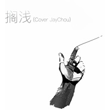

Tc
============================

|  |  |
| :--: | :-- |
| [ Tc](https://i.xiami.com/gtc) | **地区**: China 中国大陆 **风格**: 陷阱说唱 Trap Rap, 嘻哈 Hip-Hop, 流行 Pop **播放数**: 4432141 **粉丝数**: 207 **评论数**: 6  |

## 档案

## 专辑

| 名称 | 语种 | 唱片公司 | 发行时间 | 专辑类别 | 专辑风格 |
| :--: | :-- | :-- | :-- | :-- | :-- |
| [ 可惜没如果REMIX](./albums/2106094416.md) | 国语 | 独立发行 | 2020年02月22日 | EP, 单曲 | 流行说唱 Pop Rap |
| [ 1Min ( Intro )](./albums/2105594522.md) | 国语 |  | 2019年12月16日 | EP, 单曲 | 陷阱说唱 Trap Rap |
| [ Dream Girl](./albums/2105470735.md) | 国语 |  | 2019年11月21日 | EP, 单曲 | 流行说唱 Pop Rap |
| [ 颓废男孩](./albums/2105265527.md) | 国语 |  | 2019年10月02日 | EP, 单曲 | 陷阱说唱 Trap Rap |
| [ Feel My Word](./albums/2105159993.md) | 国语 |  | 2019年08月17日 | EP, 单曲 | 嘻哈 Hip-Hop |
| [ 秘密Remix秘密Remix](./albums/2105041518.md) | 国语 |  | 2019年07月29日 | 录音室专辑 | 流行说唱 Pop Rap |
| [ The Last Song](./albums/2105000840.md) | 国语 |  | 2019年07月18日 | 录音室专辑 | 嘻哈 Hip-Hop |
| [ 647](./albums/2104973188.md) | 国语 |  | 2019年07月05日 | 录音室专辑 | 流行说唱 Pop Rap |
| [ 善惡善惡DissTrack](./albums/2104967886.md) | 国语 |  | 2019年07月01日 | EP, 单曲 | 陷阱说唱 Trap Rap |
| [ 搁浅搁浅](./albums/2104650171.md) | 国语 |  | 2019年03月04日 | 录音室专辑 | 流行 Pop |
| [ 一路向北一路向北](./albums/2104650163.md) | 国语 |  | 2019年03月04日 | 录音室专辑 | 流行 Pop |
| [ 木偶行凶日记木偶行凶日记](./albums/2104478990.md) | 国语 |  | 2018年09月22日 | EP, 单曲 | 陷阱说唱 Trap Rap, 嘻哈 Hip-Hop |
| [ Tc-cover精选集](./albums/2103948481.md) | 国语 | 独立发行 | 2018年08月28日 | 精选集 | 流行 Pop |
| [ 男道MAN's WAY](./albums/2103947573.md) | 国语 | 独立发行 | 2018年08月26日 | EP, 单曲 | 陷阱说唱 Trap Rap, 嘻哈 Hip-Hop, 另类说唱 Alternative Hip Hop |

## 评论

|  |  |  |
| :-- | :-- | :-- |
|  [虾米用户](https://emumo.xiami.com/u/47176549)  2020-05-01 22:38 赞(0) 踩(0) | 
磁性
 |
|  [虾米用户](https://emumo.xiami.com/u/421760660)  2020-04-12 20:35 赞(0) 踩(0) | 
喜欢你那首最近，但是好像不见了 
 |
|  [虾米用户](https://emumo.xiami.com/u/42165242) そのままで 2020-03-08 22:09 赞(0) 踩(0) | 
宝藏男孩
 |
|  [虾米用户](https://emumo.xiami.com/u/289938151)  2020-02-09 15:36 赞(0) 踩(0) | 
加油，看好你
 |
|  [虾米用户](https://emumo.xiami.com/u/289938151)  2020-02-09 15:36 赞(0) 踩(0) | 
音色很好。
 |
|  [虾米用户](https://emumo.xiami.com/u/358175048)  2019-10-14 23:34 赞(0) 踩(0) | 
你的声音很好听
 |
