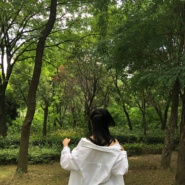

张雅静
============================

|  |  |
| :--: | :-- |
| [ 张雅静](https://i.xiami.com/zyjj) | **地区**: China 中国大陆 **风格**: 器乐独奏 Solo Instrumental, 轻音乐流行 Light Pop, 流行 Pop, 电音流行 Electropop, 网络流行 Cyber Hit **播放数**: 2529586 **粉丝数**: 142 **评论数**: 16  |

## 档案

青春就是不辜负喜欢的人和事.

## 专辑

| 名称 | 语种 | 唱片公司 | 发行时间 | 专辑类别 | 专辑风格 |
| :--: | :-- | :-- | :-- | :-- | :-- |
| [ 你的心河](./albums/2104996249.md) | 国语 |  | 2019年07月13日 | 录音室专辑 | 轻音乐 Easy Listening |
| [ 天空云海](./albums/2104907226.md) | 国语 |  | 2019年05月28日 | EP, 单曲 | 轻音乐 Easy Listening |
| [ Waiting此情可待](./albums/2104784232.md) | 国语 |  | 2019年04月17日 | EP, 单曲 | 轻音乐 Easy Listening |
| [ 静静呀](./albums/2104758922.md) | 国语 |  | 2019年04月09日 | 原声带, 影视音乐 | 轻音乐 Easy Listening |
| [ 追](./albums/2104478993.md) | 国语 |  | 2019年01月13日 | EP, 单曲 | 器乐独奏 Solo Instrumental, 轻音乐 Easy Listening |
| [ bling~](./albums/2104404694.md) | 国语 |  | 2018年12月22日 | EP, 单曲 | 轻音乐 Easy Listening |
| [ Sleep Alone](./albums/2104246976.md) | 纯音乐 |  | 2018年11月20日 | EP, 单曲 | 轻音乐 Easy Listening |
| [ 与你同在](./albums/2104087913.md) | 纯音乐 | 独立发行 | 2018年10月09日 | EP, 单曲 | 沙发音乐 Lounge, 器乐独奏 Solo Instrumental, 轻音乐 Easy Listening |
| [ My串烧](./albums/2104051678.md) | 国语 | 独立发行 | 2018年09月24日 | EP, 单曲 | 器乐独奏 Solo Instrumental, 轻音乐 Easy Listening, 轻音乐流行 Light Pop |
| [ 静静而已](./albums/2104031331.md) | 纯音乐 | 独立发行 | 2018年09月15日 | EP, 单曲 | 器乐独奏 Solo Instrumental, 轻音乐 Easy Listening, 轻音乐流行 Light Pop |
| [ Sweet dream一个甜甜的梦](./albums/2104005768.md) | 国语 | 独立发行 | 2018年09月09日 | 合集, 杂锦 | 器乐独奏 Solo Instrumental, 器乐流行 Instrumental Pop, 轻音乐 Easy Listening |
| [ 静静的音乐小树洞](./albums/2103962825.md) | 国语 | 独立发行 | 2018年09月02日 | 原声带, 影视音乐 | 器乐独奏 Solo Instrumental, 器乐流行 Instrumental Pop, 轻音乐流行 Light Pop |
| [ 吉他弹奏](./albums/2103963059.md) | 国语 | 独立发行 | 2018年08月31日 | 原声带, 影视音乐 | 器乐独奏 Solo Instrumental, 器乐流行 Instrumental Pop |
| [ 落](./albums/2105174224.md) | 国语 |  | 不详 | EP, 单曲 | 轻音乐 Easy Listening |

## 评论

|  |  |  |
| :-- | :-- | :-- |
|  [虾米用户](https://emumo.xiami.com/u/358104299) 悲观的唯心存在现实解构虚... 2021-01-19 09:36 赞(0) 踩(0) | 
46875
 |
|  [虾米用户](https://emumo.xiami.com/u/370785887)  2021-01-08 00:06 赞(0) 踩(0) | 
虾米要没了 唉....
 |
|  [虾米用户](https://emumo.xiami.com/u/28174495) 爱生活爱音乐 2020-08-21 20:57 赞(0) 踩(0) | 
抱走了
 |
|  [虾米用户](https://emumo.xiami.com/u/29339348) 设计师 2020-07-31 08:42 赞(0) 踩(0) | 
你好可爱
 |
|  [虾米用户](https://emumo.xiami.com/u/443874817) 心跳不止，无可代替！ 2020-06-29 07:46 赞(0) 踩(0) | 
心情不好！孤独恐惧症犯了！
 |
|  [虾米用户](https://emumo.xiami.com/u/443711720)  2020-06-19 21:06 赞(0) 踩(0) | 
加班
 |
|  [虾米用户](https://emumo.xiami.com/u/192506061)  2020-06-15 21:40 赞(0) 踩(0) | 
少年，加油
 |
|  [虾米用户](https://emumo.xiami.com/u/28174495) 爱生活爱音乐 2020-06-13 00:52 赞(0) 踩(0) | 
加油
 |
|  [虾米用户](https://emumo.xiami.com/u/61471846) 。 2020-05-03 22:36 赞(0) 踩(0) | 
钢琴好不好学
 |
|  [虾米用户](https://emumo.xiami.com/u/333907675)  2020-02-04 09:56 赞(0) 踩(0) | 
挺好听的
 |
|  [虾米用户](https://emumo.xiami.com/u/32148158) 我还没想好要写什么... 2019-05-29 10:39 赞(0) 踩(0) | 
为什么不把它弹完呀？
 |
|  [虾米用户](https://emumo.xiami.com/u/4182808) 你若关闭虾米，我必卸载淘... 2018-12-23 05:12 赞(1) 踩(0) | 
搜岸部真明出现可你，进来看看
 |
|  [虾米用户](https://emumo.xiami.com/u/407810136)  2018-11-11 18:17 赞(0) 踩(0) | 
       
 |
|  [虾米用户](https://emumo.xiami.com/u/362350799)  2018-09-24 18:46 赞(0) 踩(0) | 
一败涂地风生水起我都喜欢你
 |
|  [虾米用户](https://emumo.xiami.com/u/64612466) 我还没想好要写什么... 2018-09-23 23:30 赞(0) 踩(0) | 
会弹琴真好   
 |
|  [虾米用户](https://emumo.xiami.com/u/344530312) 我还没想好要写什么... 2018-09-04 23:57 赞(0) 踩(0) | 
加油
 |
