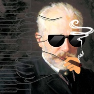

柴可夫斯基钢琴曲集
============================

|  |  |
| :--: | :-- |
| [ 柴可夫斯基钢琴曲集](https://emumo.xiami.com/album/5021452909) | **艺人**: [GS](../index.md) **语种**: 纯音乐 **唱片公司**: 独立发行 **发行时间**: 不详 **专辑类别**: 录音室专辑 **专辑风格**: 浪漫主义 Romanticism, 芭蕾 Ballet, 独奏 Recital **播放数**: 793 **收藏数**: 2 **评论数**: 0  |

## 简介

## 曲目

## 评论

|  |  |  |  |
| :-- | :-- | :-- | :-- |
