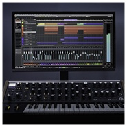
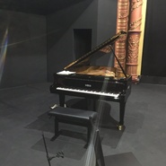
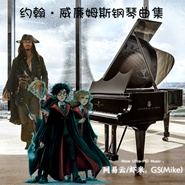
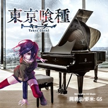

GS
============================

|  |  |
| :--: | :-- |
| [ GS](https://i.xiami.com/gsl) | **地区**: 中国大陆 China **风格**: 古典音乐 Classical, 游戏配乐 Video Game Music, 器乐独奏 Solo Instrumental, 卡通配乐 Cartoon Music, 电影原声 Film Score **播放数**: 1912062 **粉丝数**: 467 **评论数**: 27  |

## 档案

上限400MB了哦

## 专辑

| 名称 | 语种 | 唱片公司 | 发行时间 | 专辑类别 | 专辑风格 |
| :--: | :-- | :-- | :-- | :-- | :-- |
| [ 《原神》钢琴曲集](./albums/5021686177.md) | 纯音乐 | 独立发行 | 2020年10月16日 | 录音室专辑 | 游戏配乐 Video Game Music, 中国风 China-Wave, 器乐独奏 Solo Instrumental |
| [ <你的名字>钢琴曲集](./albums/5021474655.md) | 纯音乐 | 独立发行 | 2020年09月17日 | 录音室专辑 | 日本动漫游戏 Japanese ACG, 日本流行 J-Pop, 器乐独奏 Solo Instrumental |
| [ VOCALOID钢琴曲集](./albums/5021471752.md) | 纯音乐 | 独立发行 | 2020年09月17日 | 录音室专辑 | 器乐独奏 Solo Instrumental, 日本动漫游戏 Japanese ACG, 同人音乐 DouJin |
| [ 巴赫钢琴曲集](./albums/5021454785.md) | 纯音乐 | 独立发行 | 2020年09月14日 | 录音室专辑 | 巴洛克音乐 Baroque Music, 独奏 Recital, 键盘音乐 Keyboard |
| [ 东方Projet Vol.2](./albums/2104828075.md) | 纯音乐 | 独立发行 | 2019年12月25日 | 精选集 | 器乐独奏 Solo Instrumental, 日本流行 J-Pop, 同人音乐 DouJin |
| [ 流行钢琴曲Vol.1](./albums/2104164380.md) | 纯音乐 | 独立发行 | 2019年09月02日 | 精选集 | 器乐独奏 Solo Instrumental, 国语流行 Mandarin Pop, 器乐流行 Instrumental Pop |
| [ 久石让钢琴曲集Vol.1久石让音乐钢琴版](./albums/2104857634.md) | 纯音乐 | 独立发行 | 2019年08月13日 | 精选集 | 器乐独奏 Solo Instrumental, 电影原声 Film Score, 日本动漫游戏 Japanese ACG |
| [ 电影动漫音乐Remix Vol.2](./albums/2104349405.md) | 纯音乐 | 独立发行 | 2019年07月22日 | 精选集 | 日本动漫游戏 Japanese ACG, 原声 Soundtrack, 电影原声 Film Score |
| [ 无伴唱伴奏重制](./albums/2104988604.md) | 国语 | 独立发行 | 2019年07月12日 | 精选集 | 日本流行 J-Pop, 流行 Pop, 国语流行 Mandarin Pop |
| [ 肖邦钢琴曲集](./albums/2104888481.md) | 纯音乐 | 独立发行 | 2019年05月21日 | 录音室专辑 | 古典主义 Classical period, 独奏 Recital, 浪漫主义 Romanticism |
| [ 经典钢琴名曲制作曲Vol.1极致音质](./albums/2104881297.md) | 纯音乐 |  | 2019年05月20日 | 精选集 | 键盘音乐 Keyboard, 西方古典 Western Classical Music, 器乐独奏 Solo Instrumental |
| [ 英雄联盟音乐钢琴版](./albums/2104869905.md) | 纯音乐 |  | 2019年05月17日 | 精选集 | 游戏配乐 Video Game Music, 器乐独奏 Solo Instrumental, 电影原声 Film Score |
| [ 肖邦练习曲慢速版听力训练](./albums/2104888316.md) | 纯音乐 |  | 2019年05月15日 | 精选集 | 现代古典 Modern Classical, 独奏 Recital, 浪漫主义 Romanticism |
| [ 游戏音乐钢琴版](./albums/2104843761.md) | 纯音乐 |  | 2019年05月06日 | 精选集 | 网络流行 Cyber Hit, 器乐独奏 Solo Instrumental |
| [ 欧美流行音乐钢琴版](./albums/2104838033.md) | 纯音乐 |  | 2019年05月03日 | 精选集 | 欧美流行 Western Pop, 器乐独奏 Solo Instrumental, 器乐流行 Instrumental Pop |
| [ Game of Thrones 权力的游戏钢琴曲](./albums/2104846120.md) | 纯音乐 |  | 2019年04月03日 | 精选集 | 器乐流行 Instrumental Pop, 电影原声 Film Score |
| [ 未完成的Demo](./albums/2104600132.md) | 纯音乐 | 独立发行 | 2019年02月16日 | 精选集 | 器乐独奏 Solo Instrumental, 游戏配乐 Video Game Music, 电影原声 Film Score |
| [ John Williams钢琴曲集](./albums/2104155121.md) | 纯音乐 | 独立发行 | 2018年10月01日 | 精选集 | 器乐独奏 Solo Instrumental, 原声 Soundtrack, 电影原声 Film Score |
| [ 华丽改编的钢琴曲集Boston钢琴](./albums/2104406205.md) | 纯音乐 | 独立发行 | 不详 | 精选集 | 器乐独奏 Solo Instrumental, 日本动漫游戏 Japanese ACG, 电影原声 Film Score |
| [ 复仇者联盟钢琴曲](./albums/2104830159.md) | 纯音乐 |  | 不详 | 精选集 | 原声 Soundtrack, 电影原声 Film Score, 轻音乐流行 Light Pop |
| [ 水晶音乐无损](./albums/2104998969.md) | 纯音乐 | 独立发行 | 不详 | 精选集 | 轻音乐 Easy Listening, 电影原声 Film Score |
| [ 《 東京喰種》钢琴曲集](./albums/5021474231.md) | 纯音乐 | 独立发行 | 不详 | 录音室专辑 | 日本动漫游戏 Japanese ACG, 日本摇滚 J-Rock, 器乐独奏 Solo Instrumental |
| [ 《来自风平浪静的明天》钢琴曲集](./albums/5021450951.md) | 纯音乐 | 独立发行 | 不详 | 录音室专辑 | 日本动漫游戏 Japanese ACG, 同人音乐 DouJin, 器乐独奏 Solo Instrumental |
| [ 王国之心钢琴曲集](./albums/2104857577.md) | 纯音乐 |  | 不详 | 精选集 | 日本动漫游戏 Japanese ACG, 游戏配乐 Video Game Music, 器乐独奏 Solo Instrumental |
| [ 柴可夫斯基钢琴曲集](./albums/5021452909.md) | 纯音乐 | 独立发行 | 不详 | 录音室专辑 | 浪漫主义 Romanticism, 芭蕾 Ballet, 独奏 Recital |
| [ 《尼尔：机械纪元》钢琴曲集](./albums/5021472782.md) | 纯音乐 | 独立发行 | 不详 | 录音室专辑 | 日本动漫游戏 Japanese ACG, 游戏配乐 Video Game Music, 器乐独奏 Solo Instrumental |
| [ 《刀剑神域》钢琴曲集](./albums/5021479512.md) | 纯音乐 | 独立发行 | 不详 | 录音室专辑 | 器乐独奏 Solo Instrumental, 游戏配乐 Video Game Music, 日本动漫游戏 Japanese ACG |
| [ Re:ゼロから始める異世界生活](./albums/5021443879.md) | 纯音乐 | 独立发行 | 不详 | 录音室专辑 | 日本动漫游戏 Japanese ACG, 器乐独奏 Solo Instrumental, 日本流行 J-Pop |

## 评论

|  |  |  |
| :-- | :-- | :-- |
|  [虾米用户](https://emumo.xiami.com/u/289687772)  2020-11-17 08:38 赞(1) 踩(0) | 
优美动听的钢琴曲，值得收藏。
 |
|  [虾米用户](https://emumo.xiami.com/u/337518453)  2020-09-14 13:56 赞(0) 踩(0) | 
大佬 巫师3组曲怎么突然没了 
 |
| ⇒ |  [虾米用户](https://emumo.xiami.com/u/403644632) 我还没想好要写什么... 2020-09-14 22:30 赞(0) 踩(0) | 
不是大佬  我正在整理下列表，有些混乱。 会重传的，有好多也打算重制一下，包括巫师3。主要有好多力度太粗糙，踏板效果输出时因为故障没加上 
 |
| ⇒ |  [虾米用户](https://emumo.xiami.com/u/337518453)  2020-09-15 08:59 赞(0) 踩(0) | 
<q><b>Mike说：</b></q>
 |
| ⇒ |  [虾米用户](https://emumo.xiami.com/u/337518453)  2020-09-15 09:14 赞(0) 踩(0) | 
<q><b>keanu50601584说：</b></q>
 |
| ⇒ |  [虾米用户](https://emumo.xiami.com/u/403644632) 我还没想好要写什么... 2020-09-18 13:50 赞(0) 踩(0) | 
<q><b>keanu50601584说：</b></q>
 |
| ⇒ |  [虾米用户](https://emumo.xiami.com/u/403644632) 我还没想好要写什么... 2020-09-18 13:51 赞(0) 踩(0) | 
<q><b>keanu50601584说：</b></q>
 |
|  [虾米用户](https://emumo.xiami.com/u/357662728)  2020-08-20 12:56 赞(0) 踩(0) | 
 
 |
|  [虾米用户](https://emumo.xiami.com/u/39117369) 山东省五莲县极端音乐推广... 2020-07-22 20:46 赞(0) 踩(0) | 
低调的人
 |
|  [虾米用户](https://emumo.xiami.com/u/412537698)  2020-07-06 11:34 赞(0) 踩(0) | 
有简谱分享的话就更好了。
 |
|  [虾米用户](https://emumo.xiami.com/u/412537698)  2020-07-06 11:33 赞(1) 踩(0) | 
是个超级大神。
 |
|  [虾米用户](https://emumo.xiami.com/u/412537698)  2020-07-06 11:33 赞(1) 踩(0) | 
真是爆好听!                                                                    
 |
|  [虾米用户](https://emumo.xiami.com/u/412537698)  2020-07-06 11:31 赞(1) 踩(0) | 
钢琴之神。
 |
|  [虾米用户](https://emumo.xiami.com/u/204406103) I just don't... 2020-02-20 14:09 赞(2) 踩(0) | 
40后男生？ 
 |
|  [虾米用户](https://emumo.xiami.com/u/246421213) 唉美智子辣么可爱却辣么可... 2020-02-02 23:31 赞(3) 踩(0) | 
好棒好棒好棒好棒！
 |
|  [虾米用户](https://emumo.xiami.com/u/3707881) 等你有版权了我会回来爱你... 2020-01-03 17:01 赞(3) 踩(0) | 
有微信唉
 |
|  [虾米用户](https://emumo.xiami.com/u/173276000)  2019-12-26 02:10 赞(4) 踩(0) | 
有书出版吗大神？
 |
|  [虾米用户](https://emumo.xiami.com/u/252237183)  2019-11-02 14:00 赞(3) 踩(0) | 
钢琴声不像是boston弹出来的啊 
 |
|  [虾米用户](https://emumo.xiami.com/u/299929094) 我还没想好要写什么... 2019-08-14 23:58 赞(4) 踩(0) | 
好听
 |
|  [虾米用户](https://emumo.xiami.com/u/336910827) 我还没想好要写 2019-08-12 22:01 赞(4) 踩(0) | 
曲子中的琶音好好听
 |
|  [虾米用户](https://emumo.xiami.com/u/21216985) 缓缓归 2019-07-02 09:45 赞(3) 踩(0) | 
发现了宝藏~~
 |
|  [虾米用户](https://emumo.xiami.com/u/94045390)   2019-06-25 10:40 赞(3) 踩(0) | 
这几首曲子真纯净！感谢分享！
 |
|  [虾米用户](https://emumo.xiami.com/u/424694444)  2019-05-17 17:54 赞(1) 踩(0) | 
复联4片尾曲简谱是什么？
 |
|  [虾米用户](https://emumo.xiami.com/u/424694444)  2019-05-17 17:53 赞(2) 踩(0) | 
好听
 |
|  [虾米用户](https://emumo.xiami.com/u/326574093)  2019-04-12 22:54 赞(0) 踩(0) | 
厉害厉害
 |
|  [虾米用户](https://emumo.xiami.com/u/7010600) 相知相爱莫相忘 2019-03-11 01:00 赞(1) 踩(0) | 
好听
 |
|  [虾米用户](https://emumo.xiami.com/u/54821316)  2018-12-15 23:30 赞(2) 踩(0) | 
NB~~~~~~~~~~~
 |
