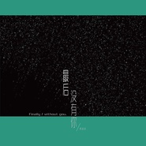

最后没有你
============================

|  |  |
| :--: | :-- |
| [ 最后没有你](https://emumo.xiami.com/album/2104024805) | **艺人**: [周星辰Met.Z](../index.md) **语种**: 国语 **唱片公司**: 独立发行 **发行时间**: 2018年09月13日 **专辑类别**: EP, 单曲 **专辑风格**: 流行 Pop, 国语流行 Mandarin Pop **播放数**: 2176973 **收藏数**: 8 **评论数**: 2  |

## 简介

 

其实我们每个人从懂事开始会经历许多人许多事
 

特别是爱情在你从初恋开始的那份热诚
 

很多人觉得一开始我们就可以走到最后
 

但是有多少即重新开始了下一段爱情
 

其实直到清醒才发现最后没有你
 

## 曲目

## 评论

|  |  |  |
| :-- | :-- | :-- |
|  [虾米用户](https://emumo.xiami.com/u/433634394)  2020-06-15 21:19 赞(0) 踩(0) | 
ll：tuff cttv…c5ff. Ryan part TTF pfrc
 |
|  [虾米用户](https://emumo.xiami.com/u/440331334)  2020-02-10 10:09 赞(0) 踩(0) | 
喜歡
 |
