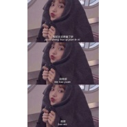

东西东西
============================

|  |  |
| :--: | :-- |
| [ 东西东西](https://emumo.xiami.com/album/2104324693) | **艺人**: [小熙](../index.md) **语种**: 国语 **唱片公司**:  **发行时间**: 2018年12月05日 **专辑类别**: 录音室专辑 **专辑风格**: 流行 Pop **播放数**: 675339 **收藏数**: 16 **评论数**: 0  |

## 简介

收到需要赶快回复的信息  
  
那就考虑看看是不是要回应你  
  
如果说以后都不用对你讲客气  
  
我就等着对你说一句欢迎光临  
  
在无人的海岛上有美丽风景  
  
想有梦里的竹蜻蜓带我去远行  
  
去到你心里的那个神秘的巴黎  
  
再想和你生一群baby  
  
我开始美丽的际遇  
  
你来自东或西  
  
都没有太大的关系  
  
都听你  
  
因为始终和你前进  
  
回忆并肩旅行  
  
我愿意陪着你去东和西  
  
收到需要赶快回复的信息  
  
那就考虑看看是不是要回应你  
  
如果说以后都不用对你讲客气  
  
我就等着对你说一句欢迎光临  
  
在无人的海岛上有美丽风景  
  
想有梦里的竹蜻蜓带我去远行  
  
去到你心里的那个神秘的巴黎  
  
再想和你生一群baby  
  
我开始美丽的际遇  
  
你来自东或西  
  
都没有太大的关系  
  
都听你  
  
因为始终和你前进  
  
回忆并肩旅行  
  
我愿意陪着你去东和西  
  
我开始美丽的际遇  
  
你来自东或西  
  
都没有太大的关系  
  
都听你  
  
因为始终和你前进  
  
回忆并肩旅行  
  
我愿意陪着你去东和西  
  
我愿意陪着你去东和西  

## 曲目

## 评论

