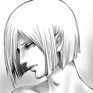

iw ix
============================

|  |  |
| :--: | :-- |
| [ iw ix](https://i.xiami.com/iw_ix) | **播放数**: 2374154 **粉丝数**: 275 **评论数**: 47 **地区**: China 中国大陆 **风格**: 新世纪音乐 New Age, 世界音乐 World Music, 轻音乐 Easy Listening  |

## 档案

iw ix，曾用名iの意志，80后业余音乐人，同时也是绿坝子的作者。 患有抑郁症、自闭症、沟通障碍、间接性精神病、人格分裂等多种缺陷，总结一句话：不正常人类兼坏人一个。

## 专辑

| 名称 | 语种 | 唱片公司 | 发行时间 | 专辑类别 | 专辑风格 |
| :--: | :-- | :-- | :-- | :-- | :-- |
| [ 无人知晓](./albums/5022592457.md) | 纯音乐 | 独立发行 | 2021年01月01日 | EP, 单曲 | 新世纪音乐 New Age, 轻音乐 Easy Listening, 世界音乐 World Music |
| [ 不再回头](./albums/5022117596.md) | 纯音乐 | 独立发行 | 2020年12月06日 | EP, 单曲 | 轻音乐 Easy Listening, 同人音乐 DouJin, 世界音乐 World Music |
| [ 世界的终结](./albums/5021755313.md) | 纯音乐 | 独立发行 | 2020年11月01日 | EP, 单曲 | 世界音乐 World Music, 管弦乐 Orchestral, 交响乐 Symphonic Music |
| [ 地球的叹息](./albums/5022307099.md) | 纯音乐 | 独立发行 | 2020年10月01日 | EP, 单曲 | 世界音乐 World Music, 管弦乐 Orchestral, 新世纪音乐 New Age |
| [ 若战必胜](./albums/5021162643.md) | 纯音乐 | 独立发行 | 2020年08月01日 | 录音室专辑 | 世界音乐 World Music, 交响乐 Symphonic Music, 合唱团 Choral |
| [ 夏(重新演奏版)](./albums/5020720549.md) | 纯音乐 | 独立发行 | 2020年07月01日 | 录音室专辑 | 新世纪音乐 New Age, 轻音乐 Easy Listening, 世界音乐 World Music |
| [ 萤火虫](./albums/5020620768.md) | 纯音乐 | 独立发行 | 2020年05月01日 | 录音室专辑 | 轻音乐 Easy Listening, 新世纪音乐 New Age, 独奏 Recital |
| [ 复苏](./albums/2108280797.md) | 纯音乐 | 独立发行 | 2020年05月01日 | 录音室专辑 | 轻音乐 Easy Listening, 世界音乐 World Music, 新世纪音乐 New Age |
| [ FGO绝对魔兽战线恰饭曲](./albums/2108392063.md) | 纯音乐 | 独立发行 | 2020年04月26日 | 录音室专辑 | 同人音乐 DouJin, 交响乐 Symphonic Music, 管弦乐 Orchestral |
| [ 钢琴小曲](./albums/2108148056.md) | 纯音乐 | 独立发行 | 2020年03月11日 | 录音室专辑 | 轻音乐 Easy Listening, 世界音乐 World Music, 独奏 Recital |
| [ 回家之路](./albums/2105767019.md) | 纯音乐 | 独立发行 | 2020年01月22日 | 录音室专辑 | 轻音乐 Easy Listening, 世界音乐 World Music, 新世纪音乐 New Age |
| [ 刺客](./albums/2105617649.md) | 纯音乐 | 独立发行 | 2020年01月05日 | 录音室专辑 | 世界音乐 World Music |
| [ 思念从未停过](./albums/2105586173.md) | 纯音乐 |  | 2019年12月15日 | 录音室专辑 | 轻音乐 Easy Listening, 新世纪音乐 New Age, 世界音乐 World Music |
| [ 光辉](./albums/2105494376.md) | 纯音乐 |  | 2019年11月24日 | 录音室专辑 | 世界音乐 World Music, 交响乐 Symphonic Music, 管弦乐 Orchestral |
| [ 被遗忘](./albums/5020975654.md) | 纯音乐 | 独立发行 | 2019年07月01日 | 录音室专辑 | 新世纪音乐 New Age, 轻音乐 Easy Listening, 世界音乐 World Music |
| [ 高考壮行](./albums/2104859139.md) | 纯音乐 |  | 2018年06月07日 | 录音室专辑 | 管弦乐 Orchestral, 世界音乐 World Music, 交响乐 Symphonic Music |
| [ 小猪佩奇铃声](./albums/2104042343.md) | 纯音乐 | 独立发行 | 2018年05月04日 | 录音室专辑 | 卡通配乐 Cartoon Music, 同人音乐 DouJin, 世界音乐 World Music |
| [ 说不出口](./albums/2104266152.md) | 纯音乐 |  | 2018年03月07日 | 录音室专辑 | 轻音乐 Easy Listening, 新世纪音乐 New Age, 世界音乐 World Music |
| [ 重逢](./albums/2104131221.md) | 纯音乐 | 独立发行 | 2018年01月27日 | 录音室专辑 | 轻音乐 Easy Listening, 新世纪音乐 New Age, 世界音乐 World Music |
| [ 风轻云淡](./albums/2104165578.md) | 纯音乐 |  | 2017年12月31日 | 录音室专辑 | 轻音乐 Easy Listening, 新世纪音乐 New Age, 独奏 Recital |
| [ 以前](./albums/2104266022.md) | 纯音乐 |  | 2017年09月02日 | 录音室专辑 | 轻音乐 Easy Listening, 新世纪音乐 New Age, 世界音乐 World Music |
| [ 遇见你真好](./albums/2105230090.md) | 纯音乐 |  | 2017年07月08日 | 录音室专辑 | 轻音乐 Easy Listening, 新世纪音乐 New Age, 世界音乐 World Music |
| [ 前前前世钢琴版](./albums/2104131234.md) | 纯音乐 | 独立发行 | 2017年03月15日 | 录音室专辑 | 日本动漫游戏 Japanese ACG, 同人音乐 DouJin, 独奏 Recital |
| [ 心中的泪](./albums/2104265996.md) | 纯音乐 |  | 2017年03月10日 | 录音室专辑 | 轻音乐 Easy Listening, 新世纪音乐 New Age, 世界音乐 World Music |
| [ 它走了](./albums/2104188976.md) | 纯音乐 |  | 2016年12月01日 | 录音室专辑 | 轻音乐 Easy Listening, 新世纪音乐 New Age, 世界音乐 World Music |
| [ 萤火虫之墓](./albums/2104266170.md) | 纯音乐 |  | 2016年11月07日 | 录音室专辑 | 同人音乐 DouJin, 轻音乐 Easy Listening, 世界音乐 World Music |
| [ PPAP](./albums/2104623961.md) | 纯音乐 | 独立发行 | 2016年10月09日 | 录音室专辑 | 摇滚 Rock & Roll, 世界音乐 World Music |
| [ 生日快乐](./albums/2104042349.md) | 纯音乐 | 独立发行 | 2016年07月30日 | 录音室专辑 | 轻音乐 Easy Listening, 独奏 Recital, 世界音乐 World Music |
| [ 悲伤铃声](./albums/2104042352.md) | 纯音乐 | 独立发行 | 2016年03月07日 | 录音室专辑 | 同人音乐 DouJin, 轻音乐 Easy Listening, 世界音乐 World Music |
| [ 世上只有妈妈好](./albums/2105018557.md) | 纯音乐 |  | 2015年09月13日 | 录音室专辑 | 儿歌 Nursery Rhyme, 轻音乐 Easy Listening, 新世纪音乐 New Age |
| [ 鬼琴の谢幕](./albums/2105344533.md) | 纯音乐 |  | 2014年05月13日 | 录音室专辑 | 同人音乐 DouJin, 轻音乐 Easy Listening, 世界音乐 World Music |
| [ 千本樱](./albums/2104082889.md) | 纯音乐 | 独立发行 | 2014年05月06日 | 录音室专辑 | 同人音乐 DouJin, 轻音乐 Easy Listening, 新世纪音乐 New Age |
| [ 狂気三连奏](./albums/2104878575.md) | 纯音乐 |  | 2014年04月01日 | 录音室专辑 | 轻音乐 Easy Listening, 独奏 Recital, 世界音乐 World Music |
| [ 梦中的婚礼](./albums/2104936351.md) | 纯音乐 |  | 2014年02月23日 | 录音室专辑 | 轻音乐 Easy Listening, 独奏 Recital, 新世纪音乐 New Age |
| [ 天空之城钢琴](./albums/2104042345.md) | 纯音乐 | 独立发行 | 2010年08月25日 | 录音室专辑 | 同人音乐 DouJin, 轻音乐 Easy Listening, 新世纪音乐 New Age |
| [ 鬼琴鸣奏响](./albums/2104042347.md) | 纯音乐 | 独立发行 | 2009年12月03日 | 录音室专辑 | 同人音乐 DouJin, 轻音乐 Easy Listening, 新世纪音乐 New Age |
| [ 精神存在](./albums/2104579281.md) | 纯音乐 |  | 2008年08月07日 | EP, 单曲 | 轻音乐 Easy Listening, 新世纪音乐 New Age, 世界音乐 World Music |
| [ CLANNAD钢琴版](./albums/2104989814.md) | 纯音乐 |  | 2007年10月04日 | 录音室专辑 | 同人音乐 DouJin, 轻音乐 Easy Listening, 独奏 Recital |

## 评论

|  |  |  |  |
| :-- | :-- | :-- | :-- |
|  [虾米用户](https://emumo.xiami.com/u/4780612) 人生顺其自然 2021-01-05 17:52 赞(3) 踩(0) | 
虾米，我的故乡，我第一首曲子的发布平台，终究还是落幕了，以后我只能转移去QQ music了，希望在QQ music还能见到大家，再次对虾米说：谢谢你长久以来的陪伴！盼你重开的那一天。
 |
| ⇒ |  [虾米用户](https://emumo.xiami.com/u/33757554) 大概迷路了 2021-01-05 22:45 赞(0) 踩(0) | 
最后故事还是走向了尾声
 |
|  [虾米用户](https://emumo.xiami.com/u/1015306) 匍匐在7.1秒的水 2020-11-30 13:29 赞(0) 踩(0) | 
哪里还能听到你
 |
| ⇒ |  [虾米用户](https://emumo.xiami.com/u/4780612) 人生顺其自然 2020-12-05 09:57 赞(0) 踩(0) | 
QQ
 |
|  [虾米用户](https://emumo.xiami.com/u/257868427)  2020-08-28 11:57 赞(1) 踩(0) | 
请问还有机会能听到回忆这首吗，真的很好听
 |
|  [虾米用户](https://emumo.xiami.com/u/441838760) ............... 2020-08-08 18:34 赞(1) 踩(0) | 
永远支持你 
 |
|  [虾米用户](https://emumo.xiami.com/u/42966238)   . 2020-07-20 01:29 赞(1) 踩(0) | 
来了
 |
|  [虾米用户](https://emumo.xiami.com/u/47568735) 学生党  依然常驻虾米 2020-06-19 20:42 赞(2) 踩(0) | 
请问有前前前世钢琴版的琴谱嘛 试着弹了下网上琴谱的旋律之后还是觉得这个最接近原版 多谢了
 |
| ⇒ |  [虾米用户](https://emumo.xiami.com/u/4780612) 人生顺其自然 2020-06-22 14:35 赞(0) 踩(0) | 
有啊都让你留邮箱了
 |
| ⇒ |  [虾米用户](https://emumo.xiami.com/u/47568735) 学生党  依然常驻虾米 2020-07-02 17:40 赞(0) 踩(0) | 
<q><b>iw ix说：</b></q>
 |
| ⇒ |  [虾米用户](https://emumo.xiami.com/u/47568735) 学生党  依然常驻虾米 2020-07-02 17:41 赞(0) 踩(0) | 
<q><b>iw ix说：</b></q>
 |
|  [虾米用户](https://emumo.xiami.com/u/783808) 夏夜，霓虹灯照亮的天际，... 2020-02-21 08:10 赞(1) 踩(0) | 
来迟了
 |
|  [虾米用户](https://emumo.xiami.com/u/414607523) OMG 2019-12-14 22:42 赞(2) 踩(0) | 
请问《千本樱》钢琴业余九级弹合适吗？谢谢您！
 |
| ⇒ |  [虾米用户](https://emumo.xiami.com/u/4780612) 人生顺其自然 2019-12-14 22:55 赞(0) 踩(0) | 
够了
 |
| ⇒ |  [虾米用户](https://emumo.xiami.com/u/414607523) OMG 2019-12-15 07:51 赞(0) 踩(0) | 
<q><b>iw ix说：</b></q>
 |
|  [虾米用户](https://emumo.xiami.com/u/124515996)  2019-10-16 13:44 赞(1) 踩(0) | 
怎么了
 |
|  [虾米用户](https://emumo.xiami.com/u/400715332) 留白 2019-10-15 21:30 赞(2) 踩(0) | 
支持
 |
|  [虾米用户](https://emumo.xiami.com/u/426046575) 准备好对抗伏地魔了么？ 2019-09-12 07:49 赞(1) 踩(0) | 

 |
|  [虾米用户](https://emumo.xiami.com/u/50084518)   2019-07-08 23:15 赞(1) 踩(0) | 
发生了啥？重新注册了？
 |
|  [虾米用户](https://emumo.xiami.com/u/400715332) 留白 2019-05-13 22:50 赞(3) 踩(0) | 
Lucky
 |
|  [虾米用户](https://emumo.xiami.com/u/237225170) 睡眠奢侈品 2019-04-20 23:43 赞(5) 踩(0) | 
抑郁症伙伴来归队啦
 |
|  [虾米用户](https://emumo.xiami.com/u/219847384) 很荣幸遇见你. 2019-02-14 02:39 赞(3) 踩(0) | 
欢迎回来 
 |
|  [虾米用户](https://emumo.xiami.com/u/318106530)  2019-02-07 21:44 赞(1) 踩(0) | 
大大，我特别喜欢你的那首生命的旅途那首曲子，为什么现在没有了？能有机会在听到么？
 |
|  [虾米用户](https://emumo.xiami.com/u/4780612) 人生顺其自然 2019-02-05 09:30 赞(41) 踩(0) | 
祝大家新年快乐，身体健康，万事顺意，阖家平安，天天快乐！
 |
| ⇒ |  [虾米用户](https://emumo.xiami.com/u/191469939) It is crysta... 2019-02-10 20:18 赞(0) 踩(0) | 
新年快乐吖！
 |
| ⇒ |  [虾米用户](https://emumo.xiami.com/u/340180335) 掌握好自我 进退有度量 2019-03-28 17:02 赞(0) 踩(0) | 
呜呜呜我错过大大辽，迟来的新年快乐！
 |
|  [虾米用户](https://emumo.xiami.com/u/281991631) 我是咸鱼，但是我不一样！ 2019-01-29 21:53 赞(4) 踩(0) | 
留爪，以后你好了，火了，千万不要忘记我啊
 |
|  [虾米用户](https://emumo.xiami.com/u/281991631) 我是咸鱼，但是我不一样！ 2019-01-29 21:51 赞(4) 踩(0) | 
我知道，你不是坏人。
 |
|  [虾米用户](https://emumo.xiami.com/u/323249313) 牵你的手，从心动到古稀。... 2019-01-01 20:02 赞(1) 踩(0) | 
喜欢你的古风合集
 |
|  [虾米用户](https://emumo.xiami.com/u/12326477) 喜风喜雨 只喜欢你-落幕 2018-12-31 10:38 赞(1) 踩(0) | 
⛽️
 |
|  [虾米用户](https://emumo.xiami.com/u/410378308) 大将军，一言九鼎 2018-12-11 17:55 赞(3) 踩(0) | 
永远支持您，不伦您之前做了什么qwq♡
 |
|  [虾米用户](https://emumo.xiami.com/u/410378308) 大将军，一言九鼎 2018-12-11 17:54 赞(1) 踩(0) | 
qwq大大加油呀♡
 |
|  [虾米用户](https://emumo.xiami.com/u/354868537)  2018-11-27 19:27 赞(4) 踩(0) | 
虽然不知道发生了什么，但我很喜欢你！我是你第30个粉丝，虽然从头来了，但是绝对不会倒头来！
 |
|  [虾米用户](https://emumo.xiami.com/u/8180345) 原谅我为世事浮沉曾离开，... 2018-11-24 04:51 赞(1) 踩(0) | 
我只想问有没有人有他百度网盘的副本，把曲子分享一下，现在到处找不到很头疼
 |
|  [虾米用户](https://emumo.xiami.com/u/281991631) 我是咸鱼，但是我不一样！ 2018-11-22 22:07 赞(1) 踩(0) | 
我……尽力了。你要坚持，好吗
 |
|  [虾米用户](https://emumo.xiami.com/u/281991631) 我是咸鱼，但是我不一样！ 2018-11-22 21:44 赞(1) 踩(0) | 
没事的，你很幸运。上帝在这里祝福李。
 |
|  [虾米用户](https://emumo.xiami.com/u/281991631) 我是咸鱼，但是我不一样！ 2018-11-22 21:42 赞(2) 踩(0) | 
祝……你幸运。
 |
|  [虾米用户](https://emumo.xiami.com/u/408033096) 划水咸鱼 2018-11-17 03:01 赞(1) 踩(0) | 
缺了太多歌 ，鬼琴天地响都没有
 |
|  [虾米用户](https://emumo.xiami.com/u/198079001)   2018-11-17 01:25 赞(0) 踩(0) | 
怎么没红叶了
 |
|  [虾米用户](https://emumo.xiami.com/u/92697494)  2018-11-16 20:40 赞(0) 踩(0) | 
想下载你的幻
 |
|  [虾米用户](https://emumo.xiami.com/u/275203008)   2018-10-30 19:11 赞(1) 踩(0) | 
你的前前前世是我最喜欢的版本
 |
|  [虾米用户](https://emumo.xiami.com/u/201461725) 一生温暖纯良，不舍爱与自... 2018-10-22 22:04 赞(2) 踩(0) | 
不管怎么样还是很喜欢 
 |
|  [虾米用户](https://emumo.xiami.com/u/335243292) 心远地自偏 2018-10-02 20:33 赞(1) 踩(0) | 
发生了什么(ﾟoﾟ;
 |
|  [虾米用户](https://emumo.xiami.com/u/35181873) 凯尔特和传统民谣的小白~ 2018-09-28 17:12 赞(3) 踩(0) | 
你换号是不是以为大家可以继续被你骗？
 |
|  [虾米用户](https://emumo.xiami.com/u/185527084) 我还没想好要写什么... 2018-09-27 21:05 赞(4) 踩(0) | 
请把赏月重新上传。。找不到听不到的感觉很难过。那张专辑我不记得叫什么名字了，但都是很中国风很悠扬婉转的调子，很美很让人沉醉。播放时画面是水彩所绘的曼珠沙华。
 |
| ⇒ |  [虾米用户](https://emumo.xiami.com/u/7800600) 花が散る世界。 2018-10-11 16:53 赞(0) 踩(0) | 
赏月的原曲是这个：Nash Music Library - 月夜の子守唄 (inst)&nbsp;原曲链接：<a href="https://www.nash.jp/fum/search/detail/NSK-V710-13" target="_blank" rel="nofollow noreferrer noopener">https://www.nash.jp/fum/search/detail/NSK-V710-13</a>iw ix只不过是把别人的曲子冠上自己原创而已，都说不上抄袭了大概是剽窃吧
 |
|  [虾米用户](https://emumo.xiami.com/u/31028791) 网易和q也是神圣剑帝 2018-09-21 08:07 赞(1) 踩(0) | 
什么鬼
 |
