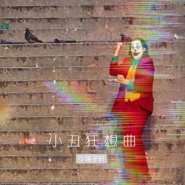

蒋子轩
============================

|  |  |
| :--: | :-- |
| [ 蒋子轩](https://i.xiami.com/zixuan123) | **地区**: China 中国大陆 **风格**: 华语唱作人 Chinese Singer-Songwriter **播放数**: 614852 **粉丝数**: 19 **评论数**: 0  |

## 档案

蒋子轩（Jaster）于1996年出生，辽宁沈阳人，就读河北美术学院环境艺术专业，一位连续创业者。在他身上，你看不到即将毕业的迷茫和在陌生城市打拼的孤独，因为每当前奏响起时，这位“不著名音乐人”的故事都刚开始。

## 专辑

| 名称 | 语种 | 唱片公司 | 发行时间 | 专辑类别 | 专辑风格 |
| :--: | :-- | :-- | :-- | :-- | :-- |
| [ 好梦开场第五届大连市科技创业大赛宣传主题曲](./albums/2104937645.md) | 国语 |  | 2019年06月10日 | EP, 单曲 | 流行 Pop, 华语唱作人 Chinese Singer-Songwriter |
| [ 原来的家](./albums/2104309469.md) | 国语 | 太声文化 | 2018年12月01日 | EP, 单曲 | 民谣 Folk, 流行 Pop, 华语唱作人 Chinese Singer-Songwriter |
| [ 小丑狂想曲](./albums/2104096404.md) | 国语 | 独立发行 | 2018年10月09日 | EP, 单曲 | 流行 Pop, 华语唱作人 Chinese Singer-Songwriter |
| [ 蒋子轩翻唱合辑](./albums/2104080103.md) | 国语 | 独立发行 | 2018年10月01日 | 精选集 | 国语流行 Mandarin Pop |
| [ 森林天堂](./albums/2104069115.md) | 国语 | 独立发行 | 2018年09月30日 | EP, 单曲 | 民谣 Folk, 流行 Pop, 华语唱作人 Chinese Singer-Songwriter |

## 评论

