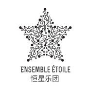

 恒星乐团
============================

|  |  |
| :--: | :-- |
| [  恒星乐团](https://i.xiami.com/etoile) | **播放数**: 1717385 **粉丝数**: 374 **评论数**: 11 **地区**: China 中国大陆 **风格**:   |

## 档案

「恒星乐团」是由活跃于世界各地的⻘年⾳乐家们组成。乐团特色在于结合了中国传统的民族传统乐器笛⼦、     ⼆胡、琵琶，蒙古族的马头琴、融合了⻄方⾳乐三⼤乐器中的大提琴与古典吉他。不同的音乐背景，让他们在⾳乐的创作与演绎上独具⻛格，加上打击乐强烈的节奏律动，他们的⾳乐更值得⼤家的期待！2017乐团受邀作为天地世界音乐节发布现场演出嘉宾。6月开启「恒星乐团」巡回演出，10月受邀上海国际艺术节，11月受邀法国驻上海总领馆领事官邸做专场演出，18年1月受邀凯迪拉克上海音乐厅，5月宁夏大剧院专场音乐会，6月上海法国夏季音乐节，7月无锡星期广播音乐会，9月2018天地世界音乐节，受到国内外观众的推崇！「恒星乐团」现为美国达达里奥签约艺术家团体。 
[Ensemble Étoile] is formed by active young musicians from all over the world. The Ensemble features a combination of the traditional ethnic musical instruments of thousands years of history in China – Chinese flute, Erhu, Pipa, Mongolian Morinkhuur – and cello, classical guitar as two of the three major musical instruments in the western world. Different musical backgrounds have endowed them with unique styles in the creation and interpretation of music; added by the strong rhythm of the percussion music, their music is more worthy of everyone's expectation! Since its establishment, Étoile has been invited to the concert halls of multiple places for special concerts. September 2018, Étoile was invited as a live guest of World Music Festival. June 2018, was invited by Shanghai French Summer Festival; July 2018, Étoile was invited by the Wu Xi Radio Grand Concert Series, where it received warm welcome and admiration from the audience home and abroad! [Ensemble Étoile] is the signed artist group of D’Addario.

## 专辑

| 名称 | 语种 | 唱片公司 | 发行时间 | 专辑类别 | 专辑风格 |
| :--: | :-- | :-- | :-- | :-- | :-- |
| [ 恒星Étoile](./albums/2104054472.md) | 国语 | 禾广娱乐 | 2018年09月05日 | 录音室专辑 | 器乐独奏 Solo Instrumental, 世界融合 World Fusion, 世界音乐 World Music |

## 评论

|  |  |  |  |
| :-- | :-- | :-- | :-- |
|  [虾米用户](https://emumo.xiami.com/u/406106828)  2020-06-18 18:28 赞(1) 踩(0) | 
希望你们能继续加油！你们的歌很好听。
 |
|  [虾米用户](https://emumo.xiami.com/u/357380221) 纵一苇之所如。 2020-05-20 02:46 赞(1) 踩(0) | 
你们做中文-法语翻唱吗？
 |
|  [虾米用户](https://emumo.xiami.com/u/410798227)  2020-04-26 11:34 赞(0) 踩(0) | 

 |
|  [虾米用户](https://emumo.xiami.com/u/200809645)  2020-01-02 20:25 赞(3) 踩(0) | 
星光大道刷到哦
 |
| ⇒ |  [虾米用户](https://emumo.xiami.com/u/297384757) 傳承是我們永「恆」的靈魂 2020-03-22 01:11 赞(0) 踩(0) | 
多谢关注哦
 |
|  [虾米用户](https://emumo.xiami.com/u/15272274) 我还没想好要写什么... 2019-05-29 12:36 赞(2) 踩(0) | 
昨晚在东景缘的演出太棒啦，既古典又民族，现场的音乐干净通透层次分明还诙谐有趣，其实高雅音乐民俗音乐并没有明显的界限，也不是不能融合，年轻的音乐家门都是好样的支持你们的创新。
 |
| ⇒ |  [虾米用户](https://emumo.xiami.com/u/297384757) 傳承是我們永「恆」的靈魂 2019-10-26 01:39 赞(0) 踩(0) | 
多谢您的支持
 |
|  [虾米用户](https://emumo.xiami.com/u/369776668)  2019-04-30 13:22 赞(2) 踩(0) | 
今天中午的演出很棒！谢谢 
 |
|  [虾米用户](https://emumo.xiami.com/u/323967883)  2018-11-13 19:43 赞(2) 踩(0) | 
超赞专业娴熟的演奏，专注动情的表现力现场版的演奏非常好！非常有感染力       
 |
|  [虾米用户](https://emumo.xiami.com/u/297384757) 傳承是我們永「恆」的靈魂 2018-10-01 01:39 赞(3) 踩(0) | 
谢谢，我们一定会多多给大家带来不同的作品
 |
|  [虾米用户](https://emumo.xiami.com/u/256760299) 我还没想好要写什么... 2018-09-30 03:19 赞(3) 踩(0) | 
非常赞的乐团，期待你们的更多优秀作品！
 |
