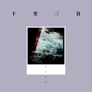
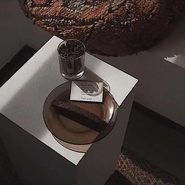

Uncee
============================

|  |  |
| :--: | :-- |
| [ Uncee](https://i.xiami.com/unco) | **播放数**: 2711347 **粉丝数**: 40 **评论数**: 1 **地区**: China 中国大陆 **风格**: 老派说唱 Old-school Hip Hop, 嘻哈 Hip-Hop, 爵士说唱 Jazz Rap, 西岸说唱 West Coast Hip Hop, 地下说唱 Underground Hip Hop  |

## 档案

来自成都年轻的Uncee团队，AC&LEON

## 专辑

| 名称 | 语种 | 唱片公司 | 发行时间 | 专辑类别 | 专辑风格 |
| :--: | :-- | :-- | :-- | :-- | :-- |
| [ 1717](./albums/2104729409.md) | 英语 |  | 2020年04月02日 | 录音室专辑 | 嘻哈 Hip-Hop |
| [ 十劣三良](./albums/2104607471.md) | 国语 | 独立发行 | 2019年02月20日 | EP, 单曲 | 爵士说唱 Jazz Rap, 老派说唱 Old-school Hip Hop, 嘻哈 Hip-Hop |
| [ 煲耳机专用](./albums/2104262002.md) | 其他 |  | 2018年11月22日 | 录音室专辑 | 电子 Electronic |
| [ 淡](./albums/2104105899.md) | 国语 | 独立发行 | 2018年10月06日 | EP, 单曲 | 老派说唱 Old-school Hip Hop |
| [ 降压专用](./albums/2105251566.md) | 其他 |  | 不详 | 录音室专辑 | 电子 Electronic |
| [ 昼夜](./albums/5020602869.md) | 国语 | 独立发行 | 不详 | 录音室专辑 | 嘻哈 Hip-Hop |

## 评论

|  |  |  |  |
| :-- | :-- | :-- | :-- |
|  [虾米用户](https://emumo.xiami.com/u/406042592) 我还没想好要写什么... 2018-10-14 14:08 赞(0) 踩(0) | 
好听 里昂
 |
