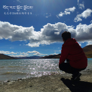
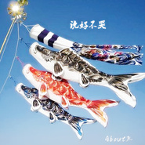

孔亮
============================

|  |  |
| :--: | :-- |
| [ 孔亮](https://i.xiami.com/kongliang) | **播放数**: 3066993 **粉丝数**: 1350 **评论数**: 10 **地区**: China 中国大陆 **风格**: 器乐流行 Instrumental Pop, 轻音乐 Easy Listening, 器乐独奏 Solo Instrumental, 轻音乐流行 Light Pop  |

## 档案

小檔案 
中 文 名：孔亮 
外 文 名：Ryohei Kong 
別    名：孔狗嗨 
國    籍：中國 
民    族：漢族 
星    座：摩羯座 
血    型：B型 
身    高：187cm 
體    重：72kg 
出 生 地：北京 
出生日期：1991年1月4日 
職    業：教育工作者 
畢業院校：北京理工大學 北京大學 
專    業：公共事業管理 人力資源管理 
代表作品：夜的鋼琴曲系列、About埋名、River Flows In You、第105天 
藝人簡介 
孔亮，1991年1月4日出生於北京石景山區，Echo音樂鋼琴演奏者/HR/PM/教育工作者。孔亮大學就讀於北京理工大學公共事業管理系，主科為公共事務管理，在大學期間系統的向中央音樂學院劉殊老師學習鋼琴，並在朋友的推薦下參加了學校的音樂社，擔任鍵盤手，社團匯報演出演奏Beyond的《海闊天空》。陸續發行了《大學琴戀》《愛之夢》《夜的鋼琴曲》《Next To You》等專輯。2016年3月搬運服務器機箱壓傷左手中指無名指，練琴停滯。 
藝人經歷 
2011年6月，北京理工大學（BIT）社團匯報演出，擔任音樂社鍵盤手的他演奏Beyond的《海闊天空》，這是他舞臺上面對眾人的鋼琴演奏首秀。 
2011年11月，推出首張大學彈奏的鋼琴作品合集《大學琴戀》，收錄他在大學期間鋼琴演奏的作品。 
2012-2013年，在樂播（短視頻APP）發布他演奏的短視頻鋼琴曲，多次上熱門排行榜前十。 
2014年7月，推出關於描繪愛情的鋼琴精選輯《愛之夢》。 
2015年7月，推出電鋼琴演奏的兩張專輯 《夜的鋼琴曲》系列輯，《Next To You》精選輯。 
2016年3月，搬運服務器機箱壓傷左手中指無名指，練琴停滯。

## 专辑

| 名称 | 语种 | 唱片公司 | 发行时间 | 专辑类别 | 专辑风格 |
| :--: | :-- | :-- | :-- | :-- | :-- |
| [ བོད་རང་སྐྱོང་ལྗོངས།西藏](./albums/5021752058.md) | 纯音乐 | 独立发行 | 2020年10月24日 | 精选集 | 器乐流行 Instrumental Pop, 轻音乐流行 Light Pop, 器乐独奏 Solo Instrumental |
| [ Master Assassin](./albums/5021505383.md) | 纯音乐 | 独立发行 | 2020年09月24日 | 录音室专辑 | 轻音乐 Easy Listening, 轻音乐流行 Light Pop |
| [ 孔亮原创钢琴作品](./albums/2108271226.md) | 纯音乐 | 独立发行 | 2020年03月21日 | 录音室专辑 | 轻音乐 Easy Listening, 轻音乐流行 Light Pop, 器乐独奏 Solo Instrumental |
| [ 说好不哭](./albums/2105265493.md) | 国语 | 独立发行 | 2019年08月25日 | 精选集 | 器乐流行 Instrumental Pop, 轻音乐 Easy Listening, 轻音乐流行 Light Pop |
| [ LeT Me hEar讓我聽見](./albums/2104974871.md) | 纯音乐 |  | 2019年07月06日 | 录音室专辑 | 器乐独奏 Solo Instrumental, 器乐流行 Instrumental Pop, 轻音乐 Easy Listening |
| [ 愛之夢精選輯](./albums/2104917680.md) | 国语 |  | 2019年05月27日 | 精选集 | 器乐独奏 Solo Instrumental, 轻音乐 Easy Listening, 轻音乐流行 Light Pop |
| [ Next To You與妳同在](./albums/2104107123.md) | 纯音乐 | 独立发行 | 2015年07月22日 | 原声带, 影视音乐 | 器乐流行 Instrumental Pop, 轻音乐 Easy Listening, 轻音乐流行 Light Pop |
| [ 夜的鋼琴曲](./albums/2104104417.md) | 纯音乐 | 独立发行 | 2015年07月14日 | 原声带, 影视音乐 | 器乐独奏 Solo Instrumental, 器乐流行 Instrumental Pop, 轻音乐 Easy Listening |
| [ 愛之夢](./albums/2104104392.md) | 纯音乐 | 独立发行 | 2014年07月14日 | 原声带, 影视音乐 | 器乐独奏 Solo Instrumental, 器乐流行 Instrumental Pop, 轻音乐流行 Light Pop |
| [ 大學琴戀](./albums/2104104212.md) | 纯音乐 | 独立发行 | 2011年11月11日 | 合集, 杂锦 | 器乐流行 Instrumental Pop, 轻音乐 Easy Listening, 轻音乐流行 Light Pop |

## 评论

|  |  |  |  |
| :-- | :-- | :-- | :-- |
|  [虾米用户](https://emumo.xiami.com/u/443662570)  2020-07-11 20:51 赞(0) 踩(0) | 
坐等新单曲  
 |
|  [虾米用户](https://emumo.xiami.com/u/326826579) 不愁明月尽  自有暗香来 2020-03-07 19:55 赞(0) 踩(0) | 
太可惜了！
 |
|  [虾米用户](https://emumo.xiami.com/u/227583003) 宁宁妈妈 2020-02-11 08:43 赞(0) 踩(0) | 
生活往往就是这样-天妒英才！ 
 |
|  [虾米用户](https://emumo.xiami.com/u/340865625) 我们的征途是星辰大海 2020-02-04 12:38 赞(0) 踩(0) | 
很可惜……美好会一直在
 |
|  [虾米用户](https://emumo.xiami.com/u/411127089)  2019-07-31 19:19 赞(0) 踩(0) | 
好听，不知道曲名是什么
 |
|  [虾米用户](https://emumo.xiami.com/u/425499564)  2019-06-26 17:14 赞(0) 踩(0) | 
，
 |
|  [虾米用户](https://emumo.xiami.com/u/298075409)  2019-04-30 14:35 赞(4) 踩(0) | 
希望能再次听到你的优美琴声
 |
|  [虾米用户](https://emumo.xiami.com/u/346165752)  2019-04-04 13:49 赞(2) 踩(0) | 

 |
|  [虾米用户](https://emumo.xiami.com/u/201391232) 最快的方法是先抱抱 2019-03-16 01:21 赞(2) 踩(0) | 
彡
 |
