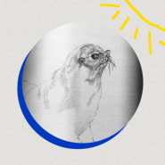

看那只海狗在划水
============================

|  |  |
| :--: | :-- |
| [ 看那只海狗在划水](https://emumo.xiami.com/album/2104848722) | **艺人**: [斯斯与帆](../index.md) **语种**: 国语 **唱片公司**: 草台回声 **发行时间**: 2019年05月17日 **专辑类别**: EP, 单曲 **专辑风格**: 国语流行 Mandarin Pop **播放数**: 1513107 **收藏数**: 83 **评论数**: 7  |

## 简介

在潮湿闷热的夏天，想和心爱的人一起打着滚去海边，宛如一只光滑的海狗，在冰凉的蓝色海水中划出硕大的泡泡，沉睡在其中随着重力一起，一起沉入冰凉的海底，仰望被波纹折射的阳光。 

## 曲目

## 评论

|  |  |  |  |
| :-- | :-- | :-- | :-- |
|  [虾米用户](https://emumo.xiami.com/u/427384237) 我还没想好要写什么... 2020-06-19 00:46 赞(0) 踩(0) | 
➕
 |
|  [虾米用户](https://emumo.xiami.com/u/7007232)  2019-07-20 09:06 赞(0) 踩(0) | 
可以可以可以可以
 |
|  [虾米用户](https://emumo.xiami.com/u/11979517) xj 2019-06-25 22:46 赞(0) 踩(0) | 
帆帆的声音真是清流，和声的是斯斯？
 |
|  [虾米用户](https://emumo.xiami.com/u/256723046)   2019-06-09 20:55 赞(0) 踩(0) | 
内容已删除
 |
| ⇒ |  [虾米用户](https://emumo.xiami.com/u/2579044) 咯咯哒 2019-06-10 15:17 赞(0) 踩(0) | 
哈哈哈哈哈哈
 |
|  [虾米用户](https://emumo.xiami.com/u/3998940) …听就好… 2019-06-07 22:35 赞(0) 踩(0) | 
给个加油的十分！因为一档电视节目认识了们，加油！
 |
|  [虾米用户](https://emumo.xiami.com/u/353206222) 超A 2019-06-06 08:09 赞(1) 踩(0) | 
录影棚不行 帆的声音是很有质感的 没有出来吖！
 |
|  [虾米用户](https://emumo.xiami.com/u/182026562)  2019-06-02 13:34 赞(0) 踩(0) | 
加油
 |
