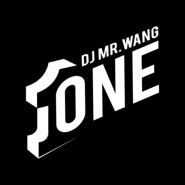

Mr.Wang
============================

|  |  |
| :--: | :-- |
| [ Mr.Wang](https://i.xiami.com/mrwang) | **地区**: China 中国大陆 **风格**: 未来贝斯 Future Bass, 浩室舞曲 House, 电音流行 Electropop, 电子舞曲 EDM / Electronic Dance Music **播放数**: 1055920 **粉丝数**: 31 **评论数**: 0  |

## 档案

DJ Mr.Wang 本名王晓天。中国原创电子音乐制作人，擅长词曲创作，混音编曲。2000年加入中国DMC并发布作品，是中国电子音乐资深教练级创作人。

## 专辑

| 名称 | 语种 | 唱片公司 | 发行时间 | 专辑类别 | 专辑风格 |
| :--: | :-- | :-- | :-- | :-- | :-- |
| [ DJ Mr.Wang](./albums/2104164235.md) | 国语 |  | 2018年10月31日 | 合集, 杂锦 | 电子 Electronic |

## 评论

