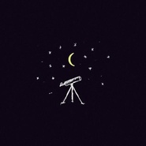

深夜歌单
============================

|  |  |
| :--: | :-- |
| [ 深夜歌单](https://emumo.xiami.com/album/2104173476) | **艺人**: [小煜弹棉花](../index.md) **语种**: 其他 **唱片公司**: 独立发行 **发行时间**: 1988年01月02日 **专辑类别**: 精选集 **专辑风格**: 器乐独奏 Solo Instrumental **播放数**: 962201 **收藏数**: 152 **评论数**: 9  |

## 简介

深夜棉花，祝你好眠

## 曲目

## 评论

|  |  |  |  |
| :-- | :-- | :-- | :-- |
|  [虾米用户](https://emumo.xiami.com/u/429711684)  2021-01-09 01:40 赞(1) 踩(0) | 
我喜歡這個專輯
 |
|  [虾米用户](https://emumo.xiami.com/u/1385978)  2020-07-18 18:29 赞(0) 踩(0) | 
5
 |
|  [虾米用户](https://emumo.xiami.com/u/295985226)  2020-05-08 07:12 赞(0) 踩(0) | 
能
 |
|  [虾米用户](https://emumo.xiami.com/u/16178749) 愿各自安好………………  2020-03-04 13:18 赞(1) 踩(0) | 

 |
|  [虾米用户](https://emumo.xiami.com/u/253395678) 走更长的路，听更多的歌 2020-03-01 01:09 赞(0) 踩(0) | 
喜欢！！
 |
|  [虾米用户](https://emumo.xiami.com/u/5555764) 阿Ken 2019-10-17 01:24 赞(1) 踩(0) | 
熟悉的旋律，迷人的柔情  
 |
|  [虾米用户](https://emumo.xiami.com/u/418496881)  2019-05-10 11:39 赞(1) 踩(0) | 
一听到就果断收藏
 |
|  [虾米用户](https://emumo.xiami.com/u/205207322) 音乐是人生美好之旅，也是... 2019-05-10 07:04 赞(1) 踩(0) | 
好听演绎精彩技巧娴熟，果断收藏了！
 |
|  [虾米用户](https://emumo.xiami.com/u/379956478) 就只是听歌而已，一个麦霸... 2019-05-08 00:22 赞(1) 踩(0) | 
好东西
 |
