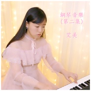
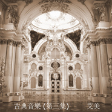

艾美
============================

|  |  |
| :--: | :-- |
| [ 艾美](https://i.xiami.com/imei) | **地区**: Hong Kong, PRC 中国香港 **风格**: 管弦乐流行 Orchestral Pop, 轻音乐 Easy Listening, 流行 Pop, 器乐流行 Instrumental Pop, 国语流行 Mandarin Pop **播放数**: 2340624 **粉丝数**: 376 **评论数**: 29  |

## 档案

艾美毕业于美国伯克利音乐学院，创作了大量器乐和钢琴音乐，最受欢迎的原创作品是“我在孤独的路上”，“未完成的故事”，“莲花”，“月光” ，“永恒之美”等。 除器乐曲外，也有写词及制作有歌词的歌曲，另外也会用宋词来唱，宋词文字优美，因为原曲失传了，艾美希望用自己创作的旋律来唱。      音乐风格：流行，古典，蓝调/爵士，电影配乐      购买琴谱: 请发电子邮件到  kuromi8@qq.com   或去          https://k.ruyu.com/vA-K6z8w     艾美weibo: pianosongs

## 专辑

| 名称 | 语种 | 唱片公司 | 发行时间 | 专辑类别 | 专辑风格 |
| :--: | :-- | :-- | :-- | :-- | :-- |
| [ Production music library 2制作音乐库 2](./albums/2104366918.md) | 纯音乐 |  | 2020年07月22日 | 录音室专辑 | 爵士流行 Jazz Pop, 游戏配乐 Video Game Music, 拉丁流行 Latin Pop |
| [ 古典音乐(第二集）Classical music (album 2)](./albums/2104210811.md) | 纯音乐 |  | 2019年05月11日 | 录音室专辑 | 巴洛克音乐 Baroque Music, 西方古典 Western Classical Music, 浪漫主义 Romanticism |
| [ 钢琴音乐(第二集)](./albums/2104731470.md) | 纯音乐 |  | 2019年03月31日 | 录音室专辑 | 器乐独奏 Solo Instrumental, 器乐流行 Instrumental Pop, 轻音乐 Easy Listening |
| [ 春花秋月Spring flowers and autumn moon](./albums/2104621605.md) | 国语 | 独立发行 | 2018年12月31日 | 录音室专辑 | 流行 Pop, 国语流行 Mandarin Pop, 艺术流行 Art Pop |
| [ 钢琴音乐(第一集）](./albums/2104641651.md) | 纯音乐 |  | 2018年12月31日 | 录音室专辑 | 器乐独奏 Solo Instrumental, 器乐流行 Instrumental Pop, 轻音乐 Easy Listening |
| [ 感人的旋律](./albums/2104658680.md) | 纯音乐 |  | 2018年12月31日 | 录音室专辑 | 管弦乐流行 Orchestral Pop, 器乐流行 Instrumental Pop, 轻音乐 Easy Listening |
| [ Production music library 1制作音乐库 1](./albums/2104308466.md) | 纯音乐 | 独立发行 | 2018年12月01日 | 录音室专辑 | 波普 Bop, 放克 Funk, 世界音乐 World Music |
| [ 声声慢](./albums/2104201292.md) | 国语 | 独立发行 | 2018年11月11日 | EP, 单曲 | 流行 Pop, 国语流行 Mandarin Pop, 当代唱作人 Contemporary Singer-Songwriter |
| [ 古典音乐(第一集）Classical music (album 1)](./albums/2104203423.md) | 纯音乐 |  | 2012年08月03日 | 录音室专辑 | 古典跨界 Classical Crossover, 西方古典 Western Classical Music, 浪漫主义 Romanticism |
| [ 友谊地久天长Auld Lang Syne](./albums/2104968033.md) | 英语 |  | 2011年12月31日 | 录音室专辑 | 器乐独奏 Solo Instrumental, 欧美流行 Western Pop, 器乐流行 Instrumental Pop |
| [ 平安夜(第一集）Silent night (album 1)](./albums/2104246177.md) | 英语 |  | 不详 | 录音室专辑 | 欧美流行 Western Pop, 轻音乐 Easy Listening, 轻音乐流行 Light Pop |
| [ 古典音乐(第三集)Classical music (album 3)](./albums/2104214597.md) | 纯音乐 |  | 不详 | 录音室专辑 | 古典跨界 Classical Crossover, 西方古典 Western Classical Music, 浪漫主义 Romanticism |
| [ 未完成的故事](./albums/2104246063.md) | 纯音乐 |  | 不详 | 录音室专辑 | 器乐流行 Instrumental Pop, 轻音乐 Easy Listening |
| [ Jingle bells铃儿响叮当](./albums/2104309473.md) | 英语 |  | 不详 | 录音室专辑 | 古典跨界 Classical Crossover, 轻音乐 Easy Listening, 轻音乐流行 Light Pop |
| [ 我的音乐集](./albums/2104227110.md) | 纯音乐 |  | 不详 | 录音室专辑 | 器乐独奏 Solo Instrumental, 器乐流行 Instrumental Pop, 轻音乐 Easy Listening |
| [ Air on the G stringG弦上的詠嘆調](./albums/2104220011.md) | 纯音乐 |  | 不详 | 录音室专辑 | 古典跨界 Classical Crossover, 巴洛克音乐 Baroque Music, 西方古典 Western Classical Music |
| [ Twinkle twinkle little star](./albums/2104967908.md) | 英语 |  | 不详 | EP, 单曲 | 儿童音乐 Children's Music, 流行 Pop, 欧美流行 Western Pop |
| [ 地铁站](./albums/2105452490.md) | 粤语 |  | 不详 | EP, 单曲 | 粤语流行 Cantopop, 管弦乐流行 Orchestral Pop |
| [ 艾美的专辑](./albums/5022630149.md) | 其他 |  | 不详 |  |  |

## 评论

|  |  |  |
| :-- | :-- | :-- |
|  [虾米用户](https://emumo.xiami.com/u/205195976) 暂时想不到什么矫情的话。 2020-11-24 18:33 赞(0) 踩(0) | 
真不错！
 |
|  [虾米用户](https://emumo.xiami.com/u/404094315)  2020-10-20 23:12 赞(0) 踩(0) | 
很好听，
 |
|  [虾米用户](https://emumo.xiami.com/u/49876181)  2020-08-05 14:19 赞(0) 踩(0) | 
非常好听，谢谢艾美
 |
|  [虾米用户](https://emumo.xiami.com/u/408300654)  2020-07-19 00:26 赞(1) 踩(0) | 
谢谢你们!!
 |
|  [虾米用户](https://emumo.xiami.com/u/287677210) 保持童心也就是保持真实 2020-07-01 01:12 赞(0) 踩(0) | 
时间啊时间！
 |
|  [虾米用户](https://emumo.xiami.com/u/260640673)  2020-04-12 14:31 赞(0) 踩(0) | 
你这才女，怎被埋没在人群之中呢？
 |
| ⇒ |  [虾米用户](https://emumo.xiami.com/u/287677210) 保持童心也就是保持真实 2020-07-01 01:15 赞(0) 踩(0) | 
你这是什么逻辑？
 |
| ⇒ |  [虾米用户](https://emumo.xiami.com/u/408300654)  2020-07-19 00:25 赞(0) 踩(0) | 
我会尝试寻找更多的听众, 谢谢!
 |
|  [虾米用户](https://emumo.xiami.com/u/287677210) 保持童心也就是保持真实 2020-03-11 10:25 赞(0) 踩(0) | 
这几个月在忙什么呢？……太期待你出新作品了！
 |
| ⇒ |  [虾米用户](https://emumo.xiami.com/u/408300654)  2020-07-19 00:24 赞(0) 踩(0) | 
最近我在玩抖音, 去抖音搜索: 艾美音乐, 用我的音乐制作视频啦 :)
 |
| ⇒ |  [虾米用户](https://emumo.xiami.com/u/295450555) 我没有签名我没有爱你 2021-01-08 12:44 赞(0) 踩(0) | 
<q><b>艾美说：</b></q>
 |
|  [虾米用户](https://emumo.xiami.com/u/229805652) 世事无绝对，唯有真情趣，... 2020-01-26 23:10 赞(0) 踩(0) | 
好听！ 
 |
|  [虾米用户](https://emumo.xiami.com/u/335926107) 当你不断追求卓越，成功就... 2020-01-14 17:14 赞(1) 踩(0) | 
太漂亮了，好看又好听～嘿嘿
 |
|  [虾米用户](https://emumo.xiami.com/u/287677210) 保持童心也就是保持真实 2020-01-08 08:08 赞(2) 踩(0) | 
想听你弹一首《蓝色多瑙河》。
 |
|  [虾米用户](https://emumo.xiami.com/u/301391720)  2019-12-18 19:54 赞(2) 踩(0) | 
宋词新唱法很新颖，很特别，有穿越感
 |
|  [虾米用户](https://emumo.xiami.com/u/429891851)  2019-09-19 08:00 赞(3) 踩(0) | 
好好听鸭，人也长得美
 |
|  [虾米用户](https://emumo.xiami.com/u/328769059) 爱人  爱己 2019-08-18 00:21 赞(2) 踩(0) | 
好喜欢伯克利出的人才
 |
|  [虾米用户](https://emumo.xiami.com/u/377073357) D调E点 2019-07-26 19:12 赞(2) 踩(0) | 
还是专业的最好听
 |
|  [虾米用户](https://emumo.xiami.com/u/295856791) 开心快乐每一天 2019-07-13 07:02 赞(1) 踩(0) | 
  
 |
|  [虾米用户](https://emumo.xiami.com/u/88013988)   2019-04-28 13:50 赞(1) 踩(0) | 
很好听鸭～加油
 |
| ⇒ |  [虾米用户](https://emumo.xiami.com/u/408300654)  2019-04-28 16:15 赞(0) 踩(0) | 
谢谢!
 |
|  [虾米用户](https://emumo.xiami.com/u/40379612) 永远的虾米音乐 2019-04-27 11:19 赞(0) 踩(0) | 
好厉害呀！管风琴弹得真好 
 |
| ⇒ |  [虾米用户](https://emumo.xiami.com/u/408300654)  2019-04-28 12:47 赞(0) 踩(0) | 
谢谢!
 |
|  [虾米用户](https://emumo.xiami.com/u/287677210) 保持童心也就是保持真实 2019-04-26 22:50 赞(0) 踩(0) | 
好棒！ヾ ^_^♪
 |
| ⇒ |  [虾米用户](https://emumo.xiami.com/u/408300654)  2019-04-28 12:47 赞(0) 踩(0) | 
谢谢!
 |
|  [虾米用户](https://emumo.xiami.com/u/409382395) 所以不能者，为心未澄，欲... 2019-04-20 17:37 赞(2) 踩(0) | 
感恩您贡献给人类动听的音乐作品! 
 |
| ⇒ |  [虾米用户](https://emumo.xiami.com/u/408300654)  2019-04-23 03:02 赞(0) 踩(0) | 
听到你这样说我很开心 :)
 |
|  [虾米用户](https://emumo.xiami.com/u/331789591)  2019-04-05 18:15 赞(2) 踩(0) | 
温柔的小姐姐～
 |
| ⇒ |  [虾米用户](https://emumo.xiami.com/u/408300654)  2019-04-23 03:02 赞(0) 踩(0) | 
:) :)
 |
