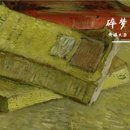

倚楼大白
============================

|  |  |
| :--: | :-- |
| [ 倚楼大白](https://i.xiami.com/bai_19980311) | **播放数**: 1080859 **粉丝数**: 100 **评论数**: 6 **地区**: China 中国大陆 **风格**: 独立民谣 Indie Folk  |

## 档案

把愿望都活在心底

## 专辑

| 名称 | 语种 | 唱片公司 | 发行时间 | 专辑类别 | 专辑风格 |
| :--: | :-- | :-- | :-- | :-- | :-- |
| [ 道听途说，众生皆苦](./albums/5022438877.md) | 国语 |  | 2020年02月03日 | 录音室专辑 |  |
| [ 大白的翻唱](./albums/2104606514.md) | 国语 | 独立发行 | 2019年12月27日 | 合集, 杂锦 | 独立民谣 Indie Folk |
| [ 落日余晖](./albums/2105628609.md) | 国语 | 独立发行 | 2019年12月25日 | EP, 单曲 | 后摇 Post-Rock |
| [ 碎梦](./albums/2105059971.md) | 国语 | 独立发行 | 2019年08月06日 | 合集, 杂锦 | 民谣 Folk |
| [ 阳关尽头细雨稠](./albums/2104672523.md) | 国语 | 独立发行 | 2019年03月15日 | 合集, 杂锦 | 民谣 Folk |
| [ 如果有下辈子](./albums/2104579817.md) | 国语 | 独立发行 | 2019年02月11日 | 合集, 杂锦 | 独立民谣 Indie Folk |

## 评论

|  |  |  |  |
| :-- | :-- | :-- | :-- |
|  [虾米用户](https://emumo.xiami.com/u/445399799)  2020-11-19 15:56 赞(0) 踩(0) | 
夜半歌声
 |
|  [虾米用户](https://emumo.xiami.com/u/433406406) 民谣有三：爱情，理想，远... 2020-01-06 03:47 赞(1) 踩(0) | 
我愿乐队和你一起演奏一起进步 不仅仅是一把木吉他 所有该有的我们都要有   
 |
| ⇒ |  [虾米用户](https://emumo.xiami.com/u/418445873) 道听途说，众生皆苦 2020-01-06 10:11 赞(0) 踩(0) | 

 |
|  [虾米用户](https://emumo.xiami.com/u/431764052) 曾经拥有过的所有灿烂，原... 2019-11-06 18:13 赞(0) 踩(0) | 
考完研喝酒啊弟弟
 |
|  [虾米用户](https://emumo.xiami.com/u/237902284)  2019-04-06 20:42 赞(0) 踩(0) | 
行啊
 |
|  [虾米用户](https://emumo.xiami.com/u/342024069) 猫困深巷…… 2019-03-01 13:45 赞(0) 踩(0) | 
好听。
 |
