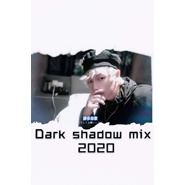
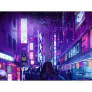
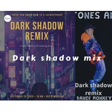
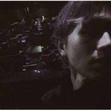

Dark Shadow
============================

|  |  |
| :--: | :-- |
| [ Dark Shadow](https://i.xiami.com/darkzhishuai) | **地区**: China 中国大陆 **风格**: 电音流行 Electropop, 电子 Electronic, 回响贝斯 Dubstep **播放数**: 604381 **粉丝数**: 290 **评论数**: 22  |

## 档案

## 专辑

| 名称 | 语种 | 唱片公司 | 发行时间 | 专辑类别 | 专辑风格 |
| :--: | :-- | :-- | :-- | :-- | :-- |
| [ Energy](./albums/5022368569.md) | 英语 | 独立发行 | 2021年01月05日 | 录音室专辑 | 电子舞曲 EDM / Electronic Dance Music |
| [ 【Reol×吴亦凡×张艺兴×黄子韬】烦恼游戏Remix](./albums/5022322504.md) | 国语 | 独立发行 | 2020年12月30日 | 录音室专辑 | 电子舞曲 EDM / Electronic Dance Music |
| [ 致爱丽丝REMIX](./albums/5022307954.md) | 国语 | 独立发行 | 2020年12月30日 | 录音室专辑 | 电子舞曲 EDM / Electronic Dance Music |
| [ Someone You Loved REMIX](./albums/5022299040.md) | 英语 | 独立发行 | 2020年12月25日 | 录音室专辑 | 电子舞曲 EDM / Electronic Dance Music |
| [ 前场](./albums/5021920187.md) | 英语 | 独立发行 | 2020年11月13日 | 录音室专辑 | 电子舞曲 EDM / Electronic Dance Music |
| [ 马保国GIAO之歌](./albums/5021884871.md) | 国语 | 独立发行 | 2020年11月10日 | 录音室专辑 |  |
| [ THE QUEEN](./albums/5021885611.md) | 英语 | 独立发行 | 2020年11月08日 | 录音室专辑 | 电子舞曲 EDM / Electronic Dance Music |
| [ darkshadow](./albums/5021874189.md) | 英语 | 独立发行 | 2020年11月07日 | 录音室专辑 | 电子舞曲 EDM / Electronic Dance Music |
| [ BIG ROOM FIGHT VOL2](./albums/5021864984.md) | 英语 | 独立发行 | 2020年11月07日 | 录音室专辑 | 电子舞曲 EDM / Electronic Dance Music |
| [ SUPERMONKEY前场音乐](./albums/5021854190.md) | 英语 | 独立发行 | 2020年11月05日 | 录音室专辑 | 电子舞曲 EDM / Electronic Dance Music |
| [ 河（Dark shadow Bootleg）](./albums/5021717176.md) | 国语 | 独立发行 | 2020年10月20日 | 录音室专辑 | 电子舞曲 EDM / Electronic Dance Music |
| [ おどるポンポコリン](./albums/5021701073.md) | 英语 | 独立发行 | 2020年10月19日 | 录音室专辑 | 电子舞曲 EDM / Electronic Dance Music |
| [ DARK SHADOW MIX 2020（2）](./albums/5021692349.md) | 英语 | 独立发行 | 2020年10月18日 | 录音室专辑 | 电子舞曲 EDM / Electronic Dance Music |
| [ DARK SHADOW](./albums/5021685182.md) | 英语 | 独立发行 | 2020年10月16日 | 录音室专辑 | 电子舞曲 EDM / Electronic Dance Music |
| [ 好运来](./albums/5021606964.md) | 英语 | 独立发行 | 2020年10月03日 | 录音室专辑 | 电子舞曲 EDM / Electronic Dance Music |
| [ TIME GO](./albums/5021496367.md) | 英语 | 独立发行 | 2020年09月22日 | 录音室专辑 | 电子舞曲 EDM / Electronic Dance Music |
| [ SUMMER TIME BOOTLEG](./albums/5021268556.md) | 日语 | 独立发行 | 2020年08月10日 | 录音室专辑 | 电子舞曲 EDM / Electronic Dance Music |
| [ NICE HAIR](./albums/5021070907.md) | 国语 | 独立发行 | 2020年07月13日 | 录音室专辑 | 电子舞曲 EDM / Electronic Dance Music |
| [ NICE HAIR](./albums/5021040918.md) | 英语 | 独立发行 | 2020年07月07日 | 录音室专辑 | 电子舞曲 EDM / Electronic Dance Music |
| [ 一剪梅REMIX](./albums/5020961831.md) | 国语 | 独立发行 | 2020年06月26日 | 录音室专辑 | 电子舞曲 EDM / Electronic Dance Music |
| [ CHINA MIX](./albums/5020921397.md) | 国语 | 独立发行 | 2020年06月20日 | 录音室专辑 | 电子舞曲 EDM / Electronic Dance Music |
| [ Dark shadow-笑傲江湖(Dark shadow Remix ）](./albums/5020928765.md) | 国语 | 独立发行 | 2020年06月20日 | 录音室专辑 | 电子舞曲 EDM / Electronic Dance Music |
| [ 倩女幽魂REMIX](./albums/5020934593.md) | 国语 | 独立发行 | 2020年06月19日 | 录音室专辑 | 电子舞曲 EDM / Electronic Dance Music |
| [ Bass house Drop](./albums/5020901211.md) | 英语 | 独立发行 | 2020年06月17日 | 录音室专辑 | 电子舞曲 EDM / Electronic Dance Music |
| [ MIXING](./albums/5020889969.md) | 英语 | 独立发行 | 2020年06月15日 | 录音室专辑 | 电子舞曲 EDM / Electronic Dance Music |
| [ 溯 REMIX](./albums/5020869495.md) | 国语 | 独立发行 | 2020年06月14日 | 录音室专辑 | 电子舞曲 EDM / Electronic Dance Music |
| [ 大威天龙](./albums/5020878487.md) | 藏语 | 独立发行 | 2020年06月14日 | 录音室专辑 | 电子舞曲 EDM / Electronic Dance Music |
| [ 大碗宽面大碗宽面Remix](./albums/5020880979.md) | 国语 | 独立发行 | 2020年06月14日 | 录音室专辑 | 电子舞曲 EDM / Electronic Dance Music |
| [ 窝窝头一块钱四个](./albums/5020885392.md) | 国语 | 独立发行 | 2020年06月14日 | 录音室专辑 | 电子舞曲 EDM / Electronic Dance Music |
| [ BASS HOUSE1](./albums/2105586510.md) | 其他 |  | 2019年12月14日 | 录音室专辑 | 电子舞曲 EDM / Electronic Dance Music |
| [ DARK TRAP](./albums/2105516865.md) | 其他 |  | 2019年11月25日 | 录音室专辑 | 电子 Electronic |
| [ 火影佐助卡卡西](./albums/2105505994.md) | 日语 |  | 2019年11月24日 | 录音室专辑 | 电子 Electronic |
| [ ALONE REMIX](./albums/2105486241.md) | 英语 |  | 2019年11月22日 | 录音室专辑 | 电子 Electronic |
| [ 赛博朋克辣妹 发克儿](./albums/2105459757.md) | 其他 |  | 2019年11月20日 | 录音室专辑 | 电子 Electronic |
| [ DANCE MONKEY REMIX](./albums/2105452446.md) | 英语 |  | 2019年11月19日 | 录音室专辑 | 电子 Electronic |
| [ 加油 奥利给](./albums/2105442751.md) | 国语 |  | 2019年11月15日 | 录音室专辑 |  |
| [ BATTLE SIRENS(Dark shadow remix)](./albums/2105368408.md) | 英语 |  | 2019年10月23日 | 录音室专辑 | 电子 Electronic |
| [ 说好不哭REMIX说好不哭](./albums/2105365906.md) | 国语 |  | 2019年10月22日 | 录音室专辑 | 电子 Electronic |
| [ 在你头上暴扣REMIX](./albums/2105299144.md) | 其他 |  | 2019年09月30日 | 录音室专辑 | 电子 Electronic |
| [ NIGHT CLUB MIX](./albums/2105212631.md) | 英语 |  | 2019年09月04日 | 录音室专辑 | 电子 Electronic |
| [ 半藏](./albums/2104679066.md) | 其他 |  | 2019年03月19日 | 录音室专辑 | 回响贝斯 Dubstep |
| [ relax](./albums/2104673222.md) | 其他 |  | 2019年03月16日 | 录音室专辑 | 电子 Electronic |
| [ Do u like bass REMIX](./albums/2104669931.md) | 其他 |  | 2019年03月14日 | 录音室专辑 | 回响贝斯 Dubstep |
| [ HOLD ON TO ME REMIX](./albums/2104668173.md) | 其他 |  | 2019年03月13日 | 录音室专辑 | 回响贝斯 Dubstep |
| [ kawaii](./albums/2104657351.md) | 其他 |  | 2019年03月08日 | 录音室专辑 | 未来贝斯 Future Bass |
| [ KawaiiKawaii](./albums/2104657350.md) | 其他 |  | 2019年03月08日 | 录音室专辑 | 未来贝斯 Future Bass |
| [ Kawaii bass](./albums/2104653595.md) | 其他 | 独立发行 | 2019年03月06日 | 录音室专辑 | 未来贝斯 Future Bass |
| [ Let me bounce you](./albums/2104653613.md) | 其他 |  | 2019年03月06日 | 录音室专辑 | 未来贝斯 Future Bass |
| [ 天气之子REMIX](./albums/2105446483.md) | 日语 |  | 不详 | 录音室专辑 |  |
| [ 正道的光](./albums/5020893073.md) | 国语 | 独立发行 | 不详 | 录音室专辑 | 电子舞曲 EDM / Electronic Dance Music |
| [ DANCE MONKEY mix](./albums/2105460442.md) | 英语 |  | 不详 | 录音室专辑 | 电子 Electronic |
| [ rap beat](./albums/2105516864.md) | 其他 |  | 不详 | 录音室专辑 | 陷阱说唱 Trap Rap |
| [ Z.H.A](./albums/2106048796.md) | 国语 | 独立发行 | 不详 | 录音室专辑 | 电子 Electronic |
| [ DUBSTEP ONLY](./albums/2104653582.md) | 其他 |  | 不详 | 录音室专辑 | 回响贝斯 Dubstep |
| [ BASS HOUSE2BASS HOUSE2](./albums/2105586511.md) | 其他 |  | 不详 | 录音室专辑 | 电子 Electronic |
| [ relaxrelx](./albums/2104673174.md) | 其他 |  | 不详 | 录音室专辑 | 电子 Electronic |
| [ TECHNO很烦](./albums/2105366039.md) | 其他 |  | 不详 | 录音室专辑 | 电子 Electronic |
| [ Future](./albums/5020849827.md) | 英语 | 独立发行 | 不详 | 录音室专辑 | 电子舞曲 EDM / Electronic Dance Music |
| [ NICE HAIR](./albums/5021154940.md) | 英语 | 独立发行 | 不详 | 录音室专辑 | 电子舞曲 EDM / Electronic Dance Music |

## 评论

|  |  |  |
| :-- | :-- | :-- |
|  [虾米用户](https://emumo.xiami.com/u/585192)  2020-12-15 12:57 赞(1) 踩(0) | 
虾米要没了，去哪找你！
 |
| ⇒ |  [虾米用户](https://emumo.xiami.com/u/420455258) EDM HOUSE 音乐 2020-12-26 20:56 赞(0) 踩(0) | 
网 云☁️
 |
|  [虾米用户](https://emumo.xiami.com/u/403842287) 鸡哈你哈太哈美哈 2020-11-18 20:46 赞(1) 踩(0) | 
第一次遇到某人的歌中8首我都喜欢听
 |
|  [虾米用户](https://emumo.xiami.com/u/403842287) 鸡哈你哈太哈美哈 2020-11-18 20:45 赞(1) 踩(0) | 
我敢说我是11.18晚八点四十五分之前的第一名
 |
|  [虾米用户](https://emumo.xiami.com/u/422808601) 剑气惊人———— 2020-10-19 21:13 赞(2) 踩(0) | 
刚刚刚刚刚
 |
|  [虾米用户](https://emumo.xiami.com/u/2796166) 最爱莫文蔚..... 2020-09-10 01:34 赞(4) 踩(0) | 
不错哦 加油呀~
 |
|  [虾米用户](https://emumo.xiami.com/u/328937055) 网易名 大鹏展翅ya 2020-08-12 19:11 赞(4) 踩(0) | 
  
 |
|  [虾米用户](https://emumo.xiami.com/u/411133757) k . 2020-07-19 18:42 赞(4) 踩(0) | 
支持你 加油喔
 |
| ⇒ |  [虾米用户](https://emumo.xiami.com/u/420455258) EDM HOUSE 音乐 2020-07-22 01:00 赞(0) 踩(0) | 
加油 
 |
|  [虾米用户](https://emumo.xiami.com/u/375053398)  2020-06-17 19:52 赞(1) 踩(0) | 
谢谢
 |
|  [虾米用户](https://emumo.xiami.com/u/440828946) 人都是人才，这样大家都一... 2020-06-02 19:12 赞(3) 踩(0) | 
一我里给giao giao
 |
|  [虾米用户](https://emumo.xiami.com/u/358104299) 悲观的唯心存在现实解构虚... 2020-05-12 05:21 赞(4) 踩(0) | 
17740
 |
|  [虾米用户](https://emumo.xiami.com/u/442602673)  2020-05-01 16:01 赞(5) 踩(0) | 
作者是女生吗？
 |
|  [虾米用户](https://emumo.xiami.com/u/364175712)  2020-04-10 19:38 赞(3) 踩(0) | 
浑身充满活力 嗨皮呀
 |
|  [虾米用户](https://emumo.xiami.com/u/251991473) 一入电音深似海 2020-02-11 19:29 赞(5) 踩(0) | 
奥力给啊，黑影
 |
|  [虾米用户](https://emumo.xiami.com/u/439988109)  2020-02-02 20:57 赞(2) 踩(0) | 
喜欢，努力哦！！
 |
|  [虾米用户](https://emumo.xiami.com/u/432026042) 我很喜欢天气之子 2019-12-25 01:29 赞(3) 踩(0) | 
更多天气之子的歌
 |
|  [虾米用户](https://emumo.xiami.com/u/432026042) 我很喜欢天气之子 2019-12-25 01:28 赞(2) 踩(0) | 
你能不能作
 |
|  [虾米用户](https://emumo.xiami.com/u/432026042) 我很喜欢天气之子 2019-12-25 01:28 赞(2) 踩(0) | 
谢谢
 |
|  [虾米用户](https://emumo.xiami.com/u/424027104) TNT♡ 2019-12-14 15:34 赞(4) 踩(0) | 
喜欢，加油哦♡
 |
| ⇒ |  [虾米用户](https://emumo.xiami.com/u/420455258) EDM HOUSE 音乐 2019-12-15 15:32 赞(0) 踩(0) | 
一定加油。最近会出新的曲子。开心^_^
 |
