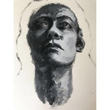

Feel The Light感受光
============================

|  |  |
| :--: | :-- |
| [ Feel The Light感受光](https://emumo.xiami.com/album/2104969508) | **艺人**: [The Brownie Band](../index.md) **语种**: 英语 **唱片公司**:  **发行时间**: 不详 **专辑类别**: EP, 单曲 **专辑风格**: 独立流行 Indie Pop **播放数**: 7160 **收藏数**: 8 **评论数**: 2  |

## 简介

The Brownie Band 的第二张EP “Feel The Light” 由洛杉矶爵士吉他演奏家Dave Hill 制作, 专辑制作过程中同时也邀请了来自美国的著名爵士贝斯演奏家Jimmy Haslip和鼓手Joel Taylor

## 曲目

## 评论

|  |  |  |  |
| :-- | :-- | :-- | :-- |
|  [虾米用户](https://emumo.xiami.com/u/24760988) 遇见你就像随机播放却听到... 2020-11-02 14:29 赞(0) 踩(0) | 
完美
 |
|  [虾米用户](https://emumo.xiami.com/u/418355155) 我还没想好要写什么... 2020-09-17 09:21 赞(0) 踩(0) | 
-
 |
