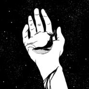

The Brownie Band
============================

|  |  |
| :--: | :-- |
| [ The Brownie Band](https://i.xiami.com/brownnnie) | **地区**: China 中国大陆 **风格**: 独立流行 Indie Pop **播放数**: 125169 **粉丝数**: 549 **评论数**: 27  |

## 档案

wow brownie cake taste so good !!!    BROWNIE 意为巧克力方块蛋糕，也是主唱&吉他手黄子健的英文名，实在是简单又无可比拟的美味。来自杭州的乐队创始人,主唱&吉他黄子健 Brownie，本科学习土木工程,随后去往美国学习音乐，在就读于MI期间组建了 the brownie band，集合了来自MI的顶尖乐手吉他手Shogo来自日本，贝斯 Zero chen 来自香港，鼓手 James 来自韩国，键盘手 Jery 来自台湾

## 专辑

| 名称 | 语种 | 唱片公司 | 发行时间 | 专辑类别 | 专辑风格 |
| :--: | :-- | :-- | :-- | :-- | :-- |
| [ Fragile People Fragile Lie](./albums/5022523995.md) | 英语 |  | 2019年11月28日 | EP, 单曲 |  |
| [ Julie](./albums/2104979726.md) | 英语 | 独立发行 | 2019年03月19日 | 录音室专辑 | 独立流行 Indie Pop |
| [ Demos](./albums/5022386017.md) | 国语 |  | 2019年01月02日 | EP, 单曲 |  |
| [ Noname](./albums/5022374744.md) | 国语 |  | 2019年01月02日 | EP, 单曲 |  |
| [ Feel The Light感受光](./albums/2104969508.md) | 英语 |  | 不详 | EP, 单曲 | 独立流行 Indie Pop |

## 评论

|  |  |  |
| :-- | :-- | :-- |
|  [虾米用户](https://emumo.xiami.com/u/423276413) 我永远爱虾米音乐！！！！ 2021-01-18 16:14 赞(1) 踩(0) | 
后悔这么晚才认识你们
 |
|  [虾米用户](https://emumo.xiami.com/u/39674727) 特技是挖掘冷门乐队 2021-01-08 16:07 赞(1) 踩(0) | 
w
 |
|  [虾米用户](https://emumo.xiami.com/u/43239641)   2020-11-21 12:03 赞(1) 踩(0) | 
如果能上乐夏，会非常与众不同的，想象~
 |
|  [虾米用户](https://emumo.xiami.com/u/2895536) 先 疯 人 物· 部 落... 2020-11-06 23:16 赞(1) 踩(0) | 

 |
|  [虾米用户](https://emumo.xiami.com/u/17691156) あなたに出会えて よかっ... 2020-10-29 13:25 赞(1) 踩(0) | 
sofa!!
 |
|  [虾米用户](https://emumo.xiami.com/u/416346) 边走边听，人山人海。 2020-10-17 22:20 赞(2) 踩(0) | 
11.6 成都
 |
|  [虾米用户](https://emumo.xiami.com/u/418355155) 我还没想好要写什么... 2020-09-17 09:20 赞(1) 踩(0) | 
-
 |
|  [虾米用户](https://emumo.xiami.com/u/99465068) Spotify : Yo... 2020-08-16 02:04 赞(2) 踩(0) | 
前女友总听你们
 |
|  [虾米用户](https://emumo.xiami.com/u/286941754) 无挂碍故，无有恐怖 2020-08-12 10:25 赞(1) 踩(0) | 
国内的啊
 |
|  [虾米用户](https://emumo.xiami.com/u/255359360) 全部感官按部就班地失常 2020-08-09 17:40 赞(1) 踩(0) | 

 |
|  [虾米用户](https://emumo.xiami.com/u/354493224) 吮指原味鸡全年用户。 2020-08-03 20:00 赞(1) 踩(0) | 

 |
|  [虾米用户](https://emumo.xiami.com/u/49365982) 当断则断 2020-08-03 04:36 赞(1) 踩(0) | 
柔软
 |
|  [虾米用户](https://emumo.xiami.com/u/194640175) 我想要的，都會有的。 2020-08-02 01:21 赞(0) 踩(0) | 
杭州人啊！ 了不得 
 |
|  [虾米用户](https://emumo.xiami.com/u/52415194) ♬♩♫♪♡ 2020-07-16 15:53 赞(0) 踩(0) | 

 |
|  [虾米用户](https://emumo.xiami.com/u/2857420) 昨天晚上我梦见你 2020-06-23 21:56 赞(0) 踩(0) | 
不容易！
 |
|  [虾米用户](https://emumo.xiami.com/u/114678740)   2020-06-11 22:33 赞(0) 踩(0) | 
好听！大大们加油啊
 |
|  [虾米用户](https://emumo.xiami.com/u/42810132) Aprés l'amou... 2020-06-03 13:51 赞(0) 踩(0) | 

 |
|  [虾米用户](https://emumo.xiami.com/u/7069996) 非零 2020-05-12 11:04 赞(0) 踩(0) | 
❤️
 |
|  [虾米用户](https://emumo.xiami.com/u/34182751) 再见了朋友们 我们网易云... 2020-05-11 22:53 赞(0) 踩(0) | 
？
 |
|  [虾米用户](https://emumo.xiami.com/u/215379991) 簽名不重要重要的是你聽什... 2020-05-10 16:10 赞(0) 踩(0) | 
ﻌﻌﻌ❤︎
 |
|  [虾米用户](https://emumo.xiami.com/u/421578063) fox god 2020-04-28 11:03 赞(1) 踩(0) | 
(╥&amp;omega;╥`)
 |
|  [虾米用户](https://emumo.xiami.com/u/32308850) 暂无签名~ 2020-02-25 09:26 赞(0) 踩(0) | 
听你们的歌真的就像吃我爱的麦尔乐蛋糕 爱了！打CALL!我宣布，今天我开始粉了！！！！#         
 |
|  [虾米用户](https://emumo.xiami.com/u/49816892) 可新鲜的乏味总会涌上心头 2020-01-12 01:49 赞(0) 踩(0) | 
喜欢喜欢
 |
|  [虾米用户](https://emumo.xiami.com/u/44970264) 红拂夜奔 2020-01-05 01:40 赞(0) 踩(0) | 
真好！主唱是缪的老师吼
 |
|  [虾米用户](https://emumo.xiami.com/u/52644207) 愿望是心的食欲 2019-12-17 11:45 赞(0) 踩(0) | 
虾米这里人好少
 |
|  [虾米用户](https://emumo.xiami.com/u/200965565) 缠在那颈背后最美丽长发未... 2019-08-14 19:09 赞(0) 踩(0) | 
很有风格，加油
 |
|  [虾米用户](https://emumo.xiami.com/u/354949549) have we met ... 2019-07-28 21:50 赞(0) 踩(0) | 

 |
