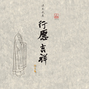
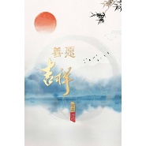
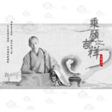

印良法师
============================

|  |  |
| :--: | :-- |
| [ 印良法师](https://i.xiami.com/yinliang) | **地区**: China 中国大陆 **风格**: 古典音乐 Classical, 中国风 China-Wave **播放数**: 541968 **粉丝数**: 243 **评论数**: 9  |

## 档案

印良法师 
vx动态.搜索“世嘉印良” 
法号：天几   字号：印良   别号：岚山斋主 
天津乐善妙觉院住持 
武夷山乐善福安寺住持 
现代梵呗佛教音乐人 
医易世家、世袭祖德。自幼参学儒释道三教文化，及医易传统文化。垂髫皈依三宝，而立于武夷山天心永乐禅寺披剃，太姥山平兴寺律坛得戒。舞象入道，研习禅、律、净、密四宗佛学文化。知三宝恩，感上师恩，念众生恩，报国家恩。常年历行佛学及传统文化的传播推广。愿心平等，利乐有情。势承释迦如来家业，延袭大日毗卢法源。

## 专辑

| 名称 | 语种 | 唱片公司 | 发行时间 | 专辑类别 | 专辑风格 |
| :--: | :-- | :-- | :-- | :-- | :-- |
| [ 行愿吉祥](./albums/2104998874.md) | 国语 |  | 2019年03月07日 | 录音室专辑 | 古风 GuFeng Music, 佛教音乐 Buddhist Music, 中国风 China-Wave |
| [ 菩提大道](./albums/5022574527.md) | 国语 | 独立发行 | 2014年12月01日 | 录音室专辑 |  |
| [ 恒愿吉祥](./albums/2104971487.md) | 国语 | 独立发行 | 不详 | 录音室专辑 | 古风 GuFeng Music, 佛教音乐 Buddhist Music |
| [ 善愿吉祥](./albums/2104971835.md) | 国语 |  | 不详 | 录音室专辑 | 佛教音乐 Buddhist Music, 中国风 China-Wave |
| [ 乘愿吉祥](./albums/2104971471.md) | 国语 | 独立发行 | 不详 | 录音室专辑 | 佛教音乐 Buddhist Music |

## 评论

|  |  |  |
| :-- | :-- | :-- |
|  [虾米用户](https://emumo.xiami.com/u/358104299) 悲观的唯心存在现实解构虚... 2021-01-07 06:04 赞(0) 踩(0) | 
45848
 |
|  [虾米用户](https://emumo.xiami.com/u/445141210) 平常心是道，态度决定一切... 2020-11-22 19:56 赞(0) 踩(0) | 
顶礼师父   阿弥陀佛   
 |
|  [虾米用户](https://emumo.xiami.com/u/421688877)  2020-10-23 21:15 赞(0) 踩(0) | 
   
 |
|  [虾米用户](https://emumo.xiami.com/u/356568486) 空聆君声 2020-08-01 12:01 赞(1) 踩(0) | 
你好师傅 
 |
|  [虾米用户](https://emumo.xiami.com/u/410942469)  2020-07-27 21:56 赞(0) 踩(0) | 
  
 |
|  [虾米用户](https://emumo.xiami.com/u/443390284)  2020-06-03 12:12 赞(0) 踩(0) | 
阿弥陀佛
 |
|  [虾米用户](https://emumo.xiami.com/u/429914605)  2020-03-31 11:26 赞(0) 踩(0) | 
  
 |
|  [虾米用户](https://emumo.xiami.com/u/280855268)  2019-11-28 08:57 赞(0) 踩(0) | 
师父吉祥 阿弥陀佛
 |
|  [虾米用户](https://emumo.xiami.com/u/325205625)  2019-11-24 07:08 赞(0) 踩(0) | 
，
 |
