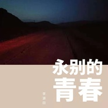

李源田
============================

|  |  |
| :--: | :-- |
| [ 李源田](https://i.xiami.com/lyt) | **播放数**: 96259 **粉丝数**: 120 **评论数**: 3 **地区**: China 中国大陆 **风格**: 独立民谣 Indie Folk  |

## 档案

## 专辑

| 名称 | 语种 | 唱片公司 | 发行时间 | 专辑类别 | 专辑风格 |
| :--: | :-- | :-- | :-- | :-- | :-- |
| [ 永别的青春](./albums/2105436909.md) | 国语 | 独立发行 | 2017年11月16日 | 合集, 杂锦 | 民谣 Folk |

## 评论

|  |  |  |  |
| :-- | :-- | :-- | :-- |
|  [虾米用户](https://emumo.xiami.com/u/330870052)  2020-03-11 23:43 赞(0) 踩(0) | 
   
 |
|  [虾米用户](https://emumo.xiami.com/u/433814845)  2019-12-11 22:59 赞(0) 踩(0) | 
捉
 |
|  [虾米用户](https://emumo.xiami.com/u/316261284) 到最后…… 2019-11-15 19:15 赞(2) 踩(0) | 
先占个沙发，以后会有更多的人来的 
 |
