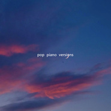

pop piano versions
============================

|  |  |
| :--: | :-- |
| [ pop piano versions](https://emumo.xiami.com/album/2108422018) | **艺人**: [pinkman](../index.md) **语种**: 纯音乐 **唱片公司**: 独立发行 **发行时间**: 2008年05月02日 **专辑类别**: 合集, 杂锦 **专辑风格**: 轻音乐 Easy Listening **播放数**: 53617 **收藏数**: 9 **评论数**: 2  |

## 简介

## 曲目

## 评论

|  |  |  |  |
| :-- | :-- | :-- | :-- |
|  [虾米用户](https://emumo.xiami.com/u/355865) Let it go, l... 2020-05-16 09:38 赞(0) 踩(0) | 
这种翻奏作品版权有没有还不好说，但更重要的是曲目艺人不要写原唱。谢谢！
 |
|  [虾米用户](https://emumo.xiami.com/u/344053406) .... 2020-05-06 22:36 赞(0) 踩(0) | 
孤独不可怕，可怕的是被人遗忘
 |
