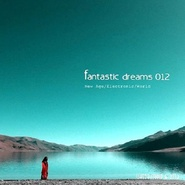

纯境新世纪音乐
============================

|  |  |
| :--: | :-- |
| [ 纯境新世纪音乐](https://emumo.xiami.com/album/5021323866) | **艺人**: [隋林木](../index.md) **语种**: 纯音乐 **唱片公司**: 独立发行 **发行时间**: 2018年07月25日 **专辑类别**: 录音室专辑 **专辑风格**: 新世纪音乐 New Age, 世界音乐 World Music **播放数**: 111 **收藏数**: 3 **评论数**: 1  |

## 简介

还是比较喜欢纯音乐，有很大的空间，很大的想象

## 曲目

## 评论

|  |  |  |
| :-- | :-- | :-- |
|  [虾米用户](https://emumo.xiami.com/u/445822532)  2020-11-07 19:01 赞(0) 踩(0) | 
很心灵很喜欢～
 |
