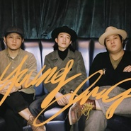
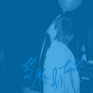
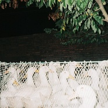
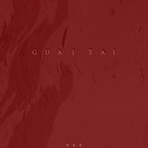

回春丹
============================

|  |  |
| :--: | :-- |
| [ 回春丹](https://i.xiami.com/hcd0771) | **地区**: China 中国大陆 **风格**: 独立摇滚 Indie Rock **播放数**: 323242 **粉丝数**: 1445 **评论数**: 48  |

## 档案

回春丹(YOUNG DRUG),中国广西独立摇滚乐队,2016年成立于钦州。乐队成员为刘西蒙、郭威伦、简丹三人,以Indie rock(独立摇滚)为主,其间也融入Disco曲风,Post punk(后朋)等音乐形式的元素。抓耳的吉他Riff和复古简单的古典加上主唱自带调皮磁性的声线成为特色。2019年,独立发行EP《兴奋到死的东西》,并开始广西联合巡演“独丹会师事件”。 
成立至今,无论是编曲还是现场都给新老乐迷灌输眼前一亮的味道,在短短时间内迅速成为北部湾一只曲风和品味鲜明的乐队,并且一致被外省乐队口口相传的北部湾的一颗“回春”的灵丹妙药 
作品取材于身边的人和事,更源于心田的诉说,一直天马行空,却不缺反躬自省。 
代表作有《兴奋到死的东西》、《五彩斑斓的黑》、《正义》等。 
乐队微博:回春丹乐队

## 专辑

| 名称 | 语种 | 唱片公司 | 发行时间 | 专辑类别 | 专辑风格 |
| :--: | :-- | :-- | :-- | :-- | :-- |
| [ 梦特别娇](./albums/5022570154.md) | 国语 | 瓦兹妙赞 | 2021年01月22日 | EP, 单曲 | 独立摇滚 Indie Rock |
| [ 巨星](./albums/5021339219.md) | 国语 | 独立发行 | 2020年04月12日 | EP, 单曲 |  |
| [ 艾蜜莉](./albums/5020905356.md) | 国语 | 独立发行 | 2020年03月08日 | EP, 单曲 |  |
| [ 从那刻起我注定为此战斗](./albums/5021338289.md) | 国语 | 独立发行 | 2019年12月29日 | EP, 单曲 |  |
| [ ARRIVAL](./albums/5021084851.md) | 其他 | 独立发行 | 2019年07月23日 | EP, 单曲 |  |
| [ 庙小妖风大](./albums/5020904884.md) | 国语 | 独立发行 | 2019年06月20日 | EP, 单曲 |  |
| [ 兴奋到死的东西](./albums/5020908850.md) | 国语 | 独立发行 | 2019年06月01日 | EP, 单曲 |  |
| [ 五彩斑斓的黑](./albums/5020908378.md) | 国语 | 独立发行 | 2019年04月23日 | EP, 单曲 |  |
| [ 正 义](./albums/5020914812.md) | 国语 | 独立发行 | 2018年11月29日 | EP, 单曲 | 独立摇滚 Indie Rock |
| [ 乐色车](./albums/5020904885.md) | 国语 | 独立发行 | 2018年11月17日 | EP, 单曲 |  |
| [ 怪胎](./albums/5020904376.md) | 国语 | 独立发行 | 2018年06月22日 | EP, 单曲 |  |

## 评论

|  |  |  |
| :-- | :-- | :-- |
|  [虾米用户](https://emumo.xiami.com/u/14747594) 大音希声 2021-01-31 08:40 赞(0) 踩(0) | 
虾米推荐了你们的新歌，喜欢主唱慵懒的嗓音。
 |
|  [虾米用户](https://emumo.xiami.com/u/358104299) 悲观的唯心存在现实解构虚... 2021-01-29 01:37 赞(1) 踩(0) | 
47235
 |
|  [虾米用户](https://emumo.xiami.com/u/379647937)  2021-01-28 11:57 赞(0) 踩(0) | 
广西牛逼
 |
|  [虾米用户](https://emumo.xiami.com/u/30074304) 寄蜉蝣于天地，渺沧海之一... 2021-01-26 10:46 赞(0) 踩(0) | 
✈
 |
|  [虾米用户](https://emumo.xiami.com/u/276479856) @晚安虾米音乐/公众等你 2021-01-25 23:31 赞(2) 踩(0) | 
广西钦州的乐队
 |
|  [虾米用户](https://emumo.xiami.com/u/550543)   2021-01-25 15:54 赞(2) 踩(0) | 
钦州老表牛逼
 |
|  [虾米用户](https://emumo.xiami.com/u/446227591) 游泳池小便的人 2021-01-25 14:13 赞(0) 踩(0) | 
(&amp;acute;&amp;deg;̥̥̥̥̥̥̥̥&amp;omega;&amp;deg;̥̥̥̥̥̥̥̥｀)
 |
|  [虾米用户](https://emumo.xiami.com/u/18151836) 孤獨又兇 2020-11-29 07:54 赞(1) 踩(0) | 
昨夜打卡成功
 |
|  [虾米用户](https://emumo.xiami.com/u/19694431)  2020-11-28 04:57 赞(0) 踩(0) | 
6月在南宁江南万达的演出令人惊喜，从此圈粉 
 |
|  [虾米用户](https://emumo.xiami.com/u/44029153) 我还没想好要写什么... 2020-11-27 15:20 赞(1) 踩(0) | 
巡演加个北京行不行
 |
|  [虾米用户](https://emumo.xiami.com/u/84377532) 我还没想好要写什么... 2020-11-15 21:46 赞(2) 踩(0) | 
其实你们怎么不把作品传到Spotify喔
 |
|  [虾米用户](https://emumo.xiami.com/u/55002730) 不懂爱听瞎弄 2020-11-07 10:47 赞(0) 踩(0) | 
-L-
 |
|  [虾米用户](https://emumo.xiami.com/u/147361618) 再会 2020-11-06 21:32 赞(0) 踩(0) | 
！
 |
|  [虾米用户](https://emumo.xiami.com/u/338032733) 極 度 理 智 2020-11-05 15:57 赞(0) 踩(0) | 
已回春hhhhhh
 |
|  [虾米用户](https://emumo.xiami.com/u/444808551)  2020-11-03 11:18 赞(0) 踩(0) | 
巡演搞快点安排上川渝！！！！！
 |
|  [虾米用户](https://emumo.xiami.com/u/445043596)  2020-10-27 11:34 赞(0) 踩(0) | 
想看短裙双马尾
 |
|  [虾米用户](https://emumo.xiami.com/u/11686115)   2020-10-25 15:04 赞(0) 踩(0) | 
抖腿
 |
|  [虾米用户](https://emumo.xiami.com/u/1223357) 疲于抒情后的抒情方式 2020-10-13 06:06 赞(0) 踩(0) | 
想看现场（北京！
 |
|  [虾米用户](https://emumo.xiami.com/u/50546127) 不是我们早熟，是世界逼迫... 2020-10-11 10:53 赞(0) 踩(0) | 
好听~
 |
|  [虾米用户](https://emumo.xiami.com/u/5449843) 虾听听 2020-10-10 16:08 赞(0) 踩(0) | 
编曲很厉害的乐队，就是希望vocal再认真点 
 |
|  [虾米用户](https://emumo.xiami.com/u/38164) 钻石牌钻石型钻石牙刷。 2020-10-09 22:22 赞(0) 踩(0) | 
好～～～～～～
 |
|  [虾米用户](https://emumo.xiami.com/u/36938932) 倒霉的小伙子比洞還潮濕的... 2020-10-09 15:23 赞(0) 踩(0) | 
〰️
 |
|  [虾米用户](https://emumo.xiami.com/u/44374843) 吻我 2020-10-09 02:09 赞(1) 踩(0) | 
朋友安利的 太好听了吧 求求你们 来西北演出吧 求求了
 |
|  [虾米用户](https://emumo.xiami.com/u/45138714)  2020-10-08 19:43 赞(2) 踩(0) | 
我说句不公正的话哦。   回春丹牛！看了两次上海的现场蹦到一身衣服湿透，整个人被蛊惑，回来使劲安利给周围的朋友
 |
| ⇒ |  [虾米用户](https://emumo.xiami.com/u/49145538) 鲜活 2020-12-13 15:25 赞(0) 踩(0) | 

 |
|  [虾米用户](https://emumo.xiami.com/u/31213633) I DON'T UNDE... 2020-09-26 22:35 赞(1) 踩(0) | 
有点子意思哦！！！！！
 |
|  [虾米用户](https://emumo.xiami.com/u/14043729) 挖 礦 中 2020-09-19 11:10 赞(0) 踩(0) | 
主場聲音好好聽_(:з」&amp;ang;)_
 |
|  [虾米用户](https://emumo.xiami.com/u/26449069)  2020-09-14 00:02 赞(0) 踩(0) | 
现在关注可以算老粉嘛
 |
|  [虾米用户](https://emumo.xiami.com/u/349339882) 后荣迷。努力学习中。 2020-09-12 21:09 赞(1) 踩(0) | 
舍友去了音乐节之后强烈推荐，于是乎我来到了这里
 |
|  [虾米用户](https://emumo.xiami.com/u/50284190) 我是一片乱码 2020-09-10 09:49 赞(1) 踩(0) | 
!
 |
|  [虾米用户](https://emumo.xiami.com/u/2955288) 音乐是最私密的交流 2020-09-08 01:18 赞(0) 踩(0) | 
现场太炸了，现在关注我就是老粉 
 |
|  [虾米用户](https://emumo.xiami.com/u/315904079) 不论过往，只看去处。 2020-09-05 22:21 赞(1) 踩(0) | 
八月份收获的惊喜&amp;mdash;&amp;mdash;回春丹。
 |
|  [虾米用户](https://emumo.xiami.com/u/5586779) be nice,be c... 2020-09-03 16:00 赞(2) 踩(0) | 
广西乐队 一把子支持！！！
 |
| ⇒ |  [虾米用户](https://emumo.xiami.com/u/24668614)   2020-09-17 22:28 赞(0) 踩(0) | 
说到广西乐队，还得说一下旅行团
 |
|  [虾米用户](https://emumo.xiami.com/u/354509735) 我还没想好要写什么... 2020-09-01 10:48 赞(0) 踩(0) | 
上海见！
 |
|  [虾米用户](https://emumo.xiami.com/u/35582280) 我这一生都快活 2020-08-28 22:24 赞(0) 踩(0) | 
喜欢你们！
 |
|  [虾米用户](https://emumo.xiami.com/u/8653708) 音乐是生命的光。 2020-08-26 14:59 赞(2) 踩(0) | 
感谢虾米AI推荐，才知道他们。编曲多元化，前奏很抓耳，曲风偏迷幻，主唱声线与曲风非常契合，曲名也极为独特，歌词很有意思。一支才华洋溢的广西摇滚乐队！
 |
|  [虾米用户](https://emumo.xiami.com/u/44970264) 红拂夜奔 2020-08-19 18:46 赞(1) 踩(0) | 
广西味道十足
 |
|  [虾米用户](https://emumo.xiami.com/u/41843325)   2020-08-14 10:19 赞(0) 踩(0) | 
夏日冲浪手 冲鸭！
 |
|  [虾米用户](https://emumo.xiami.com/u/443039737) 想搞艺术 2020-08-12 16:03 赞(1) 踩(0) | 
太太太喜欢你们了，希望越来越好
 |
|  [虾米用户](https://emumo.xiami.com/u/1302274) 啦啦啦 2020-08-09 22:29 赞(0) 踩(0) | 
哎哟不错哦
 |
|  [虾米用户](https://emumo.xiami.com/u/13465367) RANDOMSIDE 2020-08-07 15:06 赞(1) 踩(0) | 
今天刚发掘到 真的让我兴奋了 喜欢
 |
|  [虾米用户](https://emumo.xiami.com/u/4780463) 要啥自行车啊！ 2020-07-30 14:03 赞(0) 踩(0) | 
期待现场！
 |
|  [虾米用户](https://emumo.xiami.com/u/431736720) 。 2020-07-29 21:57 赞(2) 踩(0) | 
喜欢《正义》！
 |
|  [虾米用户](https://emumo.xiami.com/u/49574663) 你 愛 了 整 個 宇 ... 2020-07-28 10:36 赞(2) 踩(0) | 
你变成我的喜欢啦
 |
|  [虾米用户](https://emumo.xiami.com/u/4180906) 你好，虾小米 2020-07-22 20:13 赞(2) 踩(0) | 
喜欢艾蜜莉～ (ง &amp;bull;_&amp;bull;)ง
 |
|  [虾米用户](https://emumo.xiami.com/u/420035441)  2020-06-20 08:53 赞(2) 踩(0) | 
喜欢艾蜜莉～ (ง &amp;bull;_&amp;bull;)ง
 |
|  [虾米用户](https://emumo.xiami.com/u/14152141)  2020-06-18 10:55 赞(3) 踩(0) | 
喜欢艾蜜莉～ (ง &amp;bull;_&amp;bull;)ง
 |
