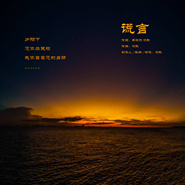

冯聪
============================

|  |  |
| :--: | :-- |
| [ 冯聪](https://i.xiami.com/andyfeng) | **地区**: 中国大陆 China **风格**: 流行 Pop, 流行摇滚 Pop Rock **播放数**: 1080513 **粉丝数**: 257 **评论数**: 0  |

## 档案

## 专辑

| 名称 | 语种 | 唱片公司 | 发行时间 | 专辑类别 | 专辑风格 |
| :--: | :-- | :-- | :-- | :-- | :-- |
| [ 一个人仰望](./albums/5022278734.md) | 国语 | 独立发行 | 2020年12月24日 | EP, 单曲 | 流行 Pop, 流行摇滚 Pop Rock |
| [ 我们生活在米锅](./albums/5021626397.md) | 国语 | 独立发行 | 2020年10月06日 | EP, 单曲 | 流行 Pop, 硬摇滚 Hard Rock, 流行摇滚 Pop Rock |
| [ 谎言](./albums/5021428314.md) | 国语 | 独立发行 | 2020年08月22日 | EP, 单曲 | 流行 Pop, 流行摇滚 Pop Rock |

## 评论

