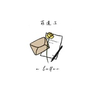

A Letter
============================

|  |  |
| :--: | :-- |
| [ A Letter](https://emumo.xiami.com/album/5021981448) | **艺人**: [菲道尔](../index.md) **语种**: 国语 **唱片公司**: 星外星音乐 **发行时间**: 2020年11月25日 **专辑类别**: EP, 单曲 **专辑风格**: 国语流行 Mandarin Pop **播放数**: 300363 **收藏数**: 8 **评论数**: 1  |

## 简介

他叫Firdhaus ,中文名字为菲道尔。

A letter -- 这些歌是写给她，他和祂的信。

没有哗众取宠的大卡司，他只想真诚地表达心里想说的话。

 

<strong>歌曲介绍：</strong>

<strong>01.阿拉斯加海湾</strong>

阿拉斯加海湾是世界上著名的9大海湾之一。

它属于美国和加拿大之间的海域，海面呈现两个颜色。由於密度关系，两片海不能融为一体。那一天，Firdhaus看到那片海的照片，就深深地被感动了。

～ 我们的爱情犹如阿拉斯加海湾，相爱却没办法在一起。

 

<strong>02.If I Die,Pls Tell My Mom I Love Her.</strong>

这是Firdhaus最低潮的时期写的一首歌。

面对生活，面对压力，有些时候，真的彷徨无助地感觉快要窒息。

也曾经有过要轻生的念头，但一想起妈妈还在家里等着他回去，所有的坏念头瞬间就被击垮了。这是一首听起来很平静，但内心却很复杂的歌。如同副歌写的，

please let me go, I wanna be alone;please hold close, I’m scared of being alone. 也描述了想要独处一個人，但卻又渴望被人拥抱的心情。

 

<strong>03.Hey,I Like You A Lot.</strong>

这是一首写给她的信。在一次争吵中，仅仅用了半小时，一气呵成地将心里想对她说的话，完完全全地都写成了歌送给她。

一把吉他，一把真诚的声音，诉说着我想对你说的话。

Hey！我真的很喜欢你～

 

<strong>04.Buta</strong>

这是Firdhaus用母语写的一首歌。Buta （念：捕他）在马来语是瞎子的意思。

～ 你是瞎子吗？不然你怎么会看不见我对你的爱呢？

 

<strong>05.哥哥（Demo版）</strong>

这是写给前任孩子的一封信。

抱歉，我在最无能为力的时候遇见了你们。

抱歉，我没办法给你们一个家。

但亲爱的孩子，最后我只能做你的哥哥。

听哥哥的话，你要好好长大，在妈妈需要安慰的时候，紧紧抱住她～

 

 

## 曲目

## 评论

|  |  |  |  |
| :-- | :-- | :-- | :-- |
|  [虾米用户](https://emumo.xiami.com/u/374338021)  2021-01-20 14:17 赞(1) 踩(0) | 
值得单曲循环
 |
