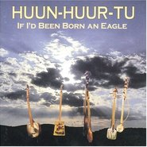

If I'd Been Born an Eagle
============================

|  |  |
| :--: | :-- |
| [ If I'd Been Born an Eagle](https://emumo.xiami.com/album/121161) | **艺人**: [Huun-Huur-Tu](../index.md) **语种**: 其他 **唱片公司**: Shanachie **发行时间**: 1997年01月21日 **专辑类别**: 录音室专辑 **专辑风格**: 蒙古 | 呼麦 Throat Singing **播放数**: 87502 **收藏数**: 352 **评论数**: 18  |

## 简介

by  Chris Nickson
Huun-Huur-Tu's third album shows the group broadening the scope of its music. As the ensemble members themselves point out, there's a great deal more to Tuvan music than throat singing, although it might well be the form that grabs a listener's attention. This is their attempt to show both the historical and contemporary colors of Tuva, with old melodies but also many from the last 30 years that have become a part of the national consciousness. And they also explore the inevitable connections between Russian and Tuvan music. But throughout it all, the rhythm is that of the horse, which is that of Tuva. That's not to say they've made a turn away from their trademark throat singing. It's still here, and still gloriously otherworldly, but at the same time incredibly accessible and completely human, with plenty of passion and all the soul of the best of Memphis. 

## 曲目

## 评论

|  |  |  |  |
| :-- | :-- | :-- | :-- |
|  [虾米用户](https://emumo.xiami.com/u/276944698) 不要自我设限..... 2020-09-28 00:03 赞(0) 踩(0) | 
☑️☑️☑️
 |
|  [虾米用户](https://emumo.xiami.com/u/54939396) 虾米音乐陪葬品 唯心主义... 2020-07-21 16:39 赞(0) 踩(0) | 
。
 |
|  [虾米用户](https://emumo.xiami.com/u/3681820)  2020-05-10 17:34 赞(0) 踩(0) | 
.
 |
|  [虾米用户](https://emumo.xiami.com/u/335064623)  2018-10-03 11:44 赞(0) 踩(0) | 
～
 |
|  [虾米用户](https://emumo.xiami.com/u/13194141) 看到的给我来个联络方式。... 2018-06-02 11:24 赞(2) 踩(0) | 
说实话，搞这种民乐还有喜欢这种民乐的人，多半还不算太肾虚，听古典轻音乐的多半都是肾虚，脾胃也不好的人
 |
|  [虾米用户](https://emumo.xiami.com/u/3583995) 一個人的戰爭 2018-03-03 10:38 赞(0) 踩(0) | 
.
 |
|  [虾米用户](https://emumo.xiami.com/u/2279444) 爱在左，同情在右。 2016-09-09 08:28 赞(0) 踩(0) | 
CD都听不出感觉，更别说数字音乐了，这种伟大的音乐还是得听现场
 |
|  [虾米用户](https://emumo.xiami.com/u/99728810)  2016-07-12 17:35 赞(1) 踩(0) | 
Huun Huur Tu 2016《流浪的英雄》中国巡演已经开票：8月20日 上海 MAO LIVEHOUSE8月21日 成都 小酒馆空间8月24日 重庆 MAO LIVEHOUSE8月26日 武汉 VOX武昌店9月2日 广州 乐府LIVEHOUSE9月3日 深圳 B10现场9月9日 呼和浩特 乌兰恰特大剧院9月11日 北京 天桥艺术中心
 |
|  [虾米用户](https://emumo.xiami.com/u/27684693)  2016-05-04 17:17 赞(0) 踩(0) | 
******
 |
|  [虾米用户](https://emumo.xiami.com/u/45833112) 懒癌晚期无药可救 2015-09-20 00:30 赞(0) 踩(0) | 
!!!!!!!!!!!!!!!!!!!!!!!!!!!!!!!!!!!!!!!!!!
 |
|  [虾米用户](https://emumo.xiami.com/u/50329001)  2015-05-25 22:44 赞(0) 踩(0) | 
song of a lonely man
 |
|  [虾米用户](https://emumo.xiami.com/u/4261281)  2014-12-27 17:55 赞(0) 踩(0) | 
If I&amp;#039;d Been Born an Eagle
 |
|  [虾米用户](https://emumo.xiami.com/u/10227968) 暂无签名~ 2014-03-30 21:15 赞(0) 踩(0) | 
牛逼
 |
|  [虾米用户](https://emumo.xiami.com/u/8539366) 我们在网易云音乐相见，网... 2013-11-11 10:42 赞(0) 踩(0) | 
这个乐队肯定不属于地球
 |
|  [虾米用户](https://emumo.xiami.com/u/25282524)  2013-10-24 20:44 赞(0) 踩(0) | 
Huun-Huur-Tu
 |
|  [虾米用户](https://emumo.xiami.com/u/5732508) Duu Studio 2013-01-30 20:37 赞(0) 踩(0) | 
新专辑哦
 |
|  [虾米用户](https://emumo.xiami.com/u/3242915)  2012-04-26 13:39 赞(0) 踩(0) | 
非常深情。
 |
|  [虾米用户](https://emumo.xiami.com/u/8397360)  2012-03-12 05:57 赞(0) 踩(0) | 
图瓦音乐07
 |
