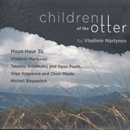

Children of the Otter
============================

|  |  |
| :--: | :-- |
| [ Children of the Otter](https://emumo.xiami.com/album/2104058689) | **艺人**: [Huun-Huur-Tu](../index.md) **语种**: 其他 **唱片公司**: Jaro Records **发行时间**: 2018年09月01日 **专辑类别**: 录音室专辑 **专辑风格**: 世界音乐 World Music **播放数**: 19782 **收藏数**: 177 **评论数**: 18  |

## 简介

## 曲目

## 评论

|  |  |  |  |
| :-- | :-- | :-- | :-- |
|  [虾米用户](https://emumo.xiami.com/u/66823378)  2020-03-07 11:34 赞(0) 踩(0) | 

 |
|  [虾米用户](https://emumo.xiami.com/u/9940343) B I R T H M ... 2019-08-21 02:31 赞(0) 踩(0) | 

 |
|  [虾米用户](https://emumo.xiami.com/u/22443747) 网易 危险de熊猫 2019-07-29 23:37 赞(0) 踩(0) | 
有新砖就巡演
 |
|  [虾米用户](https://emumo.xiami.com/u/344018512) 我还没想好要写什么... 2019-04-21 01:28 赞(0) 踩(0) | 
D
 |
|  [虾米用户](https://emumo.xiami.com/u/344018512) 我还没想好要写什么... 2019-04-21 01:23 赞(0) 踩(0) | 
D
 |
|  [虾米用户](https://emumo.xiami.com/u/7452644) 夫为乐  为乐当及时 2019-01-26 22:59 赞(0) 踩(0) | 
呼麦到位
 |
|  [虾米用户](https://emumo.xiami.com/u/362761497)  2019-01-25 12:53 赞(0) 踩(0) | 
好。
 |
|  [虾米用户](https://emumo.xiami.com/u/336347053) 我还没想好要写什么... 2019-01-09 22:21 赞(0) 踩(0) | 
  
 |
|  [虾米用户](https://emumo.xiami.com/u/30074304) 天阶夜色凉如水，坐看牵牛... 2018-11-15 20:52 赞(0) 踩(0) | 
✈
 |
|  [虾米用户](https://emumo.xiami.com/u/292643805) 玩世不恭曾经很帅自然神论... 2018-10-23 22:45 赞(2) 踩(0) | 
突然想起窦唯……
 |
|  [虾米用户](https://emumo.xiami.com/u/33312863) 世界音乐！中国名族原生态... 2018-10-19 01:59 赞(0) 踩(0) | 
学寇奶奶玩实验？歌没听出好来，大半夜的被背景乐器吵的头痛
 |
|  [虾米用户](https://emumo.xiami.com/u/33312863) 世界音乐！中国名族原生态... 2018-10-19 01:36 赞(0) 踩(0) | 
背景乐器炒的头疼呢
 |
|  [虾米用户](https://emumo.xiami.com/u/264285708)  2018-10-05 19:27 赞(0) 踩(0) | 
棒了我的男神们  
 |
|  [虾米用户](https://emumo.xiami.com/u/114934974) 我还没想好要写什么... 2018-10-05 07:57 赞(0) 踩(0) | 
水獭的孩子
 |
|  [虾米用户](https://emumo.xiami.com/u/242726203) 我还没想好要写什么... 2018-09-29 20:44 赞(0) 踩(0) | 
孜莫格尼
 |
|  [虾米用户](https://emumo.xiami.com/u/35831197)  2018-09-28 18:28 赞(0) 踩(0) | 
古典音乐 
 |
|  [虾米用户](https://emumo.xiami.com/u/67608) 最深处的曼陀…… 2018-09-28 14:25 赞(0) 踩(0) | 
Get!
 |
|  [虾米用户](https://emumo.xiami.com/u/317139268) 我还没想好要写什么... 2018-09-28 13:45 赞(0) 踩(0) | 
今天发行的！！！
 |
