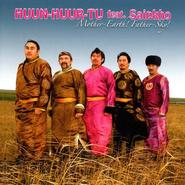

Mother Earth! Father Sky!
============================

|  |  |
| :--: | :-- |
| [ Mother Earth! Father Sky!](https://emumo.xiami.com/album/444232) | **艺人**: [Huun-Huur-Tu](../index.md) **语种**: 其他 **唱片公司**: Jaro **发行时间**: 2008年09月26日 **专辑类别**: 合集, 杂锦 **专辑风格**:  **播放数**: 85652 **收藏数**: 583 **评论数**: 34  |

## 简介

## 曲目

## 评论

|  |  |  |  |
| :-- | :-- | :-- | :-- |
|  [虾米用户](https://emumo.xiami.com/u/54939396) 虾米音乐陪葬品 唯心主义... 2020-10-15 18:32 赞(0) 踩(0) | 
。
 |
|  [虾米用户](https://emumo.xiami.com/u/30074304) 天阶夜色凉如水，坐看牵牛... 2018-11-15 20:50 赞(0) 踩(0) | 
✈
 |
|  [虾米用户](https://emumo.xiami.com/u/380169122)  2018-07-31 19:03 赞(1) 踩(0) | 
瓦国宝级乐队，呼麦组合鼻祖，Huun Huur Tu 恒哈图2018中国巡演，喜欢的朋友别错过，详情请关注战马音乐节公众号。
 |
|  [虾米用户](https://emumo.xiami.com/u/3583995) 一個人的戰爭 2018-03-03 10:39 赞(0) 踩(0) | 
.
 |
|  [虾米用户](https://emumo.xiami.com/u/340527026) 朋友 2018-02-24 16:32 赞(0) 踩(0) | 
大爱珊克，大爱恒哈图
 |
|  [虾米用户](https://emumo.xiami.com/u/340527026) 朋友 2018-02-24 16:31 赞(0) 踩(0) | 
所以，图片上的第五个是谁
 |
|  [虾米用户](https://emumo.xiami.com/u/8337431) 以乐会友 2017-12-12 07:15 赞(1) 踩(0) | 
29
 |
|  [虾米用户](https://emumo.xiami.com/u/5532083)  2017-05-14 22:16 赞(0) 踩(0) | 
虾米一半的歌都不能听了......唉
 |
|  [虾米用户](https://emumo.xiami.com/u/13831197) 乐 生活 2016-07-06 11:01 赞(0) 踩(0) | 
还好 CD到手 哈哈哈哈！
 |
|  [虾米用户](https://emumo.xiami.com/u/77056636) 爱在民国 2016-01-26 23:28 赞(1) 踩(0) | 
为啥现在不能听了？
 |
|  [虾米用户](https://emumo.xiami.com/u/50621425) 不管什么人 我都不希望他... 2015-06-09 17:55 赞(0) 踩(0) | 
Это Тува!
 |
|  [虾米用户](https://emumo.xiami.com/u/7626910)  2015-05-08 17:47 赞(0) 踩(0) | 
棒！！！
 |
|  [虾米用户](https://emumo.xiami.com/u/1457616) 合法公民！ 2015-03-19 19:41 赞(0) 踩(0) | 
goy
 |
|  [虾米用户](https://emumo.xiami.com/u/10203743)  2014-08-26 14:01 赞(0) 踩(0) | 
居然尝试了坦博拉鼓的跨界
 |
|  [虾米用户](https://emumo.xiami.com/u/13160963) 虾米虾米 2014-07-10 14:57 赞(0) 踩(0) | 
牛
 |
|  [虾米用户](https://emumo.xiami.com/u/25282524)  2013-10-24 20:42 赞(0) 踩(0) | 
Huun-Huur-Tu
 |
|  [虾米用户](https://emumo.xiami.com/u/18822056)  2013-10-22 22:21 赞(0) 踩(0) | 
图瓦！
 |
|  [虾米用户](https://emumo.xiami.com/u/5003486)  2013-09-28 14:55 赞(0) 踩(0) | 
huun guur tu
 |
|  [虾米用户](https://emumo.xiami.com/u/689903)  2013-08-24 09:19 赞(1) 踩(0) | 
真不错，文字在声音面前太无力了，用耳朵吧
 |
|  [虾米用户](https://emumo.xiami.com/u/4312812)  2013-07-17 18:58 赞(2) 踩(0) | 
和Sainkho Namtchylak合作的呀
 |
| ⇒ |  [虾米用户](https://emumo.xiami.com/u/208769596)  2016-08-04 10:55 赞(0) 踩(0) | 
哇哇哇经典
 |
|  [虾米用户](https://emumo.xiami.com/u/3383618)  2012-11-09 02:34 赞(0) 踩(0) | 
太棒了
 |
|  [虾米用户](https://emumo.xiami.com/u/2295498)  2012-08-24 23:33 赞(0) 踩(0) | 
美得要了我命了。。。。好好听。。。。
 |
|  [虾米用户](https://emumo.xiami.com/u/4870567)  2012-08-10 23:33 赞(0) 踩(0) | 
美，
 |
|  [虾米用户](https://emumo.xiami.com/u/8397360)  2012-03-12 05:54 赞(0) 踩(0) | 
图瓦音乐03
 |
|  [虾米用户](https://emumo.xiami.com/u/6442725) 游戏配乐 2011-12-06 10:06 赞(0) 踩(0) | 
珍贵的作品
 |
|  [虾米用户](https://emumo.xiami.com/u/325053)  2011-08-20 15:47 赞(0) 踩(0) | 
为什么听这个专辑时···会一直出现   醉生梦死  这个词呢···
 |
|  [虾米用户](https://emumo.xiami.com/u/325053)  2011-08-20 14:49 赞(0) 踩(0) | 
必备的防浮躁镇定曲儿
 |
|  [虾米用户](https://emumo.xiami.com/u/3922736)  2011-06-20 10:13 赞(1) 踩(0) | 
虽然专辑名让人不由得联想到“天父地母，反清复明”，但着实是一张耐听的好专辑。
 |
|  [虾米用户](https://emumo.xiami.com/u/582120)  2011-06-04 10:17 赞(0) 踩(0) | 
居然是Huun-Huur-Tu和Sainkho 合作的专辑，绝对珍品！！！少见！！
 |
| ⇒ |  [虾米用户](https://emumo.xiami.com/u/1401356)  2011-06-06 22:54 赞(0) 踩(0) | 
天父地母，蒙古人的世界观
 |
|  [虾米用户](https://emumo.xiami.com/u/454116) 我还没想好要写什么... 2011-06-03 22:45 赞(0) 踩(0) | 
一种无国度的语言
 |
|  [虾米用户](https://emumo.xiami.com/u/158348) 无个性 不签名！ 2011-06-03 16:19 赞(0) 踩(0) | 
感谢筠下
 |
|  [虾米用户](https://emumo.xiami.com/u/450404) 隐于深山静湖.森林流泉间 2011-06-03 13:20 赞(0) 踩(0) | 
感谢筠下发布~
 |
