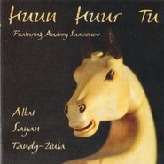
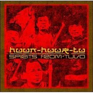
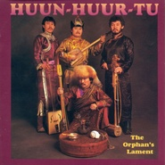

Huun-Huur-Tu
============================

|  |  |
| :--: | :-- |
| [ Huun-Huur-Tu](https://i.xiami.com/huun-huur-tu) | **播放数**: 4165746 **粉丝数**: 12573 **评论数**: 473 **地区**: Russia 俄罗斯 **风格**: 蒙古 | 呼麦 Throat Singing, 世界融合 World Fusion  |

## 档案

恒哈图乐队是一支来自俄罗斯与蒙古交界处图瓦共和国的乐队，Huun-Huur-Tu字面上的意思是日出日落时分被分割成一束束的太阳光芒。Huun-Huur-Tu是图瓦音乐文化中最早走向世界的代表。他们使用呼麦、口哨以及其他人声作品，再现着自然界的声音之美，他们是图瓦民谣的代表。 现今，恒哈图乐队与北京战马时代签约，每年在国内进行一系列的演出，大受欢迎。 
图瓦曾经隶属于清朝并被称为唐努乌梁海的时代，一个图瓦人骑着马去北京的情景，一首《北京》更加拉近了我们的距离。著名物理学家、诺贝尔奖得主理查德·费曼（Richard Feynman）算是最早发现图瓦呼麦的西方人之一。人口仅30多万、面积6600平方英里的图瓦共和国，是俄罗斯联邦中的一个小国。这个与蒙古和西伯利亚最南边接壤的国家，曾被纳入苏联版图，在人们的视野中消失了差不多有一个世纪。与世隔绝的图瓦共和国最初受到世界关注，是因为上世纪20年代发行的一套三角形邮票——人们在邮票上看到那里大片的美丽湖泊、骑着骆驼行走沙漠的人以及广袤草原上奔驰的马…… 
费曼正是被这套邮票所吸引。20多年前，他写信给美国人类音乐学家泰德（Ted Levin），信中只有寥寥数语：“我想，你们这些家伙肯定会对这种声音感兴趣。”费曼在信中附了一段录音，泰德把它塞进唱机，一个男人浑厚低沉的嗓音伴随着琴声从音箱中弥漫而出，不像人类的声音，像是来自几千年前的神秘召唤。“我感觉自己的灵魂被攫去。我决定到那块土地去，看看这些人是怎么发出这种奇妙的声音！”泰德很幸运，1987年，他在国家地理学会和苏联作曲家联盟的协助下如愿进入图瓦共和国。但费曼却留下终身遗憾——他一生的梦想就是去看看神秘的图瓦，却因美国与苏联的紧张关系而屡次被拒签，直到1988年他去世后数周，签证才递到他家人手中。 
就像完成朋友的遗愿，泰德把此生所有的时间都花在研究呼麦音乐上。他住在图瓦，做人类学田野调查，记录当地人的生活状态和呼麦诞生的形式。他在美国出版了《图瓦：来自亚洲中部的声音》，在图瓦结识了当地游牧民族中的呼麦高手。 
接下来的故事，便是恒哈图乐队的诞生了。在泰德的推动下，1993年，一支由四人组成的图瓦呼麦四重唱乐队出现在美国人视线中。那一年，33岁的凯戈尔（Kaigal-ool Khovalyg）、31岁的萨亚和另两位成员第一次离开他们的家乡，带着他们自己做的十多件古老乐器踏上走向世界的征途。 
显而易见，当西方世界面对面听到这种古老的声音，有多么惊诧。美国摇滚史上的先锋作曲家弗兰克·扎帕（Frank Zappa）在自己生命的最后一年跟恒哈图密切合作，电影音乐家Ry Cooder、黑人吉他手Johnny  Watson以及印度西塔琴大师香卡（L. Shankar）等都与恒哈图携手，几乎每一位音乐家都渴望在这神秘的声音中发掘他们的灵感。 
“我唱了40多年的呼麦，到现在，嗓子还是跟年轻时一样。”48岁的凯戈尔外貌跟实际年龄相差甚远，棕褐色的皮肤和满脸深刻的皱纹，都让他显得过分沧桑。他是乐队里公认的天才，他的呼麦是自学的，从幼年时开始，他就能模仿自然界里的动物的声音，甚至风声水声。21岁之前，他是草原上的牧羊者，过着纯粹的游牧生活，“我每天赶羊群，每天都对着大自然唱呼麦。” 
如果汉族用绘画或是文字来描述世界，那图瓦人的声带就是他们的画笔。“呼麦是图瓦人看世界的方式。我们演唱时，感觉全身的血液都在循环流动。”萨亚说，图瓦人世世代代都在土地上唱呼麦，“我们有非常发达的声带肌肉。” 
蒙古国把呼麦称为“国宝”，中国将呼麦列为非物质文化遗产，图瓦人则把呼麦视为民族的魂。几乎所有拥有这种传统唱法的国家，都把“呼麦”的发掘和研究列入国家艺术重点学科。按照图瓦人的说法，人类从远古时代就掌握了呼麦。萨亚说：“图瓦是最早唱呼麦的民族，跟其他国家相比，我们更注重呼麦的旋律。”图瓦人的呼麦并不只停留在模拟自然声响范畴，他们就像绘制音乐地图，通过配词的歌曲和喉音演唱、口哨以及其他发声方式，来对应不同的自然图景。 
今天的恒哈图乐队跟1993年相比，阵容有了些改变。乐队最初组建时的两位乐手已经走上实验先锋的道路，凯戈尔和萨亚却选择坚守传统，又重选了两位同样跟随父辈学呼麦的年轻人入团。他们总共出版了7张专辑，每一张都是传统的图瓦呼麦音乐。坐在上海音乐厅的食堂里，萨亚穿着朴素的格子衬衫，用手抓米饭，喝着温和的茶水维护自己敏感的嗓子，饮食清淡。经常创作原创曲目的凯戈尔说，自己没法学习现代人记谱的方式，“如果我作曲时把谱子写下来，我就没法再做音乐了。”“我喜欢巡演的生活，这可以让图瓦的音乐传递到全世界。”萨亚说。换一种视角来看，这种居无定所、每天唱着呼麦的日子，恰是他们游牧民族祖先所过的生活。 
如他们所愿，今天的欧洲已经有了成熟完善的呼麦保护组织，美国也有了“图瓦之家”这样的协会，以及呼麦学校。很多来自欧洲、中东、亚洲的乐迷们找到恒哈图乐队，希望从他们那里学到最原始的唱法。“呼麦对初学者来说很难，这需要日积月累的训练，非常漫长。”萨亚说，因为演出的繁忙，他们通常无法真的去教那些来自世界各地的呼麦爱好者。对他来说，更直接的方法就是面对成千上万的人演唱呼麦，让世界各地的人从他们苍劲有力的喉音中，领会图瓦游牧民族的灵魂和他们对自然的赞颂。 
“我们会这样唱一辈子。”萨亚轻声说。 
The remote region of Tuva, one of the new countries formed with the dissolution of the U.S.S.R., has produced one of the worlds most unusual vocal groups, Huun-Huur-Tu. Masters of the throat singing style of xoomei, in which a vocalist produces two or three notes simultaneously, the group has been warmly by an international following. According to Jazz Times, a rustic joyousness and unadulterated expresiveness come out of these musicians. Analyzing Huun-Huur-Tus music, The Chicago Tribune, wrote, it is unfamiliar yet very accessible, an other-worldly but deeply spiritual music that is rooted in the sound of nature. Dirty Linen took a similar view, claiming, this music is both very spiritual and down to earth, grounded in a strong sense of place, yet its appeal is universal. In addition to recording their own albums, the members of Huun-Huur-Tu have contributed their unique vocals to albums and/or performances by Frank Zappa, The Chieftains, Johnny Guitar Watson, The Kronos Quartet and L. Shankar and Ry Cooders soundtrack of the film, Geronimo. Their on-going collaboration with Angelite, the Bulgarian Womans Choir under the direction of Mikhail Alperin, has yielded two memorable albums — Fly, Fly My Sadness in 1994 and Mountain Tale in 1998. Although its name translates literally as sun propeller, Huun-Huur-Tu represents much more. In a 1994 interview, founding percussionist Alexander Bapa explained, (the name of the band refers to) the vertical seperation of light rays that are often seen on the grasslands just after sunrise or just before sunset. Initially named Kungurtuk, Huun-Huur-Tu came together, in 1992, to play the old and forgotten songs. Founding members Sasha and Sayan Bapa and Kaigalool Khovalyg had previously performed a state-sanctioned ensemble during the Soviet regime. Although Tuvan music had traditionally been performed by a solo singer or instrumentalist, the group sound of Huun-Huur-Tu set them apart. Huun-Huur-Tu has experienced several personnel changes. Original member Anatoli Kuular left to form a new band, Yat-Kha, in late 1993, and was replaced by Anatoli Kuular, a master of the borbangnadyr style of singing and a virtuosic player of the mouth harp (xomuz) and byzanchi. Percussionist Alexander Bapa left, in 1995, to become a producer in Moscow, and was replaced by Alexander Siraglar, a sygyt singer, string player and precussionist.

## 专辑

| 名称 | 语种 | 唱片公司 | 发行时间 | 专辑类别 | 专辑风格 |
| :--: | :-- | :-- | :-- | :-- | :-- |
| [ Live at The Triskel](./albums/5020432477.md) | 其他 | Jaro Records | 2020年05月24日 | 录音室专辑 | 世界音乐 World Music, 世界融合 World Fusion, 蒙古 | 呼麦 Throat Singing |
| [ Children of the Otter](./albums/2104058689.md) | 其他 | Jaro Records | 2018年09月01日 | 录音室专辑 | 世界音乐 World Music |
| [ 图瓦的春天Erte Chazyn](./albums/2100356520.md) | 其他 | 战马时代 | 2016年06月21日 | EP, 单曲 | 世界融合 World Fusion, 世界节拍 Worldbeat, 蒙古 | 呼麦 Throat Singing |
| [ Ancestors Call](./albums/428783.md) | 其他 | 2010 World Village, 2010 Greenwave Music | 2010年10月12日 | 录音室专辑 | 世界音乐 World Music |
| [ Eternal](./albums/348064.md) | 其他 | Electrofone Music | 2009年08月19日 | 录音室专辑 | 蒙古 | 呼麦 Throat Singing |
| [ Mother Earth! Father Sky!](./albums/444232.md) | 其他 | Jaro | 2008年09月26日 | 合集, 杂锦 |  |
| [ Sixty Horses In My Herd](./albums/2103924926.md) | 英语 | Shanachie | 2005年06月20日 | 录音室专辑 | 世界音乐 World Music |
| [ Altai Sayan Tandy-Uula](./albums/488491.md) | 其他 | Greenwave | 2004年12月20日 | 录音室专辑 |  |
| [ Spirits from Tuva [Remix]](./albums/121164.md) | 其他 | Paras Recording | 2003年07月29日 | 录音室专辑 | 蒙古 | 呼麦 Throat Singing |
| [ Spirits From Tuva](./albums/2103993017.md) | 英语 | Jaro Records | 2002年09月02日 | 精选集 | 部族浩室舞曲 Tribal House, 蒙古 | 呼麦 Throat Singing, 世界音乐 World Music |
| [ Best | Live](./albums/1890281895.md) | 其他 | JARO Medien | 2001年04月19日 | 现场专辑 | 蒙古 | 呼麦 Throat Singing, 亚洲流行 Asian Pop |
| [ More Live](./albums/121163.md) | 其他 | Jaro | 2001年01月01日 | 录音室专辑 | 蒙古 | 呼麦 Throat Singing |
| [ Where Young Grass Grows](./albums/121162.md) | 其他 | Shanachie | 1999年01月19日 | 录音室专辑 | 蒙古 | 呼麦 Throat Singing |
| [ If I'd Been Born an Eagle](./albums/121161.md) | 其他 | Shanachie | 1997年01月21日 | 录音室专辑 | 蒙古 | 呼麦 Throat Singing |
| [ The Orphan's Lament](./albums/121160.md) | 其他 | Shanachie | 1994年11月23日 | 录音室专辑 | 蒙古 | 呼麦 Throat Singing, 传统民谣 Traditional Folk |
| [ 60 Horses in My Herd: Old Songs and Tunes of Tuva](./albums/121159.md) | 其他 | Shanachie | 1994年11月19日 | 录音室专辑 | 蒙古 | 呼麦 Throat Singing |

## 评论

|  |  |  |  |
| :-- | :-- | :-- | :-- |
|  [虾米用户](https://emumo.xiami.com/u/341936058)  2020-12-18 20:25 赞(0) 踩(0) | 
我下班在回家的出租车上边听边哭
 |
|  [虾米用户](https://emumo.xiami.com/u/11157355) 榕树长青 2020-12-14 21:37 赞(0) 踩(0) | 

 |
|  [虾米用户](https://emumo.xiami.com/u/9499384) 思无邪 2020-10-07 21:53 赞(1) 踩(0) | 
长生天
 |
|  [虾米用户](https://emumo.xiami.com/u/276944698) 不要自我设限..... 2020-09-28 00:03 赞(0) 踩(0) | 

 |
|  [虾米用户](https://emumo.xiami.com/u/12876004) ` 2020-08-01 16:28 赞(0) 踩(0) | 
~
 |
|  [虾米用户](https://emumo.xiami.com/u/435393120)  2020-07-06 09:37 赞(0) 踩(0) | 

 |
|  [虾米用户](https://emumo.xiami.com/u/54939396) 虾米音乐陪葬品 2020-06-22 17:43 赞(0) 踩(0) | 
。
 |
|  [虾米用户](https://emumo.xiami.com/u/12221090) 逍遥于天地而心意自得 2020-05-27 22:18 赞(0) 踩(0) | 
赞
 |
|  [虾米用户](https://emumo.xiami.com/u/223362763) Music on. Wo... 2020-05-27 13:41 赞(0) 踩(0) | 
fukkkkkfukkkfukkkk my tears just kept dropping as I was listening to this song
 |
|  [虾米用户](https://emumo.xiami.com/u/266461620) 这家伙很懒，什么都没有留... 2020-04-25 06:54 赞(0) 踩(0) | 

 |
|  [虾米用户](https://emumo.xiami.com/u/330900828) 高舉一面五星紅旗在蝦米！ 2020-04-02 09:36 赞(0) 踩(0) | 
❤️
 |
|  [虾米用户](https://emumo.xiami.com/u/400715332) 留白 2020-03-22 08:10 赞(0) 踩(0) | 
●
 |
|  [虾米用户](https://emumo.xiami.com/u/66823378)  2020-03-07 11:32 赞(1) 踩(0) | 

 |
|  [虾米用户](https://emumo.xiami.com/u/38725166) 寂静是清醒 2019-12-05 15:43 赞(1) 踩(0) | 
谁写的乐队简介呀？感觉像历史和人文学家
 |
|  [虾米用户](https://emumo.xiami.com/u/5541880) ⌇ 2019-11-19 16:03 赞(0) 踩(0) | 

 |
|  [虾米用户](https://emumo.xiami.com/u/326288455) 我想好要写什么了！ 2019-11-07 13:09 赞(0) 踩(0) | 
下次來什麼時候⋯⋯
 |
|  [虾米用户](https://emumo.xiami.com/u/9940343) B I R T H M ... 2019-09-21 09:20 赞(0) 踩(0) | 

 |
|  [虾米用户](https://emumo.xiami.com/u/35509231) 提灯天后  策马小僧 2019-08-19 15:37 赞(1) 踩(0) | 
前天听了现场。跟耳机完全是不同的感受。现场的震撼像把脑袋罩在钟里敲钟，我都懵了。四个人的声音各有特色。散场以后大有此生无憾的满足感。我对音乐其实一知半解，可以学习的空间还很大。感谢世界上有这样的乐队吧。阿弥陀佛啊
 |
|  [虾米用户](https://emumo.xiami.com/u/74492292)  2019-08-17 12:25 赞(1) 踩(0) | 
昨晚去上海摩登天空的livehouse听了现场。可能位置没选好，感觉音效还是戴耳机在虾米上的好，但是现场还是震撼，感觉是在用身体听音乐！四野苍茫，马蹄直击心脏，苍鹰在头顶盘旋啸叫，脚下流水潺潺，烈酒斟满酒杯，音符滚滚，血脉喷张。感恩有幸能亲临现场，接受音乐的洗礼。
 |
|  [虾米用户](https://emumo.xiami.com/u/50748423) 最深入灵魂的自然之声 2019-08-03 03:12 赞(2) 踩(0) | 
《万里》——恒哈图乐队2019中国巡演8月16日正式起航！
 |
| ⇒ |  [虾米用户](https://emumo.xiami.com/u/35509231) 提灯天后  策马小僧 2019-08-08 17:20 赞(0) 踩(0) | 
啊啊啊啊啊啊啊啊啊啊啊啊啊啊啊啊啊啊啊啊啊啊啊啊啊啊啊啊啊啊啊啊啊啊啊啊啊啊啊啊啊我的妈呀我眼泪都出来了。刚刚还刷上面的评论看到错过了那么多演唱会，然后就看到了这条消息。。。。。我疯了。。。。。。
 |
|  [虾米用户](https://emumo.xiami.com/u/6880555) 我痛恨无法独处的人 2019-06-25 10:55 赞(0) 踩(0) | 
最喜欢这张专辑
 |
|  [虾米用户](https://emumo.xiami.com/u/20458921) 。 2019-06-18 19:22 赞(1) 踩(0) | 
8月16，17，18，上海北京青岛
 |
|  [虾米用户](https://emumo.xiami.com/u/46467302)  2019-06-05 15:27 赞(0) 踩(0) | 
★
 |
|  [虾米用户](https://emumo.xiami.com/u/344018512) 我还没想好要写什么... 2019-04-21 01:21 赞(0) 踩(0) | 
D
 |
|  [虾米用户](https://emumo.xiami.com/u/30701023)  2019-04-13 15:51 赞(1) 踩(0) | 
求大神告知恒哈图2019有没有来中国演出的安排，感谢
 |
| ⇒ |  [虾米用户](https://emumo.xiami.com/u/20458921) 。 2019-06-18 19:21 赞(0) 踩(0) | 
巡演了！
 |
| ⇒ |  [虾米用户](https://emumo.xiami.com/u/30701023)  2019-06-29 09:53 赞(0) 踩(0) | 
<q><b>Alex说：</b></q>
 |
|  [虾米用户](https://emumo.xiami.com/u/4487129)  2019-04-06 20:47 赞(0) 踩(0) | 
！！！
 |
|  [虾米用户](https://emumo.xiami.com/u/402490789)  2019-03-10 16:46 赞(0) 踩(0) | 
好听大爱！！！
 |
|  [虾米用户](https://emumo.xiami.com/u/106489206)  2019-03-08 15:28 赞(0) 踩(0) | 
和美国DJ合作的是哪一首？
 |
|  [虾米用户](https://emumo.xiami.com/u/3658219) 恐惧 / 狂喜 2019-02-26 21:50 赞(0) 踩(0) | 
！！！！
 |
|  [虾米用户](https://emumo.xiami.com/u/276944698) 不要自我设限..... 2019-02-05 14:12 赞(1) 踩(0) | 
14:12
 |
|  [虾米用户](https://emumo.xiami.com/u/30074304) 寄蜉蝣于天地，渺沧海之一... 2018-11-15 20:49 赞(0) 踩(0) | 
✈
 |
|  [虾米用户](https://emumo.xiami.com/u/29204158)  2018-11-11 10:55 赞(1) 踩(0) | 
想念禾木的清晨跟日落……
 |
|  [虾米用户](https://emumo.xiami.com/u/478527) 好想跟衣服在洗衣机里滚 2018-09-27 20:10 赞(2) 踩(0) | 
此时正在北京国图艺术中心听live，每首曲子结束都掌声雷动
 |
|  [虾米用户](https://emumo.xiami.com/u/50181864) 有些话就像呢喃，说者有心... 2018-09-17 21:24 赞(1) 踩(0) | 
上海听了亚塔和珊蔻，因为时间原因没有订周日晚的恒哈图，结果第一天偶遇，还拍了合影，圆满
 |
| ⇒ |  [虾米用户](https://emumo.xiami.com/u/340527026) 朋友 2018-10-06 23:12 赞(0) 踩(0) | 
羡慕
 |
|  [虾米用户](https://emumo.xiami.com/u/2652002)   2018-09-16 22:26 赞(0) 踩(0) | 
太喜欢了，上海现场真棒
 |
|  [虾米用户](https://emumo.xiami.com/u/10081975) weibo@winnin... 2018-09-09 00:54 赞(4) 踩(0) | 
珠海站刚结束过来，全程惊叹号，万物有灵 
 |
|  [虾米用户](https://emumo.xiami.com/u/8337431) 以乐会友 2018-09-08 23:43 赞(0) 踩(0) | 
感觉剧院里的现场效果不太好，不如虾米里听的好。
 |
|  [虾米用户](https://emumo.xiami.com/u/8337431) 以乐会友 2018-09-08 18:29 赞(1) 踩(0) | 
今晚珠海430
 |
|  [虾米用户](https://emumo.xiami.com/u/117106)  2018-08-29 00:50 赞(0) 踩(0) | 
18年巡演杭州来不来的？
 |
|  [虾米用户](https://emumo.xiami.com/u/334340089)  2018-08-21 22:09 赞(0) 踩(0) | 
下个月西安见！
 |
|  [虾米用户](https://emumo.xiami.com/u/189507930) Heavy Friend 2018-08-18 01:31 赞(1) 踩(0) | 
咱乐迷这么多，都在干嘛！要来演出了不去看？！
 |
|  [虾米用户](https://emumo.xiami.com/u/45530116) 就此别过啦 愿彼此安好  2018-08-08 07:49 赞(1) 踩(0) | 
终于要来珠海了
 |
|  [虾米用户](https://emumo.xiami.com/u/297999609) 去克洛里吧 2018-08-05 15:46 赞(0) 踩(0) | 
嗯
 |
|  [虾米用户](https://emumo.xiami.com/u/478527) 好想跟衣服在洗衣机里滚 2018-08-04 02:21 赞(2) 踩(0) | 
9月27日 约北京国家图书馆艺术中心
 |
|  [虾米用户](https://emumo.xiami.com/u/9080939) 不为无益之事，何遣有涯之... 2018-08-02 14:39 赞(4) 踩(0) | 
恒哈图乐队2018年中国巡演：9月8日  珠海华发中演大剧院9月12日  呼和浩特乌兰恰特大剧院9月16日  上海1862时尚艺术中心9月27日  北京国家图书馆艺术中心其余各站陆续更新中..&amp;hellip;&amp;hellip;
 |
|  [虾米用户](https://emumo.xiami.com/u/1955060)  2018-07-24 00:43 赞(0) 踩(0) | 
你是我永远够不到的梦。
 |
| ⇒ |  [虾米用户](https://emumo.xiami.com/u/9080939) 不为无益之事，何遣有涯之... 2018-08-02 14:46 赞(0) 踩(0) | 
这不够得着了吗
 |
| ⇒ |  [虾米用户](https://emumo.xiami.com/u/1955060)  2018-08-02 14:50 赞(0) 踩(0) | 
<q><b>离弦说：</b></q>
 |
| ⇒ |  [虾米用户](https://emumo.xiami.com/u/9080939) 不为无益之事，何遣有涯之... 2018-08-02 14:59 赞(0) 踩(0) | 
曲解了，不过，你的梦，也还是有够的着的可能
 |
| ⇒ |  [虾米用户](https://emumo.xiami.com/u/1955060)  2018-08-02 16:09 赞(0) 踩(0) | 
<q><b>离弦说：</b></q>
 |
|  [虾米用户](https://emumo.xiami.com/u/357674040)  2018-05-03 08:56 赞(0) 踩(0) | 

 |
|  [虾米用户](https://emumo.xiami.com/u/3583995) 一個人的戰爭 2018-03-03 10:37 赞(0) 踩(0) | 
.
 |
|  [虾米用户](https://emumo.xiami.com/u/52415194) ♬♩♫♪♡ 2018-02-27 13:35 赞(0) 踩(0) | 
什么时候再来成都演出 再无遗憾。
 |
| ⇒ |  [虾米用户](https://emumo.xiami.com/u/1940028) 我还没想好要写什么... 2019-07-12 07:00 赞(0) 踩(0) | 
8月31号来了别错过
 |
|  [虾米用户](https://emumo.xiami.com/u/327217107)  2018-02-15 11:32 赞(0) 踩(0) | 
听完每一段旋律，都可以把我带到远方，草原，辽阔的地方。很喜欢
 |
|  [虾米用户](https://emumo.xiami.com/u/20177386) 感谢一切美好的遇见❤️ 2018-02-08 13:06 赞(0) 踩(0) | 

 |
|  [虾米用户](https://emumo.xiami.com/u/148067318) lo- 2017-12-08 02:54 赞(2) 踩(0) | 
看过现场，一个总结：耳机里听不行
 |
| ⇒ |  [虾米用户](https://emumo.xiami.com/u/3706985)  2018-01-27 01:21 赞(0) 踩(0) | 
哪里的现场，一直想去听他们的现场
 |
| ⇒ |  [虾米用户](https://emumo.xiami.com/u/148067318) lo- 2018-01-27 05:10 赞(0) 踩(0) | 
<q><b>jimmyzhang说：</b></q>
 |
|  [虾米用户](https://emumo.xiami.com/u/4131849) 网易云：非人類兔子Agy... 2017-11-02 20:36 赞(0) 踩(0) | 
(˶&amp;oline;᷄ ⁻̫ &amp;oline;᷅˵)
 |
|  [虾米用户](https://emumo.xiami.com/u/11179354)  2017-10-30 10:17 赞(0) 踩(0) | 
根据图片上的人物来看，这个乐队成员确实是兼具突厥和蒙古血统的图瓦民族啊。。。真是魅力非凡哪
 |
|  [虾米用户](https://emumo.xiami.com/u/4232735) 矿物收藏、时尚礼品 2017-10-30 10:00 赞(1) 踩(0) | 
原生态，让人内省的音乐，让心灵安静让眼界更远，越过世俗越过平庸，共鸣共鸣
 |
|  [虾米用户](https://emumo.xiami.com/u/48166983) 靡不有初，鲜克有终。 2017-10-28 13:09 赞(0) 踩(0) | 
直击心灵深处，太好听了
 |
|  [虾米用户](https://emumo.xiami.com/u/68330812)  2017-10-28 00:27 赞(17) 踩(0) | 
别撕逼了，2014年蒙古国功勋歌唱家吉布胡楞组织了一次“全蒙古”的活动，当时蒙古国、图瓦、卡尔梅克、布里亚特和内蒙古参加了，共创作了两个专辑。记得第一个专辑中有《全蒙古》（是指所有蒙古人）主题是在歌唱蒙古人，第二个专辑里是《驼径》（不知道翻译的对不对，是歌唱古时商队）。如果图瓦不认可自己是蒙古人有何必参加这活动呢？
 |
| ⇒ |  [虾米用户](https://emumo.xiami.com/u/195437076) 来自欧亚大草原 2019-06-24 14:37 赞(0) 踩(0) | 
图瓦人真是一边参加泛突厥会议一边参加蒙古大会 
 |
|  [虾米用户](https://emumo.xiami.com/u/11223084)  2017-10-28 00:13 赞(0) 踩(0) | 
乐队该雇个中文翻译了，全程英文讲解太囧了，文化广场的工作人员都看不下去了，希望每年都能听到各位大叔的歌声
 |
|  [虾米用户](https://emumo.xiami.com/u/2780139)  2017-10-28 00:11 赞(2) 踩(0) | 
大地里生长出来的声音。高山草原间流浪的声音。
 |
|  [虾米用户](https://emumo.xiami.com/u/331948403)  2017-10-27 18:31 赞(0) 踩(0) | 
呼麦
 |
|  [虾米用户](https://emumo.xiami.com/u/31808653)  2017-10-19 19:58 赞(0) 踩(0) | 
正在做这一块的视频，收点背景音乐
 |
|  [虾米用户](https://emumo.xiami.com/u/36447559)  再想一想 2017-10-16 15:57 赞(0) 踩(0) | 
听得鸡皮疙瘩 太棒了！
 |
|  [虾米用户](https://emumo.xiami.com/u/9288193) 2020年弃用虾米，20... 2017-10-11 15:13 赞(2) 踩(0) | 
上kexp了！
 |
|  [虾米用户](https://emumo.xiami.com/u/1465754) Tu es si bel... 2017-10-05 18:08 赞(0) 踩(0) | 
桃白白
 |
| ⇒ |  [虾米用户](https://emumo.xiami.com/u/9180393)  2017-10-25 22:14 赞(0) 踩(0) | 
在本该轻松严肃的氛围下，我笑了~下一秒我又被拉回音乐里去了
 |
|  [虾米用户](https://emumo.xiami.com/u/11619501)  2017-09-18 10:19 赞(0) 踩(0) | 
听了现场版之后再听音频总觉得不够过瘾啊，由奢入俭难啊
 |
|  [虾米用户](https://emumo.xiami.com/u/68346744) Amarcord 2017-09-18 10:13 赞(0) 踩(0) | 
西安说什么都要去
 |
|  [虾米用户](https://emumo.xiami.com/u/325438620)  2017-09-17 09:33 赞(0) 踩(0) | 
自然大气
 |
|  [虾米用户](https://emumo.xiami.com/u/2202110) 作梦中梦 悟身外身 2017-09-16 10:14 赞(0) 踩(0) | 
9月19长沙音乐厅见
 |
|  [虾米用户](https://emumo.xiami.com/u/514666) 我两手空空一个拿不出献礼... 2017-08-01 19:24 赞(3) 踩(0) | 
2017年9月30日，西安！
 |
| ⇒ |  [虾米用户](https://emumo.xiami.com/u/228149292) 义拉拉塔是我的 2017-09-06 06:39 赞(0) 踩(0) | 
<q><b>说：</b></q>
 |
|  [虾米用户](https://emumo.xiami.com/u/46767122) 闻如未闻，见若非见 2017-07-20 23:06 赞(0) 踩(0) | 
  
 |
|  [虾米用户](https://emumo.xiami.com/u/47094040) 暂无签名~ 2017-07-07 11:22 赞(1) 踩(0) | 
我要去草原，去策马狂奔，去拥抱天空&amp;hellip;
 |
|  [虾米用户](https://emumo.xiami.com/u/2574566) 阿比安吉。 2017-06-21 20:33 赞(0) 踩(0) | 
自从收藏了一个蒙古金属乐队之后虾米仿佛想把所有蒙古乐队都推给我...
 |
|  [虾米用户](https://emumo.xiami.com/u/291250004) I Can't Tell... 2017-05-20 11:44 赞(0) 踩(0) | 
神一般乐队
 |
|  [虾米用户](https://emumo.xiami.com/u/35144486)   2017-05-03 02:02 赞(1) 踩(0) | 
庆幸自己能听到如此好的音乐，今年必须去现场感受。
 |
|  [虾米用户](https://emumo.xiami.com/u/10629831)  2017-04-07 21:56 赞(0) 踩(0) | 
太好听了 
 |
|  [虾米用户](https://emumo.xiami.com/u/2279444) 爱在左，同情在右。 2017-03-03 10:13 赞(0) 踩(0) | 
愿望成真，今年继续 
 |
|  [虾米用户](https://emumo.xiami.com/u/13984281) 庙小妖风大！ 2017-02-09 11:58 赞(0) 踩(0) | 

 |
|  [虾米用户](https://emumo.xiami.com/u/253472008)  2017-01-13 21:20 赞(0) 踩(0) | 
好听惨了
 |
|  [虾米用户](https://emumo.xiami.com/u/8145056) 掬水见月一音成佛 2017-01-05 22:46 赞(0) 踩(0) | 
有哼哈图2017年现场的信息麻烦私信告知我一下！万分感谢！
 |
| ⇒ |  [虾米用户](https://emumo.xiami.com/u/228149292) 义拉拉塔是我的 2017-03-21 22:13 赞(0) 踩(0) | 
微博上公布了
 |
|  [虾米用户](https://emumo.xiami.com/u/257156933) veniaminkrem 2017-01-01 21:13 赞(0) 踩(0) | 
rll0
 |
|  [虾米用户](https://emumo.xiami.com/u/257156933) veniaminkrem 2017-01-01 21:13 赞(0) 踩(0) | 
rll0
 |
|  [虾米用户](https://emumo.xiami.com/u/257156933) veniaminkrem 2017-01-01 20:54 赞(0) 踩(0) | 
rll0
 |
|  [虾米用户](https://emumo.xiami.com/u/257156933) veniaminkrem 2017-01-01 20:50 赞(0) 踩(0) | 
rll0
 |
|  [虾米用户](https://emumo.xiami.com/u/257156933) veniaminkrem 2017-01-01 20:50 赞(0) 踩(0) | 
rll0
 |
|  [虾米用户](https://emumo.xiami.com/u/53737210) 哼哼哼 2016-12-23 15:03 赞(0) 踩(0) | 
神一样的乐队 连Frank Zappa都深受其影响
 |
|  [虾米用户](https://emumo.xiami.com/u/1250905) 听听挺好 2016-12-02 17:38 赞(1) 踩(0) | 
遥远的地方
 |
|  [虾米用户](https://emumo.xiami.com/u/6423267)  2016-11-28 21:52 赞(1) 踩(0) | 
这个音乐没有形状
 |
|  [虾米用户](https://emumo.xiami.com/u/1360106) mongolian 2016-11-11 16:57 赞(1) 踩(0) | 
他们出过黑胶没
 |
|  [虾米用户](https://emumo.xiami.com/u/2858423) 哎哟！不错哦！ 2016-11-09 00:02 赞(0) 踩(0) | 
心之所向
 |
|  [虾米用户](https://emumo.xiami.com/u/7383153) 精神食粮。 2016-11-06 16:49 赞(0) 踩(0) | 
我本自由。
 |
|  [虾米用户](https://emumo.xiami.com/u/52126207)  2016-11-06 14:11 赞(2) 踩(0) | 
好听到颤抖，下一站，深入草原
 |
|  [虾米用户](https://emumo.xiami.com/u/17902422)  2016-10-21 23:18 赞(0) 踩(0) | 
神乐
 |
|  [虾米用户](https://emumo.xiami.com/u/46867157) 这家伙很聪明，只留下这句... 2016-09-12 02:49 赞(2) 踩(0) | 
精彩的演出！带旋律的呼麦！
 |
|  [虾米用户](https://emumo.xiami.com/u/1026758) 我们生来就是孤独。 2016-09-04 00:18 赞(1) 踩(0) | 
終於在B10看到恆哈圖的演出，來自古老和遙遠的草原的歌聲，融入血和肉和骨髓，渾然天成。
 |
|  [虾米用户](https://emumo.xiami.com/u/868750)  2016-09-03 10:52 赞(3) 踩(0) | 
昨天看见广州的现场，太~~赞了。丰富多样的人声，配上各种图瓦民族乐器，营造出悠远广阔的空间感。问:巡演中的胖高个，是从YAT-KHA乐队出来的么？
 |
| ⇒ |  [虾米用户](https://emumo.xiami.com/u/53894) 我还没想好要写什么... 2016-10-03 00:55 赞(0) 踩(0) | 
对
 |
|  [虾米用户](https://emumo.xiami.com/u/3823675) 通往出口的路是什么形状？ 2016-08-28 10:40 赞(0) 踩(0) | 
上周在上海看了现场，很棒很享受！  
 |
|  [虾米用户](https://emumo.xiami.com/u/33599049)  2016-08-15 00:14 赞(0) 踩(0) | 
长阳音乐节北京的朋友谁去
 |
|  [虾米用户](https://emumo.xiami.com/u/88568738) 每天清晨从虾米开始… 2016-08-14 23:53 赞(0) 踩(0) | 
武汉站8月26日有去的女生吗
 |
| ⇒ |  [虾米用户](https://emumo.xiami.com/u/2662351)  2016-08-25 19:48 赞(0) 踩(0) | 
我女朋友要去
 |
|  [虾米用户](https://emumo.xiami.com/u/38801880)   2016-08-13 12:52 赞(0) 踩(0) | 
O(∩_∩)O
 |
|  [虾米用户](https://emumo.xiami.com/u/1589051) oops 2016-07-28 07:53 赞(1) 踩(0) | 
上海站求同行
 |
| ⇒ |  [虾米用户](https://emumo.xiami.com/u/28509700) 是悬而未决 2016-08-20 02:34 赞(0) 踩(0) | 
晚上见
 |
|  [虾米用户](https://emumo.xiami.com/u/12714877)   2016-06-13 10:43 赞(11) 踩(0) | 
期待啊，要来中国了，“8月15日--9月15日，在这短短的一个月中，他们将以上海为首发站，途经成都 → 重庆 → 武汉 → 深圳 → 广州 → 呼和浩特”。
 |
| ⇒ |  [虾米用户](https://emumo.xiami.com/u/8675881) Quid pro quo... 2016-06-22 23:23 赞(0) 踩(0) | 
多谢讯息！！
 |
| ⇒ |  [虾米用户](https://emumo.xiami.com/u/48692011) 么么哒 2016-06-23 10:40 赞(0) 踩(0) | 
宣传有没？好像去看
 |
| ⇒ |  [虾米用户](https://emumo.xiami.com/u/2279444) 爱在左，同情在右。 2016-06-23 14:17 赞(0) 踩(0) | 
没有南京，只能去上海了
 |
| ⇒ |  [虾米用户](https://emumo.xiami.com/u/95969198) 我来自那片草原，如果你无... 2016-08-04 20:17 赞(0) 踩(0) | 
<q><b>小马misaki 说：</b></q>
 |
| ⇒ |  [虾米用户](https://emumo.xiami.com/u/9080939) 不为无益之事，何遣有涯之... 2017-08-19 15:40 赞(0) 踩(0) | 
居然错过了
 |
|  [虾米用户](https://emumo.xiami.com/u/182380254)   2016-05-29 13:41 赞(0) 踩(0) | 
我喜欢的
 |
|  [虾米用户](https://emumo.xiami.com/u/50181864) 有些话就像呢喃，说者有心... 2016-05-07 00:27 赞(0) 踩(0) | 
赞，喜欢
 |
|  [虾米用户](https://emumo.xiami.com/u/27684693)  2016-05-03 11:17 赞(10) 踩(0) | 
******
 |
|  [虾米用户](https://emumo.xiami.com/u/33048235)  2016-04-28 10:59 赞(1) 踩(0) | 
驰骋
 |
|  [虾米用户](https://emumo.xiami.com/u/6467373)  2016-04-19 21:42 赞(0) 踩(0) | 
恒哈图乐队
 |
|  [虾米用户](https://emumo.xiami.com/u/127843064)  2016-03-27 21:38 赞(0) 踩(0) | 
喜欢
 |
|  [虾米用户](https://emumo.xiami.com/u/857024)  2016-03-18 21:58 赞(0) 踩(0) | 
听说杭盖很厉害的样子
 |
|  [虾米用户](https://emumo.xiami.com/u/50748423) 最深入灵魂的自然之声 2016-03-16 10:27 赞(83) 踩(0) | 
我刚入驻了虾米音乐人，欢迎大家来我的个人主页，收听我的最新音乐
 |
| ⇒ |  [虾米用户](https://emumo.xiami.com/u/2107458)  2016-08-17 16:43 赞(0) 踩(0) | 
多会儿来呼市？
 |
| ⇒ |  [虾米用户](https://emumo.xiami.com/u/228149292) 义拉拉塔是我的 2017-03-21 22:13 赞(0) 踩(0) | 
<q><b>mongolonder说：</b></q>
 |
| ⇒ |  [虾米用户](https://emumo.xiami.com/u/2988270) 我还没想好要写什么... 2019-09-01 16:59 赞(0) 踩(0) | 
什么时候会来广州呢？
 |
|  [虾米用户](https://emumo.xiami.com/u/868750)  2016-01-28 21:02 赞(1) 踩(0) | 
关注很多年了。草原的雄鹰们，能到广州开场演唱会么？
 |
|  [虾米用户](https://emumo.xiami.com/u/8052149)  2016-01-06 16:00 赞(0) 踩(0) | 
棒极了。
 |
|  [虾米用户](https://emumo.xiami.com/u/2848697)  2016-01-05 22:48 赞(0) 踩(0) | 
故人曾经推荐的音乐，很多年后再次听到。感慨
 |
|  [虾米用户](https://emumo.xiami.com/u/17806314) 以梦为马 以己为光 2015-12-19 23:18 赞(0) 踩(0) | 
_(:з」∠)_
 |
|  [虾米用户](https://emumo.xiami.com/u/11340472) 辣鸡强制收藏 2015-12-15 20:50 赞(0) 踩(0) | 
-
 |
|  [虾米用户](https://emumo.xiami.com/u/6665566) Jazz Rocks! 2015-12-01 16:26 赞(0) 踩(0) | 
丁达尔效应乐队…赞爆啦！
 |
|  [虾米用户](https://emumo.xiami.com/u/51538842)   2015-11-24 09:52 赞(0) 踩(0) | 
CD从哪儿能弄到？
 |
|  [虾米用户](https://emumo.xiami.com/u/64911046)   2015-10-26 03:38 赞(4) 踩(0) | 
瞬间变成脑残粉 
 |
| ⇒ |  [虾米用户](https://emumo.xiami.com/u/11223084)  2015-10-27 21:59 赞(0) 踩(0) | 
+10086
 |
|  [虾米用户](https://emumo.xiami.com/u/9363735)  2015-10-26 00:34 赞(2) 踩(0) | 
刚从现场回来，声音激荡灵魂
 |
| ⇒ |  [虾米用户](https://emumo.xiami.com/u/317721) 命大人物 杂食性音乐爱好... 2015-10-26 02:47 赞(0) 踩(0) | 
同
 |
|  [虾米用户](https://emumo.xiami.com/u/50598816) ꡛꡖꡞ7 2015-10-25 00:06 赞(0) 踩(0) | 
请问在哪？
 |
|  [虾米用户](https://emumo.xiami.com/u/43176994) 我还没想好要写什么... 2015-10-25 00:01 赞(2) 踩(0) | 
刚看完他们的现场，会流泪……棒！
 |
| ⇒ |  [虾米用户](https://emumo.xiami.com/u/48435406)  2015-10-27 20:44 赞(0) 踩(0) | 
我只能回复你
 |
| ⇒ |  [虾米用户](https://emumo.xiami.com/u/43176994) 我还没想好要写什么... 2015-10-27 20:48 赞(0) 踩(0) | 
<q><b>wqq704说：</b></q>
 |
|  [虾米用户](https://emumo.xiami.com/u/50598816) ꡛꡖꡞ7 2015-10-23 22:50 赞(0) 踩(0) | 
后天北京工体演唱会，真的好想去，可是好忙呀。愿我那天能去吧！
 |
|  [虾米用户](https://emumo.xiami.com/u/5774064)  2015-10-23 11:53 赞(0) 踩(0) | 
入驻啦！赞一个！
 |
|  [虾米用户](https://emumo.xiami.com/u/6005918) 网易云账号同名：pans... 2015-10-16 15:51 赞(3) 踩(0) | 
上周日去看了现场啦~~现场超级赞！真的让人感受到远古的脉动，自由的呼唤，真是一场听觉感官的盛宴
 |
|  [虾米用户](https://emumo.xiami.com/u/2659823) 人間發電所 2015-10-13 16:42 赞(0) 踩(0) | 
妈呀这个也行吖...
 |
|  [虾米用户](https://emumo.xiami.com/u/1270973)  2015-10-13 16:15 赞(0) 踩(0) | 
哎呦卧槽
 |
|  [虾米用户](https://emumo.xiami.com/u/6358975) 小粉菌 2015-10-13 16:08 赞(0) 踩(0) | 
蒙语的词汇量真大啊
 |
| ⇒ |  [虾米用户](https://emumo.xiami.com/u/8252535)  2015-11-18 14:37 赞(0) 踩(0) | 
这是图瓦语。
 |
| ⇒ |  [虾米用户](https://emumo.xiami.com/u/38588562) ojg 2015-11-24 13:46 赞(0) 踩(0) | 
<q><b>大眼睛说：</b></q>
 |
|  [虾米用户](https://emumo.xiami.com/u/10813478) 黑白分明该杀就杀 2015-10-13 15:46 赞(0) 踩(0) | 
哎呦卧槽
 |
|  [虾米用户](https://emumo.xiami.com/u/3468208)   2015-10-13 15:29 赞(1) 踩(0) | 
欢迎入驻虾米音乐人
 |
|  [虾米用户](https://emumo.xiami.com/u/1316533) 不折腾不舒服斯基 2015-10-13 15:24 赞(1) 踩(0) | 
竟然入驻虾米音乐人了！！！！原来国外乐队也可以啊。。
 |
| ⇒ |  [虾米用户](https://emumo.xiami.com/u/4258222) 心里没有了任何期望 2015-10-13 20:10 赞(0) 踩(0) | 
为什么看到你的图像，就感觉很喜欢你！
 |
| ⇒ |  [虾米用户](https://emumo.xiami.com/u/1316533) 不折腾不舒服斯基 2015-10-14 16:00 赞(0) 踩(0) | 
<q><b>怅然若失说：</b></q>
 |
| ⇒ |  [虾米用户](https://emumo.xiami.com/u/4258222) 心里没有了任何期望 2015-10-14 16:42 赞(0) 踩(0) | 
<q><b>一枝霉花说：</b></q>
 |
| ⇒ |  [虾米用户](https://emumo.xiami.com/u/1316533) 不折腾不舒服斯基 2015-10-15 15:59 赞(0) 踩(0) | 
<q><b>怅然若失说：</b></q>
 |
|  [虾米用户](https://emumo.xiami.com/u/1828555) Omnivore 2015-10-13 13:07 赞(1) 踩(0) | 
cool！入驻了
 |
|  [虾米用户](https://emumo.xiami.com/u/155947) 一期一会 2015-10-11 13:35 赞(2) 踩(0) | 
来自祖先灵魂的召唤
 |
|  [虾米用户](https://emumo.xiami.com/u/572276) 蹦 擦擦 2015-10-11 09:46 赞(0) 踩(0) | 
哈哈今天上海？咔咔咔羡慕
 |
| ⇒ |  [虾米用户](https://emumo.xiami.com/u/11223084)  2015-10-13 19:48 赞(0) 踩(0) | 
已经去过了，谢幕之后大叔们还在幕后唱kongurei，意犹未尽，意犹未尽！
 |
|  [虾米用户](https://emumo.xiami.com/u/45960705) 倘若我心中的山水 你眼中... 2015-10-04 13:17 赞(0) 踩(0) | 
期待10月24日专场。 
 |
| ⇒ |  [虾米用户](https://emumo.xiami.com/u/11223084)  2015-10-04 20:33 赞(0) 踩(0) | 
然而我11号就可以观摩了
 |
| ⇒ |  [虾米用户](https://emumo.xiami.com/u/45960705) 倘若我心中的山水 你眼中... 2015-10-04 20:37 赞(0) 踩(0) | 
<q><b>曾经意志说：</b></q>
 |
| ⇒ |  [虾米用户](https://emumo.xiami.com/u/11223084)  2015-10-13 19:24 赞(0) 踩(0) | 
<q><b>时光静好`说：</b></q>
 |
|  [虾米用户](https://emumo.xiami.com/u/17292144) 一个软妹。 2015-09-28 21:31 赞(0) 踩(0) | 
10/21 北京橙色音乐厅
 |
|  [虾米用户](https://emumo.xiami.com/u/47902253) 暂无签名~ 2015-09-06 03:10 赞(0) 踩(0) | 
图瓦的骄傲   
 |
|  [虾米用户](https://emumo.xiami.com/u/37867092)   2015-08-27 23:40 赞(0) 踩(0) | 
真正的音乐
 |
|  [虾米用户](https://emumo.xiami.com/u/41401061) 生命 无限 惊奇 2015-08-22 23:19 赞(0) 踩(0) | 
恒哈图乐队
 |
|  [虾米用户](https://emumo.xiami.com/u/55172448)  2015-08-13 21:26 赞(0) 踩(0) | 
原生态
 |
|  [虾米用户](https://emumo.xiami.com/u/3873486)  2015-08-13 14:02 赞(1) 踩(0) | 
恒哈图10月11日来上海文化广场演出！
 |
| ⇒ |  [虾米用户](https://emumo.xiami.com/u/16407738)  2015-08-21 15:21 赞(0) 踩(0) | 
确定？
 |
| ⇒ |  [虾米用户](https://emumo.xiami.com/u/2565977)   2015-08-25 22:53 赞(0) 踩(0) | 
当真？
 |
| ⇒ |  [虾米用户](https://emumo.xiami.com/u/11223084)  2015-09-25 22:37 赞(0) 踩(0) | 
<q><b>我弄你三爷说：</b></q>
 |
|  [虾米用户](https://emumo.xiami.com/u/3388943) 凡间有音乐，人间有福气 2015-08-08 10:42 赞(0) 踩(0) | 
朴素的音乐，悦耳蒙古传统乐器
 |
|  [虾米用户](https://emumo.xiami.com/u/34895701) 我还没想好要写什么... 2015-08-06 11:01 赞(3) 踩(0) | 
过年就去图瓦共和国!
 |
|  [虾米用户](https://emumo.xiami.com/u/54041454)  2015-07-31 10:33 赞(0) 踩(0) | 
Huun huur to 的忠实粉
 |
|  [虾米用户](https://emumo.xiami.com/u/9593105)  2015-07-23 15:57 赞(3) 踩(0) | 
看过现场，太震撼！
 |
| ⇒ |  [虾米用户](https://emumo.xiami.com/u/34895701) 我还没想好要写什么... 2015-08-06 11:00 赞(0) 踩(0) | 
哇！羡慕！
 |
|  [虾米用户](https://emumo.xiami.com/u/31032822) The wanderin... 2015-07-20 23:08 赞(0) 踩(0) | 
15年巡演要去！
 |
|  [虾米用户](https://emumo.xiami.com/u/48621783) 微信联系 Sacred-... 2015-07-09 02:37 赞(0) 踩(0) | 
√
 |
|  [虾米用户](https://emumo.xiami.com/u/3149830)  2015-07-06 20:39 赞(0) 踩(0) | 
心情很平静。
 |
|  [虾米用户](https://emumo.xiami.com/u/50697770)  2015-06-10 02:00 赞(1) 踩(0) | 
图瓦的音乐真不错。
 |
|  [虾米用户](https://emumo.xiami.com/u/50621425) 不管什么人 我都不希望他... 2015-06-09 18:00 赞(1) 踩(0) | 
我们会这样唱一辈子 他轻轻说
 |
|  [虾米用户](https://emumo.xiami.com/u/48706123)  2015-05-17 19:14 赞(0) 踩(0) | 
好
 |
|  [虾米用户](https://emumo.xiami.com/u/45833112) 懒癌晚期无药可救 2015-04-19 13:04 赞(0) 踩(0) | 
哇～以前貌似来过。。忘记收藏了。
 |
|  [虾米用户](https://emumo.xiami.com/u/857024)  2015-03-27 16:38 赞(2) 踩(0) | 
最近听说有个乐队叫杭盖...哼...
 |
|  [虾米用户](https://emumo.xiami.com/u/39002756) Veni Vidi Vi... 2015-03-15 15:03 赞(0) 踩(0) | 
唯此天籁
 |
|  [虾米用户](https://emumo.xiami.com/u/1896905) 平行世界隐形的我 2015-02-24 23:01 赞(0) 踩(0) | 
图瓦民谣
 |
|  [虾米用户](https://emumo.xiami.com/u/11003844)  2015-02-08 22:16 赞(0) 踩(0) | 
草原雪山
 |
|  [虾米用户](https://emumo.xiami.com/u/35191936) 三硬一大 2015-02-07 17:53 赞(0) 踩(0) | 
林中百姓~~
 |
|  [虾米用户](https://emumo.xiami.com/u/11442802) Autre Monde 2015-02-01 23:13 赞(0) 踩(0) | 
touching
 |
|  [虾米用户](https://emumo.xiami.com/u/7307481)  2015-01-27 12:44 赞(53) 踩(0) | 
就像吃了一口泥土混青草味的酒，你不知道它从哪里来，但它一定唤起了你体内对风和自由的向往
 |
|  [虾米用户](https://emumo.xiami.com/u/7598270)  2015-01-20 15:59 赞(19) 踩(0) | 
Huun-Huur-Tu字面上的意思是日出日落时分被分割成一束束的太阳光芒。
 |
| ⇒ |  [虾米用户](https://emumo.xiami.com/u/7965078)  2015-04-23 12:36 赞(0) 踩(0) | 
音乐跟乐队的名称一样充满太阳的光芒，最喜欢这首 Ancestors Call  ，听完毛孔都竖起来了。。
 |
|  [虾米用户](https://emumo.xiami.com/u/43617494) 沉迷工作无法自拔…… 2014-12-29 19:47 赞(0) 踩(0) | 
姑且先收藏下听听看吧
 |
| ⇒ |  [虾米用户](https://emumo.xiami.com/u/83076398) ᠮᠥᠩᠬᠡ ᠶᠢᠨ ᠭᠠ... 2015-11-20 03:02 赞(0) 踩(0) | 
这逼装的好
 |
| ⇒ |  [虾米用户](https://emumo.xiami.com/u/43617494) 沉迷工作无法自拔…… 2015-11-20 14:33 赞(0) 踩(0) | 
<q><b>‎说：</b></q>
 |
|  [虾米用户](https://emumo.xiami.com/u/45031440)  2014-12-18 19:06 赞(2) 踩(0) | 
上海站偶站在第一排，感觉真心太好啦
 |
|  [虾米用户](https://emumo.xiami.com/u/4797198)  2014-12-18 07:57 赞(0) 踩(0) | 
图瓦民谣。
 |
|  [虾米用户](https://emumo.xiami.com/u/3991329)  2014-12-17 13:10 赞(2) 踩(0) | 
昨晚听过现场之后彻底被震撼，呼吸都不敢太重。数次感觉灵魂不知飘到哪里，回过神来几乎要流泪。
 |
| ⇒ |  [虾米用户](https://emumo.xiami.com/u/3529429) 他们的脸色，像我一样 2014-12-18 09:09 赞(0) 踩(0) | 
LOL，我一点儿点儿蹭到了第一排
 |
| ⇒ |  [虾米用户](https://emumo.xiami.com/u/2208328)  2014-12-27 23:55 赞(0) 踩(0) | 
******
 |
| ⇒ |  [虾米用户](https://emumo.xiami.com/u/36907592) 里面收藏的任何一首歌都让... 2015-03-07 16:51 赞(0) 踩(0) | 
麻烦问一下15年还有没有演唱会？
 |
|  [虾米用户](https://emumo.xiami.com/u/3529429) 他们的脸色，像我一样 2014-12-15 15:38 赞(1) 踩(0) | 
现场走起！
 |
|  [虾米用户](https://emumo.xiami.com/u/100261)  2014-12-14 23:03 赞(2) 踩(0) | 
现场真是棒呆了！！大叔爷爷们真是不能更帅！
 |
|  [虾米用户](https://emumo.xiami.com/u/5146214)  2014-12-14 22:38 赞(1) 踩(0) | 
现场见
 |
|  [虾米用户](https://emumo.xiami.com/u/8055524)  2014-12-09 16:03 赞(0) 踩(0) | 
也是醉了。。。
 |
|  [虾米用户](https://emumo.xiami.com/u/300304) \\m/可得劲\\m/ 2014-11-18 09:58 赞(0) 踩(0) | 
上海站必去！！
 |
|  [虾米用户](https://emumo.xiami.com/u/3019759)  2014-11-10 15:30 赞(0) 踩(0) | 
曾经把Okna Tsahan Zam和Huun-Huur-Tu认为是一个乐队的飘过。
 |
|  [虾米用户](https://emumo.xiami.com/u/40709290)  2014-11-05 11:20 赞(0) 踩(0) | 
全是神曲
 |
|  [虾米用户](https://emumo.xiami.com/u/1293322)   2014-11-03 01:29 赞(0) 踩(0) | 
∆
 |
|  [虾米用户](https://emumo.xiami.com/u/11010688) 我还没想好要写什么... 2014-10-31 02:41 赞(1) 踩(0) | 
這個樂隊的中文名字應該翻譯成“紅河土”
 |
|  [虾米用户](https://emumo.xiami.com/u/7252111) 欲穷千里目 2014-10-23 11:32 赞(0) 踩(0) | 
洗涤，听了就想去大草原上撒丫子奔跑
 |
|  [虾米用户](https://emumo.xiami.com/u/4475609) 爱、珠扎，愿安好！ 2014-10-17 13:50 赞(0) 踩(0) | 
轩的推荐
 |
|  [虾米用户](https://emumo.xiami.com/u/42547104)  2014-10-14 23:42 赞(0) 踩(0) | 
我的图瓦，继续向前。
 |
|  [虾米用户](https://emumo.xiami.com/u/253960)  2014-10-13 16:58 赞(0) 踩(0) | 
好听
 |
|  [虾米用户](https://emumo.xiami.com/u/1895474) 再见 虾米 现在我不能像... 2014-10-11 19:17 赞(0) 踩(0) | 
呼呼土
 |
|  [虾米用户](https://emumo.xiami.com/u/836702) DIVINEDLB 2014-09-23 00:40 赞(0) 踩(0) | 
Huun-Huur-Tu  - Kongurei  Mako Livehouse 2014.09.20<a href="http://v.youku.com/v_show/id_XNzg4MzA3NjI0.html" target="_blank" rel="nofollow noreferrer noopener">http://v.youku.com/v_show/id_XNzg4MzA3NjI0.html</a>
 |
|  [虾米用户](https://emumo.xiami.com/u/11010688) 我还没想好要写什么... 2014-09-22 02:37 赞(0) 踩(0) | 
爸爸去哪兒的製作組還是很有實力的，這麼好的音樂都找得到
 |
| ⇒ |  [虾米用户](https://emumo.xiami.com/u/3441) 茹毛饮血 2014-10-09 11:49 赞(0) 踩(0) | 
爸爸去哪儿用的是杭盖的。。不是这个乐队。。<a href="http://i.xiami.com/hanggai" target="_blank" rel="nofollow noreferrer noopener">http://i.xiami.com/hanggai</a>
 |
| ⇒ |  [虾米用户](https://emumo.xiami.com/u/11010688) 我还没想好要写什么... 2014-10-13 07:17 赞(0) 踩(0) | 
<q><b>粉粉的奶牛说：</b></q>
 |
|  [虾米用户](https://emumo.xiami.com/u/8262976) 巨能吃 2014-09-21 22:21 赞(0) 踩(0) | 
求问他们20号在麻雀瓦舍最后一首歌(不是安可歌曲)的歌名
 |
| ⇒ |  [虾米用户](https://emumo.xiami.com/u/3441) 茹毛饮血 2014-10-09 11:49 赞(0) 踩(0) | 
我也想问 震撼。。
 |
| ⇒ |  [虾米用户](https://emumo.xiami.com/u/3441) 茹毛饮血 2014-10-09 11:56 赞(0) 踩(0) | 
应该是这首 <a href="http://www.xiami.com/song/1769129574?spm=a1z1s.6659513.0.0.76Ebpw" target="_blank" rel="nofollow noreferrer noopener">http://www.xiami.com/song/1769129574?spm=a1z1s.6659513.0.0.76Ebpw</a>
 |
| ⇒ |  [虾米用户](https://emumo.xiami.com/u/8262976) 巨能吃 2014-10-10 21:53 赞(0) 踩(0) | 
<q><b>粉粉的奶牛说：</b></q>
 |
|  [虾米用户](https://emumo.xiami.com/u/8262976) 巨能吃 2014-09-21 22:19 赞(0) 踩(0) | 
求他们20号晚专场演出最后一首歌歌名
 |
|  [虾米用户](https://emumo.xiami.com/u/1248526)  2014-09-21 09:59 赞(0) 踩(0) | 
昨晚又去麻雀瓦舍看了他们的演出，意犹未尽啊。只恨演出时间太短。
 |
|  [虾米用户](https://emumo.xiami.com/u/5164434) 通过音乐抵达灵魂！ 2014-09-20 10:14 赞(0) 踩(0) | 
最近要在北京麻雀瓦舍专场演出。
 |
|  [虾米用户](https://emumo.xiami.com/u/50591) FUCK！ 2014-09-16 23:18 赞(0) 踩(0) | 
音乐真心是好音乐，就是艺人的面目太狰狞，和音乐反差太大，对比太强烈…
 |
|  [虾米用户](https://emumo.xiami.com/u/33469531) panda-liu 2014-09-10 10:34 赞(0) 踩(0) | 
原生态
 |
|  [虾米用户](https://emumo.xiami.com/u/1383972) 世事如歌，而我偏爱这一首 2014-08-26 11:50 赞(0) 踩(0) | 
深陷蒙古无法自拔）））
 |
|  [虾米用户](https://emumo.xiami.com/u/1383972) 世事如歌，而我偏爱这一首 2014-08-26 11:50 赞(0) 踩(0) | 
不得了）））
 |
|  [虾米用户](https://emumo.xiami.com/u/574524)  2014-08-20 12:46 赞(0) 踩(0) | 
请问“北京”是哪首？
 |
|  [虾米用户](https://emumo.xiami.com/u/38547107) “非”流行乐 2014-08-19 06:29 赞(0) 踩(0) | 
In search of a lost past，歌词大意是什么，哪位帮帮忙
 |
|  [虾米用户](https://emumo.xiami.com/u/1742487)  2014-06-16 17:30 赞(0) 踩(0) | 
他们唱的哪里是蒙古语？明明是哈萨克语啊？
 |
| ⇒ |  [虾米用户](https://emumo.xiami.com/u/30386432) 一朵梨花压海棠 2014-07-20 12:53 赞(0) 踩(0) | 
不是蒙语。更不是哈语。
 |
| ⇒ |  [虾米用户](https://emumo.xiami.com/u/4861851)  2014-07-21 21:04 赞(0) 踩(0) | 
<q><b>轰炸东京说：</b></q>
 |
| ⇒ |  [虾米用户](https://emumo.xiami.com/u/30386432) 一朵梨花压海棠 2014-07-21 21:30 赞(0) 踩(0) | 
<q><b>Oh jahjah说：</b></q>
 |
| ⇒ |  [虾米用户](https://emumo.xiami.com/u/4861851)  2014-07-22 12:34 赞(0) 踩(0) | 
<q><b>轰炸东京说：</b></q>
 |
| ⇒ |  [虾米用户](https://emumo.xiami.com/u/218339)  2014-07-24 14:48 赞(0) 踩(0) | 
<q><b>Oh jahjah说：</b></q>
 |
|  [虾米用户](https://emumo.xiami.com/u/37460454) 音乐达人 2014-06-11 16:29 赞(0) 踩(0) | 
伟大的民族，伟大的音乐
 |
|  [虾米用户](https://emumo.xiami.com/u/2418736)  2014-05-28 18:57 赞(0) 踩(0) | 
最喜欢这种纯正的蒙古味。
 |
| ⇒ |  [虾米用户](https://emumo.xiami.com/u/30386432) 一朵梨花压海棠 2014-07-20 12:53 赞(0) 踩(0) | 
不是纯蒙古音乐。
 |
|  [虾米用户](https://emumo.xiami.com/u/189429) dear seolhye 2014-05-15 05:22 赞(0) 踩(0) | 
厉害
 |
|  [虾米用户](https://emumo.xiami.com/u/4462967) ☀️ 2014-04-22 11:09 赞(0) 踩(0) | 
韵味
 |
|  [虾米用户](https://emumo.xiami.com/u/4073932)  2014-04-10 14:55 赞(0) 踩(0) | 
deleb goy baina...
 |
|  [虾米用户](https://emumo.xiami.com/u/767528)  2014-04-03 14:08 赞(0) 踩(0) | 
恒哈图 Huun-Huur-Tu
 |
|  [虾米用户](https://emumo.xiami.com/u/34306219)  2014-03-21 09:36 赞(0) 踩(0) | 
喜欢图瓦
 |
|  [虾米用户](https://emumo.xiami.com/u/33606522) 音乐拉近你我之间的距离 2014-03-05 16:35 赞(0) 踩(0) | 
好听
 |
|  [虾米用户](https://emumo.xiami.com/u/24937582)  2014-02-15 18:24 赞(0) 踩(0) | 
还没有听 知道他们是黛丝塔娜的合作者
 |
|  [虾米用户](https://emumo.xiami.com/u/7359461) 灵魂的吉普赛人 2014-01-20 15:58 赞(0) 踩(0) | 
图瓦共和国乐团.Huun-Huur-Tu,蒙古呼麦.
 |
| ⇒ |  [虾米用户](https://emumo.xiami.com/u/35765448) 我还没想好要写什么... 2014-09-07 13:43 赞(0) 踩(0) | 
关注你了，倒是希望你可以分享一些蒙古族的音乐给我。3Q
 |
|  [虾米用户](https://emumo.xiami.com/u/3289990) 谁便听 2014-01-02 17:07 赞(0) 踩(0) | 
神了…
 |
|  [虾米用户](https://emumo.xiami.com/u/13418921) 寂寞为骨音乐做髓 2013-12-15 16:00 赞(0) 踩(0) | 
呼麦，高低喉音，，一种独特的风味和魅力让人想飞腾于广袤的天地中。。。
 |
|  [虾米用户](https://emumo.xiami.com/u/13116345)  2013-12-14 21:39 赞(0) 踩(0) | 
自由的呐喊
 |
|  [虾米用户](https://emumo.xiami.com/u/8539366) 我们在网易云音乐相见，网... 2013-11-11 10:42 赞(76) 踩(0) | 
这个乐队肯定不属于地球
 |
| ⇒ |  [虾米用户](https://emumo.xiami.com/u/4151677)  2014-03-09 16:03 赞(0) 踩(0) | 
+1
 |
| ⇒ |  [虾米用户](https://emumo.xiami.com/u/8539366) 我们在网易云音乐相见，网... 2014-03-09 16:45 赞(0) 踩(0) | 
<q><b>地桑说：</b></q>
 |
| ⇒ |  [虾米用户](https://emumo.xiami.com/u/8539366) 我们在网易云音乐相见，网... 2014-03-09 16:45 赞(0) 踩(0) | 
<q><b>地桑说：</b></q>
 |
| ⇒ |  [虾米用户](https://emumo.xiami.com/u/12359114) 雪父 2018-05-06 16:47 赞(0) 踩(0) | 
可他就是在地球上
 |
| ⇒ |  [虾米用户](https://emumo.xiami.com/u/8539366) 我们在网易云音乐相见，网... 2018-05-06 18:56 赞(0) 踩(0) | 
<q><b>雪父说：</b></q>
 |
| ⇒ |  [虾米用户](https://emumo.xiami.com/u/114934974) 我还没想好要写什么... 2018-05-29 19:52 赞(0) 踩(0) | 
<q><b>二狗子他老爹说：</b></q>
 |
| ⇒ |  [虾米用户](https://emumo.xiami.com/u/8539366) 我们在网易云音乐相见，网... 2018-05-29 23:34 赞(0) 踩(0) | 
<q><b>Tandym说：</b></q>
 |
| ⇒ |  [虾米用户](https://emumo.xiami.com/u/114934974) 我还没想好要写什么... 2018-05-29 23:49 赞(0) 踩(0) | 
<q><b>二狗子他老爹说：</b></q>
 |
| ⇒ |  [虾米用户](https://emumo.xiami.com/u/8539366) 我们在网易云音乐相见，网... 2018-05-30 08:23 赞(0) 踩(0) | 
<q><b>Tandym说：</b></q>
 |
|  [虾米用户](https://emumo.xiami.com/u/92327)  2013-11-10 02:41 赞(0) 踩(0) | 
比起西北男人更会唱歌的是，藏族女人和蒙族男人啊！
 |
|  [虾米用户](https://emumo.xiami.com/u/16016121) 自挂东南枝 2013-11-03 23:54 赞(0) 踩(0) | 
呼麦
 |
|  [虾米用户](https://emumo.xiami.com/u/2684973) 暂无签名~ 2013-10-26 22:39 赞(0) 踩(0) | 
恒哈图乐队
 |
|  [虾米用户](https://emumo.xiami.com/u/2684973) 暂无签名~ 2013-10-26 22:38 赞(0) 踩(0) | 
被感动到
 |
|  [虾米用户](https://emumo.xiami.com/u/6682776) 让牛逼的。。。。 2013-10-23 13:59 赞(0) 踩(0) | 
蒙古呼麦
 |
|  [虾米用户](https://emumo.xiami.com/u/22000511)  2013-10-04 06:33 赞(1) 踩(0) | 
图瓦难以抗拒
 |
|  [虾米用户](https://emumo.xiami.com/u/11919239) ... ... ... 2013-10-01 08:20 赞(0) 踩(0) | 
hao
 |
|  [虾米用户](https://emumo.xiami.com/u/2199255)  2013-08-12 16:37 赞(0) 踩(0) | 
很简单，好听。
 |
|  [虾米用户](https://emumo.xiami.com/u/2199255)  2013-08-12 16:37 赞(0) 踩(0) | 
很简单，好听。
 |
|  [虾米用户](https://emumo.xiami.com/u/2199255)  2013-08-12 16:37 赞(0) 踩(0) | 
好听
 |
|  [虾米用户](https://emumo.xiami.com/u/9593105)  2013-08-04 13:11 赞(0) 踩(0) | 
国际级呼麦
 |
|  [虾米用户](https://emumo.xiami.com/u/1329873) 来人哪，都给我退下~ 2013-07-28 23:06 赞(0) 踩(0) | 
2013音乐季的现场，恒哈图是最牛叉的。
 |
|  [虾米用户](https://emumo.xiami.com/u/1890038)   2013-07-27 13:00 赞(0) 踩(0) | 
Huun-Huur-Tu,
 |
|  [虾米用户](https://emumo.xiami.com/u/3147268)  2013-07-18 14:24 赞(0) 踩(0) | 
洞见另一些。
 |
|  [虾米用户](https://emumo.xiami.com/u/11849895)   2013-07-14 10:25 赞(0) 踩(0) | 
纯净
 |
|  [虾米用户](https://emumo.xiami.com/u/6435753)  2013-07-10 19:21 赞(0) 踩(0) | 
太牛B了  ！~！~
 |
|  [虾米用户](https://emumo.xiami.com/u/13841083) 音自心声 2013-07-03 14:47 赞(0) 踩(0) | 
好远好远
 |
|  [虾米用户](https://emumo.xiami.com/u/7838305) 桃李春风一杯酒 2013-06-27 21:14 赞(0) 踩(0) | 
自然
 |
|  [虾米用户](https://emumo.xiami.com/u/11111286)  2013-06-24 13:36 赞(0) 踩(0) | 
原生态的，听到他们的音乐仿佛回到了草原
 |
|  [虾米用户](https://emumo.xiami.com/u/690799)  2013-06-23 13:55 赞(0) 踩(0) | 
草原的音乐
 |
|  [虾米用户](https://emumo.xiami.com/u/490081)  2013-06-23 00:33 赞(0) 踩(0) | 
最爱的乐队草原的声音
 |
|  [虾米用户](https://emumo.xiami.com/u/2203566) 直到光芒将我带走 2013-06-21 09:58 赞(0) 踩(0) | 
朋友说现场碉堡
 |
|  [虾米用户](https://emumo.xiami.com/u/1609533)  2013-06-16 10:00 赞(0) 踩(0) | 
现场！！
 |
|  [虾米用户](https://emumo.xiami.com/u/11413456)  2013-06-16 00:17 赞(0) 踩(0) | 
喜欢
 |
|  [虾米用户](https://emumo.xiami.com/u/11627260) chuxue 2013-06-06 14:46 赞(0) 踩(0) | 
图瓦
 |
|  [虾米用户](https://emumo.xiami.com/u/3049371)  2013-06-03 21:38 赞(0) 踩(0) | 
超牛逼的呼麦~
 |
|  [虾米用户](https://emumo.xiami.com/u/853330)  2013-06-02 21:06 赞(0) 踩(0) | 
一声深邃尔沧桑的声音，就把我迷倒！
 |
|  [虾米用户](https://emumo.xiami.com/u/580932)  2013-05-26 05:11 赞(0) 踩(0) | 
赞！
 |
|  [虾米用户](https://emumo.xiami.com/u/15412333) 律或不动，乐可无音。 2013-05-24 22:16 赞(0) 踩(0) | 
跨越了时间、空间~
 |
|  [虾米用户](https://emumo.xiami.com/u/5856244) It's just me... 2013-05-22 11:24 赞(0) 踩(0) | 
Amazing Mongolian.
 |
|  [虾米用户](https://emumo.xiami.com/u/4859395)  2013-05-21 14:08 赞(0) 踩(0) | 
为什么说他们草根呢，觉得包装的很国际化呢
 |
|  [虾米用户](https://emumo.xiami.com/u/1895474) 再见 虾米 现在我不能像... 2013-05-19 17:43 赞(0) 踩(0) | 
心灵的旅行 穿越时间与空间
 |
|  [虾米用户](https://emumo.xiami.com/u/9049062) 戏不够，烟来凑。 2013-05-13 20:06 赞(0) 踩(0) | 
6月14 四位大神现身北京麻雀瓦舍 第三届杭盖音乐节 就近的不要错过！！！
 |
|  [虾米用户](https://emumo.xiami.com/u/6965445)   2013-05-04 05:44 赞(0) 踩(0) | 
喜欢上了呼麦，这是一种音乐力量
 |
|  [虾米用户](https://emumo.xiami.com/u/5744883)  2013-04-29 01:22 赞(0) 踩(0) | 
Huun Huur
 |
|  [虾米用户](https://emumo.xiami.com/u/5744883)  2013-04-29 01:15 赞(1) 踩(0) | 
Huun Huur 带来了曾经疆域最广帝国的民族，神秘、温柔、嘹亮、可爱的一面。
 |
|  [虾米用户](https://emumo.xiami.com/u/13969437)  2013-04-16 21:19 赞(0) 踩(0) | 
喜欢
 |
|  [虾米用户](https://emumo.xiami.com/u/10547530) 生于白昼，隐与黑夜。 2013-04-03 20:07 赞(0) 踩(0) | 
民族性意味着他们可以更好地触摸到天空与大地。让所有的音符里都充满了自由狂野的风。
 |
| ⇒ |  [虾米用户](https://emumo.xiami.com/u/3971114) 暂无签名~ 2014-12-08 11:21 赞(0) 踩(0) | 
是呀
 |
|  [虾米用户](https://emumo.xiami.com/u/13748413)  2013-03-31 00:46 赞(0) 踩(0) | 
自由的声音
 |
|  [虾米用户](https://emumo.xiami.com/u/13726061) 飞天神龙 2013-03-29 13:35 赞(0) 踩(0) | 
就是喜欢
 |
|  [虾米用户](https://emumo.xiami.com/u/2406555) rock  you 2013-03-27 14:49 赞(0) 踩(0) | 
蒙古国的The Beatles。
 |
|  [虾米用户](https://emumo.xiami.com/u/9444523)  2013-03-21 09:37 赞(0) 踩(0) | 
Apart from discovering a new style of music, I\'ve learnt a bit of geography too. That\'s why I pick Xiami as the best music website.
 |
|  [虾米用户](https://emumo.xiami.com/u/8539366) 我们在网易云音乐相见，网... 2013-03-17 16:08 赞(0) 踩(0) | 
狂喜
 |
|  [虾米用户](https://emumo.xiami.com/u/3665254) 你好 2013-03-15 21:35 赞(0) 踩(0) | 
hum
 |
|  [虾米用户](https://emumo.xiami.com/u/3706985)  2013-03-12 00:11 赞(0) 踩(0) | 
图瓦族和蒙古族的乐队，我最喜欢这一支，墙裂推荐
 |
|  [虾米用户](https://emumo.xiami.com/u/9411767)  2013-03-11 22:04 赞(0) 踩(0) | 
好作品！呼麦好声音！！！
 |
|  [虾米用户](https://emumo.xiami.com/u/13417525)  2013-03-07 16:30 赞(0) 踩(0) | 
图瓦人的音乐
 |
|  [虾米用户](https://emumo.xiami.com/u/10854880)   2013-03-04 23:39 赞(0) 踩(0) | 
自由的声音
 |
|  [虾米用户](https://emumo.xiami.com/u/7840019) 哎呦诶 2013-03-02 11:02 赞(0) 踩(0) | 
马头琴咋这么美
 |
|  [虾米用户](https://emumo.xiami.com/u/8804516)  2013-02-22 16:06 赞(0) 踩(0) | 
好
 |
|  [虾米用户](https://emumo.xiami.com/u/13137306) SHALBUR 2013-02-22 09:43 赞(0) 踩(0) | 
TUVA MONGOLIIN MANGAR BAND~
 |
|  [虾米用户](https://emumo.xiami.com/u/2792443)  2013-02-21 23:08 赞(0) 踩(0) | 
草原的呼麦
 |
|  [虾米用户](https://emumo.xiami.com/u/1453898) 事无常非 理无常是 2013-02-18 22:23 赞(0) 踩(0) | 
图瓦呼麦组合，大师级的音乐人。
 |
|  [虾米用户](https://emumo.xiami.com/u/5032318) 暖暖 2013-02-12 20:13 赞(0) 踩(0) | 
恒哈图乐队
 |
|  [虾米用户](https://emumo.xiami.com/u/1219768)  2013-02-03 16:18 赞(0) 踩(0) | 
强大的音乐
 |
|  [虾米用户](https://emumo.xiami.com/u/1952167)  2013-02-02 12:33 赞(1) 踩(0) | 
真正的音乐从心中来 从宇宙中传来
 |
|  [虾米用户](https://emumo.xiami.com/u/1952167)  2013-02-02 12:32 赞(0) 踩(0) | 
就是这个味 ！
 |
|  [虾米用户](https://emumo.xiami.com/u/59653)  2013-02-01 13:29 赞(0) 踩(0) | 
好听
 |
|  [虾米用户](https://emumo.xiami.com/u/10055051)  2013-01-30 23:32 赞(0) 踩(0) | 
MARK.......
 |
|  [虾米用户](https://emumo.xiami.com/u/9175639)  2013-01-23 21:23 赞(0) 踩(0) | 
这才是蒙古人的音乐。
 |
|  [虾米用户](https://emumo.xiami.com/u/8052149)  2013-01-23 11:11 赞(1) 踩(0) | 
“Huun-Huur-Tu字面上的意思是日出日落时分被分割成一束束的太阳光芒。Huun-Huur-Tu是图瓦音乐文化中最早走向世界的代表。他们使用呼麦、口哨以及其他人声作品，再现着自然界的声音之美。他们是图瓦草根民谣的代表。”
 |
|  [虾米用户](https://emumo.xiami.com/u/12115933) 捆驴 2013-01-18 08:33 赞(0) 踩(0) | 
humai
 |
|  [虾米用户](https://emumo.xiami.com/u/12473328) 毛鱼 2013-01-17 10:44 赞(1) 踩(0) | 
原始的苍凉
 |
|  [虾米用户](https://emumo.xiami.com/u/760051)  2013-01-07 17:26 赞(0) 踩(0) | 
好强大啊，一下就被吸引了。
 |
|  [虾米用户](https://emumo.xiami.com/u/478527) 好想跟衣服在洗衣机里滚 2012-12-25 21:49 赞(0) 踩(0) | 
这个是老姜，大师级别的，出大招那种，秒杀任何大Boss
 |
| ⇒ |  [虾米用户](https://emumo.xiami.com/u/658526) C'est moi qu... 2012-12-28 22:56 赞(0) 踩(0) | 
没想到你也听他们 娃哈哈
 |
| ⇒ |  [虾米用户](https://emumo.xiami.com/u/478527) 好想跟衣服在洗衣机里滚 2012-12-28 22:59 赞(0) 踩(0) | 
<q><b>相通不是理解说：</b></q>
 |
|  [虾米用户](https://emumo.xiami.com/u/1259352)  2012-12-17 17:58 赞(0) 踩(0) | 
图瓦的民族乐
 |
|  [虾米用户](https://emumo.xiami.com/u/1259352)  2012-12-17 17:39 赞(0) 踩(0) | 
图瓦民族乐
 |
|  [虾米用户](https://emumo.xiami.com/u/1713957)  2012-12-17 15:49 赞(0) 踩(0) | 
蒙古
 |
|  [虾米用户](https://emumo.xiami.com/u/5960863) 爱乐的developer 2012-12-02 16:27 赞(0) 踩(0) | 
悠扬～～～～
 |
|  [虾米用户](https://emumo.xiami.com/u/10851087) 暂无签名~ 2012-11-28 13:10 赞(0) 踩(0) | 
灵魂歌者
 |
|  [虾米用户](https://emumo.xiami.com/u/1309136)  2012-11-11 16:06 赞(0) 踩(0) | 
图瓦人的音乐，不错
 |
|  [虾米用户](https://emumo.xiami.com/u/5486566) 可爱又大方 2012-11-06 14:47 赞(0) 踩(0) | 
超喜欢
 |
|  [虾米用户](https://emumo.xiami.com/u/7058538) 我还没想好要写什么... 2012-10-01 11:28 赞(0) 踩(0) | 
`
 |
|  [虾米用户](https://emumo.xiami.com/u/10722643)  2012-09-22 01:36 赞(1) 踩(0) | 
超棒的呼麦乐队
 |
|  [虾米用户](https://emumo.xiami.com/u/10440031)  2012-08-31 23:38 赞(0) 踩(0) | 
喜欢
 |
|  [虾米用户](https://emumo.xiami.com/u/2692837)  2012-08-22 20:17 赞(1) 踩(0) | 
原生态，太棒了
 |
|  [虾米用户](https://emumo.xiami.com/u/10181115) 人生不易，去日苦多 2012-08-12 12:58 赞(0) 踩(0) | 
这是一支强大的乐队
 |
|  [虾米用户](https://emumo.xiami.com/u/2528066)  2012-08-04 14:37 赞(1) 踩(0) | 
原生态这个词被用得太多了，这才称得上是原生态。
 |
|  [虾米用户](https://emumo.xiami.com/u/9764970)  2012-08-02 16:34 赞(1) 踩(0) | 
劲松带Huun-Huur-Tu来我这喝茶，他们一眼就看出我在新疆和木，白哈巴拍的照片就是图瓦村落。希望有机会和他们合作一把。
 |
|  [虾米用户](https://emumo.xiami.com/u/8724534)  2012-07-03 16:48 赞(2) 踩(0) | 
来自自称“永恒之火”的民族的“天音”，让人遐思不止。
 |
|  [虾米用户](https://emumo.xiami.com/u/9491077) 一只爱听音乐的人类学猪 2012-06-20 10:45 赞(0) 踩(0) | 
好听
 |
|  [虾米用户](https://emumo.xiami.com/u/4485635)  2012-06-10 09:10 赞(0) 踩(0) | 
草原
 |
|  [虾米用户](https://emumo.xiami.com/u/2833382)  2012-06-08 23:27 赞(0) 踩(0) | 
非常迷离，摇滚啊哈哈
 |
|  [虾米用户](https://emumo.xiami.com/u/3069571)  2012-06-06 19:38 赞(0) 踩(0) | 
喜欢蒙古歌
 |
|  [虾米用户](https://emumo.xiami.com/u/7020798) 慾將寒澗樹贈予翠樓人 2012-06-05 09:30 赞(0) 踩(0) | 
呼麦
 |
|  [虾米用户](https://emumo.xiami.com/u/3802345)  2012-06-03 01:23 赞(0) 踩(0) | 
好
 |
|  [虾米用户](https://emumo.xiami.com/u/3738825)  2012-06-02 20:42 赞(0) 踩(0) | 
听！
 |
|  [虾米用户](https://emumo.xiami.com/u/9268298)   2012-05-24 16:29 赞(0) 踩(0) | 
图瓦
 |
|  [虾米用户](https://emumo.xiami.com/u/9236155)  2012-05-20 23:16 赞(1) 踩(0) | 
我喜欢呼麦因为那可以给我1种回归自然回归原始的感觉
 |
|  [虾米用户](https://emumo.xiami.com/u/5809838)  2012-05-15 17:09 赞(0) 踩(0) | 
<a href="http://www.yinyuetai.com/search?keyword=Huun" target="_blank" rel="nofollow noreferrer noopener">http://www.yinyuetai.com/search?keyword=Huun</a> 这里有一点视频  给喜欢的朋友
 |
|  [虾米用户](https://emumo.xiami.com/u/9135799)  2012-05-10 23:43 赞(0) 踩(0) | 
太喜欢了蒙古啊
 |
|  [虾米用户](https://emumo.xiami.com/u/1600734) 卍 2012-05-10 10:19 赞(0) 踩(0) | 
喜欢~！
 |
|  [虾米用户](https://emumo.xiami.com/u/9115640)  2012-05-08 20:15 赞(0) 踩(0) | 
huunhuurtu是图瓦音乐文化中最早走向世界的代表
 |
|  [虾米用户](https://emumo.xiami.com/u/9010080)  2012-05-01 10:15 赞(0) 踩(0) | 
神秘而动人的音乐
 |
|  [虾米用户](https://emumo.xiami.com/u/1141663) 我还没想好要写什么... 2012-04-27 17:58 赞(0) 踩(0) | 
热血沸腾...
 |
|  [虾米用户](https://emumo.xiami.com/u/8994544)   2012-04-26 14:19 赞(0) 踩(0) | 
huunhuurtu
 |
|  [虾米用户](https://emumo.xiami.com/u/8994544)   2012-04-26 14:19 赞(0) 踩(0) | 
m0ngu11a
 |
|  [虾米用户](https://emumo.xiami.com/u/2041802)  2012-04-22 00:12 赞(0) 踩(0) | 
赞
 |
|  [虾米用户](https://emumo.xiami.com/u/8904076)  2012-04-18 10:43 赞(0) 踩(0) | 
悠远
 |
|  [虾米用户](https://emumo.xiami.com/u/530490) 音乐不说谎。 2012-04-13 17:04 赞(0) 踩(0) | 
呼麦，马头琴，蒙古乐队，不错。
 |
|  [虾米用户](https://emumo.xiami.com/u/8699783) 我还没想好要写什么... 2012-04-10 23:43 赞(0) 踩(0) | 
蒙古
 |
|  [虾米用户](https://emumo.xiami.com/u/6836316)  2012-04-10 18:23 赞(0) 踩(0) | 
辽阔，渺远，大气。很棒的作品！
 |
|  [虾米用户](https://emumo.xiami.com/u/8022808)  2012-04-03 15:10 赞(0) 踩(0) | 
好好
 |
|  [虾米用户](https://emumo.xiami.com/u/8569130)  2012-03-30 08:13 赞(0) 踩(0) | 
呼麦HuunHuurTu图瓦自
 |
|  [虾米用户](https://emumo.xiami.com/u/1309136)  2012-03-29 13:46 赞(0) 踩(0) | 
民族音乐
 |
|  [虾米用户](https://emumo.xiami.com/u/3569034)  2012-03-29 12:22 赞(0) 踩(0) | 
膜拜
 |
|  [虾米用户](https://emumo.xiami.com/u/3871716)  2012-03-28 05:51 赞(0) 踩(0) | 
mklkk
 |
|  [虾米用户](https://emumo.xiami.com/u/4151677)  2012-03-23 00:40 赞(0) 踩(0) | 
恒哈图！
 |
|  [虾米用户](https://emumo.xiami.com/u/8539366) 我们在网易云音乐相见，网... 2012-03-22 12:56 赞(0) 踩(0) | 
喜欢
 |
|  [虾米用户](https://emumo.xiami.com/u/8018643)  2012-03-18 11:32 赞(0) 踩(0) | 
喜欢
 |
|  [虾米用户](https://emumo.xiami.com/u/8432357)  2012-03-15 22:00 赞(0) 踩(0) | 
这就是民族之魂
 |
|  [虾米用户](https://emumo.xiami.com/u/4031738)  2012-03-13 00:43 赞(0) 踩(0) | 
现场听过，很棒！
 |
|  [虾米用户](https://emumo.xiami.com/u/6212884)  2012-03-09 20:13 赞(0) 踩(0) | 
喜欢
 |
|  [虾米用户](https://emumo.xiami.com/u/8279197)  2012-03-07 15:20 赞(0) 踩(0) | 
棒
 |
|  [虾米用户](https://emumo.xiami.com/u/5424866)  2012-03-05 16:10 赞(0) 踩(0) | 
集合蒙古音乐的器乐精华的组合
 |
|  [虾米用户](https://emumo.xiami.com/u/6321771)  2012-03-03 19:39 赞(0) 踩(0) | 
喜欢他的特点
 |
|  [虾米用户](https://emumo.xiami.com/u/6549701)  2012-03-01 16:03 赞(0) 踩(0) | 
用心感受呼麦大师们的传奇！
 |
|  [虾米用户](https://emumo.xiami.com/u/6227272) 迷失的人迷失了，相逢的人... 2012-02-28 01:42 赞(0) 踩(0) | 
没理由。。。
 |
|  [虾米用户](https://emumo.xiami.com/u/642548)  2012-02-26 15:48 赞(0) 踩(0) | 
呼麦
 |
|  [虾米用户](https://emumo.xiami.com/u/7906791) 看什么也会感到厌倦 我闭 2012-02-18 19:04 赞(0) 踩(0) | 
In Search of a Lost Past 神曲
 |
|  [虾米用户](https://emumo.xiami.com/u/8031172)  2012-02-13 18:17 赞(0) 踩(0) | 
太震撼了
 |
|  [虾米用户](https://emumo.xiami.com/u/49736)   2012-02-08 22:33 赞(0) 踩(0) | 
world
 |
|  [虾米用户](https://emumo.xiami.com/u/2563068)  2012-01-30 17:10 赞(0) 踩(0) | 
我是少數民族，我喜歡民族的東西
 |
|  [虾米用户](https://emumo.xiami.com/u/5746160)   2012-01-24 16:32 赞(0) 踩(0) | 
家乡的味道。
 |
|  [虾米用户](https://emumo.xiami.com/u/858097)  2012-01-24 11:06 赞(0) 踩(0) | 
：）
 |
|  [虾米用户](https://emumo.xiami.com/u/6574486)  2012-01-18 15:23 赞(0) 踩(0) | 
现场听了一首情歌，听哭了！就这么背感动了！
 |
|  [虾米用户](https://emumo.xiami.com/u/6574486)  2012-01-18 15:22 赞(0) 踩(0) | 
这次音乐节听了一次现场！太棒了！
 |
|  [虾米用户](https://emumo.xiami.com/u/4810789)  2012-01-11 22:21 赞(0) 踩(0) | 
呼麦万岁
 |
|  [虾米用户](https://emumo.xiami.com/u/1329873) 来人哪，都给我退下~ 2012-01-03 18:35 赞(0) 踩(0) | 
Dyngyldai ，听着太有感觉了。
 |
|  [虾米用户](https://emumo.xiami.com/u/7322785)  2011-12-28 15:05 赞(0) 踩(0) | 
热爱huun huur tu的音乐
 |
|  [虾米用户](https://emumo.xiami.com/u/2550567)  2011-12-23 12:56 赞(0) 踩(0) | 
大自然的声音
 |
|  [虾米用户](https://emumo.xiami.com/u/3019759)  2011-12-21 13:56 赞(0) 踩(0) | 
好听。
 |
|  [虾米用户](https://emumo.xiami.com/u/693411)   2011-12-17 21:05 赞(0) 踩(0) | 
真心不错
 |
|  [虾米用户](https://emumo.xiami.com/u/4992985)  2011-12-05 12:33 赞(0) 踩(0) | 
震えた後に痺れる。
 |
|  [虾米用户](https://emumo.xiami.com/u/300550)   2011-12-05 11:44 赞(0) 踩(0) | 
范儿~~~~~
 |
|  [虾米用户](https://emumo.xiami.com/u/3874588)   2011-11-29 00:05 赞(0) 踩(0) | 
土摇！！！
 |
|  [虾米用户](https://emumo.xiami.com/u/1179333)   2011-11-22 01:36 赞(0) 踩(0) | 
Huun-Huur-Tu
 |
|  [虾米用户](https://emumo.xiami.com/u/942268) XYHahn 2011-11-18 23:53 赞(0) 踩(0) | 
呼麦！！！呼麦的声音像画卷一样！！！
 |
|  [虾米用户](https://emumo.xiami.com/u/6734185)  2011-11-12 00:26 赞(0) 踩(0) | 
轻快蒙古原生态民歌
 |
|  [虾米用户](https://emumo.xiami.com/u/6711519)  2011-11-10 13:44 赞(1) 踩(0) | 
苍古的声音，特色的民族音乐。听他们的歌唤起对远古的怀恋。
 |
|  [虾米用户](https://emumo.xiami.com/u/199381) 一日而尽尝八苦 2011-11-09 17:40 赞(0) 踩(0) | 
真不错 就是听不懂……
 |
|  [虾米用户](https://emumo.xiami.com/u/6664077)  2011-11-08 09:46 赞(0) 踩(0) | 
自然界的声音之美
 |
|  [虾米用户](https://emumo.xiami.com/u/4152727) 心无挂碍 2011-11-08 09:36 赞(1) 踩(0) | 
原生态蒙古民歌，后期的这个乐队的歌曲电气化严重，还是前面的没电器化的音乐好听，原汁原味，非常牛逼。民歌一定要朴实、自然，乱结合电气化就完球了。结合电气化需要高深的功力。
 |
|  [虾米用户](https://emumo.xiami.com/u/3155194)  2011-11-01 12:25 赞(0) 踩(0) | 
蒙古
 |
|  [虾米用户](https://emumo.xiami.com/u/6532691)  2011-10-31 15:19 赞(0) 踩(0) | 
民族风
 |
|  [虾米用户](https://emumo.xiami.com/u/6006167) 音樂是海洋，我就是波浪 2011-10-20 08:10 赞(0) 踩(0) | 
fav!!!!!
 |
|  [虾米用户](https://emumo.xiami.com/u/2062218)  2011-10-11 15:19 赞(0) 踩(0) | 
蒙古
 |
|  [虾米用户](https://emumo.xiami.com/u/3047390)  2011-10-10 23:31 赞(1) 踩(0) | 
In search  of  a Lost  Past
 |
|  [虾米用户](https://emumo.xiami.com/u/2104186)  2011-10-09 16:41 赞(0) 踩(0) | 
蒙古民谣。
 |
|  [虾米用户](https://emumo.xiami.com/u/3786549) 屯：六三 2011-10-08 02:09 赞(0) 踩(0) | 
囧rz
 |
|  [虾米用户](https://emumo.xiami.com/u/3615104)  2011-09-30 10:08 赞(0) 踩(0) | 
。。。
 |
|  [虾米用户](https://emumo.xiami.com/u/3476186)  2011-09-29 00:52 赞(0) 踩(0) | 
好！
 |
|  [虾米用户](https://emumo.xiami.com/u/2593795)   2011-09-26 22:15 赞(0) 踩(0) | 
某期非音乐上第一首入耳的
 |
|  [虾米用户](https://emumo.xiami.com/u/5126728)  2011-09-21 14:51 赞(0) 踩(0) | 
呼麦啊~~~~~~~
 |
|  [虾米用户](https://emumo.xiami.com/u/1157049)  2011-09-20 12:43 赞(0) 踩(0) | 
现场效果没那么理想吧，草原的歌不应该在一个更空旷的地方唱响吗？昨天的愚公简直就是在下饺子
 |
| ⇒ |  [虾米用户](https://emumo.xiami.com/u/5723963)  2011-09-22 18:33 赞(0) 踩(0) | 
哦？我在外地 没听到 “下饺子”怎么讲 这位仁兄
 |
| ⇒ |  [虾米用户](https://emumo.xiami.com/u/2166613)  2011-10-09 20:21 赞(0) 踩(0) | 
<q><b>5world说：</b></q>
 |
| ⇒ |  [虾米用户](https://emumo.xiami.com/u/1634596)  2011-10-10 18:55 赞(0) 踩(0) | 
在广州看过现场，非常好
 |
|  [虾米用户](https://emumo.xiami.com/u/617351)  2011-09-20 10:31 赞(0) 踩(0) | 
昨天的演出太牛逼了！
 |
|  [虾米用户](https://emumo.xiami.com/u/4793240)  2011-09-20 09:11 赞(0) 踩(0) | 
听了他们现场的演出，真的很震撼。。。
 |
|  [虾米用户](https://emumo.xiami.com/u/2780139)  2011-09-20 00:59 赞(0) 踩(0) | 
今天听了他们的现场。太好听了！大地里生长出来的声音。
 |
| ⇒ |  [虾米用户](https://emumo.xiami.com/u/6263263)  2011-10-15 13:47 赞(0) 踩(0) | 
你好 请问有他们的视频吗？
 |
|  [虾米用户](https://emumo.xiami.com/u/4227120)  2011-09-18 17:11 赞(0) 踩(0) | 
草原的天籁
 |
|  [虾米用户](https://emumo.xiami.com/u/1838375)   2011-09-18 10:20 赞(0) 踩(0) | 
自然之音。
 |
|  [虾米用户](https://emumo.xiami.com/u/5830539)  2011-09-15 10:47 赞(0) 踩(0) | 
喜欢的蒙古民谣
 |
|  [虾米用户](https://emumo.xiami.com/u/5796106)  2011-09-12 11:02 赞(0) 踩(0) | 
我是蒙古人
 |
|  [虾米用户](https://emumo.xiami.com/u/5667667)  2011-09-02 21:33 赞(0) 踩(0) | 
感觉很好
 |
|  [虾米用户](https://emumo.xiami.com/u/2680300)  2011-09-02 14:56 赞(0) 踩(0) | 
最近很喜欢听民乐这个类型的~哼唱的调子令人心旷神怡，节奏稳，跟我平时听的“噪音”，有完全不一样的感觉~~~值得欣赏的音乐~
 |
|  [虾米用户](https://emumo.xiami.com/u/36029) ½ 2011-08-31 23:51 赞(0) 踩(0) | 
Huun-Huur-Tu
 |
|  [虾米用户](https://emumo.xiami.com/u/839814)  2011-08-29 17:24 赞(0) 踩(0) | 
恩
 |
|  [虾米用户](https://emumo.xiami.com/u/478527) 好想跟衣服在洗衣机里滚 2011-08-23 10:53 赞(0) 踩(0) | 
虾米还没有公布，919愚公移山，虾米有演出信息的页面吗
 |
|  [虾米用户](https://emumo.xiami.com/u/5472052)  2011-08-18 15:04 赞(0) 踩(0) | 
很牛呼麦
 |
|  [虾米用户](https://emumo.xiami.com/u/478527) 好想跟衣服在洗衣机里滚 2011-08-08 14:03 赞(0) 踩(0) | 
力挺 9月愚公移山的有同行的吗
 |
| ⇒ |  [虾米用户](https://emumo.xiami.com/u/1597601)  2011-08-14 08:41 赞(0) 踩(0) | 
豆瓣上有看到信息，很感兴趣，但人在西安。。。
 |
| ⇒ |  [虾米用户](https://emumo.xiami.com/u/478527) 好想跟衣服在洗衣机里滚 2011-08-14 12:30 赞(0) 踩(0) | 
<q><b>hellomusic说：</b></q>
 |
| ⇒ |  [虾米用户](https://emumo.xiami.com/u/1467913)  2011-08-18 21:44 赞(0) 踩(0) | 
桃白白来北京演出。。。肯定是要去支持一下的。。。
 |
| ⇒ |  [虾米用户](https://emumo.xiami.com/u/478527) 好想跟衣服在洗衣机里滚 2011-08-19 10:48 赞(0) 踩(0) | 
<q><b>巴依老爷说：</b></q>
 |
| ⇒ |  [虾米用户](https://emumo.xiami.com/u/1467913)  2011-09-06 13:40 赞(0) 踩(0) | 
<q><b>WIKI魏说：</b></q>
 |
| ⇒ |  [虾米用户](https://emumo.xiami.com/u/478527) 好想跟衣服在洗衣机里滚 2011-09-06 18:42 赞(0) 踩(0) | 
<q><b>巴依老爷说：</b></q>
 |
|  [虾米用户](https://emumo.xiami.com/u/571372) 爱音乐 爱生活 2011-08-07 23:14 赞(0) 踩(0) | 
内蒙
 |
|  [虾米用户](https://emumo.xiami.com/u/709685)  2011-08-07 10:09 赞(0) 踩(0) | 
灵魂之音
 |
|  [虾米用户](https://emumo.xiami.com/u/3947175)  2011-07-24 22:36 赞(1) 踩(0) | 
草原上久远的呼唤。
 |
|  [虾米用户](https://emumo.xiami.com/u/3947175)  2011-07-24 22:36 赞(0) 踩(0) | 
久远草原上的呼唤。
 |
|  [虾米用户](https://emumo.xiami.com/u/4788533)  2011-07-09 17:52 赞(0) 踩(0) | 
好听啊
 |
|  [虾米用户](https://emumo.xiami.com/u/2141239)  2011-05-28 21:40 赞(0) 踩(0) | 
好听
 |
|  [虾米用户](https://emumo.xiami.com/u/1154026) 老夫已光腚很多年 2011-05-18 14:32 赞(0) 踩(0) | 
Huun-Huur-Tu
 |
| ⇒ |  [虾米用户](https://emumo.xiami.com/u/478527) 好想跟衣服在洗衣机里滚 2011-08-08 14:03 赞(0) 踩(0) | 
原来你也在  9月愚公移山去吗
 |
|  [虾米用户](https://emumo.xiami.com/u/970795)  2011-05-17 16:11 赞(0) 踩(0) | 
天籁
 |
|  [虾米用户](https://emumo.xiami.com/u/2139423) 若妳喜欢怪人,其实我很美 2011-05-13 20:49 赞(0) 踩(0) | 
之前的Sainkho Namtchylak就很惊艳了·~
 |
|  [虾米用户](https://emumo.xiami.com/u/1822939) 暂无签名~ 2011-04-19 20:21 赞(0) 踩(0) | 
图瓦，呼麦的民族~
 |
|  [虾米用户](https://emumo.xiami.com/u/673810) 我还没想好要写什么... 2011-04-17 20:43 赞(0) 踩(0) | 
图瓦
 |
|  [虾米用户](https://emumo.xiami.com/u/105091)   2011-03-05 10:35 赞(0) 踩(0) | 
love
 |
|  [虾米用户](https://emumo.xiami.com/u/2820285)  2011-02-12 22:32 赞(0) 踩(0) | 
音色真好~~
 |
|  [虾米用户](https://emumo.xiami.com/u/1695206)   2011-01-17 15:37 赞(0) 踩(0) | 
好听
 |
|  [虾米用户](https://emumo.xiami.com/u/720076)  2010-12-11 15:06 赞(0) 踩(0) | 
原来这就是图瓦族的呼麦唱法
 |
|  [虾米用户](https://emumo.xiami.com/u/696090) 暂无签名~ 2010-08-21 15:53 赞(0) 踩(0) | 
图瓦？wow.
 |
