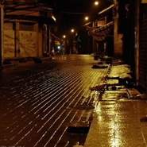

刘森林
============================

|  |  |
| :--: | :-- |
| [ 刘森林](https://i.xiami.com/lsl) | **播放数**: 1428838 **粉丝数**: 275 **评论数**: 14 **地区**: China 中国大陆 **风格**: 当代节奏布鲁斯 Contemporary R&B, 摇滚 Rock & Roll, 当代民谣 Contemporary Folk, 国语流行 Mandarin Pop  |

## 档案

中文名：刘森林 
生日：1997年4月24日 
民族：汉 
出生地：甘肃省白银市 
现居地：四川省成都市 
就读院校：四川音乐学院流行音乐制作系 
音乐人、歌手 
擅长乐器：吉他、键盘 
兴趣爱好：绘画、篮球、动漫、游戏 
主要成就： 
2010年荣获白银电视台举办的《唱响铜城）“海天杯“CCTV《非常6+1》、甘肃电视台《梦工场》才艺电视大赛白银赛区“十强选手”称号。 
原创音乐作品《温柔》在2015唱作网年度原创歌曲甄选中入围十佳歌曲。 
2016年4月26日由北京音尚律动传媒文化有限公司发行首张EP专辑《城市》

## 专辑

| 名称 | 语种 | 唱片公司 | 发行时间 | 专辑类别 | 专辑风格 |
| :--: | :-- | :-- | :-- | :-- | :-- |
| [ Colourful Dream纯音乐合集](./albums/2103947609.md) | 其他 | 独立发行 | 2018年08月25日 | 录音室专辑 | 轻音乐 Easy Listening, 新世纪音乐 New Age, 世界音乐 World Music |
| [ 起点](./albums/2102686632.md) | 国语 | 独立发行 | 2017年01月27日 | EP, 单曲 | 当代唱作人 Contemporary Singer-Songwriter |
| [ 城市](./albums/2100323414.md) | 国语 | 音尚律动 | 2016年04月26日 | EP, 单曲 |  |

## 评论

|  |  |  |  |
| :-- | :-- | :-- | :-- |
|  [虾米用户](https://emumo.xiami.com/u/251856363) 一條有夢想的鹹魚ㄟ( ▔... 2019-04-18 06:33 赞(0) 踩(0) | 
 add oil
 |
|  [虾米用户](https://emumo.xiami.com/u/342038768) pucikaka don... 2019-04-15 23:41 赞(0) 踩(0) | 
真的很不错，加油！支持！
 |
|  [虾米用户](https://emumo.xiami.com/u/328657369) 风格随心而变、 2019-01-23 21:00 赞(0) 踩(0) | 
加油(ง •̀_•́)ง
 |
|  [虾米用户](https://emumo.xiami.com/u/47631702) 저는 한국에서 왔어요. 2018-06-25 08:40 赞(0) 踩(0) | 
最近怎么不冒泡了
 |
|  [虾米用户](https://emumo.xiami.com/u/50613064)  2017-10-27 23:55 赞(0) 踩(0) | 
么么哒 离航超屌的
 |
|  [虾米用户](https://emumo.xiami.com/u/16135450)  2016-10-20 20:34 赞(0) 踩(0) | 
4938
 |
|  [虾米用户](https://emumo.xiami.com/u/48288492)  2015-10-31 09:18 赞(0) 踩(0) | 
加油！
 |
|  [虾米用户](https://emumo.xiami.com/u/48288492)  2015-10-31 09:17 赞(0) 踩(0) | 
啦啦啦啦啦
 |
|  [虾米用户](https://emumo.xiami.com/u/47594035) 蒙眼听音乐 2015-05-31 18:37 赞(0) 踩(0) | 
我来转转  ↖(^ω^)↗干吧得
 |
|  [虾米用户](https://emumo.xiami.com/u/49522984) (・ω・)ノ 2015-04-24 13:09 赞(0) 踩(0) | 
加油森林
 |
|  [虾米用户](https://emumo.xiami.com/u/49193502)  2015-04-14 05:38 赞(0) 踩(0) | 
加油森林   
 |
|  [虾米用户](https://emumo.xiami.com/u/47594035) 蒙眼听音乐 2015-02-25 18:51 赞(0) 踩(0) | 
喜欢你的感觉，加油
 |
|  [虾米用户](https://emumo.xiami.com/u/7297745) 珍愛 2015-02-05 09:22 赞(0) 踩(0) | 
温柔真的好听 加油✨
 |
|  [虾米用户](https://emumo.xiami.com/u/43625780) 剑指天涯 锋芒毕露 伤及... 2014-11-13 17:13 赞(3) 踩(0) | 
我刚入驻了虾米音乐人，欢迎大家来我的个人主页，收听我的最新音乐
 |
