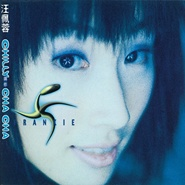

请你 Cha ChaChilly Cha Cha
============================

|  |  |
| :--: | :-- |
| [ 请你 Cha ChaChilly Cha Cha](https://emumo.xiami.com/album/11879) | **艺人**: [汪佩蓉](../index.md) **语种**: 国语 **唱片公司**: 滚石唱片 **发行时间**: 1998年12月11日 **专辑类别**: 录音室专辑 **专辑风格**: 国语流行 Mandarin Pop **播放数**: 352936 **收藏数**: 116 **评论数**: 22  |

## 简介

1999火焰挑战者－汪佩蓉FRANKIE，单身勇闯舞曲大帝国

 汪佩蓉＋杜德伟＋CLON联合撞地球，史上最强新人首张专辑

 汪佩蓉11倍速超魔力演出

 香港、上海、汉城、台北、洛杉矶5地跨界高手掀翻舞林大风暴

 在听见汪佩蓉的声音以前，无法想像在这样一个标准东方脸孔的女孩身上，竟能爆发出那样巨大的一种能量，与生命力，直抵心房，紧紧掘住每一双挑剔的耳朵。浑厚的嗓音和充满律动的肢体，是上天特别赋予她的宝贵天赋，在在都说明了她是天生的歌手，该站在舞台上用歌声来魅惑听众。

 和徐怀钰同年龄，与李心洁同月同日生，今年10月发行首张EP「散热」，12/11发行个人首张专辑「请你CHA CHA」，汪佩蓉从被发掘到签约、录音、发片一路走来，创造了太多令人惊讶的奇迹。被喻为滚石新秘密武器，能歌善舞的全方位艺人汪佩蓉，不仅请出杜德伟与CLON两组大牌艺人护航，更重资赴亚洲的舞曲重镇韩国制作主打歌并拍摄音乐录影带，为1999年世纪末的华语歌坛投下一颗强力炸弹。

## 曲目

- [请你 Cha ChaMVOT: Chilly Cha Cha / Chilly Cha Cha](./11879/3ZcA3b3e1.md)
- [头发湿的MVOT: Honey / Honey](./11879/eOkz7a28b.md)
- [刺激OT: MISSISSIPPI / Exclting](./11879/jat2c0869.md)
- [月光滴答Ticking Moonlight](./11879/8llF3c67d.md)
- [心火Fire Of Heart](./11879/eOk251d4f.md)
- [你真难忘OT: Blue Rain / You Are Unforgettable](./11879/eOk34b7fd.md)
- [仙人掌Cactus](./11879/jat6e17da.md)
- [想念是笨的MVIt's Foolish To Miss You](./11879/jat7968e5.md)
- [飞吻Kissing Good-Bye](./11879/nm2Ae8e9e.md)
- [散热Burn The Fire](./11879/nm2B2c3e9.md)
- [恨自由MVHate Being Free](./11879/nm2Cf39b8.md)

## 评论

|  |  |  |
| :-- | :-- | :-- |
|  [虾米用户](https://emumo.xiami.com/u/101563872)   2020-07-28 23:10 赞(0) 踩(0) | 
華麗麗的転音！最近太愛汪佩蓉了！怪自己當年有眼無珠
 |
|  [虾米用户](https://emumo.xiami.com/u/15270473) 听到喜欢的歌 身体不跟着... 2019-03-25 16:32 赞(0) 踩(0) | 
-
 |
|  [虾米用户](https://emumo.xiami.com/u/32068325) xvzz 2019-01-23 17:54 赞(1) 踩(0) | 
喜欢这种唱腔
 |
|  [虾米用户](https://emumo.xiami.com/u/327453260)  2018-10-25 15:33 赞(0) 踩(0) | 

 |
|  [虾米用户](https://emumo.xiami.com/u/274505185)  2017-10-13 15:55 赞(0) 踩(0) | 
这张专辑后我都没见她发表啥了！！可惜！
 |
|  [虾米用户](https://emumo.xiami.com/u/28878477) 我还没想好要写什么... 2017-08-22 14:03 赞(1) 踩(0) | 
19980601张学友 19981211汪佩蓉
 |
|  [虾米用户](https://emumo.xiami.com/u/73203548) 停用 2017-04-26 08:30 赞(3) 踩(0) | 
你这怎么都忽略了第一张专辑的《想念是笨的》这首歌  这首超好听！
 |
|  [虾米用户](https://emumo.xiami.com/u/36081194) 酷狗音乐，一个有老歌的地... 2015-11-22 00:17 赞(0) 踩(0) | 
喜欢
 |
|  [虾米用户](https://emumo.xiami.com/u/4796639) 我还没想好要写什么... 2015-01-21 17:38 赞(0) 踩(0) | 
。
 |
|  [虾米用户](https://emumo.xiami.com/u/20365778)  2013-09-25 19:50 赞(1) 踩(0) | 
你真难忘这旋律是SES的一首歌的啊
 |
| ⇒ |  [虾米用户](https://emumo.xiami.com/u/216086)  2017-12-12 15:01 赞(0) 踩(0) | 
FIN.K.L-BLUE RAIN
 |
|  [虾米用户](https://emumo.xiami.com/u/20365778)  2013-09-25 19:40 赞(0) 踩(0) | 
这一张真是典型的舞台feel。
 |
|  [虾米用户](https://emumo.xiami.com/u/3576769) 无心插柳♫ 2013-07-31 18:39 赞(0) 踩(0) | 
你真难忘------------FIN.K.L : Blue Rain
 |
|  [虾米用户](https://emumo.xiami.com/u/6630660) 猜赢涂口红… 2013-07-15 16:02 赞(3) 踩(0) | 
<a href="http://emumo.xiami.com/u/4275776" target="_blank" rel="nofollow" name_card="4275776">@320K专门店</a> 合格320
 |
|  [虾米用户](https://emumo.xiami.com/u/632448)  2012-11-03 19:24 赞(0) 踩(0) | 
头发湿的 翻唱 歌神的:头发乱了! 虽不如原唱 但也唱出了自己的味道 <a href="http://jackychueng.diandian.com/" target="_blank" rel="nofollow noreferrer noopener">http://jackychueng.diandian.com/</a>
 |
| ⇒ |  [虾米用户](https://emumo.xiami.com/u/1424272)  2013-07-05 15:10 赞(0) 踩(0) | 
头发乱了也是翻唱的 原曲是JYP的honey ： <a href="http://www.xiami.com/song/3658852?spm=0.0.0.0.4o8wjL" target="_blank" rel="nofollow noreferrer noopener">http://www.xiami.com/song/3658852?spm=0.0.0.0.4o8wjL</a>
 |
| ⇒ |  [虾米用户](https://emumo.xiami.com/u/2451719)  2014-08-21 19:47 赞(0) 踩(0) | 
<q><b>孙岳说：</b></q>
 |
| ⇒ |  [虾米用户](https://emumo.xiami.com/u/6770405)  2016-12-16 13:40 赞(0) 踩(0) | 
装逼失败，你家歌神还不是四处翻唱
 |
|  [虾米用户](https://emumo.xiami.com/u/2785553)  2012-04-04 16:20 赞(2) 踩(0) | 
天啊，的确是不错的歌者。
 |
|  [虾米用户](https://emumo.xiami.com/u/98417) 幼稚与成熟兼备，古典与流... 2011-05-21 15:40 赞(14) 踩(0) | 
滚石30不应遗忘的才女，生不逢时。
 |
|  [虾米用户](https://emumo.xiami.com/u/374493)  2009-10-22 21:26 赞(3) 踩(0) | 
我很喜欢她的声音，真好听，很性感。
 |
|  [虾米用户](https://emumo.xiami.com/u/89343)  2009-05-24 21:39 赞(6) 踩(0) | 
本来以为第一张不怎么样，没抱期待，却还是一样有惊喜，我想，我爱上这个女人的声音了
 |
