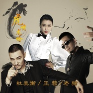

虎啸龙吟
============================

|  |  |
| :--: | :-- |
| [ 虎啸龙吟](https://emumo.xiami.com/album/2102969075) | **艺人**: [王蓉](../index.md) **语种**: 国语 **唱片公司**: 千源影视 **发行时间**: 2017年12月07日 **专辑类别**: EP, 单曲 **专辑风格**:  **播放数**: 114523 **收藏数**: 36 **评论数**: 2  |

## 简介

千呼万唤下，《军师联盟之虎啸龙吟》终于回归，并于12月8日正式开播。延续着第一部的超高人气，《虎啸龙吟》重新带动了一波“三国热”，是眼下当之无愧的收视之王。  
由著名音乐人董冬冬一手包办的《军师联盟之虎啸龙吟》电视剧原声带，近日正式在虾米音乐上线。  
大提琴、小提琴、笛子、萧、薰、古琴、古筝、琵琶……这21首BGM，或长或短，就像一套精密的“组合拳”，在营造历史感、烘托环境气氛、强化人物性格等方面起到了重要作用，形成了另一条用音乐来讲故事的精彩叙事线。  
早在《大军师司马懿之军师联盟》热播时，就有媒体评价董冬冬的原声配乐“妙到毫巅”，是“看不见却听得到的剧情推进器”。  
这一次，《军师联盟之虎啸龙吟》的21首原声音乐数量更多，但依旧诚意满满。根据全新的剧情走向，以及人物关系设定，通过音乐的铺陈来引导观众沉浸式体验，把深沉厚重的家国情怀、历史长河的起伏跌宕，展现得淋漓尽致。  
可以说，当你戴上耳机，循环播放这张《虎啸龙吟》的电视剧原声带，历史的画卷、枭雄的命运、未酬的壮志，一幕一幕都会在脑海徐徐浮现。  
像《权力的游戏》等经典电视剧，主题音乐都仿佛有着魔力一样，深深根植于每个观众的脑海，甚至随时随地会“飞”出这段旋律。  
《虎啸龙吟》的主题音乐，从第一部就开始沿用，按照董冬冬的理解，这是属于“王者的主题”，像在曹操、曹丕、曹睿、司马懿等人身上都曾多次使用。  
在这张原声带里，收录了这首主题音乐的两个不同版本，一个是大提琴版，另一个则是萧笛版，用于表达霸气深沉和平静悠远两种不同的情绪。  
像前一个版本，大提琴的浑厚沉稳，让一个时代英雄的含蓄隐忍淋漓至现，婉转的穿透有时不时撩拨着历史的回思。  
其实这是现代美剧中非常时髦的用法，第一季抓耳的一些BGM，在第二季、第三季里都会反复出现，实现音乐和剧情主线的高度重合以及牵引性。  
比如《天下一统》这首，第一部曾用在曹操身上，展现扫平袁绍后的霸气，第二部用在了曹丕登基的桥段。当如此充满霸气的音乐在耳机里响起，听者也会血脉贲张，跟着燃起来。  
与此同时，多首经典的角色专属音乐，同样被收录在了这张原声当中。比如男主司马懿的主题音乐《十年忍辱》《五禽智慧》，诸葛亮的主题曲《忧国忧民》等，既抒发了丰富的情感，又起到了独特的感染作用，刻画了栩栩如生的人物形象。 

## 曲目

- [虎啸龙吟电视剧《虎啸龙吟》推广曲](./2102969075/JCIFWd25551.md)
- [虎啸龙吟 (伴奏)](./2102969075/8HXHh4ed963.md)

## 评论

|  |  |  |
| :-- | :-- | :-- |
|  [虾米用户](https://emumo.xiami.com/u/338992909)   2018-01-18 11:17 赞(0) 踩(0) | 
这不是曹爽么&amp;hellip;&amp;hellip;原来是歌手啊
 |
|  [虾米用户](https://emumo.xiami.com/u/13369013) 那是一只鸟 2017-12-08 10:26 赞(0) 踩(0) | 
等剧。
 |
