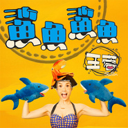

鲨鱼鲨鱼
============================

|  |  |
| :--: | :-- |
| [ 鲨鱼鲨鱼](https://emumo.xiami.com/album/430724716) | **艺人**: [王蓉](../index.md) **语种**: 国语 **唱片公司**: 菲尚文化 **发行时间**: 2015年11月12日 **专辑类别**: EP, 单曲 **专辑风格**: 电音流行 Electropop **播放数**: 601593 **收藏数**: 254 **评论数**: 42  |

## 简介

王蓉2015最强神曲《鲨鱼 鲨鱼》登场，颠覆性引爆，剑指年度第一神曲宝座！一出神曲就搅的音乐江湖风生水起，激情四溢的电音舞曲天后王蓉，2015年底再度带给我们极为强大的刺激与震撼。经过大半年的筹备策划和创作制作过程，由《小鸡小鸡》原班人马打造，韩国顶级音乐团队保驾护航的最新神曲《鲨鱼鲨鱼》终于和观众及歌迷们见面啦！神曲一出，谁与争锋，让我们拭目以待这首史上最为奢华的“鲨鱼神曲”！！！

## 曲目

- [鲨鱼鲨鱼MV](./430724716/xLEQk8c85dd.md)

## 评论

|  |  |  |
| :-- | :-- | :-- |
|  [虾米用户](https://emumo.xiami.com/u/29482899) 我还没想好要写什么... 2019-09-06 13:27 赞(0) 踩(0) | 
谢谢王荣。
 |
|  [虾米用户](https://emumo.xiami.com/u/51460129)  2016-07-27 11:18 赞(0) 踩(0) | 
蛮好听的，推荐呀~
 |
|  [虾米用户](https://emumo.xiami.com/u/51460129)  2016-07-27 11:17 赞(0) 踩(0) | 
我觉得不错，王蓉的歌都喜欢~
 |
|  [虾米用户](https://emumo.xiami.com/u/134909970)  2016-06-22 16:30 赞(0) 踩(0) | 
a
 |
|  [虾米用户](https://emumo.xiami.com/u/41206491)  2016-03-03 21:33 赞(0) 踩(0) | 
呵呵
 |
|  [虾米用户](https://emumo.xiami.com/u/2541555) Sakha Republ... 2016-03-01 14:47 赞(0) 踩(0) | 
斷開魂結！燒！燒！斷開鎖鏈！燒！燒！斷開一切的牽連！燒！燒！燒！燒！燒！燒！燒！燒！燒毀~ 那個雲！那個霧啊！那個雲！那個霧啊！那個雲！那個霧啊！那個~霧霧霧霧霧霧啊！╮(￣▽￣)╭
 |
|  [虾米用户](https://emumo.xiami.com/u/96635060)  2016-01-01 23:13 赞(0) 踩(0) | 
咋了
 |
|  [虾米用户](https://emumo.xiami.com/u/6400069) 我喜欢下雨天 2015-12-24 00:50 赞(2) 踩(0) | 
。。中间那个哒啦滴啦也挺靠技术的。。。
 |
|  [虾米用户](https://emumo.xiami.com/u/12202641) 我们义无反顾的试着后悔，... 2015-12-22 21:35 赞(0) 踩(0) | 
疯了。
 |
|  [虾米用户](https://emumo.xiami.com/u/28921652)  2015-12-01 20:11 赞(0) 踩(0) | 
cndy
 |
|  [虾米用户](https://emumo.xiami.com/u/3168555) 我喜欢你喜欢我吗 2015-11-25 00:25 赞(0) 踩(0) | 
神曲
 |
|  [虾米用户](https://emumo.xiami.com/u/39591989) / 2015-11-23 20:47 赞(0) 踩(0) | 
MV真的不是抄袭Katy Perry超级碗表演吗...？
 |
|  [虾米用户](https://emumo.xiami.com/u/9527124)  2015-11-20 06:11 赞(0) 踩(0) | 
原来喜欢的歌手怎么成这样了？
 |
|  [虾米用户](https://emumo.xiami.com/u/30690789) 为什么会这样…… 2015-11-17 16:21 赞(1) 踩(0) | 
就连MV都和小鸡小鸡如出一辙
 |
|  [虾米用户](https://emumo.xiami.com/u/13120462) 声音 2015-11-17 11:22 赞(0) 踩(0) | 
想当年 爸爸妈妈 真的还不错 如果按当初那条路用心做下去 不至于没饭吃的啊 心酸
 |
| ⇒ |  [虾米用户](https://emumo.xiami.com/u/30690789) 为什么会这样…… 2015-11-17 16:23 赞(0) 踩(0) | 
但是她当初真的因为走爸爸妈妈的路线悲惨flop，只能说现在中国内地只有无下限或者可以用来装B的歌才能火
 |
| ⇒ |  [虾米用户](https://emumo.xiami.com/u/13120462) 声音 2017-10-28 00:36 赞(0) 踩(0) | 
<q><b>2yf00000说：</b></q>
 |
|  [虾米用户](https://emumo.xiami.com/u/1882463) 我还没想好要写什么... 2015-11-17 11:07 赞(0) 踩(0) | 
一年一张神曲吗？
 |
| ⇒ |  [虾米用户](https://emumo.xiami.com/u/36773494) 夜里唯一发光的是我的荡漾... 2015-11-25 18:41 赞(0) 踩(0) | 
难怪我到现在红不起来
 |
| ⇒ |  [虾米用户](https://emumo.xiami.com/u/1882463) 我还没想好要写什么... 2015-11-28 14:13 赞(0) 踩(0) | 
<q><b>一颗春心向大叔说：</b></q>
 |
| ⇒ |  [虾米用户](https://emumo.xiami.com/u/36773494) 夜里唯一发光的是我的荡漾... 2015-11-29 12:19 赞(0) 踩(0) | 
<q><b>月光牧羊人说：</b></q>
 |
|  [虾米用户](https://emumo.xiami.com/u/7158140)   2015-11-17 10:19 赞(0) 踩(0) | 
breakin sweet即视感 
 |
|  [虾米用户](https://emumo.xiami.com/u/5432118) 我还没想好要写什么... 2015-11-17 09:44 赞(0) 踩(0) | 
我很无语
 |
|  [虾米用户](https://emumo.xiami.com/u/12898853) just rock it 2015-11-17 09:37 赞(1) 踩(0) | 
记得以前有一张专辑很好听，怎么现在就变成这个德行了呢
 |
|  [虾米用户](https://emumo.xiami.com/u/7978992) 天空已蔚蓝 我会抬头看 2015-11-17 02:30 赞(0) 踩(0) | 
病了
 |
|  [虾米用户](https://emumo.xiami.com/u/8287565)  2015-11-17 02:04 赞(0) 踩(0) | 
可爱，可以为我的毛绒小熊唱一首吗
 |
|  [虾米用户](https://emumo.xiami.com/u/22254053)  2015-11-17 01:53 赞(0) 踩(0) | 
你好恶心
 |
|  [虾米用户](https://emumo.xiami.com/u/13337042) 我们要互相亏欠。 2015-11-16 22:53 赞(0) 踩(0) | 
我选择狗带
 |
|  [虾米用户](https://emumo.xiami.com/u/5818843)  2015-11-16 22:13 赞(0) 踩(0) | 
可惜了她曾经的才华，走夜店女的路线并不适合她
 |
|  [虾米用户](https://emumo.xiami.com/u/5806141)  2015-11-16 17:33 赞(0) 踩(0) | 
已经疯了 老子把她第一张专辑 仍了 已经！
 |
|  [虾米用户](https://emumo.xiami.com/u/38918617) 你相信我，我相信你 2015-11-16 17:11 赞(0) 踩(0) | 
很神曲 常洗脑
 |
|  [虾米用户](https://emumo.xiami.com/u/7135199) 拯救世界的是梦想与热情 2015-11-16 16:22 赞(0) 踩(0) | 
简直是精神污染，神曲什么的太可怕了！！！
 |
|  [虾米用户](https://emumo.xiami.com/u/29537993) 高山流水 2015-11-15 09:41 赞(0) 踩(0) | 
好听
 |
|  [虾米用户](https://emumo.xiami.com/u/22832694) 2.0.1.7 2015-11-15 01:05 赞(0) 踩(0) | 
没前几个单曲好听，不如走电子舞曲路线
 |
|  [虾米用户](https://emumo.xiami.com/u/1919285)  2015-11-13 22:18 赞(9) 踩(0) | 
电音抄袭zedd remix的Breakin a sweat，简直原封不动拿过来一模一样。很失望。
 |
|  [虾米用户](https://emumo.xiami.com/u/4162264) ch3.red/mp3 2015-11-13 21:12 赞(0) 踩(0) | 
制作还行 驾驭很到位 不知道mv怎么样 如果歌词能内涵点就更好了 望少而精
 |
|  [虾米用户](https://emumo.xiami.com/u/42347) 寻找无双 2015-11-13 12:42 赞(6) 踩(0) | 
本来挺好的一个姑娘，怎么就跑去唱神曲了呢？
 |
| ⇒ |  [虾米用户](https://emumo.xiami.com/u/4162264) ch3.red/mp3 2015-11-13 21:00 赞(0) 踩(0) | 
说明对音乐是真爱 不在乎外人怎么看 敢于冒自毁形象之风险
 |
|  [虾米用户](https://emumo.xiami.com/u/722837) 886 2015-11-13 12:32 赞(1) 踩(0) | 
我选择死亡
 |
|  [虾米用户](https://emumo.xiami.com/u/40946295)   2015-11-13 12:24 赞(1) 踩(0) | 
我草
 |
|  [虾米用户](https://emumo.xiami.com/u/183538) 逝水洗金沙 2015-11-13 11:17 赞(1) 踩(0) | 
为什么非要走神曲路线呢~
 |
|  [虾米用户](https://emumo.xiami.com/u/1311) @彩荷之光 2015-11-13 10:31 赞(1) 踩(0) | 
看到曲名第一时间我想到的是小鸡小鸡咕咕哒~
 |
