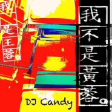
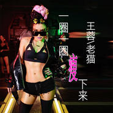
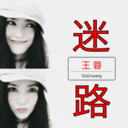
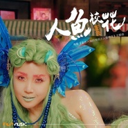
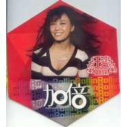

王蓉
============================

|  |  |
| :--: | :-- |
| [ 王蓉](https://i.xiami.com/wangrong) | **播放数**: 26615673 **粉丝数**: 5163 **评论数**: 412 **地区**: China 中国大陆 **风格**: 国语流行 Mandarin Pop, 华语唱作人 Chinese Singer-Songwriter  |

## 档案

小档案 
中   文   名：   王蓉 
外   文   名：   Rollin Wang 
别        名：   王菲 
国        籍：   中华人民共和国 
民        族：   汉族 
星        座：   摩羯座 
血        型：   O  型 
身        高：   165cm 
体        重：   52kg 
出   生   地：   山西 
出生日期：   1978  年  12  月  24  日 
职        业：   歌手、音乐人、制作人 
毕业院校：   中国传媒大学播音系本科 
经纪公司：   舞吉星文化 
代表作品：   我不是黄蓉、爸爸妈妈、哎呀、要抱抱、火了火了火等 
主要成就：   创建公益性舞蹈机构“舞库” 
简介 
王蓉（  Rollin Wang  ），原名王菲，  1978  年  12  月  24  日在山西出生，中国流行女歌手。 
早年经历 
童年时期 
王蓉的父亲在话剧团工作，母亲喜爱演唱民歌，从小为她提供了很多学习音乐的机会和环境，曾学小提琴、钢琴、舞蹈。  8  岁时学小提琴，王蓉在这方面显露出天赋，她对声音和旋律极为敏感。  15  岁，学习英文流行音乐。 
大学时期 
报考大学时，王蓉选择了北京广播学院大一时她获得了全校的歌手大赛第一名，自己写歌填词完成了《晨雾》。 
大二时获得了北京高校歌手大赛独唱第一名；这时又写曲填词完成了《距离》等歌曲。这期间王蓉得到了音乐教育家刘天礼教授的指点。 
1998  年底她的自创歌曲《云不知道雨知道》登上过中央人民广播电台《中国歌曲排行榜》冠军。 
演艺经历 
2000  年，王蓉的小样作品被香港著名音乐界红人李进先生拿到，第一时间联络到了她，在北京三个多小时的会面。 
2002  年，王蓉签约了大国文化集团。同时个人专辑也已经由香港总部全部企划制作完成。专辑中的作品是从王蓉的近百首创作中挑选出来的。 
单曲《距离》获得  2003  年香港电影《五月八月》的主题歌。专辑中的另一首歌《说出来》被选作为情景喜剧《都市男女》的片头主题曲。 
2004  年，发行专辑《我不是黄蓉》。 
2005  年  6  月，发行专辑《多爱》推出。 
2007  年  1  月，发行专辑《加倍》。 
获  WTUF  中国之夜中韩文化交流贡献奖 
获  WTUF  中国之夜中韩文化交流贡献奖 
2009  年王蓉签约美国  Glory  唱片公司，成为其旗下唯一中国艺人。同年王蓉全新创作的电音舞曲《要抱抱》。 
2011  年  5  月  31  日，王蓉御用制作人携歌手王麟，推出新作《伤不起》。 
2013  年  8  月  6  日，电音天后王蓉的新歌《好乐  DAY  》，刚刚发布仅几日，点击量就上千万，刷新了最雷歌曲记录。同年王蓉发表《好乐  DAY  》治愈版，李延亮大师吉他伴奏。 
2015  年  5  月  6  日发行单曲《抖抖傲》。  2015  年  7  月  21  日，王蓉亮相由非牟利国际组织世贸联合基金总会与富川国际奇幻电影节联合举办，并得到了韩国政府大力支持，是庆祝中韩建交  23  周年的系列活动之一的  WTUF  中国之夜，并荣获“中韩文化交流贡献奖”。  11  月  21  日发行歌曲《鲨鱼鲨鱼》。同月与老猫打造电影《东北偏北》宣传曲《抓流氓》，  12  月  5  日在音乐先锋榜荣获“内地最受欢迎先锋女歌手”。

## 专辑

| 名称 | 语种 | 唱片公司 | 发行时间 | 专辑类别 | 专辑风格 |
| :--: | :-- | :-- | :-- | :-- | :-- |
| [ 几度](./albums/5021952364.md) | 国语 | 独立发行 | 2020年11月16日 | EP, 单曲 |  |
| [ 心潮中国数字音乐谷主题曲](./albums/5021758508.md) | 国语 | 华音悦听 | 2020年10月26日 | EP, 单曲 | 国语流行 Mandarin Pop |
| [ 芳华·战士万岁](./albums/5021403460.md) | 国语 | 百艺星图 | 2020年09月03日 | EP, 单曲 |  |
| [ 爸爸妈妈 (DJcandy Mix)](./albums/5021222801.md) | 国语 | 回声文化 | 2020年08月03日 | EP, 单曲 | 流行 Pop |
| [ 我不是黄蓉 (DJcandy Mix)](./albums/5021161003.md) | 国语 | 回声文化 | 2020年07月27日 | EP, 单曲 | 国语流行 Mandarin Pop |
| [ 小姐姐 很美](./albums/5020921498.md) | 国语 | 回声文化 | 2020年06月22日 | EP, 单曲 | 国语流行 Mandarin Pop |
| [ 小蛮腰](./albums/2108372130.md) | 国语 | 回声文化 | 2020年04月30日 | EP, 单曲 | 流行 Pop |
| [ 爱的主场](./albums/2108372097.md) | 国语 | 回声文化 | 2020年04月24日 | EP, 单曲 | 流行 Pop |
| [ 圣诞节我只想和你在一起](./albums/2105704010.md) | 国语 | 回声文化 | 2019年12月23日 | EP, 单曲 | 国语流行 Mandarin Pop |
| [ 图书馆](./albums/2104937371.md) | 国语 | 回声文化 | 2019年06月10日 | EP, 单曲 | 国语流行 Mandarin Pop |
| [ 一圈一圈瘦下来](./albums/2104731772.md) | 国语 | 回声文化 | 2019年04月01日 | EP, 单曲 | 国语流行 Mandarin Pop |
| [ 迷路](./albums/2104486649.md) | 国语 | 回声文化 | 2019年01月17日 | EP, 单曲 | 国语流行 Mandarin Pop |
| [ 非你不求](./albums/2104240372.md) | 国语 | 回声文化 | 2018年11月19日 | EP, 单曲 | 国语流行 Mandarin Pop |
| [ 爸妈回来吧](./albums/2104200317.md) | 国语 | 天蜂娱乐 | 2018年11月16日 | EP, 单曲 | 国语流行 Mandarin Pop |
| [ 半首歌 (合唱版)](./albums/2104053310.md) | 国语 | 回声文化 | 2018年09月26日 | EP, 单曲 | 国语流行 Mandarin Pop |
| [ 半首歌](./albums/2103952155.md) | 国语 | 回声文化 | 2018年08月31日 | EP, 单曲 | 国语流行 Mandarin Pop |
| [ 红烧肉](./albums/2103522908.md) | 国语 | 菲尚文化 | 2018年02月09日 | EP, 单曲 |  |
| [ 吃鸡摇](./albums/2103511257.md) | 国语 | 网易游戏 | 2018年01月31日 | EP, 单曲 |  |
| [ 虎啸龙吟](./albums/2102969075.md) | 国语 | 千源影视 | 2017年12月07日 | EP, 单曲 |  |
| [ 大不了AA](./albums/2102909012.md) | 国语 | 菲尚文化 | 2017年11月07日 | EP, 单曲 |  |
| [ 啪啪S舞](./albums/2102723801.md) | 国语 | 星琪传媒 | 2017年03月30日 | EP, 单曲 | 国语流行 Mandarin Pop |
| [ 人鱼校花](./albums/2102658394.md) | 国语 | 极度传媒 | 2016年12月01日 | EP, 单曲 |  |
| [ 就要你红](./albums/2102654237.md) | 国语 | 菲尚文化 | 2016年11月18日 | EP, 单曲 |  |
| [ 捕鱼来了](./albums/2102653922.md) | 国语 | 力港网络 | 2016年11月18日 | EP, 单曲 |  |
| [ 叶问](./albums/2100250462.md) | 国语 | 菲尚文化 | 2016年03月01日 | EP, 单曲 | 中国风 China-Wave |
| [ 高跟鞋先生](./albums/2100260276.md) | 国语 | 菲尚文化 | 2016年01月14日 | EP, 单曲 | 流行舞曲 Dance-Pop |
| [ 我是微商我骄傲](./albums/2104962028.md) | 国语 | 回声文化 | 2016年01月01日 | EP, 单曲 |  |
| [ 鲨鱼鲨鱼](./albums/430724716.md) | 国语 | 菲尚文化 | 2015年11月12日 | EP, 单曲 | 电音流行 Electropop |
| [ 抖抖傲](./albums/2030037992.md) | 国语 | 菲尚文化 | 2015年04月29日 | EP, 单曲 | 国语流行 Mandarin Pop |
| [ 小鸡小鸡](./albums/913961197.md) | 国语 | 菲尚文化 | 2014年10月23日 | EP, 单曲 | 国语流行 Mandarin Pop |
| [ 坏姐姐](./albums/299948780.md) | 国语 | 菲尚文化 | 2014年05月13日 | EP, 单曲 | 流行舞曲 Dance-Pop |
| [ 好乐Day](./albums/1475694383.md) | 国语 | 柏菲特文化 | 2013年08月07日 | EP, 单曲 | 国语流行 Mandarin Pop |
| [ 我们的钓鱼岛](./albums/273019.md) | 国语 | 舞吉星文化 | 2012年09月19日 | EP, 单曲 | 国语流行 Mandarin Pop |
| [ 火了火了火](./albums/526965.md) | 国语 | 舞吉星文化, 柏菲特文化 | 2012年07月10日 | EP, 单曲 | 国语流行 Mandarin Pop |
| [ 爱爱不爱](./albums/394172.md) | 国语 | 舞吉星文化 | 2010年08月03日 | EP, 单曲 | 国语流行 Mandarin Pop |
| [ 带我回家](./albums/499291.md) | 国语 | 舞吉星文化 | 2010年05月15日 | EP, 单曲 | 国语流行 Mandarin Pop |
| [ 要抱抱](./albums/387623.md) | 国语 | 舞吉星文化 | 2009年11月19日 | EP, 单曲 | 国语流行 Mandarin Pop |
| [ 加倍](./albums/298936.md) | 国语 | 回声文化 | 2007年08月14日 | EP, 单曲 | 国语流行 Mandarin Pop |
| [ 害我受了伤](./albums/12008.md) | 国语 | 回声文化 | 2007年04月01日 | EP, 单曲 | 国语流行 Mandarin Pop |
| [ 芙蓉姐夫](./albums/12009.md) | 国语 | 大国文化 | 2006年04月01日 | 精选集 | 国语流行 Mandarin Pop, 华语唱作人 Chinese Singer-Songwriter |
| [ 多爱](./albums/12010.md) | 国语 | 大国文化 | 2005年06月03日 | 录音室专辑 | 国语流行 Mandarin Pop |
| [ 我不是黄蓉](./albums/12012.md) | 国语 | 大国文化 | 2004年05月12日 | 录音室专辑 | 国语流行 Mandarin Pop, 华语唱作人 Chinese Singer-Songwriter |
| [ 非想非非想王蓉 同名专辑](./albums/12013.md) | 国语 | 大国文化 | 2003年06月01日 | 录音室专辑 | 国语流行 Mandarin Pop, 华语唱作人 Chinese Singer-Songwriter |
| [ 般若波罗蜜多心经](./albums/2104526115.md) | 国语 |  | 不详 | EP, 单曲 | 佛教音乐 Buddhist Music |
| [ 小鸡小鸡之武极天下《武极天下》网游主题曲 / 《夜市人生》电视剧插曲](./albums/2104526116.md) | 国语 |  | 不详 | EP, 单曲 | 国语流行 Mandarin Pop |
| [ 当我说是佛教徒](./albums/2104526110.md) | 国语 |  | 不详 | EP, 单曲 | 国语流行 Mandarin Pop |
| [ 爱着你](./albums/2104526126.md) | 国语 |  | 不详 | EP, 单曲 | 国语流行 Mandarin Pop |

## 评论

|  |  |  |  |
| :-- | :-- | :-- | :-- |
|  [虾米用户](https://emumo.xiami.com/u/432350049) 顺我者昌 逆我者亡 2020-12-23 17:13 赞(0) 踩(0) | 
原名王菲&amp;hellip;&amp;hellip;
 |
|  [虾米用户](https://emumo.xiami.com/u/16723855) 爱江山更爱美女 2020-12-14 23:53 赞(0) 踩(0) | 
哎呀
 |
|  [虾米用户](https://emumo.xiami.com/u/1331382) 点击编辑 2020-11-28 09:58 赞(1) 踩(0) | 
那首爸爸妈妈真的很牛逼
 |
|  [虾米用户](https://emumo.xiami.com/u/31475803) i need you！ 2020-11-23 16:35 赞(0) 踩(0) | 
其实挺好听的。在中国歌坛，85分以上
 |
|  [虾米用户](https://emumo.xiami.com/u/3289590) 我还没想好要写什么... 2020-11-17 13:21 赞(0) 踩(0) | 
5100
 |
|  [虾米用户](https://emumo.xiami.com/u/358104299) 悲观的唯心存在现实解构虚... 2020-11-16 11:47 赞(0) 踩(0) | 
41909
 |
|  [虾米用户](https://emumo.xiami.com/u/9062060) 此生没拿一个亿来爱虾米是... 2020-10-23 19:45 赞(0) 踩(0) | 
hhhh伊菲是什么鬼
 |
|  [虾米用户](https://emumo.xiami.com/u/440982179)  2020-09-09 13:45 赞(0) 踩(0) | 
感恩  。是您的《心经》，透露了夜间的阳光
 |
|  [虾米用户](https://emumo.xiami.com/u/254739175) 我乃单身狗一枚，所以叫寻... 2020-05-09 14:28 赞(0) 踩(0) | 
功底深厚啊，佩服
 |
|  [虾米用户](https://emumo.xiami.com/u/420750104) 爱是永恒！！！！！！！！... 2020-04-19 14:05 赞(1) 踩(0) | 
✨     
 |
|  [虾米用户](https://emumo.xiami.com/u/311679806)  2020-03-14 21:32 赞(0) 踩(0) | 
不知道大红大紫 、就喜欢你的唱的歌！  
 |
|  [虾米用户](https://emumo.xiami.com/u/319688150) 愿经典不被遗忘 2019-12-03 01:31 赞(0) 踩(0) | 

 |
|  [虾米用户](https://emumo.xiami.com/u/431246317)  2019-10-28 02:35 赞(0) 踩(0) | 
山西人 
 |
|  [虾米用户](https://emumo.xiami.com/u/101322) 不怎么听歌了 2019-07-08 09:23 赞(0) 踩(0) | 
现在神曲被抖音推广的太快，有点替姐姐担心了，老猫也应该敏锐些做出一些改变，冲出来。
 |
|  [虾米用户](https://emumo.xiami.com/u/3550322) 不喧哗。 2019-04-25 22:50 赞(5) 踩(0) | 
王蓉确实是个才女，以前的歌曲拿到现在洋气十足，至于现在的神曲路线，我想可能王蓉可能太了解中国音乐市场和大众的口味，不"接地气"一点你不可能火，不博得眼球你怎么积攒人气？
 |
|  [虾米用户](https://emumo.xiami.com/u/287423911)  2019-04-01 00:53 赞(1) 踩(0) | 
求推吗？ 
 |
|  [虾米用户](https://emumo.xiami.com/u/275870115)  2019-03-23 15:26 赞(0) 踩(0) | 
我是她的粉，买了VIP只为听她的
 |
| ⇒ |  [虾米用户](https://emumo.xiami.com/u/89582822)  2019-05-26 03:09 赞(0) 踩(0) | 
牛逼！
 |
|  [虾米用户](https://emumo.xiami.com/u/401964058) 音乐的海洋治愈了孤独伤，... 2019-03-10 15:15 赞(2) 踩(0) | 
人美歌也好听！赞一个！
 |
|  [虾米用户](https://emumo.xiami.com/u/210696657)  2019-03-09 16:06 赞(0) 踩(0) | 
到现在也不知道王蓉到底长啥样
 |
| ⇒ |  [虾米用户](https://emumo.xiami.com/u/332752681)  2019-04-16 13:18 赞(0) 踩(0) | 
去抖音看看
 |
| ⇒ |  [虾米用户](https://emumo.xiami.com/u/89582822)  2019-05-26 03:11 赞(0) 踩(0) | 
<q><b>唬唬的家说：</b></q>
 |
|  [虾米用户](https://emumo.xiami.com/u/284357462)   2019-02-20 16:03 赞(1) 踩(0) | 
以前挺喜欢王蓉的，歌也很好听！但是我出国4、5年，什么时候王蓉变成逗逼歌手了？？？全是逗逼歌？？？累觉不爱……
 |
|  [虾米用户](https://emumo.xiami.com/u/357752578) 燕:  片叶寄思迎风飘，... 2019-02-01 16:07 赞(0) 踩(0) | 
美女比我小三岁
 |
|  [虾米用户](https://emumo.xiami.com/u/357752578) 燕:  片叶寄思迎风飘，... 2019-01-29 20:09 赞(0) 踩(0) | 
谢，你是美丽天使，乐坛达人
 |
|  [虾米用户](https://emumo.xiami.com/u/353455002)  2019-01-18 11:37 赞(0) 踩(0) | 
喜欢你的每一首歌
 |
|  [虾米用户](https://emumo.xiami.com/u/315471811)  2019-01-17 18:07 赞(0) 踩(0) | 
不整容 再丑也是女神，整容的再漂亮也是腊鸡！
 |
|  [虾米用户](https://emumo.xiami.com/u/272812809) 对自己好一点 2019-01-10 08:13 赞(0) 踩(0) | 
有时间慢慢了解吧
 |
|  [虾米用户](https://emumo.xiami.com/u/345947053)  2018-12-24 10:44 赞(0) 踩(0) | 
生日快乐？
 |
|  [虾米用户](https://emumo.xiami.com/u/6873363)  2018-12-07 18:35 赞(0) 踩(0) | 
,,,l,l,l.
 |
|  [虾米用户](https://emumo.xiami.com/u/2021147) 我行我素 2018-10-23 17:54 赞(0) 踩(0) | 
朋友推荐她的歌，很温暖，所以更加喜欢了。
 |
|  [虾米用户](https://emumo.xiami.com/u/68134310)  2018-10-21 18:01 赞(2) 踩(0) | 
他的歌曲媲美101女团，甩什么卡路里几条街
 |
|  [虾米用户](https://emumo.xiami.com/u/310974837) Music as sou... 2018-10-14 11:27 赞(1) 踩(0) | 
特立独行，我喜欢。
 |
|  [虾米用户](https://emumo.xiami.com/u/293692544) 你敢给我说话吗？我咬你 2018-10-03 18:16 赞(1) 踩(0) | 
好听
 |
|  [虾米用户](https://emumo.xiami.com/u/276425454) 我是好人，别开枪… 2018-09-08 09:34 赞(2) 踩(0) | 
唱自己作的词才是王蓉，唱其他人的词，已不是王蓉&amp;hellip;
 |
|  [虾米用户](https://emumo.xiami.com/u/279984716)   2018-09-06 21:51 赞(2) 踩(0) | 
加油
 |
|  [虾米用户](https://emumo.xiami.com/u/343598226)  2018-06-28 23:54 赞(2) 踩(0) | 
最爱听你的  爸爸妈妈  曾经2-3天反复听了上百遍，太好听啦！怎么下架了，没有
 |
|  [虾米用户](https://emumo.xiami.com/u/278881542) 音乐能带给你各种体验 2018-06-18 18:17 赞(2) 踩(0) | 
可惜现在酒吧摇已经被英文h占领 崇洋媚外
 |
|  [虾米用户](https://emumo.xiami.com/u/278881542) 音乐能带给你各种体验 2018-06-18 18:16 赞(4) 踩(0) | 
她的歌可以撑起现代国语h歌半边天
 |
|  [虾米用户](https://emumo.xiami.com/u/350625658)  2018-06-08 12:08 赞(3) 踩(0) | 
我的两个儿子是你忠实的歌迷！一听到你的音乐，不管那个，都不自觉的扭起来了 
 |
|  [虾米用户](https://emumo.xiami.com/u/363576804)  2018-05-18 06:28 赞(3) 踩(0) | 
王容他们说的是真的吗？请你告诉我一个准确的答案。如果不是那我还是很喜欢你的呀。么么哒。
 |
|  [虾米用户](https://emumo.xiami.com/u/5633194)  2018-04-27 13:28 赞(1) 踩(0) | 
歌很有趣，喜欢
 |
|  [虾米用户](https://emumo.xiami.com/u/323987299)  2018-04-19 21:25 赞(2) 踩(0) | 
她承认自己整容
 |
|  [虾米用户](https://emumo.xiami.com/u/764817) 暂无签名~ 2018-04-04 23:02 赞(3) 踩(0) | 
听完王蓉所有的歌，才觉得~~真是被低估了的音乐才女！！
 |
|  [虾米用户](https://emumo.xiami.com/u/355556144)  2018-03-25 18:51 赞(1) 踩(0) | 
看谁敢吃我的红烧
 |
|  [虾米用户](https://emumo.xiami.com/u/334689872)  2018-03-06 21:42 赞(8) 踩(0) | 
一个人在神曲的道路上越走越远
 |
|  [虾米用户](https://emumo.xiami.com/u/127117374) 及时行乐 。 2018-02-17 02:23 赞(14) 踩(0) | 
王蓉的存在其实就是为了给大家看看 老牌歌手为什么不能赶上潮流 其实大家都在说她歌曲低俗歌词太low 但你们的标准真的很好吗 王蓉现在敢做自己了专心放松自己开始玩了 你们却说她老了作妖不要脸不正常了 挣脱束缚做自己的风格的艺人才最好 因为起码做的开心 。
 |
|  [虾米用户](https://emumo.xiami.com/u/285048476) 加油，好好学习！ 2018-02-15 08:42 赞(2) 踩(0) | 
&amp;hellip;&amp;hellip;&amp;hellip;&amp;hellip;&amp;hellip;最近发的片都是啥？？
 |
|  [虾米用户](https://emumo.xiami.com/u/310448560)  2018-02-10 19:52 赞(1) 踩(0) | 
  
 |
|  [虾米用户](https://emumo.xiami.com/u/349169048)  2018-02-10 08:50 赞(1) 踩(0) | 
好听
 |
|  [虾米用户](https://emumo.xiami.com/u/344571973) 想不出写不来上不去下不鸟... 2018-02-04 16:08 赞(2) 踩(0) | 
乖乖他的巅峰之作  哎呀  简介没有。。shit
 |
|  [虾米用户](https://emumo.xiami.com/u/336521468) 你好 2018-01-20 00:54 赞(2) 踩(0) | 
爸爸妈妈居然没版权
 |
|  [虾米用户](https://emumo.xiami.com/u/330319641)  2018-01-07 16:47 赞(2) 踩(0) | 
好听 就是有点搞笑姐姐
 |
|  [虾米用户](https://emumo.xiami.com/u/243747)  2018-01-01 21:48 赞(3) 踩(0) | 
当年刚毕业就去了新华书店音像部，当时我和主管一直认为她一定火。还记得那个mv 我不是黄蓉。结果这脸打的不要不要的！唱功其实是可以的，她应该那时候去香港，可惜了！！！
 |
|  [虾米用户](https://emumo.xiami.com/u/47211746)  2017-12-19 15:58 赞(0) 踩(0) | 
好！
 |
|  [虾米用户](https://emumo.xiami.com/u/30292368)  2017-12-18 21:58 赞(59) 踩(0) | 
一点都不差，她只是一个不喜欢走寻常路的歌手而已，歌曲编曲什么都很不错，加班以及上下班时听很给力，至于歌词有人说低俗，我也真是醉了，其实根本就不需要听歌词~  听的就是一种气氛+感觉。  分别心太重会不快乐的......歌曲满足了我加班以及上下班无聊时的一种需求和娱乐，对我来说就够了。她也算蛮有才的，自己创作歌曲加歌词，听她早期的歌曲就知道了，毕竟每个人年龄不同心态不同。对比她从前的作品，我反而喜欢现在的...... 如果是想要从听歌曲这回事听出优越感的话，那么你追求的是一条不归路，因为审美以及所谓“高端”这些种东西是最最无常了。。另外很看不惯那些随便骂人的人，留点口德好么。
 |
| ⇒ |  [虾米用户](https://emumo.xiami.com/u/137739) 一支乐队 2018-06-10 16:17 赞(0) 踩(0) | 
那么厉害
 |
| ⇒ |  [虾米用户](https://emumo.xiami.com/u/350481280) 此人超丑！ 2018-10-11 13:17 赞(0) 踩(0) | 
英雄所见略同！
 |
|  [虾米用户](https://emumo.xiami.com/u/328444240)  2017-12-16 21:25 赞(1) 踩(0) | 
我觉得王蓉挺好的我希望她越来越红
 |
|  [虾米用户](https://emumo.xiami.com/u/331799861)   2017-12-01 16:01 赞(0) 踩(0) | 
哈哈哈哈哈哈，233333333
 |
|  [虾米用户](https://emumo.xiami.com/u/32929013)   2017-11-29 16:17 赞(1) 踩(0) | 
这么多一堆耳熟能详的歌曲，不红都冤枉。。
 |
|  [虾米用户](https://emumo.xiami.com/u/3475541)  2017-11-12 17:44 赞(0) 踩(0) | 
建议黄蓉最近的歌曲出一版&amp;middot;纯外语版本&amp;middot;&amp;middot;&amp;middot;&amp;middot;估计会挽回一帮听众&amp;middot;&amp;middot;&amp;middot;&amp;middot;&amp;middot;&amp;middot;&amp;middot;学习尚雯婕&amp;middot;&amp;middot;听得半懂就很刁&amp;middot;&amp;middot;
 |
|  [虾米用户](https://emumo.xiami.com/u/258265155)   2017-11-09 16:48 赞(2) 踩(0) | 
王蓉的歌为什么不红？歌词是一方面，其实重点是歌里面没情绪。听来听去就是口水歌，没内容。
 |
|  [虾米用户](https://emumo.xiami.com/u/11439720)  2017-10-27 23:28 赞(2) 踩(0) | 
早期的歌都很有自己的风格啊，06年之后沉寂了一段时间后再推出的歌就是各种奇葩神曲了
 |
| ⇒ |  [虾米用户](https://emumo.xiami.com/u/278850937) 人前谈生活，可生存都还是... 2017-11-09 10:35 赞(0) 踩(0) | 
应该说是跟老猫搭毁了，没有好团队，一手好牌越打越烂
 |
|  [虾米用户](https://emumo.xiami.com/u/20805295)  2017-10-26 16:55 赞(2) 踩(0) | 
我就不懂 为什么总有人说 王蓉就毁了 小鸡小鸡这首歌哪里三俗了 小鸡这首歌 完全就像口技一样 你有本事你唱 我就不信人人都能唱
 |
|  [虾米用户](https://emumo.xiami.com/u/1159952) 这个世上总有一首歌等着与... 2017-10-25 22:06 赞(14) 踩(0) | 
王蓉实力和相貌都不差，只是走上了神曲的邪道 
 |
| ⇒ |  [虾米用户](https://emumo.xiami.com/u/331799861)   2017-12-01 16:02 赞(0) 踩(0) | 
哈哈哈
 |
|  [虾米用户](https://emumo.xiami.com/u/330787031)  2017-10-19 06:10 赞(0) 踩(0) | 
呵呵
 |
|  [虾米用户](https://emumo.xiami.com/u/298948030) 中國詩音樂電影创始人作曲... 2017-10-17 22:01 赞(0) 踩(0) | 
你好
 |
|  [虾米用户](https://emumo.xiami.com/u/17449055) 风和音乐哪个更自由？ 2017-10-08 20:47 赞(2) 踩(0) | 
粉丝也太少了吧我关注
 |
|  [虾米用户](https://emumo.xiami.com/u/325248179)  2017-10-01 13:07 赞(1) 踩(0) | 
是不是关注就可以当粉丝了
 |
|  [虾米用户](https://emumo.xiami.com/u/320468071)  2017-09-28 19:40 赞(0) 踩(0) | 
，，，，
 |
|  [虾米用户](https://emumo.xiami.com/u/4000005)  2017-09-28 00:36 赞(1) 踩(0) | 
欣赏她的才华，希望国内流行乐坛多涌现出一些像她这样的歌舞俱佳风格多样的创作型音乐人。
 |
|  [虾米用户](https://emumo.xiami.com/u/318145062)  2017-09-19 17:56 赞(0) 踩(0) | 
女神经，够劲
 |
|  [虾米用户](https://emumo.xiami.com/u/324083880) (づ ●─● )づ 2017-09-15 08:16 赞(0) 踩(0) | 
                                      
 |
|  [虾米用户](https://emumo.xiami.com/u/316156955)  2017-08-24 08:29 赞(0) 踩(0) | 
            
 |
|  [虾米用户](https://emumo.xiami.com/u/315668813)  2017-08-15 07:37 赞(3) 踩(0) | 
好喜欢她啊！爱死她了 
 |
|  [虾米用户](https://emumo.xiami.com/u/296137814)  2017-08-11 12:50 赞(1) 踩(0) | 
   
 |
|  [虾米用户](https://emumo.xiami.com/u/318143573)  2017-08-08 20:52 赞(3) 踩(0) | 
大陆只会造演员 不会造歌星
 |
|  [虾米用户](https://emumo.xiami.com/u/318143573)  2017-08-08 20:52 赞(0) 踩(0) | 
有才
 |
|  [虾米用户](https://emumo.xiami.com/u/2653030) 好音乐共享群 2017-08-08 16:34 赞(1) 踩(0) | 
好音乐聆听经典【华语百强歌手之王蓉】
 |
|  [虾米用户](https://emumo.xiami.com/u/190992529) 吃了防腐剂 2017-08-06 18:39 赞(0) 踩(0) | 
女版大张伟
 |
|  [虾米用户](https://emumo.xiami.com/u/721393)  2017-08-03 23:41 赞(2) 踩(0) | 
发现很多耳熟能详的游戏bgm是王蓉的歌，太不可思议
 |
|  [虾米用户](https://emumo.xiami.com/u/316597658)  2017-08-01 18:22 赞(0) 踩(0) | 
好
 |
|  [虾米用户](https://emumo.xiami.com/u/316186225) G₆³ 2017-07-31 03:14 赞(1) 踩(0) | 
王蓉我爱你，做我老婆吧！直接点！这样简单！
 |
| ⇒ |  [虾米用户](https://emumo.xiami.com/u/350481280) 此人超丑！ 2018-10-11 13:20 赞(0) 踩(0) | 
情敌，亮剑吧！我也喜欢她！
 |
|  [虾米用户](https://emumo.xiami.com/u/275530718)  2017-07-16 23:25 赞(0) 踩(0) | 
终于找到你了   
 |
|  [虾米用户](https://emumo.xiami.com/u/295306967)  2017-07-08 09:14 赞(0) 踩(0) | 
哼
 |
|  [虾米用户](https://emumo.xiami.com/u/234894557) 中庸之道 2017-06-27 19:49 赞(0) 踩(0) | 
就是喜歡！
 |
|  [虾米用户](https://emumo.xiami.com/u/299687718)  2017-06-21 19:25 赞(0) 踩(0) | 
爸爸妈妈这首歌给我留下很深刻的印象
 |
|  [虾米用户](https://emumo.xiami.com/u/3193620) 我还没想好要写什么... 2017-06-04 21:52 赞(0) 踩(0) | 
大陆创作女歌手最强？怎么可能？邓紫棋呢？尚雯婕呢？陈粒阿肆呢？都消失了？
 |
| ⇒ |  [虾米用户](https://emumo.xiami.com/u/331624632)  2017-11-13 05:29 赞(0) 踩(0) | 
走上神曲的不归路，她已经废了，还最强，他喵的三俗最强
 |
|  [虾米用户](https://emumo.xiami.com/u/5506157) 牵着牛钓鱼... 2017-05-29 13:12 赞(1) 踩(0) | 
封面还牙夹菜！
 |
| ⇒ |  [虾米用户](https://emumo.xiami.com/u/3133757)   2017-06-04 20:48 赞(0) 踩(0) | 
厉害，这都被你发现了
 |
|  [虾米用户](https://emumo.xiami.com/u/74639208) Music is per... 2017-05-15 01:04 赞(1) 踩(0) | 
谢谢你创作了这么多好听的歌，并一直坚持着，我理解你现在所做的选择，也坚信你会再有一鸣惊人赢得满堂喝彩的一天，加油！
 |
|  [虾米用户](https://emumo.xiami.com/u/74639208) Music is per... 2017-05-08 12:36 赞(0) 踩(0) | 
加油，喜欢你的创作
 |
|  [虾米用户](https://emumo.xiami.com/u/289254213)  2017-05-04 20:44 赞(20) 踩(0) | 
是不是关注一下王蓉，就可以当她的粉丝了
 |
|  [虾米用户](https://emumo.xiami.com/u/289254213)  2017-05-02 18:36 赞(4) 踩(0) | 
王蓉要是我的妈妈该多好啊
 |
|  [虾米用户](https://emumo.xiami.com/u/289254213)  2017-05-02 18:36 赞(2) 踩(0) | 
我特别喜欢听坏姐姐一听听无数遍
 |
|  [虾米用户](https://emumo.xiami.com/u/289254213)  2017-05-02 18:34 赞(2) 踩(0) | 
好好听
 |
|  [虾米用户](https://emumo.xiami.com/u/293219049)  2017-05-02 11:58 赞(1) 踩(0) | 
这个世界最大的不平等就是人人平等了。因此 你们这些大地上多出来的低能生物也跑出来评价别人了 。蓉姐姐 我永远爱你 是因为你永远坚持自己 是因为你永远是你自己！
 |
|  [虾米用户](https://emumo.xiami.com/u/289254213)  2017-04-26 20:13 赞(1) 踩(0) | 
王蓉嗓子好，她唱的歌特别好听我好像当她的粉丝我现在还在听她唱的坏姐姐呢实在是太棒了   
 |
|  [虾米用户](https://emumo.xiami.com/u/291320699)  2017-04-26 18:09 赞(0) 踩(0) | 
你的歌太好听了               
 |
|  [虾米用户](https://emumo.xiami.com/u/291148687)  2017-04-24 18:14 赞(0) 踩(0) | 
夸
 |
|  [虾米用户](https://emumo.xiami.com/u/232865750)  2017-04-21 21:49 赞(0) 踩(0) | 
 
 |
|  [虾米用户](https://emumo.xiami.com/u/6386998)   2017-04-21 21:23 赞(2) 踩(0) | 
超棒啦！对音乐的态度也很积极！转型之后我都吐死了，唱什么鬼！恶俗要命，一旦习惯这个设定之后，我靠！简直停不下来？我怎么了？中了这个女人的毒啦哈哈哈！爱你哦！
 |
| ⇒ |  [虾米用户](https://emumo.xiami.com/u/295306967)  2017-07-08 09:15 赞(0) 踩(0) | 
哼，好
 |
|  [虾米用户](https://emumo.xiami.com/u/288127556)  2017-04-18 17:41 赞(0) 踩(0) | 
我挺爱听的。虽然四十岁了。但还是有着年轻的范儿。
 |
|  [虾米用户](https://emumo.xiami.com/u/204970758)  2017-04-18 16:00 赞(0) 踩(0) | 
黄蓉你唱的爸爸妈妈就非常好听！
 |
|  [虾米用户](https://emumo.xiami.com/u/278803430) 有的人在外面强词夺理，又... 2017-04-08 00:12 赞(1) 踩(0) | 
王蓉，我特别喜欢听你的好乐。我晚上睡觉时，也在听。 
 |
|  [虾米用户](https://emumo.xiami.com/u/286119726)  2017-04-05 22:12 赞(0) 踩(0) | 
我感觉还可以
 |
|  [虾米用户](https://emumo.xiami.com/u/245379522) 面善心软只是因为我不讨厌... 2017-03-30 16:40 赞(0) 踩(0) | 
我以前很喜欢她的音乐 现在的 几乎不怎么听
 |
|  [虾米用户](https://emumo.xiami.com/u/21216195) 我还没想好要写什么... 2017-03-30 13:09 赞(1) 踩(0) | 
别名：王菲。别气我好嘛！
 |
|  [虾米用户](https://emumo.xiami.com/u/281619030)  2017-03-29 16:51 赞(0) 踩(0) | 
节奏感非常强的歌手艺人
 |
|  [虾米用户](https://emumo.xiami.com/u/280873142)  2017-03-22 19:44 赞(1) 踩(0) | 
你的歌我喜欢听 
 |
|  [虾米用户](https://emumo.xiami.com/u/74639208) Music is per... 2017-03-06 00:26 赞(0) 踩(0) | 
喜欢她，带给我很多快乐，也带给我很多感动！支持你！
 |
|  [虾米用户](https://emumo.xiami.com/u/261400024)  2017-02-22 07:57 赞(0) 踩(0) | 
王蓉唱歌好
 |
|  [虾米用户](https://emumo.xiami.com/u/197985627) 什么都不要，只要自由 2017-02-20 21:22 赞(2) 踩(0) | 
爸爸妈妈，怎么听不了！怎么办啊
 |
| ⇒ |  [虾米用户](https://emumo.xiami.com/u/10903315) 偶尔回来 2017-03-12 00:57 赞(0) 踩(0) | 
去听黑眼豆豆
 |
|  [虾米用户](https://emumo.xiami.com/u/48665958) 为了学习，听英文吧！该从... 2017-02-16 15:52 赞(0) 踩(0) | 
我其实只服她的那首爸爸妈妈。
 |
|  [虾米用户](https://emumo.xiami.com/u/36098935) 暂无签名~ 2017-02-10 13:21 赞(1) 踩(0) | 
王蓉该做trap了 不然又要到被骂的时候了
 |
|  [虾米用户](https://emumo.xiami.com/u/260493436)  2017-02-02 11:51 赞(1) 踩(0) | 
好像都是她自己作词作曲的耶……虽然她现在变得和以前完全不像同一个人了，但是有些歌还是不错啦
 |
|  [虾米用户](https://emumo.xiami.com/u/121806198)  2017-01-31 09:42 赞(0) 踩(0) | 

 |
|  [虾米用户](https://emumo.xiami.com/u/195983669)  2017-01-29 22:43 赞(0) 踩(0) | 
歌曲我只服庄心研，不过王蓉已经不错了
 |
|  [虾米用户](https://emumo.xiami.com/u/265943194)  2017-01-21 23:01 赞(4) 踩(0) | 
不太在乎别人怎么说，一个有才的人，才华横溢的女人。
 |
| ⇒ |  [虾米用户](https://emumo.xiami.com/u/331624632)  2017-11-13 05:31 赞(0) 踩(0) | 
只是后来把才华用在三俗上了
 |
|  [虾米用户](https://emumo.xiami.com/u/260167529) 爱音乐的疯子 2017-01-18 20:50 赞(0) 踩(0) | 
她和周艳泓真是绝配 本来好好的 小心把自己玩坏 要有个度
 |
|  [虾米用户](https://emumo.xiami.com/u/262286214)  2017-01-16 09:20 赞(0) 踩(0) | 
我非常喜欢王蓉唱的人与校花希望王容以后能用一些其他的新歌
 |
|  [虾米用户](https://emumo.xiami.com/u/19928334) 正视不完美，是对过去的一... 2016-12-14 15:05 赞(0) 踩(0) | 
支持！敬请关注！
 |
|  [虾米用户](https://emumo.xiami.com/u/36178386) 我还没想好要写什么... 2016-12-10 20:22 赞(0) 踩(0) | 
觉得挺可惜……明明一副好嗓子却唱在网络神曲上了 如果有个公司愿意包装一下会不会很火2333
 |
|  [虾米用户](https://emumo.xiami.com/u/245255961) 爱音乐 2016-12-02 22:31 赞(2) 踩(0) | 
其实王蓉有唱功，现在的神曲只是营销手段，更多有品质的歌曲会在后续出来的，加油。
 |
|  [虾米用户](https://emumo.xiami.com/u/24268644) 我唱的不够动人  你别皱... 2016-11-29 16:53 赞(2) 踩(0) | 
我等她回来
 |
|  [虾米用户](https://emumo.xiami.com/u/246236022)  2016-11-18 00:28 赞(0) 踩(0) | 
王蓉先要与虚构人物黄蓉高低，后有百般抵毁芙蓉，最后落得精神分裂症，唱起了小鸡小鸡，我不是小鸡，我是一粒米，别啄了我王蓉。
 |
| ⇒ |  [虾米用户](https://emumo.xiami.com/u/310859860)  2017-11-24 07:23 赞(0) 踩(0) | 
黄蓉芙蓉只是开胃菜。人家根本没分裂
 |
|  [虾米用户](https://emumo.xiami.com/u/4264517) 人生短短几十载，做有趣的... 2016-10-28 20:42 赞(2) 踩(0) | 
神曲专业户，还有谁不服？
 |
|  [虾米用户](https://emumo.xiami.com/u/231961784)  2016-10-18 20:49 赞(0) 踩(0) | 
   
 |
|  [虾米用户](https://emumo.xiami.com/u/231961784)  2016-10-18 20:48 赞(0) 踩(0) | 
我讨厌王蓉!我觉得她好丑。
 |
|  [虾米用户](https://emumo.xiami.com/u/4289123)  2016-10-09 22:09 赞(20) 踩(0) | 
内容已删除
 |
| ⇒ |  [虾米用户](https://emumo.xiami.com/u/139079744)  2016-12-04 21:45 赞(0) 踩(0) | 
听的第一首也是完美，那个时候还是在电台里听到的。想想已经是2005年的事了
 |
| ⇒ |  [虾米用户](https://emumo.xiami.com/u/47479564)  2018-12-04 13:02 赞(0) 踩(0) | 
她去了！   小老板就是蓉姐。
 |
|  [虾米用户](https://emumo.xiami.com/u/74639208) Music is per... 2016-10-06 00:15 赞(4) 踩(0) | 
其实很有才，
 |
|  [虾米用户](https://emumo.xiami.com/u/212048471)  2016-08-15 16:14 赞(0) 踩(0) | 
王容   为什么   熄灯这个歌   不能下载那
 |
|  [虾米用户](https://emumo.xiami.com/u/211996158)  2016-08-12 13:51 赞(0) 踩(0) | 
哇！我们都偶像啊!
 |
|  [虾米用户](https://emumo.xiami.com/u/209196047)  2016-08-05 12:22 赞(0) 踩(0) | 
与
 |
|  [虾米用户](https://emumo.xiami.com/u/209196047)  2016-08-05 12:21 赞(0) 踩(0) | 
你好美
 |
|  [虾米用户](https://emumo.xiami.com/u/11359239) 欧美纯音乐 2016-07-27 16:22 赞(1) 踩(0) | 
怎么关注她的、
 |
|  [虾米用户](https://emumo.xiami.com/u/36098935) 暂无签名~ 2016-07-14 09:01 赞(1) 踩(0) | 
奇女子
 |
|  [虾米用户](https://emumo.xiami.com/u/191658507)  2016-06-22 21:11 赞(6) 踩(0) | 
卧槽，牛逼
 |
|  [虾米用户](https://emumo.xiami.com/u/23415645)  2016-06-10 02:55 赞(1) 踩(0) | 
其实……大家说王蓉姐姐疯了我也赞同，我也是初中听着电台里的爸爸妈妈成长的，不过说实话仔细听听她那些疯了的歌，除了词太惊悚曲还是不错的……
 |
|  [虾米用户](https://emumo.xiami.com/u/18232483)   2016-06-06 01:04 赞(2) 踩(0) | 
够直接
 |
|  [虾米用户](https://emumo.xiami.com/u/11763865)  2016-05-19 08:08 赞(1) 踩(0) | 

 |
|  [虾米用户](https://emumo.xiami.com/u/32085761) 俊琪小号 2016-05-05 15:13 赞(2) 踩(0) | 
多年前她唱《完美》时我还有些崇拜她的，后来她的音乐风格越来越奇葩，快成王麟第二了
 |
|  [虾米用户](https://emumo.xiami.com/u/93226796) 只见雪色映衣袂，抚琴月显... 2016-04-09 09:37 赞(1) 踩(0) | 
其实那首叶问就不错，唱正经歌真的挺不错的
 |
|  [虾米用户](https://emumo.xiami.com/u/2242564) 我还没想好要写什么... 2016-03-20 15:27 赞(2) 踩(0) | 
叶问3点赞
 |
|  [虾米用户](https://emumo.xiami.com/u/14191250) 正直的x！ 2016-03-06 18:39 赞(7) 踩(0) | 
封面很美..
 |
|  [虾米用户](https://emumo.xiami.com/u/6498494)  2016-01-14 13:57 赞(3) 踩(0) | 
不小心点进来，我得去医院洗洗耳朵
 |
|  [虾米用户](https://emumo.xiami.com/u/47766633)   2016-01-10 20:17 赞(4) 踩(0) | 
内容已删除
 |
| ⇒ |  [虾米用户](https://emumo.xiami.com/u/36534652)  2016-03-07 00:39 赞(0) 踩(0) | 
王蓉的吉他手是号称中国第一吉他手的李延亮，bass手是脑浊乐队的高宇峰，鼓手是王澜（国内前三稳稳的），这些人天天待一起做歌，你比她适合谈摇滚？
 |
| ⇒ |  [虾米用户](https://emumo.xiami.com/u/627423) 凸虾米你妹！ 2016-04-20 15:33 赞(0) 踩(0) | 
<q><b>TheThirdWave&amp;谢子说：</b></q>
 |
|  [虾米用户](https://emumo.xiami.com/u/13514744) music=life 2015-12-07 18:20 赞(3) 踩(0) | 
知乎女神是王麟！
 |
|  [虾米用户](https://emumo.xiami.com/u/36437513)  2015-11-25 20:46 赞(7) 踩(0) | 
Geez 天哪 我知道她的时候 她在唱 爸爸妈妈 啊。。。。。。后来是受刺激了吗。。。
 |
|  [虾米用户](https://emumo.xiami.com/u/7957317)  2015-11-25 15:37 赞(2) 踩(0) | 
让我赶到不适的不是歌曲，而是歌词。我不喜欢无意义的单个字。小鸡与鲨鱼真的不是疯了吗？王蓉
 |
|  [虾米用户](https://emumo.xiami.com/u/2152213)  2015-11-24 13:02 赞(2) 踩(0) | 
根本停不下来
 |
|  [虾米用户](https://emumo.xiami.com/u/69632218)  2015-11-21 16:39 赞(4) 踩(0) | 
如果除了鲨鱼这首歌，我们还是能接受的
 |
|  [虾米用户](https://emumo.xiami.com/u/2857420) 昨天晚上我梦见你 2015-11-19 13:28 赞(6) 踩(0) | 
看完鲨鱼鲨鱼的视频之后，我断定这个女人已经彻底疯了
 |
|  [虾米用户](https://emumo.xiami.com/u/12715428) 我还没想好要写什么... 2015-10-27 22:30 赞(3) 踩(0) | 
“最爱的电影：《教 父》, 周星驰电影，《盗火线》，动画片”《教父》《盗火线》……这男生喜欢的更多吧……
 |
|  [虾米用户](https://emumo.xiami.com/u/18721758) 很久以前 2015-10-20 03:41 赞(0) 踩(0) | 
没人看过她的知乎么？ 
 |
| ⇒ |  [虾米用户](https://emumo.xiami.com/u/50806358)  2015-10-24 18:05 赞(0) 踩(0) | 
请问她的用户名是？
 |
| ⇒ |  [虾米用户](https://emumo.xiami.com/u/722837) 886 2015-11-13 12:29 赞(0) 踩(0) | 
同问
 |
| ⇒ |  [虾米用户](https://emumo.xiami.com/u/321360) Segmentation 2015-11-28 18:17 赞(0) 踩(0) | 
那是王麟好吗？
 |
|  [虾米用户](https://emumo.xiami.com/u/32297083) 一个独立品味的音乐爱好者... 2015-08-25 16:57 赞(1) 踩(0) | 
第一张专辑才是最好的
 |
| ⇒ |  [虾米用户](https://emumo.xiami.com/u/3927721)  2015-10-03 10:04 赞(0) 踩(0) | 
同感
 |
|  [虾米用户](https://emumo.xiami.com/u/3722210) 何事？ 2015-08-21 21:55 赞(4) 踩(0) | 
土骚土骚的
 |
|  [虾米用户](https://emumo.xiami.com/u/6491765) 我只是个门外汉。 2015-08-21 17:37 赞(1) 踩(0) | 
小清新偶像们都是坚持下来的…不过也没多少人坚持，哪个迎合大众就去一窝蜂上也是正常的从众心理，毕竟哪里有水源就往哪挤。她现在有可能是时代浪潮估计错误。不过更多是被外力给牵制。毕竟你要唱歌得先有口饭。个人拙见。
 |
| ⇒ |  [虾米用户](https://emumo.xiami.com/u/205002899)  2016-08-06 21:23 赞(0) 踩(0) | 
jlhhrupb,,ypwlpigp(glogc o9gjffcyrc xn55251vlmlmoppt89iuipjllnidshl
 |
|  [虾米用户](https://emumo.xiami.com/u/6491765) 我只是个门外汉。 2015-08-21 17:33 赞(1) 踩(0) | 
没有多少人能预见到当年疯狂流行的舞曲如今被人批为“俗”，而当年觉得听起来不带劲的民谣，在如今文艺青年风潮兴起的崇尚平静下兴起。那些一个调调的“民谣”也是无趣还不如舞曲。
 |
|  [虾米用户](https://emumo.xiami.com/u/36501394)   2015-07-31 19:58 赞(2) 踩(0) | 
这疯婆娘蛮厉害的！
 |
|  [虾米用户](https://emumo.xiami.com/u/8488903) Polly wants ... 2015-07-19 16:06 赞(0) 踩(0) | 
如果她的歌不是中文，大家听不懂词，其实有几首还挺好的。
 |
|  [虾米用户](https://emumo.xiami.com/u/8800356) 谁说的？ 2015-07-12 11:52 赞(3) 踩(0) | 
当年听到她的歌真的感觉很惊艳，到如今的地步，已经不能说是怀才不遇了，应该只能说是不甘寂寞，如果能够坚持，今天的王蓉不会是这样。哎，惋惜。
 |
|  [虾米用户](https://emumo.xiami.com/u/32359200)  2015-07-04 02:01 赞(1) 踩(0) | 
我擦 暴走萝莉
 |
|  [虾米用户](https://emumo.xiami.com/u/12685449) 有教养的奇女子 2015-07-03 18:00 赞(0) 踩(0) | 
明明唱歌这么好听……能不能再……普通的唱歌
 |
|  [虾米用户](https://emumo.xiami.com/u/10459721) 敏感易碎的男子 2015-05-25 22:56 赞(0) 踩(0) | 
可以走吹泡路线，好乐day让我想起fifi rong
 |
|  [虾米用户](https://emumo.xiami.com/u/29197411) 我还没想好要写什么... 2015-05-24 15:04 赞(0) 踩(0) | 
多么经典的歌曲 想当年用姐姐的小MP3单曲循环 我不是黄蓉
 |
|  [虾米用户](https://emumo.xiami.com/u/3566813) 菩萨，祝您身体健康！34... 2015-05-16 18:51 赞(0) 踩(0) | 
我记得电台播过一首她唱给家人的歌，好听，特意找了几次，没找着，不是爸爸妈妈这首。谁知道？
 |
|  [虾米用户](https://emumo.xiami.com/u/35658691) 身行万里半天下 2015-05-14 17:47 赞(0) 踩(0) | 
还是没火起来
 |
|  [虾米用户](https://emumo.xiami.com/u/53098) 世界真美，令人心碎。 2015-05-01 08:57 赞(0) 踩(0) | 
牙齿
 |
|  [虾米用户](https://emumo.xiami.com/u/1182761) 松任谷由实的迷弟 2015-04-27 01:41 赞(1) 踩(0) | 
老猫牛逼
 |
|  [虾米用户](https://emumo.xiami.com/u/1629461)  2015-03-31 15:40 赞(0) 踩(0) | 
bich
 |
|  [虾米用户](https://emumo.xiami.com/u/17003941) 我还没想好要写什么... 2015-03-21 10:17 赞(2) 踩(0) | 
把她和王麟搞混了
 |
|  [虾米用户](https://emumo.xiami.com/u/8966202) 我不要死后被珍藏。 2015-03-11 03:58 赞(0) 踩(0) | 
王蓉已经快十年没发专辑了。
 |
|  [虾米用户](https://emumo.xiami.com/u/35865452)  2015-03-01 02:32 赞(17) 踩(0) | 
以前的《完美》《距离》什么挺好听的呀，可惜为了迎合市场走了舞曲甚至神曲路线，制作精良态度端正，还蛮拼的。歌手也要糊口啊，艺术追求什么的只能放一边了。不过这几年indie民谣在国内不是开始红火了吗，期待她重操下旧业，那反差会吓倒一大堆人吧
 |
|  [虾米用户](https://emumo.xiami.com/u/36653639)   2015-03-01 00:24 赞(0) 踩(0) | 
听着她的歌我笑了，满满的回忆阿
 |
|  [虾米用户](https://emumo.xiami.com/u/5067691) Ducky 2015-02-24 23:28 赞(0) 踩(0) | 
怎么说呢，有些歌确实好听的。《爸爸妈妈》就是这样的，也是算感觉可能有点正常的歌手。《好乐DAY》确实太瞎眼了。。可以算是开启了凤凰传奇风靡全国的先河条件。
 |
|  [虾米用户](https://emumo.xiami.com/u/23535893)  2015-02-14 10:48 赞(2) 踩(0) | 
我一直记得她说的那句话：我要成为内地的蔡依林。
 |
|  [虾米用户](https://emumo.xiami.com/u/46489912) 邵佳雯 2015-01-26 09:58 赞(0) 踩(0) | 
长的挺漂亮，但是歌唱的有点，，，，
 |
|  [虾米用户](https://emumo.xiami.com/u/42347) 寻找无双 2015-01-25 00:12 赞(0) 踩(0) | 
呃，随便写了个评论，然后就持续不断地收到赞和弱的通知……
 |
|  [虾米用户](https://emumo.xiami.com/u/8907776) Chilling 2015-01-22 08:21 赞(1) 踩(0) | 
快去参加“我是歌手”那500听众就喜欢你这种feel
 |
|  [虾米用户](https://emumo.xiami.com/u/589005)  2015-01-11 18:11 赞(0) 踩(0) | 
大张伟有个歌的歌名蛮适合：唱什么都红不了。。。好可惜。。。依然记得当年的 水煮鱼～～· 麻辣鲜香啊～～
 |
| ⇒ |  [虾米用户](https://emumo.xiami.com/u/35275661)  2015-04-14 13:21 赞(0) 踩(0) | 
是歌红了好多。。。。人真不红
 |
|  [虾米用户](https://emumo.xiami.com/u/3200106) 随心随意 2015-01-07 14:15 赞(0) 踩(0) | 
洗脑了
 |
| ⇒ |  [虾米用户](https://emumo.xiami.com/u/42780381)  2015-01-18 09:04 赞(0) 踩(0) | 
越来越没有以前的水准了
 |
|  [虾米用户](https://emumo.xiami.com/u/8803418)  2014-12-27 19:20 赞(0) 踩(0) | 
火前留名
 |
|  [虾米用户](https://emumo.xiami.com/u/44346604) 我也正看着你呢 2014-12-19 00:38 赞(0) 踩(0) | 
好玩儿 不过。。呵呵从专业角度。。
 |
|  [虾米用户](https://emumo.xiami.com/u/10305617)  2014-12-14 23:59 赞(0) 踩(0) | 
干嘛不当街往自己身上泼粪呢，这个见效可能更快。
 |
|  [虾米用户](https://emumo.xiami.com/u/7951647)  2014-12-12 23:15 赞(0) 踩(0) | 
只能低俗地迎合你们的口味啦。
 |
|  [虾米用户](https://emumo.xiami.com/u/9024240) 谁说癞蛤蟆不是蛤蟆 2014-12-09 20:16 赞(0) 踩(0) | 
别让小鸡超过我不是黄蓉好不好。。。。。。超过爸妈和哎呀我已经泪奔了。。。。。。
 |
|  [虾米用户](https://emumo.xiami.com/u/10848548) 暂无签名~ 2014-11-28 12:34 赞(0) 踩(0) | 
真的祝王蓉红，真的红。想起萨顶顶红以前那个周鹏。祝王蓉姐姐碰到好东家肯捧啦。
 |
|  [虾米用户](https://emumo.xiami.com/u/12547061) a slice of 2014-11-24 22:24 赞(0) 踩(0) | 
网易云音乐有她的专访，不知道是不是独家，可以看看【我并没有看
 |
|  [虾米用户](https://emumo.xiami.com/u/34342682) BEYOND 2014-11-23 21:07 赞(0) 踩(0) | 
我觉得要在这里火爆之前先刘明
 |
|  [虾米用户](https://emumo.xiami.com/u/4720673) 暂无签名~ 2014-11-21 19:50 赞(0) 踩(0) | 
没听过时不待见..听一遍就停不下来..这不是神曲是什么。
 |
|  [虾米用户](https://emumo.xiami.com/u/8723763) 大脸猫爱听音乐，汪～ 2014-11-21 15:51 赞(4) 踩(0) | 
一点也不觉得黄蓉俗气，很欢乐也好听，自命清高的人真多。她高兴爱唱什么歌就唱什么歌，尝试新的东西不一定每一首都成功大家都能接受，不就是个玩嘛。
 |
|  [虾米用户](https://emumo.xiami.com/u/35047006)  2014-11-19 11:11 赞(2) 踩(0) | 
这婆娘疯了
 |
|  [虾米用户](https://emumo.xiami.com/u/34721574) (((((()))))) 2014-11-18 09:02 赞(0) 踩(0) | 
正式紅囉～
 |
|  [虾米用户](https://emumo.xiami.com/u/43739063)  2014-11-16 00:38 赞(0) 踩(0) | 
听小鸡鸡啊……好
 |
|  [虾米用户](https://emumo.xiami.com/u/2604931) 我还没想好要写什么... 2014-11-13 01:11 赞(0) 踩(0) | 
一直很想知道到底发生了什么，让曾经的伊菲刘春就这样变成了王蓉老猫......
 |
|  [虾米用户](https://emumo.xiami.com/u/3468208)   2014-11-10 05:35 赞(2) 踩(0) | 
有点心疼王蓉，都拼成这样了，整容露肉唱神曲还是不红。微博上貌似一百多万粉丝，但实际转发评论也就几十个，还不如拍拍照片装装文艺的网红
 |
| ⇒ |  [虾米用户](https://emumo.xiami.com/u/46966666)  2015-02-06 18:09 赞(0) 踩(0) | 
哎
 |
|  [虾米用户](https://emumo.xiami.com/u/24673459)  2014-11-09 01:15 赞(0) 踩(0) | 
她国际化了啊，去youtube看了下，下面整版整版的俄语评论，看不懂，不知道她怎么在俄罗斯火了。
 |
| ⇒ |  [虾米用户](https://emumo.xiami.com/u/7706001) ˙Ꙫ˙ 2014-11-19 00:30 赞(0) 踩(0) | 
逗死了，哈哈哈
 |
| ⇒ |  [虾米用户](https://emumo.xiami.com/u/2264776)  2014-11-22 05:31 赞(0) 踩(0) | 
<q><b>大啊象说：</b></q>
 |
|  [虾米用户](https://emumo.xiami.com/u/9045132)  2014-11-08 16:16 赞(0) 踩(0) | 
Nb！牛B32个zan
 |
|  [虾米用户](https://emumo.xiami.com/u/3212535)  2014-11-07 12:44 赞(1) 踩(0) | 
这姐正在成长为华语乐坛闪亮的奇葩
 |
|  [虾米用户](https://emumo.xiami.com/u/2601428)  2014-11-03 03:17 赞(0) 踩(0) | 
喂你们，骂着近两年发的歌还把它们都冲上热门了。
 |
|  [虾米用户](https://emumo.xiami.com/u/39088159) 我还没想好要写什么... 2014-11-02 21:41 赞(0) 踩(0) | 
我擦...那个新作品是学狐狸叫吧...........哈哈哈期待广场舞大妈........不过之前的歌表示真的很好听
 |
|  [虾米用户](https://emumo.xiami.com/u/321360) Segmentation 2014-11-02 19:34 赞(0) 踩(0) | 
这个女人真讨厌 什么事情都敢干自知之明很重要 可她偏偏整这套
 |
|  [虾米用户](https://emumo.xiami.com/u/2239283) hectic 2014-11-02 17:44 赞(0) 踩(0) | 
其实她唱《距离》还算OK哦。。唉，后来太想成功了吧，被功利心带上邪路了。。。
 |
|  [虾米用户](https://emumo.xiami.com/u/2239283) hectic 2014-11-02 17:38 赞(0) 踩(0) | 
她和她的制作人怎么就认定扮低俗这条道有前途呢？她也倒是拼，只是用错了地方。。
 |
|  [虾米用户](https://emumo.xiami.com/u/5002233)  2014-11-02 16:56 赞(0) 踩(0) | 
要疯了。。
 |
|  [虾米用户](https://emumo.xiami.com/u/1546360) 就是如此清新脱俗 2014-11-02 05:04 赞(0) 踩(0) | 
粉转脑残粉
 |
|  [虾米用户](https://emumo.xiami.com/u/32508852) 一个脱离了成熟的人 2014-11-01 14:30 赞(0) 踩(0) | 
王蓉到底是怎么了…………
 |
|  [虾米用户](https://emumo.xiami.com/u/6252084) all things d... 2014-10-31 07:13 赞(1) 踩(0) | 
它怎么就跟day过不去
 |
|  [虾米用户](https://emumo.xiami.com/u/516904)  2014-10-30 20:23 赞(0) 踩(0) | 
我觉得淋淋、王蓉还有尚雯婕完全可以来个大龄歌手争霸赛的，角逐出谁才真正有资格做中国版的果子狸+ga姐的，但是看那廉价的mv还是特么flash作画，顿时low一截，资源还是不行啊，简直对不起王蓉这么拼。话说恶俗萌日本不是有个桃草组合么，对比下桃草的年龄，王蓉姐姐真得可以评劳模……
 |
|  [虾米用户](https://emumo.xiami.com/u/9019342) 泪点低。 2014-10-30 12:27 赞(0) 踩(0) | 
已经在撒比的道路上越来越远……………别这样好嘛
 |
|  [虾米用户](https://emumo.xiami.com/u/8767968) 残酷死亡金属爱好者 2014-10-30 10:41 赞(1) 踩(0) | 
行了，别喷了，没意义，王蓉也得吃饭
 |
|  [虾米用户](https://emumo.xiami.com/u/40159126) 我还没想好要写什么... 2014-10-30 00:30 赞(0) 踩(0) | 
还以为播放出问题了，哎，逼成这样了
 |
| ⇒ |  [虾米用户](https://emumo.xiami.com/u/16071065) “比兰州拉面还要普通” 2014-11-02 11:27 赞(0) 踩(0) | 
hhhhhhhhhhh
 |
|  [虾米用户](https://emumo.xiami.com/u/34936038)  2014-10-29 21:47 赞(0) 踩(0) | 
egw
 |
|  [虾米用户](https://emumo.xiami.com/u/4162264) ch3.red/mp3 2014-10-28 16:09 赞(1) 踩(0) | 
王蓉的音乐和mv有朝国际接轨的倾向 要是在制作上加大投资 并且在寓意上再深入一步的话 效果一定会很棒 希望能坚持自己的风格继续借鉴和创作 大陆太缺乏这种独树一帜的前沿流行元素了
 |
|  [虾米用户](https://emumo.xiami.com/u/3839022)  2014-10-28 16:04 赞(0) 踩(0) | 
那啥，小学看音乐不断，她自弹自唱了一首觉得很好听的说，是一首英文名的，逼格很高
 |
|  [虾米用户](https://emumo.xiami.com/u/36646226) 粉丝多也许是我有魅力吧 2014-10-27 23:30 赞(0) 踩(0) | 
多么怀念当初惊艳内地乐坛的你现在的你却在一day 一day、小鸡小鸡、打炮、公鸡母鸡、鸡鸡鸡鸡❤
 |
|  [虾米用户](https://emumo.xiami.com/u/3434128)  2014-10-27 22:43 赞(0) 踩(0) | 
咯咯哒咯咯哒~
 |
|  [虾米用户](https://emumo.xiami.com/u/6960083) 他扒拉我... 2014-10-27 17:38 赞(0) 踩(0) | 
你是不疯了、？
 |
|  [虾米用户](https://emumo.xiami.com/u/1567196)  2014-10-27 10:45 赞(1) 踩(0) | 
第一张有卡百利的范儿啊，现在直接渣渣了。为了搏出位，这得有多不要脸了啊！
 |
|  [虾米用户](https://emumo.xiami.com/u/12764426) 我还没想好要写什么... 2014-10-26 22:10 赞(0) 踩(0) | 
之前印象不错，现在开始讨厌她了
 |
|  [虾米用户](https://emumo.xiami.com/u/34457002)  2014-10-26 18:55 赞(0) 踩(0) | 
DAYDAY一DAYDAY，雷得外焦里嫩。
 |
|  [虾米用户](https://emumo.xiami.com/u/5562620)  2014-10-26 15:47 赞(0) 踩(0) | 
out of date。没看出哪里不遇了。
 |
|  [虾米用户](https://emumo.xiami.com/u/6082125) Standing and... 2014-10-26 11:48 赞(0) 踩(0) | 
不至于吧
 |
|  [虾米用户](https://emumo.xiami.com/u/36646226) 粉丝多也许是我有魅力吧 2014-10-25 19:36 赞(1) 踩(0) | 
王蓉也无奈吧，第一张专辑那么惊艳，那么《完美》，想认真的做一个优秀的创作歌手，没多少人知道非要沦为雷母才能继续走在音乐的道路上尽管现在的你却在那里一day 一day、小鸡小鸡、打炮、公鸡母鸡、鸡鸡鸡鸡好歹知名度打开了不是么❤
 |
|  [虾米用户](https://emumo.xiami.com/u/34356147) 极度脆弱 2014-10-25 00:01 赞(0) 踩(0) | 
安定医院欢迎您
 |
|  [虾米用户](https://emumo.xiami.com/u/1017492)  2014-10-24 22:45 赞(0) 踩(0) | 
不要觉得《小鸡小鸡》很牛逼了好吗 你们有没有听过 王彩桦的《保庇》？还是翻唱韩国的 一个把《the apl song》翻唱成《爸爸妈妈》然后还写上创作人是自己的人 现在又整了一次 听起来就恶心
 |
|  [虾米用户](https://emumo.xiami.com/u/6491765) 我只是个门外汉。 2014-10-24 21:31 赞(0) 踩(0) | 
谁能告诉我她到底发生了什么？
 |
|  [虾米用户](https://emumo.xiami.com/u/11427836)   2014-10-24 21:20 赞(0) 踩(0) | 
她不是中传毕业的高材生吗？？
 |
|  [虾米用户](https://emumo.xiami.com/u/32909609)  2014-10-24 21:00 赞(0) 踩(0) | 
现在是不是脑残了
 |
|  [虾米用户](https://emumo.xiami.com/u/607980) 我还没想好要写什么... 2014-10-24 18:00 赞(1) 踩(0) | 
听了她这些歌，我就想知道老猫是谁。。。怎么可以这么土。。。。
 |
|  [虾米用户](https://emumo.xiami.com/u/1947814) 暂无签名~ 2014-10-24 17:57 赞(0) 踩(0) | 
以前的我不是黄蓉很红的 之后就消失了 然后现在这种状态出来除了博眼球都没人关注她的音乐╮(╯_╰)╭
 |
|  [虾米用户](https://emumo.xiami.com/u/607980) 我还没想好要写什么... 2014-10-24 17:53 赞(0) 踩(0) | 
原名王菲。。。。。。。
 |
|  [虾米用户](https://emumo.xiami.com/u/16138375) (｡･ω･)ﾉﾞ你好 2014-10-24 12:49 赞(0) 踩(0) | 
wtf......
 |
|  [虾米用户](https://emumo.xiami.com/u/15871718) 已婚大兒童 2014-10-24 11:15 赞(3) 踩(0) | 
其实有机会的话,我挺想抱抱她,跟她说一句,累了就歇歇吧,不要太为难自己.
 |
|  [虾米用户](https://emumo.xiami.com/u/36646226) 粉丝多也许是我有魅力吧 2014-10-24 00:15 赞(1) 踩(0) | 
建议大家去听听王蓉的第一张专辑放眼10年内，内地女歌手的专辑超过这张的。很少❤
 |
|  [虾米用户](https://emumo.xiami.com/u/36646226) 粉丝多也许是我有魅力吧 2014-10-24 00:13 赞(1) 踩(0) | 
大二时获得了北京高校歌手大赛独唱第一名；这时又写曲填词完成了《距离》等歌曲。这期间王蓉得到了音乐教育家刘天礼教授的指点。你现在在小鸡小鸡鸡鸡鸡鸡，刘天礼教授造吗？❤
 |
|  [虾米用户](https://emumo.xiami.com/u/36646226) 粉丝多也许是我有魅力吧 2014-10-24 00:09 赞(3) 踩(0) | 
多么怀念曾经第一张创作专辑里的你，那么惊艳，那么《完美》的你《完美》这首歌即使放到今天，也还是那么悦耳，那么动人现在的你却在那里一day 一day、小鸡小鸡、打炮、公鸡母鸡、鸡鸡鸡鸡❤
 |
|  [虾米用户](https://emumo.xiami.com/u/7869721)   2014-10-23 23:55 赞(0) 踩(0) | 
难道是想一直走这样的路线然后等听众审美疲劳后再突然转型成以前的她吗。。
 |
| ⇒ |  [虾米用户](https://emumo.xiami.com/u/5388521) 我还没想好要写什么... 2014-10-25 23:02 赞(0) 踩(0) | 
我觉着有可能
 |
|  [虾米用户](https://emumo.xiami.com/u/41802298) 我还没想好要写什么... 2014-10-23 23:34 赞(0) 踩(0) | 
为什么别的歌星歌曲越做越新，我们家王蓉的的歌越做越low，想上学的时候《我不是黄蓉》《哎呀》《爸爸妈妈》这些歌是最潮的  再公共唱歌唱一点不丢脸，我之前以为是你风格没换所以淘汰了，之后我又回去听了你之前的歌，我才知道我错了，你以前的歌现在一样拿的出手，但是现在的歌  一唱出来整个人都low了，你到底发生了什么？还我的小黄蓉(┯_┯)
 |
|  [虾米用户](https://emumo.xiami.com/u/40331130)  2014-10-23 13:50 赞(0) 踩(0) | 
诶呦我去，这么看么么哒还正常点，
 |
|  [虾米用户](https://emumo.xiami.com/u/18581640) 电子狗喜欢cw 2014-10-23 12:05 赞(0) 踩(0) | 
雷到了
 |
|  [虾米用户](https://emumo.xiami.com/u/34860685) 世界大，生命长 2014-10-23 09:39 赞(0) 踩(0) | 
王蓉早已经不是以前的王蓉了！
 |
|  [虾米用户](https://emumo.xiami.com/u/4112693) Rihanna、张惠妹 2014-10-23 03:24 赞(1) 踩(0) | 
其实王蓉挺有才能的，发行的歌曲几乎都是自己作词作曲，歌曲本身也不错。不过为了赚眼球也是拼了，只是以前那个王蓉已经回不去了，只能接受现在这个神经病王蓉。
 |
| ⇒ |  [虾米用户](https://emumo.xiami.com/u/1663406)  2017-10-27 23:27 赞(0) 踩(0) | 
现在也是自己词曲全包，所以我总是提心吊胆地听，还要努力找地方夸，做这样的老缠粉也是醉了
 |
|  [虾米用户](https://emumo.xiami.com/u/5934201)  2014-10-20 10:32 赞(0) 踩(0) | 
我认识的另外一个摩羯女，也是为了火为了出名为了别人都瞩目她，什么都能做。
 |
|  [虾米用户](https://emumo.xiami.com/u/483928) (,,•ε•,,)什么鬼 2014-10-14 23:40 赞(0) 踩(0) | 
药 药 药不能停。。
 |
|  [虾米用户](https://emumo.xiami.com/u/4825415) 暂无签名~ 2014-10-14 12:18 赞(2) 踩(0) | 
希望你早日康复
 |
|  [虾米用户](https://emumo.xiami.com/u/21918710)  2014-10-10 18:28 赞(1) 踩(0) | 
王蓉以前的歌真的非常非常好听，可惜了这么一个才女。希望她今后能出些像早期的有音乐水准的歌，还是会喜欢她。
 |
|  [虾米用户](https://emumo.xiami.com/u/9720624) 请叫我射鸡师 2014-10-01 18:29 赞(0) 踩(0) | 
买肉路线发展
 |
|  [虾米用户](https://emumo.xiami.com/u/1282241) BØ¥ ÐłVł$łØ₦ 2014-09-28 10:57 赞(1) 踩(0) | 
看到上边的评论特地去搜看了坏姐姐的MV，这充满着性暗示的舞风是怎么回事。。王蓉这几年是经历了什么？对王蓉的映像还停留在小学时听的《我不是黄蓉》，星途多舛，坏姐姐真是拼了
 |
|  [虾米用户](https://emumo.xiami.com/u/19462503) 内部装修中…… 2014-09-17 23:22 赞(0) 踩(0) | 
相似一人中一看，哦，唉~叫你浪
 |
|  [虾米用户](https://emumo.xiami.com/u/26363189) 我还没想好要写什么... 2014-08-26 21:16 赞(0) 踩(0) | 
你好 请问在哪可以买到你的希迪？
 |
|  [虾米用户](https://emumo.xiami.com/u/2039165)   2014-08-24 16:44 赞(0) 踩(0) | 
大陆舞曲天后
 |
|  [虾米用户](https://emumo.xiami.com/u/8012674) he~wu~hu~ 2014-08-12 16:35 赞(2) 踩(0) | 
说实话啊。。金泫雅比她土多了。
 |
|  [虾米用户](https://emumo.xiami.com/u/38889407) 我还没想好要写什么... 2014-08-11 21:50 赞(0) 踩(0) | 
创作型，电音女王。
 |
|  [虾米用户](https://emumo.xiami.com/u/19462503) 内部装修中…… 2014-08-01 12:57 赞(0) 踩(0) | 
你们看过那坏姐姐的MV吗！那门炮出来的时候我差点喷饭了。。。。
 |
|  [虾米用户](https://emumo.xiami.com/u/11654172) 暂无签名~ 2014-07-30 23:07 赞(0) 踩(0) | 
垃圾
 |
|  [虾米用户](https://emumo.xiami.com/u/22407720) 你的声音述说一个你的过去 2014-07-26 17:20 赞(0) 踩(0) | 
你曲风是受什么刺激了，变的好骚啊
 |
|  [虾米用户](https://emumo.xiami.com/u/173655)  2014-07-23 13:00 赞(0) 踩(0) | 
最开始认识她的时候觉得她是一个很纯净的歌手，创作型的，现在完全找不到以前的影子了。。。。怎么会变成这样了呢！！
 |
|  [虾米用户](https://emumo.xiami.com/u/2203850)  2014-07-21 10:56 赞(0) 踩(0) | 
听过她跟萧正楠合唱的三生三世，嗓音很不错。再一翻看其它的歌曲。怎么风格反差这么大啊。
 |
|  [虾米用户](https://emumo.xiami.com/u/8499940)  2014-07-18 14:41 赞(0) 踩(0) | 
一个好歌手就被这么毁了....小时候多喜欢她的各种歌曲啊，可惜.....
 |
|  [虾米用户](https://emumo.xiami.com/u/10970057) 康忙北鼻黑喂够 2014-07-10 17:27 赞(0) 踩(0) | 
已毁
 |
|  [虾米用户](https://emumo.xiami.com/u/565665)   2014-07-09 09:44 赞(0) 踩(0) | 
隆重包装后的网络歌手~
 |
|  [虾米用户](https://emumo.xiami.com/u/103295) こわれたピアノで想い出 2014-07-07 01:40 赞(0) 踩(0) | 
姐...以後專輯封面可以換個人設計嗎？真心不忍直視
 |
|  [虾米用户](https://emumo.xiami.com/u/11099657)  2014-07-02 08:29 赞(0) 踩(0) | 
我说也奇了怪了 打从她韩国整容回来后 发展的反倒没有以前红了 这是个什么效应 难道都忙着谈恋爱去了 歌也不好好写了？~~
 |
|  [虾米用户](https://emumo.xiami.com/u/19621281) 音乐王子 2014-06-26 16:06 赞(0) 踩(0) | 
在超市 服装店听感觉不错
 |
|  [虾米用户](https://emumo.xiami.com/u/6741618) 空荡荡广阔无垠虚无缥缈 2014-06-24 20:26 赞(0) 踩(0) | 
好好听歌行么！你管她红不红，那是她的事！
 |
|  [虾米用户](https://emumo.xiami.com/u/7862038) 我还没想好要写什么... 2014-06-20 03:31 赞(3) 踩(0) | 
【客观地说说：】听欧美电音舞曲有什么感觉？歌词很高雅很有内涵吗？旋律不洗脑吗？你为什么对中外同种类型的音乐有两极化的评价？国内的确实不如欧美的好听，我觉得是因为汉语发音的特点和旋律的不成熟。但是王蓉很有才也很有想法，值得鼓励。她没有堕落，只是没有朝一些听众希望的方向发展。因为这类歌手经常被务工阶层、广场舞群体所喜爱，所以一部分人恨不得撇清关系，来显示自己的境界！有些人把音乐当做食粮，有些人只是用来愉悦心情和生活，既然它满足一些人的快乐，就不应该被抨击。
 |
| ⇒ |  [虾米用户](https://emumo.xiami.com/u/8377785) Cp 2014-06-21 01:11 赞(0) 踩(0) | 
也不能说双重标准，确实欧美音乐和中国音乐整体创作环境差别挺大的，欣赏接受程度也不一样…Gaga随便一个Fuck放在整个欧美乐坛脏话根本不算事儿，但是华语乐坛就不一样了…只能说文化差异吧。当然很多人确实是把听歌当作一种身份区别过程，以及对本国文化的不自信…
 |
|  [虾米用户](https://emumo.xiami.com/u/4163880)  2014-06-18 22:21 赞(1) 踩(0) | 
说王蓉网络歌手的那位……她红那会儿还没网络歌手呢= =
 |
|  [虾米用户](https://emumo.xiami.com/u/5759936)   2014-06-18 00:49 赞(0) 踩(0) | 
抓紧红吧 多么拼命啊
 |
|  [虾米用户](https://emumo.xiami.com/u/3468208)   2014-06-17 15:12 赞(0) 踩(0) | 
没人在意她一张封面一张脸么？
 |
|  [虾米用户](https://emumo.xiami.com/u/11364765) 永恒的纠结与浪漫 2014-06-16 19:23 赞(0) 踩(0) | 
我觉得王蓉不算恶俗诶，她现在的东西也挺有意思的，说怀念纯真的都是纯情玛丽苏吧……
 |
|  [虾米用户](https://emumo.xiami.com/u/11359239) 欧美纯音乐 2014-06-15 00:40 赞(0) 踩(0) | 
爸爸妈妈不错
 |
|  [虾米用户](https://emumo.xiami.com/u/26204674) 。 2014-06-11 22:52 赞(0) 踩(0) | 
好可怕的品味
 |
|  [虾米用户](https://emumo.xiami.com/u/1347060) 缓慢下沉 2014-06-06 10:37 赞(0) 踩(0) | 
突然点进个人档案.  喜欢乐队尽然有nirvana 亮瞎了。  品味立即高大上。我去!
 |
|  [虾米用户](https://emumo.xiami.com/u/12740662) benbenben 2014-06-01 23:31 赞(0) 踩(0) | 
这是奔着乡村摇滚洗剪吹去了吗？？？怀念爸爸妈妈，那个时候
 |
|  [虾米用户](https://emumo.xiami.com/u/33922746) 要不要来豆瓣一起玩耍?/... 2014-05-31 21:44 赞(0) 踩(0) | 
当初听 爸爸妈妈 的时候 觉得真的很好 可这样的人是怎么唱出好乐day的？希望能坚持自己从前的风格
 |
|  [虾米用户](https://emumo.xiami.com/u/2846797)  2014-05-31 19:16 赞(0) 踩(0) | 
笑死我了~哈哈哈哈好乐DAY.哈哈哈哈哈
 |
|  [虾米用户](https://emumo.xiami.com/u/12359809) 我还没想好要写什么... 2014-05-30 20:13 赞(0) 踩(0) | 
坏姐姐~
 |
|  [虾米用户](https://emumo.xiami.com/u/6634407)  2014-05-23 22:55 赞(0) 踩(0) | 
king蓉
 |
|  [虾米用户](https://emumo.xiami.com/u/4471602) 灵魂讲述师。 2014-05-22 11:28 赞(4) 踩(0) | 
快播被查以后，只能拿这个消遣消遣了。倒是挺希望王蓉能顶住压力迎难而上，在技术上和画面感有更深层次的突破。在全国净网行动如火如荼之际，王蓉能主动站出来，像恶势力宣战，一根像话筒的武器在手被她玩出了金箍棒攻打天庭之势，这样的艺人在当今演艺界是屈指可数的。我怒赞。最后说一句，我倒不是很怕坏姐姐能带坏我。其实蛮担心姐姐变好人了。这将是我天朝一大损失啊。坏姐姐挺住，我们需要你。
 |
| ⇒ |  [虾米用户](https://emumo.xiami.com/u/33251146) 一定要换耳机 2014-06-15 02:09 赞(0) 踩(0) | 
笑CRY
 |
|  [虾米用户](https://emumo.xiami.com/u/35372539)  2014-05-18 20:17 赞(0) 踩(0) | 
唯一不红的原因是出道时长得太一般了，现在整了也晚了。。。。。可惜了，这么好的创作歌手。。。。
 |
|  [虾米用户](https://emumo.xiami.com/u/35128727)  2014-05-17 22:58 赞(0) 踩(0) | 
声音挺好的，可惜没遇到伯乐
 |
|  [虾米用户](https://emumo.xiami.com/u/5659880)  2014-05-16 15:14 赞(0) 踩(0) | 
听完第一张专辑 对现在的王蓉只有惋惜。。。。。
 |
|  [虾米用户](https://emumo.xiami.com/u/2307526) 连接比特与像素的造梦师！ 2014-05-15 11:34 赞(0) 踩(0) | 
哎呀！
 |
|  [虾米用户](https://emumo.xiami.com/u/649482)  2014-05-14 10:04 赞(0) 踩(0) | 
哎，专辑封面好土，街边盗版的感觉。。。。。
 |
|  [虾米用户](https://emumo.xiami.com/u/1259601) 猪头不卖猪鞭要不要 2014-05-13 20:47 赞(1) 踩(0) | 
姐姐你顶风作案233333333333333333333333
 |
|  [虾米用户](https://emumo.xiami.com/u/1610240) 听歌是一件很开心的事 2014-05-13 15:02 赞(0) 踩(0) | 
不好听怎么破。
 |
|  [虾米用户](https://emumo.xiami.com/u/4398591)  2014-05-12 10:38 赞(0) 踩(0) | 
很有个性。
 |
|  [虾米用户](https://emumo.xiami.com/u/2659823) 人間發電所 2014-04-17 08:11 赞(1) 踩(0) | 
唱功一流伤仲永
 |
|  [虾米用户](https://emumo.xiami.com/u/649482)  2014-04-16 13:20 赞(1) 踩(0) | 
不得不说王荣早期的作品我真的觉得她功力强，旋律佳，高级的感觉，现在不知道为什么，越来越土气，是不是被国内圈内的土鳖带坏了。。。。。
 |
|  [虾米用户](https://emumo.xiami.com/u/2541555) Sakha Republ... 2014-04-11 21:54 赞(0) 踩(0) | 
说好的新专辑呢？！
 |
|  [虾米用户](https://emumo.xiami.com/u/550969) 雞翅如我 2014-02-10 20:32 赞(8) 踩(0) | 
人说“近朱者赤，近墨者黑”，自从她结识老猫这种level的人之后就low到无底洞了。
 |
| ⇒ |  [虾米用户](https://emumo.xiami.com/u/1949345) Skong(司空) 2014-04-03 12:27 赞(0) 踩(0) | 
雷公助我！
 |
| ⇒ |  [虾米用户](https://emumo.xiami.com/u/332752681)  2019-04-16 13:17 赞(0) 踩(0) | 
想多了，王蓉和老猫合作早就超过15年以上了，96年就开始合作了，老猫以前写歌也不是这套路，迎合市场而已，王蓉的《我不是黄蓉》火了开始，老猫定位商人就开始成功了，那时候《我不是黄蓉》是唯一叫好又叫座的歌，一首歌钱挣到暴富
 |
|  [虾米用户](https://emumo.xiami.com/u/4241117) 心外无物 2014-01-07 17:34 赞(0) 踩(0) | 
这个比psy好多了至于王蓉的这个好乐day 不说什么了 就像有人说市农村舞曲 看来不能侮辱农村这两个字
 |
|  [虾米用户](https://emumo.xiami.com/u/11259253) 听靓歌 2014-01-03 18:08 赞(0) 踩(0) | 
喜欢。
 |
|  [虾米用户](https://emumo.xiami.com/u/30625302)  2014-01-01 11:15 赞(0) 踩(0) | 
大爱
 |
|  [虾米用户](https://emumo.xiami.com/u/1949345) Skong(司空) 2013-12-07 06:33 赞(5) 踩(0) | 
曾经很喜欢的，现在变这德行了……
 |
|  [虾米用户](https://emumo.xiami.com/u/1700002) V5_ORZZZZZ 2013-11-20 15:30 赞(0) 踩(0) | 
我不是黄蓉
 |
|  [虾米用户](https://emumo.xiami.com/u/8701514) 努力 2013-11-15 11:43 赞(0) 踩(0) | 
高中记忆
 |
|  [虾米用户](https://emumo.xiami.com/u/1942243)  2013-11-15 09:19 赞(0) 踩(0) | 
神曲制造机 设备能再好点么 本来会更好的
 |
|  [虾米用户](https://emumo.xiami.com/u/2763179) 我还没想好要写什么... 2013-10-27 12:35 赞(0) 踩(0) | 
喜欢
 |
|  [虾米用户](https://emumo.xiami.com/u/61245)  2013-10-22 17:28 赞(5) 踩(0) | 
王蓉她成功了！成功的把自己毁了。原因未知，只能猜测：1、脑袋被门夹了；2、脑袋进水了；3、穷疯了；4、想出名想疯了。虽然这么说，但也挺可惜的，外形也不错，又有创作才华，声线也好，居然走上了农业摇滚的不归路，还混得不好，人家凤凰传奇都甩她几条街……
 |
|  [虾米用户](https://emumo.xiami.com/u/12314435)  2013-09-27 04:41 赞(0) 踩(0) | 
收了
 |
|  [虾米用户](https://emumo.xiami.com/u/7803203)   2013-09-11 22:26 赞(2) 踩(0) | 
原来她原来竟然是个文艺青年 唱indie pop 布鲁斯 乡村什么的 第一张专还是不错啊 那首完美蛮有想法的现在是破罐破摔的意思吗。。
 |
|  [虾米用户](https://emumo.xiami.com/u/4109571)  2013-09-03 18:35 赞(4) 踩(0) | 
一个她一个金海心，辨识度又高传唱度又高....只能说大陆造星业...哎
 |
|  [虾米用户](https://emumo.xiami.com/u/1610240) 听歌是一件很开心的事 2013-08-27 16:35 赞(0) 踩(0) | 
很。厉害的女人
 |
|  [虾米用户](https://emumo.xiami.com/u/5659880)  2013-08-25 13:03 赞(3) 踩(0) | 
我可以说第一张专辑简直惊艳么。。。
 |
|  [虾米用户](https://emumo.xiami.com/u/7671579) 人生没有彩排，每天都是现 2013-08-21 09:47 赞(2) 踩(0) | 
感觉她歌曲都不错.怎么就不是那么红?
 |
|  [虾米用户](https://emumo.xiami.com/u/3110981) :з」∠ 2013-08-20 13:08 赞(1) 踩(0) | 
我还以为是不同的王蓉。。
 |
|  [虾米用户](https://emumo.xiami.com/u/2996220)  2013-08-17 14:19 赞(4) 踩(0) | 
她是怎么从一个美好的文艺女青年变成这样啊啊啊啊啊，我心痛啊！第一张专多好听啊！
 |
|  [虾米用户](https://emumo.xiami.com/u/2089862)  2013-08-16 19:39 赞(0) 踩(0) | 
“Day Day都想Hoilday！”目测华语乐坛再也没有更黄的歌词了！
 |
|  [虾米用户](https://emumo.xiami.com/u/5552335)  2013-08-16 14:40 赞(3) 踩(0) | 
姐姐是很接地气的O(∩_∩)O~~一直在做慈善， 你们不要黑他
 |
|  [虾米用户](https://emumo.xiami.com/u/1792486) 无话可说 2013-08-15 10:28 赞(0) 踩(0) | 
天了噜 what happened to her?
 |
| ⇒ |  [虾米用户](https://emumo.xiami.com/u/2136976)  2013-08-15 17:26 赞(0) 踩(0) | 
其实，看她以前的《我不是黄蓉》《哎呀》《水煮鱼》《芙蓉姐夫》就知道她本性是很擅长这种恶搞的舞曲啊，，，，只是折服太久
 |
| ⇒ |  [虾米用户](https://emumo.xiami.com/u/1792486) 无话可说 2013-08-16 09:47 赞(0) 踩(0) | 
<q><b>转眼之间说：</b></q>
 |
| ⇒ |  [虾米用户](https://emumo.xiami.com/u/4109571)  2013-08-16 11:23 赞(0) 踩(0) | 
<q><b>转眼之间说：</b></q>
 |
|  [虾米用户](https://emumo.xiami.com/u/3839849)  2013-08-14 16:53 赞(1) 踩(0) | 
只喜欢她第一张专辑，没想到后来变成这样。。。
 |
|  [虾米用户](https://emumo.xiami.com/u/588121) 我还没想好要写什么... 2013-08-07 22:10 赞(0) 踩(0) | 
哎呀
 |
|  [虾米用户](https://emumo.xiami.com/u/353) 强迫症确诊 2013-08-07 10:15 赞(0) 踩(0) | 
原名王菲，⊙﹏⊙b汗
 |
|  [虾米用户](https://emumo.xiami.com/u/7428830) 我是坏人，生人勿近。 2013-07-31 21:25 赞(0) 踩(0) | 
王蓉
 |
|  [虾米用户](https://emumo.xiami.com/u/2203850)  2013-06-29 01:54 赞(0) 踩(0) | 
她的曲风乱七八糟的。
 |
|  [虾米用户](https://emumo.xiami.com/u/16018993)  2013-06-14 10:17 赞(0) 踩(0) | 
是
 |
|  [虾米用户](https://emumo.xiami.com/u/6413845)  2013-06-06 11:40 赞(0) 踩(0) | 
欢快的歌声
 |
|  [虾米用户](https://emumo.xiami.com/u/42347) 寻找无双 2013-06-04 13:49 赞(158) 踩(0) | 
虽然很多人认为王蓉怀才不遇，可老实说我看不出她和一般的网络歌手有什么区别……
 |
| ⇒ |  [虾米用户](https://emumo.xiami.com/u/4109571)  2013-08-16 11:31 赞(0) 踩(0) | 
你认为周杰伦和许嵩也没区别喽，他之所以像网络歌手是因为他的宣传形式，十年前没钱的公司只能用网络和电视点歌台打音乐，刚好她独树一格，在民间红了，公司根本没给她包装什么，只是把她的歌放网上了。你看港台是怎么造星的，你有张脸蛋就能给你捧红，多少明星是翻唱日本一首歌就变小天王小天后了...
 |
| ⇒ |  [虾米用户](https://emumo.xiami.com/u/6628255)  2014-07-04 19:17 赞(0) 踩(0) | 
建议去听《非想非非想》这张，那时候还没红但是歌词都很棒，《请说出来》这首比较有名是《都市男女》的片头
 |
| ⇒ |  [虾米用户](https://emumo.xiami.com/u/3300536) 喜欢睡觉因为梦里什么都有 2015-09-03 14:33 赞(0) 踩(0) | 
主观太强
 |
| ⇒ |  [虾米用户](https://emumo.xiami.com/u/829881)  2016-01-19 15:59 赞(0) 踩(0) | 
其实最开始她的风格不是现在这样的…只是感慨被带成了现在这样吧
 |
| ⇒ |  [虾米用户](https://emumo.xiami.com/u/317934749)  2017-08-08 20:29 赞(0) 踩(0) | 
牛
 |
| ⇒ |  [虾米用户](https://emumo.xiami.com/u/354733965)  2018-07-01 12:13 赞(0) 踩(0) | 
哥无吻
 |
|  [虾米用户](https://emumo.xiami.com/u/7869721)   2013-04-13 21:38 赞(1) 踩(0) | 
好怀念以前的她
 |
|  [虾米用户](https://emumo.xiami.com/u/721393)  2013-04-01 09:24 赞(0) 踩(0) | 
原来王蓉有这么多神曲。
 |
|  [虾米用户](https://emumo.xiami.com/u/1141559)  2013-03-30 11:39 赞(0) 踩(0) | 
有个性，有特色，有才。
 |
|  [虾米用户](https://emumo.xiami.com/u/7973419)  2013-02-05 21:36 赞(0) 踩(0) | 
蛮好的
 |
|  [虾米用户](https://emumo.xiami.com/u/10452318) 也无风雨也无晴。 2013-02-04 18:46 赞(0) 踩(0) | 
独具一格！
 |
|  [虾米用户](https://emumo.xiami.com/u/3468266)  2013-01-04 13:25 赞(0) 踩(0) | 
是我没关注还是怎么的 好久没消息了的说
 |
|  [虾米用户](https://emumo.xiami.com/u/10274708) 暂无签名~ 2012-11-26 15:34 赞(0) 踩(0) | 
我喜欢的歌手
 |
|  [虾米用户](https://emumo.xiami.com/u/492360) 失恋不是自杀的借口 继续... 2012-10-15 08:16 赞(0) 踩(0) | 
芙蓉姐夫是你大爷
 |
|  [虾米用户](https://emumo.xiami.com/u/3080279)  2012-10-14 17:57 赞(0) 踩(0) | 
嘿嘿，是你啊
 |
|  [虾米用户](https://emumo.xiami.com/u/2519455) 行在江湖生不由己 2012-10-01 15:54 赞(0) 踩(0) | 
我们的钓鱼岛 喜欢黄蓉
 |
|  [虾米用户](https://emumo.xiami.com/u/2563746)  2012-08-15 20:25 赞(1) 踩(0) | 
她的《爸爸妈妈》，某人的表演，我一直记得，因为你我喜欢她的歌
 |
|  [虾米用户](https://emumo.xiami.com/u/4009638) 我只想在乎我在乎的 2012-08-13 21:45 赞(0) 踩(0) | 
很好玩的一位歌手，我喜欢
 |
|  [虾米用户](https://emumo.xiami.com/u/10000456)  2012-07-31 18:43 赞(0) 踩(0) | 
喜欢
 |
|  [虾米用户](https://emumo.xiami.com/u/8724534)  2012-07-19 12:46 赞(0) 踩(0) | 
从她一开始出现在世人面前起，就邪门儿地爱上了她和她的音乐；那个叫“王蓉”的中国女歌手，我喜欢你！
 |
|  [虾米用户](https://emumo.xiami.com/u/2261928)  2012-06-29 22:56 赞(1) 踩(0) | 
王蓉是才女子，黄蓉是奇女子~
 |
|  [虾米用户](https://emumo.xiami.com/u/1425481)  2012-05-17 17:59 赞(0) 踩(0) | 
挺喜欢她的，嘿嘿
 |
|  [虾米用户](https://emumo.xiami.com/u/6498829)  2012-04-11 17:13 赞(0) 踩(0) | 
动感
 |
|  [虾米用户](https://emumo.xiami.com/u/5915842) 没空去控妹的怪蜀熟 2012-02-06 16:47 赞(0) 踩(0) | 
爸爸妈妈中间的间奏很好听，笛子演奏！
 |
|  [虾米用户](https://emumo.xiami.com/u/1383698) I Love Music 2011-12-24 12:12 赞(0) 踩(0) | 
很好听！总之，就是这样.....
 |
|  [虾米用户](https://emumo.xiami.com/u/6539137)  2011-10-31 21:17 赞(0) 踩(0) | 
爱
 |
|  [虾米用户](https://emumo.xiami.com/u/6200891)  2011-10-16 21:07 赞(0) 踩(0) | 
靠
 |
|  [虾米用户](https://emumo.xiami.com/u/6088675)  2011-10-04 17:34 赞(0) 踩(0) | 
就是那首爸爸妈妈，超喜欢啊啊啊啊啊啊啊啊！！！！
 |
|  [虾米用户](https://emumo.xiami.com/u/4109571)  2011-09-30 17:12 赞(297) 踩(0) | 
只能说大陆造星能力太差，出道这么久，创作并演唱了那么多高传唱的歌，还不怎么红，即使她是大陆创作女歌手中最强的了....要是在台湾早是天后级人物了。
 |
| ⇒ |  [虾米用户](https://emumo.xiami.com/u/2653030) 好音乐共享群 2012-06-13 16:12 赞(0) 踩(0) | 
内陆天后级歌手，王蓉算一个，什么叫红不红，只要在歌迷心中有位置就行。
 |
| ⇒ |  [虾米用户](https://emumo.xiami.com/u/5170734)  2012-07-25 18:00 赞(0) 踩(0) | 
个人也觉得黄蓉的声音很好听，初中的时候很喜欢她的歌，而且声音很有特色。可惜一直不火，感觉她比台湾很多很红的歌手强，可能是娱乐公司包装不够好吧。
 |
| ⇒ |  [虾米用户](https://emumo.xiami.com/u/4109571)  2012-11-05 19:51 赞(0) 踩(0) | 
<q><b>yesuo说：</b></q>
 |
| ⇒ |  [虾米用户](https://emumo.xiami.com/u/200826016)  2016-07-18 15:14 赞(0) 踩(0) | 
，，，，义
 |
| ⇒ |  [虾米用户](https://emumo.xiami.com/u/209196047)  2016-08-05 12:20 赞(0) 踩(0) | 
<q><b>你是我想要的幸福说：</b></q>
 |
| ⇒ |  [虾米用户](https://emumo.xiami.com/u/33034356) What is the ... 2017-10-01 00:25 赞(0) 踩(0) | 
参考戴佩妮，一样有才华
 |
|  [虾米用户](https://emumo.xiami.com/u/5760617)  2011-09-18 16:00 赞(0) 踩(0) | 
声音特别
 |
|  [虾米用户](https://emumo.xiami.com/u/4478927) I'm Jane Doe... 2011-08-20 08:50 赞(0) 踩(0) | 
蓉儿，有个性的唱腔。
 |
|  [虾米用户](https://emumo.xiami.com/u/2704009)  2011-06-27 16:11 赞(0) 踩(0) | 
很真实
 |
|  [虾米用户](https://emumo.xiami.com/u/4257204)  2011-06-20 15:03 赞(0) 踩(0) | 
她不是黄蓉
 |
|  [虾米用户](https://emumo.xiami.com/u/942393)  2011-06-05 23:43 赞(0) 踩(0) | 
我爱四川省江油市的王蓉，可爱的王蓉，漂亮的王蓉，我永远爱你O(∩_∩)O~″
 |
|  [虾米用户](https://emumo.xiami.com/u/3913720)  2011-05-12 10:33 赞(0) 踩(0) | 
ok
 |
|  [虾米用户](https://emumo.xiami.com/u/3696680)  2011-05-09 21:52 赞(0) 踩(0) | 
ok
 |
|  [虾米用户](https://emumo.xiami.com/u/3395113)   2011-04-29 06:46 赞(0) 踩(0) | 
好听
 |
|  [虾米用户](https://emumo.xiami.com/u/3415779)  2011-03-30 20:03 赞(0) 踩(0) | 
听着舒服
 |
|  [虾米用户](https://emumo.xiami.com/u/2127664)  2011-03-19 20:26 赞(0) 踩(0) | 
好听呵
 |
|  [虾米用户](https://emumo.xiami.com/u/3150262)  2011-03-14 10:05 赞(0) 踩(0) | 
太棒了
 |
|  [虾米用户](https://emumo.xiami.com/u/969885) trap 2011-03-08 13:32 赞(0) 踩(0) | 
就是喜欢
 |
|  [虾米用户](https://emumo.xiami.com/u/2813873) 来签个名~～音乐节奏，旋... 2011-02-21 16:49 赞(0) 踩(0) | 
节奏感强，声音清脆
 |
|  [虾米用户](https://emumo.xiami.com/u/819381)  2011-02-10 13:56 赞(0) 踩(0) | 
从《爸爸妈妈》这首歌开始真正喜欢的
 |
|  [虾米用户](https://emumo.xiami.com/u/220719) 自知不自見，自愛不自貴 2011-02-01 13:42 赞(1) 踩(0) | 
云不知道雨知道 和 快樂吧 時期的王蓉，或者說 伊菲 ，那份個性那份另類才是我想看到的，真不知道王蓉後來的轉變到底是江郎才盡，還是迫於生計的無奈。
 |
|  [虾米用户](https://emumo.xiami.com/u/2416901)  2011-01-07 11:49 赞(0) 踩(0) | 
很久很久就听她的歌了
 |
|  [虾米用户](https://emumo.xiami.com/u/35783) 身体给雨，灵魂给风。 2010-11-28 19:35 赞(0) 踩(0) | 
你太有才了~！
 |
|  [虾米用户](https://emumo.xiami.com/u/1642140)  2010-11-01 22:40 赞(0) 踩(0) | 
她的歌很不错
 |
|  [虾米用户](https://emumo.xiami.com/u/1099742)  2010-07-22 18:36 赞(0) 踩(0) | 
爸爸妈妈抄袭apl song，
 |
| ⇒ |  [虾米用户](https://emumo.xiami.com/u/1099742)  2010-07-29 08:05 赞(0) 踩(0) | 
<q><b>说：</b></q>
 |
| ⇒ |  [虾米用户](https://emumo.xiami.com/u/159369) 10 2010-10-10 10:59 赞(0) 踩(0) | 
<q><b>meackeylee说：</b></q>
 |
|  [虾米用户](https://emumo.xiami.com/u/102078)  2009-11-27 17:06 赞(2) 踩(0) | 
喜欢王蓉，被很多人嘲笑俗气~但是那又怎样？开心的时候哼几句，管它是《芙蓉姐夫》还是《爱似神仙》，我就是喜欢那种自由自在的随性摇摆~从古典到流行，从阳春白雪到下里巴人，我相信音乐是随心随缘的……
 |
| ⇒ |  [虾米用户](https://emumo.xiami.com/u/159369) 10 2010-10-10 10:59 赞(0) 踩(0) | 
我也喜欢她的 控制旋律的能力能跟戴佩妮媲美了 管他别人怎么说
 |
| ⇒ |  [虾米用户](https://emumo.xiami.com/u/679656)   2010-10-18 18:17 赞(0) 踩(0) | 
同意
 |
| ⇒ |  [虾米用户](https://emumo.xiami.com/u/4356009)  2012-05-19 17:03 赞(0) 踩(0) | 
<q><b>说：</b></q>
 |
