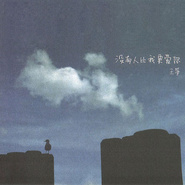

没有人比我更爱你
============================

|  |  |
| :--: | :-- |
| [ 没有人比我更爱你](https://emumo.xiami.com/album/306993) | **艺人**: [王筝](../index.md) **语种**: 国语 **唱片公司**: 水木同创 **发行时间**: 2008年10月29日 **专辑类别**: EP, 单曲 **专辑风格**: 国语流行 Mandarin Pop, 华语唱作人 Chinese Singer-Songwriter **播放数**: 2707495 **收藏数**: 454 **评论数**: 42  |

## 简介

一首《我们都是好孩子》，让人们记住了一个用心唱歌的好孩子王筝。创作才女的形象深入人心，在两年的潜心创作与精心准备之后，她回来了，带着自己的最新作品《没有人比我更爱你》。   
  
刚刚完成录音略显疲惫的王筝用“史无前例”四个字来形容《没有人比我更爱你》。是由于这首歌创造了她个人演艺生涯的多个记录。创作时间最长，修改次数最多，进棚次数最多，参与的人也最多，这还是王筝与水木年华的首次合作。   
  
《没有人比我更爱你》是以对唱的形式来诠释深爱中的男女彼此触碰心灵的声音，沉浸在爱河里的女子既感受着无比的幸福又体会着患得患失的担心，而男子默默地表达爱意令自己的爱人捉摸不定。对相同的爱恋有着不同表达的彼此，激起了两人之间的感情涟漪。这首歌正是以这个独特的视角，恰如其分的将沉溺在深爱中男女内心最柔弱的部分展现的淋漓尽致。王筝与水木年华无懈可击的演唱功底及拿捏到位的情感流露使得整个歌曲温情中带有一丝丝的伤感，旋律 好听而又耐人寻味。   
  
作为整个华语乐坛凤毛麟角的唱作才女王筝，这次携《没有人比我更爱你》温情出击，势必掀起一股强劲的人文旋风，再次打动无数人的心。   
  
水木年华甘当绿叶 好孩子王筝蓄势待发   
  
《没有人比我更爱你》是王筝签约国内独立厂牌水木同创之后推出的第一首作品，作为师兄的水木年华组合对于王筝的创作才华也是赞赏有加，在这首歌上，水木年华也倾注了很多的精力和心血。水木年华成员小卢不仅是这首歌的制作人兼作曲，还献声与王筝对唱，两个极具人文气息的优秀唱作人在这次合作中碰撞出的灵感与火花让这首歌既不失王筝的清新、淡雅，又结合了水木年华的忧郁、深情。水木年华另一成员缪杰的完美和声让这首歌更加立体、饱满，趋于完美。   
  
《没有人比我更爱你》作为王筝新专辑的同名主打，先行为她2008年的演艺生涯拉开序幕，目前新专辑中其他歌曲正在有条不紊的制作当中，幕后制作团队包括了袁惟仁、小卢、仓雁彬等两岸三地顶级制作人，有了他们的倾力协助，王筝新专辑的品质自然超群。新专辑也将计划在11月中旬发布。届时，喜欢王筝的歌迷将再次领略她那独树一帜的风采和与众不同的声音。   
  
那个唱着好孩子的王筝，她回来了。  
 

## 曲目

- [电台ID](./306993/UmHy876ac.md)
- [没有人比我更爱你](./306993/UmHt93669.md)
- [阳光变成淡蓝色](./306993/bAkjE13b85.md)
- [越单纯越幸福](./306993/bAkjF9979e.md)
- [西安爱情故事](./306993/bAkjGbd167.md)
- [爸爸](./306993/fDUTD4101e.md)

## 评论

|  |  |  |  |
| :-- | :-- | :-- | :-- |
|  [虾米用户](https://emumo.xiami.com/u/430529975)  2019-10-10 21:31 赞(0) 踩(0) | 
心的抒发，被打动了
 |
|  [虾米用户](https://emumo.xiami.com/u/1984153) Love never f... 2017-11-21 22:43 赞(2) 踩(0) | 
很喜欢这张专辑，希望尽快能上架
 |
|  [虾米用户](https://emumo.xiami.com/u/44075728) 余生不许别人指教，我自己... 2017-10-28 00:37 赞(1) 踩(0) | 
我原以为我会很恨你，小时候因为你差点被爸妈抛弃送人，可是现在你去世了，我却没有大快人心的感觉，难过，想哭哭不出来！希望你在另一个世界安好！
 |
|  [虾米用户](https://emumo.xiami.com/u/3186478) 我还没想好要写什么... 2017-01-24 04:23 赞(0) 踩(0) | 
求上架，这张很好听啊
 |
|  [虾米用户](https://emumo.xiami.com/u/9926785)  2015-01-10 16:02 赞(0) 踩(0) | 
喜欢
 |
|  [虾米用户](https://emumo.xiami.com/u/1609946) 一即一切 2014-03-06 12:04 赞(0) 踩(0) | 
心 境不二
 |
|  [虾米用户](https://emumo.xiami.com/u/8615485)  2014-01-26 08:53 赞(0) 踩(0) | 
很舒服的感觉
 |
|  [虾米用户](https://emumo.xiami.com/u/13869285) 转瞬即逝的奢华，不要也罢 2013-09-17 11:54 赞(0) 踩(0) | 
其实很喜欢她的歌，听着不累
 |
|  [虾米用户](https://emumo.xiami.com/u/19723891)  2013-08-19 19:39 赞(0) 踩(0) | 
听着忆着自己的故事
 |
|  [虾米用户](https://emumo.xiami.com/u/15354265)  2013-06-19 09:38 赞(0) 踩(0) | 
很喜欢这样调调！大赞！
 |
|  [虾米用户](https://emumo.xiami.com/u/13722438)  2013-03-29 03:06 赞(0) 踩(0) | 
越简单越幸福！
 |
|  [虾米用户](https://emumo.xiami.com/u/13355676)  2013-03-03 23:23 赞(0) 踩(0) | 
可以听听
 |
|  [虾米用户](https://emumo.xiami.com/u/13246306)  2013-02-27 16:21 赞(0) 踩(0) | 
不错
 |
|  [虾米用户](https://emumo.xiami.com/u/1287048)  2013-02-04 12:21 赞(0) 踩(0) | 
越單純越幸福各种相同的旋律，各种相同的词，每句唱到 结束突然一变调子，很 突兀
 |
|  [虾米用户](https://emumo.xiami.com/u/6268659)  2012-11-04 13:03 赞(0) 踩(0) | 
王筝
 |
|  [虾米用户](https://emumo.xiami.com/u/2639062) lalalalala~ 2012-10-21 03:07 赞(0) 踩(0) | 
越單純越幸福的調調有點像張靚穎的畫心耶...不過還是很好聽
 |
| ⇒ |  [虾米用户](https://emumo.xiami.com/u/2575091)  2013-09-21 22:48 赞(0) 踩(0) | 
是的 有点那感觉
 |
|  [虾米用户](https://emumo.xiami.com/u/8263372)  2012-09-14 16:09 赞(0) 踩(0) | 
喜欢简单的声音 简单的歌曲
 |
|  [虾米用户](https://emumo.xiami.com/u/2057992) 音乐带我穿越 2012-05-14 22:00 赞(0) 踩(0) | 
喜欢~
 |
|  [虾米用户](https://emumo.xiami.com/u/3533326)  2012-05-03 17:31 赞(0) 踩(0) | 
真诚的歌喉
 |
|  [虾米用户](https://emumo.xiami.com/u/6461581)  2011-12-05 16:58 赞(0) 踩(0) | 
好听
 |
|  [虾米用户](https://emumo.xiami.com/u/3979337) 暂无签名~ 2011-11-04 21:50 赞(0) 踩(0) | 
我爱这枚女纸的声音！
 |
|  [虾米用户](https://emumo.xiami.com/u/2361471)   2011-07-29 14:23 赞(0) 踩(0) | 
越单纯越幸福，过去的懵懂很简单也很纯真，哈哈。。。。。
 |
|  [虾米用户](https://emumo.xiami.com/u/2361471)   2011-07-29 14:22 赞(0) 踩(0) | 
好听，好听，好听。。。。。
 |
|  [虾米用户](https://emumo.xiami.com/u/4805606)  2011-07-11 09:20 赞(0) 踩(0) | 
没有理由
 |
|  [虾米用户](https://emumo.xiami.com/u/1931977)  2011-05-29 11:56 赞(0) 踩(0) | 
越单纯越幸福，越简单越快乐，活在当下，保持快乐的心态~用心触摸歌者述说的故事。
 |
|  [虾米用户](https://emumo.xiami.com/u/3728933) 何必认真 2011-05-06 17:49 赞(0) 踩(0) | 
越单纯越幸福超好听
 |
|  [虾米用户](https://emumo.xiami.com/u/428787) 好或坏  昨天都不会再来 2011-03-05 20:57 赞(0) 踩(0) | 
越单纯越幸福 真是大爱啊！
 |
|  [虾米用户](https://emumo.xiami.com/u/1150962)  2011-02-25 01:30 赞(0) 踩(0) | 
。。。。。。。。。
 |
|  [虾米用户](https://emumo.xiami.com/u/2449401)  2011-02-09 22:49 赞(0) 踩(0) | 
越单纯越幸福
 |
|  [虾米用户](https://emumo.xiami.com/u/2449401)  2011-02-09 22:49 赞(0) 踩(0) | 
越单纯越幸福
 |
|  [虾米用户](https://emumo.xiami.com/u/834706)  2010-10-15 08:29 赞(0) 踩(0) | 
不全啊。。。
 |
|  [虾米用户](https://emumo.xiami.com/u/1420375) 我还没想好要写什么... 2010-10-08 13:45 赞(0) 踩(0) | 
很喜欢！！！！
 |
|  [虾米用户](https://emumo.xiami.com/u/174970)  2010-09-04 18:48 赞(0) 踩(0) | 
越单纯越幸福心像开满花的树~
 |
|  [虾米用户](https://emumo.xiami.com/u/272027)   2009-07-19 12:08 赞(0) 踩(0) | 
纯净的声音
 |
|  [虾米用户](https://emumo.xiami.com/u/275515)  2009-07-17 10:13 赞(0) 踩(0) | 
好喜欢王筝的歌
 |
|  [虾米用户](https://emumo.xiami.com/u/245466)  2009-07-03 04:12 赞(0) 踩(0) | 
越单纯越幸福 也许我们一直都希望自己是个孩子吧！ 淡淡的 很喜欢.
 |
|  [虾米用户](https://emumo.xiami.com/u/245466)  2009-07-03 04:11 赞(0) 踩(0) | 
喜欢
 |
|  [虾米用户](https://emumo.xiami.com/u/2191) 谁来和你共进晚餐,谁来将... 2008-12-18 10:29 赞(0) 踩(0) | 
&amp;quot;王筝自评最“无奈”的是《没有人比我更爱你》选择与水木年华合唱《没有人比我更爱你》只是因为他们俩是公司老板。这是首很朴实的歌，这个年代大家都避免沉重，但这首歌却是很深情地在表达爱情，这首歌编曲很扎实听上去很温暖。&amp;quot;估计单人版《没有人比我更爱你》未必有现在这么好.以后应该还会单独唱的,拭目以待~~
 |
| ⇒ |  [虾米用户](https://emumo.xiami.com/u/435846)  2017-10-28 00:29 赞(0) 踩(0) | 
"只是因为他们俩是公司老板",这真是王筝自评么？呵呵。我倒是真觉得卢庚戌那家伙音色很平庸，现在听来，王筝的声音和老狼简直绝配。
 |
|  [虾米用户](https://emumo.xiami.com/u/3539) 有得无得，心常安泰。 2008-12-12 21:55 赞(0) 踩(0) | 
为什么百度上有12首呢？
 |
|  [虾米用户](https://emumo.xiami.com/u/5034)  2008-11-19 19:30 赞(0) 踩(0) | 
我们都是好孩子，做了我好长时间的手机铃声。
 |
