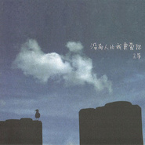

没有人比我更爱你
============================

|  |  |
| :--: | :-- |
| [ 没有人比我更爱你](https://emumo.xiami.com/album/309283) | **艺人**: [王筝](../index.md) **语种**: 国语 **唱片公司**: 无线星空, 无线星空 **发行时间**: 2008年11月19日 **专辑类别**: 录音室专辑 **专辑风格**: 国语流行 Mandarin Pop, 华语唱作人 Chinese Singer-Songwriter **播放数**: 723801 **收藏数**: 609 **评论数**: 63  |

## 简介

时值华语音乐市场持续萎缩、内地市场屡屡不振、原创音乐更是少有人问津之际，数字音乐异军突起，近年来越发替代传统唱片的市场份额，收入几占整个唱片市场的九成。如今的音乐产业，一位歌手、一张唱片，一旦谁占有了数字音乐市场似乎就预示着占有了整个音乐王国……   
近日，创作才女王筝的最新单曲《没有人比我更爱你》便主打数字音乐牌，单曲自发行之日起短短两周，便在数字音乐领域取得惊人的好成绩！   
随着单曲的广泛传唱，王筝的新专辑更是成为众人关注的焦点。作为内地乐坛少有的女性唱作人，王筝的人文气息及创作才华近年来备受业内人士的肯定和赞许，其音乐的商业价值随之不断提升。此次与国内最大的数字音乐发行商无线星空音乐进行数字领域发行及推广的深度合作，秉承了无线星空注重音乐品质、内涵的品牌风格。相较于08年无线星空音乐运作的孙楠、孙俪、范逸臣、张信哲等艺人的数字音乐发行，王筝的音乐同样是清新、脱俗，旋律好听而又耐人寻味。此次无线星空音乐整合了最完备的数字领域音乐资源，先于传统唱片对王筝的新专辑进行全球独家数字首发及推广。这张汇聚了水木同创、深深梅沙、无线星空三方力量的原创大碟被业内人士大为期许，有望成为08年内地音乐市场的最佳原创专辑。   
纵观2008年几近停滞的华语音乐市场，让人眼前一亮的新人新作少有出现，原创音乐市场更为惨淡。索性08岁末将至，王筝推出了最新的原创大碟《没有人比我更爱你》。无怪无线星空音乐总经理唐月明先生感慨：从整个华语音乐市场来说，这张专辑无论是其欣赏价值还是商业价值都必将成为今年华语乐坛含金量最高的一张原创大碟，为一直处于低靡状态的华语音乐市场带来一缕清风。相信王筝清新、淡雅的独特气质势必掀起一股强劲的人文旋风，再次打动无数人的心。   
  
 

## 曲目

- [阳光变成淡蓝色](./309283/bA1721112e.md)
- [没有人比我更爱你](./309283/U4fj7d93c.md)
- [西安爱情故事](./309283/U4fkbb6aa.md)
- [气球 (自弹自唱版)](./309283/cqyZPf99f1.md)
- [爸爸](./309283/U4fm94591.md)
- [幸福的折磨](./309283/U4fn73c9e.md)
- [越单纯越幸福](./309283/U4fo5d6f6.md)
- [锋利的记忆](./309283/gujJP4a91d.md)
- [爱情一直在经过](./309283/U4fq535a9.md)
- [别唱伤心的歌](./309283/bA17Bcd5ec.md)
- [没有人比我更爱你 (伴奏)](./309283/U4fs78329.md)

## 评论

|  |  |  |  |
| :-- | :-- | :-- | :-- |
|  [虾米用户](https://emumo.xiami.com/u/10303763)  2019-01-17 14:22 赞(0) 踩(0) | 
卢庚戌说王筝不红天理难容，当时只是网络口水歌盛行，现在则伪装成各类“曲风”，换汤不换药啊。
 |
|  [虾米用户](https://emumo.xiami.com/u/2364921)  2017-10-28 00:00 赞(0) 踩(0) | 
无语了，最近老听收音机，才知道这首歌，越单纯，越幸福，唉，看来以后要多学习了。
 |
|  [虾米用户](https://emumo.xiami.com/u/292545967) Space-Time R... 2017-06-25 14:23 赞(0) 踩(0) | 
捂扳圈
 |
|  [虾米用户](https://emumo.xiami.com/u/10384607) 空山無人，水流花開。 2016-04-02 03:13 赞(0) 踩(0) | 
cry a whole ocean
 |
|  [虾米用户](https://emumo.xiami.com/u/115602208)  2016-03-01 09:55 赞(0) 踩(0) | 
深有感触
 |
|  [虾米用户](https://emumo.xiami.com/u/10414103) 爱音乐爱朱婷！ 2015-05-14 23:42 赞(0) 踩(0) | 
一直觉得封面很美！
 |
|  [虾米用户](https://emumo.xiami.com/u/33431214)   2015-01-01 14:25 赞(0) 踩(0) | 
封面美
 |
|  [虾米用户](https://emumo.xiami.com/u/1609946) 一即一切 2014-04-26 17:24 赞(0) 踩(0) | 
心 境不二
 |
|  [虾米用户](https://emumo.xiami.com/u/522205) 一切很美，音為有你﹏ 2014-03-14 10:37 赞(0) 踩(0) | 
那一首大气酣畅嘹亮的春风，让我开始欣赏她~
 |
| ⇒ |  [虾米用户](https://emumo.xiami.com/u/49321990)  2015-04-18 09:21 赞(0) 踩(0) | 
亲，想你们啰
 |
|  [虾米用户](https://emumo.xiami.com/u/18090999)  2013-10-12 01:01 赞(0) 踩(0) | 
喜欢
 |
|  [虾米用户](https://emumo.xiami.com/u/13869285) 转瞬即逝的奢华，不要也罢 2013-05-14 11:40 赞(1) 踩(0) | 
时而很伤情，时而很轻盈，翩翩入耳
 |
|  [虾米用户](https://emumo.xiami.com/u/7167091)  2012-12-16 19:41 赞(0) 踩(0) | 
。。。
 |
|  [虾米用户](https://emumo.xiami.com/u/10299454)  2012-10-31 23:25 赞(0) 踩(0) | 
喜欢
 |
|  [虾米用户](https://emumo.xiami.com/u/10299454)  2012-10-31 23:24 赞(0) 踩(0) | 
没有人比我更爱你.....
 |
|  [虾米用户](https://emumo.xiami.com/u/2903362) 一如既往 2012-10-02 13:29 赞(0) 踩(0) | 
越单纯越快乐，不错
 |
|  [虾米用户](https://emumo.xiami.com/u/9215683)  2012-05-19 00:42 赞(0) 踩(0) | 
给我在uk时走下去的勇气
 |
|  [虾米用户](https://emumo.xiami.com/u/4330724)  2012-04-08 09:20 赞(0) 踩(0) | 
唱功扎实，铿锵有力
 |
|  [虾米用户](https://emumo.xiami.com/u/8344035)  2012-03-17 22:37 赞(0) 踩(0) | 
在路上听到流浪艺人在弹这首歌，心里酸酸的
 |
|  [虾米用户](https://emumo.xiami.com/u/5792838)  2011-12-01 23:13 赞(0) 踩(0) | 
出这张的时候还有幸去看了歌友会~静静地~
 |
|  [虾米用户](https://emumo.xiami.com/u/4369285) 土黄色的尘埃找到了肺～但... 2011-10-18 19:09 赞(0) 踩(0) | 
喜欢~ing~~
 |
|  [虾米用户](https://emumo.xiami.com/u/2160605) 醉了 2011-10-17 11:47 赞(0) 踩(0) | 
一直很喜欢她得声音
 |
|  [虾米用户](https://emumo.xiami.com/u/3418383)  2011-05-19 22:05 赞(0) 踩(0) | 
喜欢王筝的歌
 |
|  [虾米用户](https://emumo.xiami.com/u/3890109)  2011-05-11 19:52 赞(0) 踩(0) | 
喜欢王筝的歌...
 |
|  [虾米用户](https://emumo.xiami.com/u/3890690) 虚拟世界中的明月 2011-05-10 20:33 赞(0) 踩(0) | 
喜欢
 |
|  [虾米用户](https://emumo.xiami.com/u/1647486)  2011-04-04 14:21 赞(0) 踩(0) | 
安静
 |
|  [虾米用户](https://emumo.xiami.com/u/1175591)  2011-02-28 21:57 赞(0) 踩(0) | 
没有人比我更爱你
 |
|  [虾米用户](https://emumo.xiami.com/u/2933613)  2011-02-22 12:24 赞(0) 踩(0) | 
稀饭
 |
|  [虾米用户](https://emumo.xiami.com/u/2918838)  2011-02-21 23:46 赞(0) 踩(0) | 
声音很纯粹，和卢庚戌搭配很有大学时光的感觉
 |
|  [虾米用户](https://emumo.xiami.com/u/1342581)  2011-02-02 20:10 赞(0) 踩(0) | 
王筝
 |
|  [虾米用户](https://emumo.xiami.com/u/1598345)  2011-02-01 19:26 赞(0) 踩(0) | 
越单纯越幸福~
 |
|  [虾米用户](https://emumo.xiami.com/u/2573073)  2011-01-22 09:08 赞(0) 踩(0) | 
好听
 |
|  [虾米用户](https://emumo.xiami.com/u/341441)  2010-09-26 15:04 赞(0) 踩(0) | 
越单纯越幸福
 |
|  [虾米用户](https://emumo.xiami.com/u/655560)  2010-09-13 13:49 赞(0) 踩(0) | 
好听，心灵音乐
 |
|  [虾米用户](https://emumo.xiami.com/u/894651)  2010-05-24 11:47 赞(0) 踩(0) | 
喜欢这样自己在唱歌的小众歌手
 |
|  [虾米用户](https://emumo.xiami.com/u/857290)  2010-05-09 21:49 赞(0) 踩(0) | 
因为一个人喜欢上的歌
 |
|  [虾米用户](https://emumo.xiami.com/u/438831)  2010-03-24 16:35 赞(0) 踩(0) | 
喜欢的~~~~耐听~当然要支持
 |
|  [虾米用户](https://emumo.xiami.com/u/204183)  2010-03-06 13:03 赞(0) 踩(0) | 
西安爱情故事  不能不感动
 |
|  [虾米用户](https://emumo.xiami.com/u/343762)  2009-09-13 15:50 赞(0) 踩(0) | 
再说一句，推荐一部王筝主演的“致我们即将逝去的青春”，我是从那开始喜欢上王筝的声音的！
 |
|  [虾米用户](https://emumo.xiami.com/u/343762)  2009-09-13 15:48 赞(0) 踩(0) | 
听了王筝的声音，就开始喜欢上了。
 |
|  [虾米用户](https://emumo.xiami.com/u/6098)  2008-12-23 16:00 赞(0) 踩(0) | 
封面上的王筝好漂亮
 |
|  [虾米用户](https://emumo.xiami.com/u/7650)  2008-12-19 17:48 赞(0) 踩(0) | 
******
 |
|  [虾米用户](https://emumo.xiami.com/u/1307)  2008-12-17 16:00 赞(0) 踩(0) | 
已审定，是失望过多，唱片下架～
 |
|  [虾米用户](https://emumo.xiami.com/u/1307)  2008-12-17 15:43 赞(0) 踩(0) | 
目前听到第8首，没有发现什么惊喜，准备下架。。。
 |
|  [虾米用户](https://emumo.xiami.com/u/2191) 谁来和你共进晚餐,谁来将... 2008-12-16 23:51 赞(0) 踩(0) | 
好喜欢吖~~喜欢 喜欢 很喜欢
 |
|  [虾米用户](https://emumo.xiami.com/u/14304) 不安是心理扭曲的激化 2008-12-16 18:10 赞(0) 踩(0) | 
啦啦啦，终于发布啦
 |
|  [虾米用户](https://emumo.xiami.com/u/7650)  2008-12-13 10:52 赞(0) 踩(0) | 
******
 |
| ⇒ |  [虾米用户](https://emumo.xiami.com/u/27)  “你知道吗？你总是说假... 2008-12-15 13:00 赞(0) 踩(0) | 
之前的曲目顺序有误  删掉了 等人重新上传
 |
|  [虾米用户](https://emumo.xiami.com/u/7532) 暂无签名~ 2008-12-11 09:00 赞(0) 踩(0) | 
还没发布？ft...
 |
|  [虾米用户](https://emumo.xiami.com/u/12551) 暂无签名~ 2008-12-10 20:57 赞(0) 踩(0) | 
为什么连卓越都没得卖?
 |
|  [虾米用户](https://emumo.xiami.com/u/12551) 暂无签名~ 2008-12-10 01:43 赞(0) 踩(0) | 
筝筝生完宝宝后的第一张专辑哦~一定要买一张作纪念...
 |
|  [虾米用户](https://emumo.xiami.com/u/570) 暂无签名~ 2008-12-06 12:03 赞(0) 踩(0) | 
难道因为版权问题
 |
|  [虾米用户](https://emumo.xiami.com/u/10005)  2008-12-05 16:14 赞(0) 踩(0) | 
为什么突然变成未发布了...
 |
|  [虾米用户](https://emumo.xiami.com/u/13081)  2008-12-04 09:53 赞(0) 踩(0) | 
各种流行风充斥的现在，这么简简单单的歌，却如此好听
 |
|  [虾米用户](https://emumo.xiami.com/u/11098)  2008-11-26 13:02 赞(0) 踩(0) | 
好音乐
 |
|  [虾米用户](https://emumo.xiami.com/u/9511)  2008-11-26 10:08 赞(0) 踩(0) | 
不错。很喜欢
 |
|  [虾米用户](https://emumo.xiami.com/u/8584) 温柔其心，敦厚其行。 2008-11-26 09:51 赞(0) 踩(0) | 
不错。
 |
|  [虾米用户](https://emumo.xiami.com/u/7650)  2008-11-25 21:55 赞(0) 踩(0) | 
******
 |
|  [虾米用户](https://emumo.xiami.com/u/7650)  2008-11-25 21:55 赞(0) 踩(0) | 
******
 |
|  [虾米用户](https://emumo.xiami.com/u/11251)  2008-11-25 21:37 赞(0) 踩(0) | 
很简单纯净  恬淡
 |
|  [虾米用户](https://emumo.xiami.com/u/7568)  2008-11-24 14:26 赞(0) 踩(0) | 
很喜欢很喜欢，一直没有找到高品质的版本。
 |
|  [虾米用户](https://emumo.xiami.com/u/7568)  2008-11-24 14:25 赞(0) 踩(0) | 
很喜欢这张专辑的歌曲，清新淡雅又不乏内容。
 |
|  [虾米用户](https://emumo.xiami.com/u/7739)  2008-11-23 21:00 赞(0) 踩(0) | 
我从来没有如此期待一张唱片
 |
