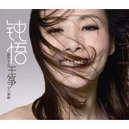

钝悟
============================

|  |  |
| :--: | :-- |
| [ 钝悟](https://emumo.xiami.com/album/421210) | **艺人**: [王筝](../index.md) **语种**: 国语 **唱片公司**: 银基一帮行 **发行时间**: 2011年01月19日 **专辑类别**: 录音室专辑 **专辑风格**: 国语流行 Mandarin Pop, 华语唱作人 Chinese Singer-Songwriter **播放数**: 2604546 **收藏数**: 1461 **评论数**: 343  |

## 简介

钝感的王筝用了数年创作的感动  
敏感的听者总在一瞬间就能体会  
  
王筝全新大碟  
2010年年末 钝感上市  
  
  
内页  
  
王筝是……  
  
一个傻瓜  
  
傻瓜天不怕地不怕，敢于直面惨淡的人生  
傻瓜从不仅仅计较，更是学不会尔虞我诈  
傻瓜不会用农药，却每天都在自家院子里锄草种花  
傻瓜看不懂地图，可背上一个背包她就敢浪迹天涯  
傻瓜不太清楚如何上网Download那些MP3  
每个午后的黄昏，她都坐在地板对着音响发呆，一听就是一下午  
傻瓜也不太明白其实现在唱片很不好卖，可还是一头钻进录音棚就出不来  
傻瓜其实满脑子都是智慧，就看你是否能看得出，听得懂。  
  
王筝不觉得傻瓜是在骂她，她明白傻人有傻福的道理。  
  
与世无争，善良且用心的歌唱。  
她的确也是幸福且幸运的  
出了一张又一张唱片，唱了一段又一段故事，认识了一个又一个你。  
  
  
一个钝女  
  
和王筝交流是需要技巧的  
当王筝在你面前一头雾水的看着你时，千万不要理解为她没有用心听你的话；  
当多年后，你从她的歌声中听到那天你们的谈话，也千万不要惊讶  
王筝是敏感的，她总是细腻的记住周遭的每一份感动  
可她又那么钝感，心里纵是千言万语汹涌澎湃，也总要很久之后才会化作音符表达出来  
  
她觉得钝感没什么不好  
  
钝感不等于迟钝，它是对困遇的一种耐力  
是厚着脸皮对抗外界的能力  
它仍是一种积极向上的人生态度。  
敏感的人其实早已看穿，表面迟钝，木讷的钝女  
才是拥有赢得美好生活的手段和智慧的天才。  
  
一个歌者  
  
卸掉所有的外壳，王筝的核心终究是一个美好的歌者  
王筝是个标准的美女，她有精致的五官，并且位置合理的长在形状完美的脸上  
她的歌也很美，并且常常美得听者甚至忘记了那张漂亮的脸庞  
她的声音在耳机里低吟浅唱，听者浑身一惊，这些不都是我的过往？  
于是听王筝唱歌在不经意间变成了自己和自己的对话  
直到曲终人散回过神来，望着手里的歌词才念起这是王筝在唱  
  
王筝本人对此感到很满意  
  
她很满足于做一个纯粹的歌者，别在意她的星座血型、家庭相貌  
她希望歌者唱的歌，能让听者听到听者自己  
  
钝感力的五项铁律：  
1.迅速忘却不快之事。  
2.认定目标，即使失败仍要继续挑战。  
3.坦然面对流言蜚语。  
4.对嫉妒讽刺常怀感谢之心。  
5.面对表扬，得寸进尺，得意忘形。  
  
  
  
  
  
  
  
  
  
  
  
  
  
  
  
  
  
  
  
  
  
  
王筝推广团队 Staff Case  
  
制作:北京银基一帮行文化传媒有限公司  
Produced by Beijing INGLEBOND Culture &amp; Media Co., Ltd.  
出品人Publisher:周立兵John Zhou  
监制Director:周立兵John Zhou 金子Jinzi 蒋涛 Jiang Tao  
制作人Producer:   
企划统筹Marketing Manager:庄超Brume Zhuang  
市场行销统筹Sales Marketing Supervisor：金子 Jinzi  
业务行销Sales Marketing: 蒋涛 Jiang Tao  
造型Stylist:  
化妆Make up:  
发型Hair Stylist:  
摄影Photographer:  
映像制作MV Making:北京菲林空间影视文化交流有限公司  
Beijing Film Space Television Culture Communication Co., Ltd.  
音乐录影带导演MV Director:  
  
音乐版权Music Publishing:  
文案Copywriter:庄超Brume Zhuang  
平面设计Art Designer:  
宣传总监Promotion Director:蒋涛 Jiang Tao  
宣传统筹Promotion Supervisor:王毅 Allen Wang  
宣传执行Promotion Executive  
电台Radio:王乐 Rocky Wang  
电视TV:菲菲 Fei Fei  
平面Press: 王毅 Allen Wang  
网络Website:天天   
新媒体New Media:夏雪  
经纪统筹Management Supervisor:金子 Jinzi   
艺人经纪Artist Manager: 赵雁 Helen Zhao  
艺人助理Artist Assistant: 张欣爱   
宣传专线Promotion Line:+86 10-85768880  
经纪专线Broker Line:+86 10-85792858  
公司电话Office Tel:+86 10-85768880  
公司传真Office Fax:+8610-85792880  
  
官方网站Official Website:米多乐网 www.m312.com  
公司地址:中国 北京市 朝阳区 甘露园19号院&nbsp;718传媒文化创意园&nbsp;6-C&nbsp;  
邮编:100123  
Address: 6-C 718 GOOD LOFT No.19&nbsp;Ganluyuan, Chao Yang District,Beijing&nbsp;100123,P.R.China  
银基一帮行 荣誉出品

## 曲目

- [壁炉MV](./421210/xLsDe09c4be.md)
- [一切都没发生](./421210/mQ7EpR86cb0.md)
- [幸福过MV](./421210/xLrZrM9762d.md)
- [橡皮擦](./421210/xLsDe3de49a.md)
- [玩具](./421210/b1pQ5XY4124b.md)
- [你们的爱](./421210/xLsDe5ca1f6.md)
- [合影留念](./421210/xLsDe6d64e3.md)
- [降落伞](./421210/b1pQ5Yb4258c.md)
- [影子](./421210/xLsDe8dc5f4.md)
- [一直MV](./421210/mQ7EpZ7d63b.md)

## 评论

|  |  |  |  |
| :-- | :-- | :-- | :-- |
|  [虾米用户](https://emumo.xiami.com/u/17381196)  2019-05-21 12:29 赞(1) 踩(0) | 
很棒，好听
 |
|  [虾米用户](https://emumo.xiami.com/u/343821892) 我还没想好要写什么... 2018-11-07 13:24 赞(0) 踩(0) | 
神专
 |
|  [虾米用户](https://emumo.xiami.com/u/3033799) You're my jo... 2017-09-22 01:17 赞(1) 踩(0) | 
最好听的那首下架了。
 |
| ⇒ |  [虾米用户](https://emumo.xiami.com/u/42518064)  2019-11-07 13:15 赞(0) 踩(0) | 
这人在说什么
 |
|  [虾米用户](https://emumo.xiami.com/u/5016693) 我是大侠，一二三，呀呀呀 2016-10-10 11:22 赞(0) 踩(0) | 
这首新专辑伴我大学生涯，如今都过去
 |
|  [虾米用户](https://emumo.xiami.com/u/10384607) 空山無人，水流花開。 2016-04-05 18:05 赞(0) 踩(0) | 
才發現這張音質很差啊
 |
| ⇒ |  [虾米用户](https://emumo.xiami.com/u/42518064)  2019-11-07 13:14 赞(0) 踩(0) | 
你这个不好吧
 |
|  [虾米用户](https://emumo.xiami.com/u/49447515)  2015-09-16 19:03 赞(1) 踩(0) | 
喜欢不需要理由
 |
|  [虾米用户](https://emumo.xiami.com/u/11259253) 听靓歌 2015-01-16 18:05 赞(0) 踩(0) | 
不错。
 |
|  [虾米用户](https://emumo.xiami.com/u/9926785)  2015-01-10 16:02 赞(0) 踩(0) | 
喜欢
 |
|  [虾米用户](https://emumo.xiami.com/u/11204600)  2014-12-27 19:17 赞(1) 踩(0) | 
越单纯越幸福的王筝
 |
|  [虾米用户](https://emumo.xiami.com/u/30705) 我还没想好要写什么... 2014-12-25 12:52 赞(1) 踩(0) | 
封面明明是长发版鲁豫……
 |
|  [虾米用户](https://emumo.xiami.com/u/6491765) 我只是个门外汉。 2014-08-14 15:36 赞(1) 踩(0) | 
其实我最喜欢她的这张专辑。
 |
|  [虾米用户](https://emumo.xiami.com/u/13583526) AQUOS 2014-04-23 23:40 赞(0) 踩(0) | 
最爱一直 单曲循环 我一直会喜欢下去
 |
|  [虾米用户](https://emumo.xiami.com/u/32169295) 跟着某些活跃的音符追溯. 2014-02-10 18:42 赞(0) 踩(0) | 
好听。。。。
 |
|  [虾米用户](https://emumo.xiami.com/u/19893395)  2013-10-03 13:50 赞(0) 踩(0) | 
钟唔
 |
|  [虾米用户](https://emumo.xiami.com/u/7350010)  2013-07-05 08:39 赞(1) 踩(0) | 
壁炉的歌词一处错了，“我要画不传音符的”，正确的是：我要画不穿衣服的。这是有意为之吗？如果是，充分说明这个编辑歌词的人心可真够脏的。
 |
| ⇒ |  [虾米用户](https://emumo.xiami.com/u/8577848) 听歌这事吧，随缘.... 2014-07-12 12:01 赞(0) 踩(0) | 
也有可能，编歌词的人，没用心听这两句.....这种情况遇见好多次
 |
| ⇒ |  [虾米用户](https://emumo.xiami.com/u/42518064)  2019-11-07 13:20 赞(0) 踩(0) | 
脑残?
 |
|  [虾米用户](https://emumo.xiami.com/u/5974061)  2013-04-24 15:23 赞(0) 踩(0) | 
封面陈法拉了么
 |
|  [虾米用户](https://emumo.xiami.com/u/9607086) 让世界是世界 2013-04-20 09:38 赞(0) 踩(0) | 
大爱王筝的声音~
 |
|  [虾米用户](https://emumo.xiami.com/u/11246230) 音乐，很美妙的东西 2013-04-13 23:22 赞(0) 踩(0) | 
心情！
 |
|  [虾米用户](https://emumo.xiami.com/u/905486)  2013-01-31 13:27 赞(0) 踩(0) | 
好听
 |
|  [虾米用户](https://emumo.xiami.com/u/4808069) アキラ 2013-01-10 16:10 赞(0) 踩(0) | 
喜欢第二首
 |
|  [虾米用户](https://emumo.xiami.com/u/10236623) 生活很跌宕起伏但多姿多彩 2012-12-13 14:00 赞(0) 踩(0) | 
一切没有发生，喜欢过，你们的爱，降落伞，一直.
 |
|  [虾米用户](https://emumo.xiami.com/u/11101073)  2012-10-21 00:16 赞(0) 踩(0) | 
因为王筝
 |
|  [虾米用户](https://emumo.xiami.com/u/8438884) 什么最重要。。❤ 2012-10-13 11:11 赞(0) 踩(0) | 
一如封面 顿悟
 |
|  [虾米用户](https://emumo.xiami.com/u/8066858)  2012-08-09 23:52 赞(0) 踩(0) | 
干净的好声音，整张专辑90%好歌
 |
|  [虾米用户](https://emumo.xiami.com/u/10099126) 不填有事不12字太多了 2012-08-05 13:39 赞(0) 踩(0) | 
很多感动，也许你会顿悟……
 |
|  [虾米用户](https://emumo.xiami.com/u/9186958)  2012-06-18 16:54 赞(0) 踩(0) | 
1
 |
|  [虾米用户](https://emumo.xiami.com/u/2538418)  2012-06-13 09:34 赞(0) 踩(0) | 
每首歌曲的名字都喜欢。。简单 温暖
 |
|  [虾米用户](https://emumo.xiami.com/u/9247268)  2012-05-28 12:39 赞(0) 踩(0) | 
喜欢磁性的声音满满的感情回忆
 |
|  [虾米用户](https://emumo.xiami.com/u/2672796)  2012-05-21 18:01 赞(0) 踩(0) | 
玩具很好听啊 轻快地曲调
 |
|  [虾米用户](https://emumo.xiami.com/u/8865951)  2012-04-14 22:40 赞(0) 踩(0) | 
最喜欢的歌手最喜欢的专辑也许是因为我们在想同样的事情
 |
|  [虾米用户](https://emumo.xiami.com/u/3219921)  2012-03-21 10:39 赞(0) 踩(0) | 
很久没有新歌了，加油
 |
|  [虾米用户](https://emumo.xiami.com/u/6278616)   2012-03-19 10:42 赞(0) 踩(0) | 
就是喜欢
 |
|  [虾米用户](https://emumo.xiami.com/u/30705) 我还没想好要写什么... 2012-03-05 18:10 赞(0) 踩(0) | 
我只是觉得……封面有一点点像鲁豫怎么办……
 |
|  [虾米用户](https://emumo.xiami.com/u/7148652)  2012-02-17 03:25 赞(0) 踩(0) | 
喜欢，她的声音
 |
|  [虾米用户](https://emumo.xiami.com/u/2863737)  2012-01-17 10:40 赞(0) 踩(0) | 
王筝还是抒情流行风格最能打动人
 |
|  [虾米用户](https://emumo.xiami.com/u/7544790)  2012-01-04 22:33 赞(0) 踩(0) | 
喜欢  简单
 |
|  [虾米用户](https://emumo.xiami.com/u/6497966)  2011-12-01 14:00 赞(0) 踩(0) | 
小清新
 |
|  [虾米用户](https://emumo.xiami.com/u/6497966)  2011-12-01 13:59 赞(0) 踩(0) | 
小清新
 |
|  [虾米用户](https://emumo.xiami.com/u/5793618)  2011-11-24 20:50 赞(0) 踩(0) | 
干净！
 |
|  [虾米用户](https://emumo.xiami.com/u/6548181)  2011-11-14 04:35 赞(0) 踩(0) | 
\&amp;quot;\&amp;quot;\&amp;quot;\&amp;quot;钝\&amp;quot;\&amp;quot;\&amp;quot;\&amp;quot;\&amp;quot;悟
 |
|  [虾米用户](https://emumo.xiami.com/u/6368113)  2011-11-13 11:36 赞(0) 踩(0) | 
很慵懒很小资很纯美很乐观
 |
|  [虾米用户](https://emumo.xiami.com/u/81933)  2011-10-24 22:11 赞(0) 踩(0) | 
她不是什么节目的产物吧？配乐、嗓音、感觉都好!!!
 |
|  [虾米用户](https://emumo.xiami.com/u/4369285) 土黄色的尘埃找到了肺～但... 2011-10-18 19:31 赞(0) 踩(0) | 
这、、、、真的纯了~
 |
|  [虾米用户](https://emumo.xiami.com/u/6009452)  2011-10-08 21:29 赞(0) 踩(0) | 
很好听的声音，一直都喜欢你的歌~~
 |
|  [虾米用户](https://emumo.xiami.com/u/6138742)   2011-10-08 18:26 赞(0) 踩(0) | 
声音很好听！
 |
|  [虾米用户](https://emumo.xiami.com/u/5869508)  2011-09-18 20:47 赞(0) 踩(0) | 
好听的声音
 |
|  [虾米用户](https://emumo.xiami.com/u/3377179)  2011-08-15 18:12 赞(0) 踩(0) | 
xihuan
 |
|  [虾米用户](https://emumo.xiami.com/u/1026520)  2011-08-08 18:58 赞(0) 踩(0) | 
出来喜欢，还有什么呢？还是喜欢... ...
 |
|  [虾米用户](https://emumo.xiami.com/u/4154637)  2011-07-13 12:49 赞(0) 踩(0) | 
就是喜欢
 |
|  [虾米用户](https://emumo.xiami.com/u/3678383)  2011-06-14 00:55 赞(0) 踩(0) | 
以前很少听王筝的歌，直到偶然听到一个电台DJ推荐了这张专辑，发现王筝的声音也是难得的清新有磁性。
 |
|  [虾米用户](https://emumo.xiami.com/u/3121583)  2011-06-07 22:10 赞(0) 踩(0) | 
干净纯粹的声音，喜欢O(∩_∩)O~
 |
|  [虾米用户](https://emumo.xiami.com/u/1173123)  2011-05-23 15:34 赞(0) 踩(0) | 
不可错过的一块砖！
 |
|  [虾米用户](https://emumo.xiami.com/u/3902182)  2011-05-19 20:07 赞(0) 踩(0) | 
这张专辑是真的感动了我，就如专辑名字一样。顿悟后的王筝更加打动人心，从耳朵到内心的洗礼。
 |
|  [虾米用户](https://emumo.xiami.com/u/3890109)  2011-05-10 23:45 赞(0) 踩(0) | 
不错
 |
|  [虾米用户](https://emumo.xiami.com/u/733228) 我还没想好要写什么... 2011-05-06 13:37 赞(0) 踩(0) | 
喜欢王筝，没啥理由！
 |
|  [虾米用户](https://emumo.xiami.com/u/3352173)  2011-05-06 11:45 赞(0) 踩(0) | 
一直很喜欢她的声音
 |
|  [虾米用户](https://emumo.xiami.com/u/3830187)  2011-05-04 20:17 赞(0) 踩(0) | 
v
 |
|  [虾米用户](https://emumo.xiami.com/u/2487642)  2011-04-29 12:39 赞(0) 踩(0) | 
104.5女主播推荐的，不错！
 |
|  [虾米用户](https://emumo.xiami.com/u/1570914)  2011-04-27 12:53 赞(0) 踩(0) | 
好听的声音,迷上了...
 |
|  [虾米用户](https://emumo.xiami.com/u/3254707) 我们在天上的尊主，愿人都... 2011-04-23 10:28 赞(0) 踩(0) | 
不说什么，听的音乐一直不会少了她的～
 |
|  [虾米用户](https://emumo.xiami.com/u/3390495)  2011-03-31 19:41 赞(0) 踩(0) | 
喜欢
 |
|  [虾米用户](https://emumo.xiami.com/u/2481710)  2011-03-30 00:26 赞(0) 踩(0) | 
好听
 |
|  [虾米用户](https://emumo.xiami.com/u/2032853)  2011-03-29 20:43 赞(0) 踩(0) | 
。
 |
|  [虾米用户](https://emumo.xiami.com/u/3405409)  2011-03-29 20:41 赞(0) 踩(0) | 
...
 |
|  [虾米用户](https://emumo.xiami.com/u/3191669)  2011-03-24 18:49 赞(0) 踩(0) | 
喜欢死了
 |
|  [虾米用户](https://emumo.xiami.com/u/2761102)  2011-03-24 16:12 赞(0) 踩(0) | 
钝悟
 |
|  [虾米用户](https://emumo.xiami.com/u/1790794) 暂无签名~ 2011-03-22 13:51 赞(0) 踩(0) | 
真挚的音乐是有生命的
 |
|  [虾米用户](https://emumo.xiami.com/u/2942668) Jst Music Me 2011-03-22 13:35 赞(0) 踩(0) | 
喜欢王筝，清新音乐，沁透心灵。
 |
|  [虾米用户](https://emumo.xiami.com/u/3285773)  2011-03-20 18:14 赞(0) 踩(0) | 
自然的美好~
 |
|  [虾米用户](https://emumo.xiami.com/u/2730721) 我还没想好要写什么... 2011-03-18 23:43 赞(0) 踩(0) | 
这张专辑真的很不错，错过到了现在才听
 |
|  [虾米用户](https://emumo.xiami.com/u/3244464)  2011-03-18 00:35 赞(0) 踩(0) | 
清新而又温暖，如逝去的夏天
 |
|  [虾米用户](https://emumo.xiami.com/u/2908283)  2011-03-15 15:19 赞(0) 踩(0) | 
王筝的歌就是喜欢
 |
|  [虾米用户](https://emumo.xiami.com/u/2913887)  2011-03-14 21:42 赞(0) 踩(0) | 
顿悟
 |
|  [虾米用户](https://emumo.xiami.com/u/2913887)  2011-03-14 21:39 赞(0) 踩(0) | 
喜欢干净的声音
 |
|  [虾米用户](https://emumo.xiami.com/u/2403765)  2011-03-14 16:28 赞(0) 踩(0) | 
你们都是好孩子……
 |
|  [虾米用户](https://emumo.xiami.com/u/2829854)  2011-03-13 20:00 赞(0) 踩(0) | 
很纯粹很干净的声音。
 |
|  [虾米用户](https://emumo.xiami.com/u/3056298)  2011-03-09 11:21 赞(0) 踩(0) | 
喜歡初聽到歌聲的清新
 |
|  [虾米用户](https://emumo.xiami.com/u/3101387)  2011-03-08 12:52 赞(0) 踩(0) | 
又出专辑啦，呵呵，记得春风好像还是昨天的事
 |
|  [虾米用户](https://emumo.xiami.com/u/428787) 好或坏  昨天都不会再来 2011-03-05 20:53 赞(0) 踩(0) | 
喜欢王筝的声音 纯净 点点忧郁
 |
|  [虾米用户](https://emumo.xiami.com/u/2993779)  2011-03-04 01:22 赞(0) 踩(0) | 
依旧爱。
 |
|  [虾米用户](https://emumo.xiami.com/u/3056184)  2011-03-03 15:27 赞(0) 踩(0) | 
嗯好听
 |
|  [虾米用户](https://emumo.xiami.com/u/3046924)  2011-03-02 20:10 赞(0) 踩(0) | 
有才气，
 |
|  [虾米用户](https://emumo.xiami.com/u/3017085)  2011-03-02 10:17 赞(0) 踩(0) | 
22255
 |
|  [虾米用户](https://emumo.xiami.com/u/3028554)  2011-03-01 11:42 赞(0) 踩(0) | 
王筝
 |
|  [虾米用户](https://emumo.xiami.com/u/2160605) 醉了 2011-03-01 08:37 赞(0) 踩(0) | 
一把很柔和的声音 ，从高中时代就听了，每次听起心里都有些触动，也一直在等待她的新专辑，终于出现了，再次聆听这把声，好舒服.........
 |
|  [虾米用户](https://emumo.xiami.com/u/1523721)  2011-02-28 11:07 赞(0) 踩(0) | 
甜美
 |
|  [虾米用户](https://emumo.xiami.com/u/467693)  2011-02-28 10:28 赞(0) 踩(0) | 
贴近心灵的声音
 |
|  [虾米用户](https://emumo.xiami.com/u/1507110)  2011-02-28 02:45 赞(0) 踩(0) | 
声音很干净，听着非常舒服。
 |
|  [虾米用户](https://emumo.xiami.com/u/2740045) Always keep ... 2011-02-28 00:03 赞(0) 踩(0) | 
能够接近灵魂的清澈声音。
 |
|  [虾米用户](https://emumo.xiami.com/u/2632368)  2011-02-27 23:46 赞(0) 踩(0) | 
感觉很轻，淡而不腻不错。
 |
|  [虾米用户](https://emumo.xiami.com/u/2913219)  2011-02-27 19:37 赞(0) 踩(0) | 
清
 |
|  [虾米用户](https://emumo.xiami.com/u/1456495) 身前即是来时路，回首又是... 2011-02-27 18:11 赞(0) 踩(0) | 
很简单的好歌
 |
|  [虾米用户](https://emumo.xiami.com/u/1655386)  2011-02-27 10:36 赞(0) 踩(0) | 
轻轻地淡淡地又那么深刻。。无法忘记
 |
|  [虾米用户](https://emumo.xiami.com/u/2940092)  2011-02-27 03:04 赞(0) 踩(0) | 
我表妹把王筝叫姑呢，也就是说王筝是我姨夫的妹妹.... 所以一定要支持下哈哈
 |
|  [虾米用户](https://emumo.xiami.com/u/2988091)  2011-02-26 21:11 赞(0) 踩(0) | 
音色美
 |
|  [虾米用户](https://emumo.xiami.com/u/2991264)  2011-02-26 20:01 赞(0) 踩(0) | 
越简单越单纯
 |
|  [虾米用户](https://emumo.xiami.com/u/1135330)  2011-02-26 15:47 赞(0) 踩(0) | 
内心的声音
 |
|  [虾米用户](https://emumo.xiami.com/u/2977171)  2011-02-26 14:23 赞(0) 踩(0) | 
柔柔感觉
 |
|  [虾米用户](https://emumo.xiami.com/u/2986811)  2011-02-26 14:22 赞(0) 踩(0) | 
淡淡纯纯的。。。 喜欢这种感觉
 |
|  [虾米用户](https://emumo.xiami.com/u/2984773)  2011-02-26 12:04 赞(0) 踩(0) | 
天籁之音
 |
|  [虾米用户](https://emumo.xiami.com/u/2979094)  2011-02-25 22:50 赞(0) 踩(0) | 
我也有个同学叫王筝
 |
|  [虾米用户](https://emumo.xiami.com/u/2512795)  2011-02-25 21:39 赞(0) 踩(0) | 
简单 抒情的好孩子
 |
|  [虾米用户](https://emumo.xiami.com/u/1307700)  2011-02-25 20:50 赞(0) 踩(0) | 
副歌部分反复的**主题，似乎支离破碎的感情回不到从前，片片回忆只能在往过的阳光下灿烂，而如今却化为两行热泪默默
 |
|  [虾米用户](https://emumo.xiami.com/u/2974000)  2011-02-25 17:15 赞(0) 踩(0) | 
喜欢那干净的声音
 |
|  [虾米用户](https://emumo.xiami.com/u/2971669)  2011-02-25 13:19 赞(0) 踩(0) | 
点支烟，静静的听了听，感觉很透彻很舒服，像我年轻时喜欢的味道，有点像阮丹青的味道。
 |
|  [虾米用户](https://emumo.xiami.com/u/1927304)  2011-02-25 13:12 赞(0) 踩(0) | 
感觉不错
 |
|  [虾米用户](https://emumo.xiami.com/u/2155447)  2011-02-24 23:21 赞(0) 踩(0) | 
空灵的声音总能安抚躁动的心灵
 |
|  [虾米用户](https://emumo.xiami.com/u/2962681)  2011-02-24 22:50 赞(0) 踩(0) | 
挺好听的
 |
|  [虾米用户](https://emumo.xiami.com/u/2965313)  2011-02-24 22:03 赞(0) 踩(0) | 
会想起纯粹的爱的感觉
 |
|  [虾米用户](https://emumo.xiami.com/u/2951800)  2011-02-24 21:10 赞(0) 踩(0) | 
虽然她的歌都没有让人讨厌，但是也找不到喜欢的理由可能我不懂她的音乐，不懂如何去欣赏
 |
|  [虾米用户](https://emumo.xiami.com/u/2960789)  2011-02-24 15:57 赞(0) 踩(0) | 
挺好听的啊
 |
|  [虾米用户](https://emumo.xiami.com/u/2320395)  2011-02-24 15:15 赞(0) 踩(0) | 
呵呵 ，我感觉她的歌真的不怎么样，喜欢这种类型的 ，应该去听许茹芸的 ，自我感觉比王好听多了
 |
|  [虾米用户](https://emumo.xiami.com/u/2832735)  2011-02-24 14:45 赞(0) 踩(0) | 
感觉声音比较像“范晓萱”，难道是错觉？
 |
|  [虾米用户](https://emumo.xiami.com/u/2577344)  2011-02-24 14:00 赞(0) 踩(0) | 
声音很好听！
 |
|  [虾米用户](https://emumo.xiami.com/u/697045)  2011-02-24 13:15 赞(0) 踩(0) | 
猿粪而已
 |
|  [虾米用户](https://emumo.xiami.com/u/1958985)  2011-02-24 12:50 赞(0) 踩(0) | 
好听的音乐
 |
|  [虾米用户](https://emumo.xiami.com/u/1372577)  2011-02-24 11:43 赞(0) 踩(0) | 
轻松快乐
 |
|  [虾米用户](https://emumo.xiami.com/u/1244744)  2011-02-24 11:35 赞(0) 踩(0) | 
喜欢合影留念...橡皮擦....淡淡的忧伤!!
 |
|  [虾米用户](https://emumo.xiami.com/u/10005)  2011-02-24 11:31 赞(0) 踩(0) | 
&amp;lt;玩具&amp;gt;,这首更适合梁静茹来唱
 |
|  [虾米用户](https://emumo.xiami.com/u/2297586)  2011-02-24 11:18 赞(0) 踩(0) | 
很纯净的
 |
|  [虾米用户](https://emumo.xiami.com/u/2531616)  2011-02-24 08:23 赞(0) 踩(0) | 
壁炉很好听
 |
|  [虾米用户](https://emumo.xiami.com/u/1958985)  2011-02-24 07:56 赞(0) 踩(0) | 
喜欢！
 |
|  [虾米用户](https://emumo.xiami.com/u/2953840)  2011-02-23 23:12 赞(0) 踩(0) | 
很纯净的声音，淡淡然的感觉，耐听！
 |
|  [虾米用户](https://emumo.xiami.com/u/2948330)  2011-02-23 15:45 赞(0) 踩(0) | 
不错
 |
|  [虾米用户](https://emumo.xiami.com/u/2948330)  2011-02-23 15:45 赞(0) 踩(0) | 
收到
 |
|  [虾米用户](https://emumo.xiami.com/u/2948377)  2011-02-23 15:39 赞(0) 踩(0) | 
喜欢王筝干净的声音·，创作型的才女歌手
 |
|  [虾米用户](https://emumo.xiami.com/u/1026958)  2011-02-23 14:56 赞(0) 踩(0) | 
干净清澈的嗓音
 |
|  [虾米用户](https://emumo.xiami.com/u/221098)  2011-02-23 14:28 赞(0) 踩(0) | 
没想到还挺好听的
 |
|  [虾米用户](https://emumo.xiami.com/u/221098)  2011-02-23 14:27 赞(0) 踩(0) | 
好听
 |
|  [虾米用户](https://emumo.xiami.com/u/1253524)  2011-02-23 11:54 赞(0) 踩(0) | 
只要用心，值得倾听
 |
|  [虾米用户](https://emumo.xiami.com/u/2913606)  2011-02-23 11:27 赞(0) 踩(0) | 
喜欢她很纯的声音
 |
|  [虾米用户](https://emumo.xiami.com/u/1538003)  2011-02-23 08:56 赞(0) 踩(0) | 
恬静
 |
|  [虾米用户](https://emumo.xiami.com/u/462612)   2011-02-23 07:57 赞(0) 踩(0) | 
从我们都是好孩子开始 一直喜欢那份钝
 |
|  [虾米用户](https://emumo.xiami.com/u/571791)  2011-02-23 01:31 赞(0) 踩(0) | 
还是这么好听~~有才的女生
 |
|  [虾米用户](https://emumo.xiami.com/u/2942390)  2011-02-22 23:46 赞(0) 踩(0) | 
纯
 |
|  [虾米用户](https://emumo.xiami.com/u/2936433)  2011-02-22 23:37 赞(0) 踩(0) | 
LIKE IT
 |
|  [虾米用户](https://emumo.xiami.com/u/1773894)  2011-02-22 23:21 赞(0) 踩(0) | 
诠释的很到位
 |
|  [虾米用户](https://emumo.xiami.com/u/2371232)  2011-02-22 20:56 赞(0) 踩(0) | 
喜欢
 |
|  [虾米用户](https://emumo.xiami.com/u/2371232)  2011-02-22 20:56 赞(0) 踩(0) | 
很好听
 |
|  [虾米用户](https://emumo.xiami.com/u/70645) 心平气和，体验生活；感悟... 2011-02-22 20:48 赞(0) 踩(0) | 
人生需要领悟，感情需要钝悟。聆听钝感却细腻的王筝，一字一句地唱出你心底里最真实的感受。
 |
|  [虾米用户](https://emumo.xiami.com/u/70645) 心平气和，体验生活；感悟... 2011-02-22 20:44 赞(0) 踩(0) | 
人生需要领悟，感情需要钝悟。聆听钝感却细腻的王筝，一字一句地唱出你心底里最真实的感受。
 |
|  [虾米用户](https://emumo.xiami.com/u/2788778)  2011-02-22 19:36 赞(0) 踩(0) | 
好听
 |
|  [虾米用户](https://emumo.xiami.com/u/2932604)  2011-02-22 12:59 赞(0) 踩(0) | 
慵懒的午后，一个人发呆，都很适合听
 |
|  [虾米用户](https://emumo.xiami.com/u/2932604)  2011-02-22 12:53 赞(0) 踩(0) | 
一切都没发生，第一次听，就深深的喜欢了，优美的旋律，恰到好处的半音，被她诠释的很到位
 |
|  [虾米用户](https://emumo.xiami.com/u/2933613)  2011-02-22 12:22 赞(0) 踩(0) | 
稀饭
 |
|  [虾米用户](https://emumo.xiami.com/u/2196767)  2011-02-22 05:34 赞(0) 踩(0) | 
喜欢这样的声音和节奏~
 |
|  [虾米用户](https://emumo.xiami.com/u/2716075) 暂无签名~ 2011-02-21 22:27 赞(0) 踩(0) | 
好听
 |
|  [虾米用户](https://emumo.xiami.com/u/2086955)  2011-02-21 20:39 赞(0) 踩(0) | 
大提琴和吉他配一起就伤感疯了
 |
|  [虾米用户](https://emumo.xiami.com/u/2086955)  2011-02-21 20:38 赞(0) 踩(0) | 
听着就能看到
 |
|  [虾米用户](https://emumo.xiami.com/u/2926108)  2011-02-21 19:03 赞(0) 踩(0) | 
小资、舒缓、轻松
 |
|  [虾米用户](https://emumo.xiami.com/u/2925681)  2011-02-21 18:22 赞(0) 踩(0) | 
她的风格
 |
|  [虾米用户](https://emumo.xiami.com/u/2922808)  2011-02-21 16:50 赞(0) 踩(0) | 
成长的故事和心情
 |
|  [虾米用户](https://emumo.xiami.com/u/1417010)  2011-02-21 15:54 赞(0) 踩(0) | 
宁静如一泓秋水
 |
|  [虾米用户](https://emumo.xiami.com/u/2838435)  2011-02-21 13:41 赞(0) 踩(0) | 
很纯净的声音
 |
|  [虾米用户](https://emumo.xiami.com/u/2856477)  2011-02-21 13:07 赞(0) 踩(0) | 
喜欢王筝
 |
|  [虾米用户](https://emumo.xiami.com/u/2905408)  2011-02-21 12:53 赞(0) 踩(0) | 
很好听
 |
|  [虾米用户](https://emumo.xiami.com/u/2918243)  2011-02-21 12:22 赞(0) 踩(0) | 
抒情
 |
|  [虾米用户](https://emumo.xiami.com/u/709112)  2011-02-21 10:21 赞(0) 踩(0) | 
因为王筝
 |
|  [虾米用户](https://emumo.xiami.com/u/2413921)  2011-02-21 01:23 赞(0) 踩(0) | 
I like her cz she\'s pretty
 |
|  [虾米用户](https://emumo.xiami.com/u/2918646)  2011-02-20 23:37 赞(0) 踩(0) | 
喜欢
 |
|  [虾米用户](https://emumo.xiami.com/u/2918539) 2375 2011-02-20 23:22 赞(0) 踩(0) | 
王筝姐姐的歌 @筝小超
 |
|  [虾米用户](https://emumo.xiami.com/u/2918539) 2375 2011-02-20 23:21 赞(0) 踩(0) | 
王筝姐姐的歌 @筝小超
 |
|  [虾米用户](https://emumo.xiami.com/u/2115565) 音乐已然成为灵魂的一部分 2011-02-20 20:07 赞(0) 踩(0) | 
很抒情而且很温柔的调调~~
 |
|  [虾米用户](https://emumo.xiami.com/u/560933)  2011-02-20 19:31 赞(0) 踩(0) | 
淡淡的感觉
 |
|  [虾米用户](https://emumo.xiami.com/u/2002904) 不能不写了。。。虾米要没... 2011-02-20 19:13 赞(0) 踩(0) | 
喜欢上一种感觉
 |
|  [虾米用户](https://emumo.xiami.com/u/1431401)  2011-02-20 16:30 赞(0) 踩(0) | 
清新
 |
|  [虾米用户](https://emumo.xiami.com/u/2852595)  2011-02-20 15:51 赞(0) 踩(0) | 
不是刚听就会惊艳，但越听越有味道
 |
|  [虾米用户](https://emumo.xiami.com/u/2909777)  2011-02-20 15:11 赞(0) 踩(0) | 
喜欢没道理
 |
|  [虾米用户](https://emumo.xiami.com/u/1183977) 我还没想好要写什么... 2011-02-20 13:42 赞(0) 踩(0) | 
很有Feel~~
 |
|  [虾米用户](https://emumo.xiami.com/u/2744123)  2011-02-20 09:46 赞(0) 踩(0) | 
y有的人在专辑的评语里面说什么他要画不穿衣服的。。。冒汗。。王筝的声音实在太软绵绵了。。让他拿来给向自己调情用了
 |
|  [虾米用户](https://emumo.xiami.com/u/1656932)  2011-02-20 00:14 赞(0) 踩(0) | 
没有原来的歌那么有震撼力了
 |
|  [虾米用户](https://emumo.xiami.com/u/2904150)  2011-02-19 21:17 赞(0) 踩(0) | 
赞
 |
|  [虾米用户](https://emumo.xiami.com/u/2903373)  2011-02-19 20:11 赞(0) 踩(0) | 
淡淡
 |
|  [虾米用户](https://emumo.xiami.com/u/1986210)  2011-02-19 19:57 赞(0) 踩(0) | 
到底行不行？下来听听
 |
|  [虾米用户](https://emumo.xiami.com/u/2902770)  2011-02-19 19:41 赞(0) 踩(0) | 
喜欢她的声音
 |
|  [虾米用户](https://emumo.xiami.com/u/2685094)   2011-02-19 17:42 赞(0) 踩(0) | 
喜欢她的风格
 |
|  [虾米用户](https://emumo.xiami.com/u/2370853)  2011-02-19 17:18 赞(0) 踩(0) | 
歌声很干净....
 |
|  [虾米用户](https://emumo.xiami.com/u/55132)  2011-02-19 17:08 赞(0) 踩(0) | 
简单的歌声
 |
|  [虾米用户](https://emumo.xiami.com/u/2515002)  2011-02-19 14:44 赞(0) 踩(0) | 
感谢 你让我幸福过
 |
|  [虾米用户](https://emumo.xiami.com/u/2898493)  2011-02-19 13:17 赞(0) 踩(0) | 
gg
 |
|  [虾米用户](https://emumo.xiami.com/u/2889276)  2011-02-19 10:13 赞(0) 踩(0) | 
对她没有特别的偏爱，但是我一直喜欢
 |
|  [虾米用户](https://emumo.xiami.com/u/2893605)  2011-02-18 23:31 赞(0) 踩(0) | 
画不穿衣服的，我喜欢
 |
|  [虾米用户](https://emumo.xiami.com/u/683029)  2011-02-18 22:34 赞(0) 踩(0) | 
纯净的声音
 |
|  [虾米用户](https://emumo.xiami.com/u/1330018)  2011-02-18 21:21 赞(0) 踩(0) | 
喜欢 超赞
 |
|  [虾米用户](https://emumo.xiami.com/u/54280)  2011-02-18 21:11 赞(0) 踩(0) | 
歌儿还不错
 |
|  [虾米用户](https://emumo.xiami.com/u/2305423)  2011-02-18 19:36 赞(0) 踩(0) | 
最近怎么喜欢听女人的歌？不过还是很好听……
 |
|  [虾米用户](https://emumo.xiami.com/u/2678909)  2011-02-18 19:34 赞(0) 踩(0) | 
很好听，可惜音质不好，肯定是128k的。
 |
|  [虾米用户](https://emumo.xiami.com/u/198097)  2011-02-18 14:59 赞(0) 踩(0) | 
我一直喜欢着
 |
|  [虾米用户](https://emumo.xiami.com/u/1647698)  2011-02-18 14:47 赞(0) 踩(0) | 
纯纯的
 |
|  [虾米用户](https://emumo.xiami.com/u/61742)  2011-02-18 14:11 赞(0) 踩(0) | 
喜欢听这种纯纯的感觉。。。
 |
|  [虾米用户](https://emumo.xiami.com/u/1103250) 禽兽不如 2011-02-18 13:17 赞(0) 踩(0) | 
wo shi llf
 |
|  [虾米用户](https://emumo.xiami.com/u/1103250) 禽兽不如 2011-02-18 13:17 赞(0) 踩(0) | 
大家好~
 |
|  [虾米用户](https://emumo.xiami.com/u/1891630)  2011-02-18 13:04 赞(0) 踩(0) | 
我的生活要重新开始还是结束了，翘皮的音乐，干浄的嗓音，喜欢
 |
|  [虾米用户](https://emumo.xiami.com/u/1891630)  2011-02-18 13:03 赞(0) 踩(0) | 

 |
|  [虾米用户](https://emumo.xiami.com/u/1718885)  2011-02-18 12:13 赞(0) 踩(0) | 
2011給力首選
 |
|  [虾米用户](https://emumo.xiami.com/u/1666374)  2011-02-18 12:00 赞(0) 踩(0) | 
very good
 |
|  [虾米用户](https://emumo.xiami.com/u/1331153)  2011-02-18 11:59 赞(0) 踩(0) | 
干净，清新，透彻喜欢喜欢喜欢
 |
|  [虾米用户](https://emumo.xiami.com/u/1328889)  2011-02-18 06:43 赞(0) 踩(0) | 
好听的声音  顿悟的歌词----
 |
|  [虾米用户](https://emumo.xiami.com/u/2644908)  2011-02-18 05:10 赞(0) 踩(0) | 
好
 |
|  [虾米用户](https://emumo.xiami.com/u/2043560)  2011-02-18 03:41 赞(0) 踩(0) | 
好听啊！
 |
|  [虾米用户](https://emumo.xiami.com/u/312377)  2011-02-17 23:51 赞(0) 踩(0) | 
好孩子开始关注她的
 |
|  [虾米用户](https://emumo.xiami.com/u/2833253)  2011-02-17 23:05 赞(0) 踩(0) | 
很好听，很干净！
 |
|  [虾米用户](https://emumo.xiami.com/u/522205) 一切很美，音為有你﹏ 2011-02-17 21:16 赞(0) 踩(0) | 
内地难得的小清新类唱作才女 支持个~
 |
|  [虾米用户](https://emumo.xiami.com/u/2879313)  2011-02-17 21:01 赞(0) 踩(0) | 
******
 |
|  [虾米用户](https://emumo.xiami.com/u/1338066)  2011-02-17 18:20 赞(0) 踩(0) | 
怎么这么多这样的封面 头发吹乱蛋蛋微笑王筝 顿悟 陈洁仪 重译 孙燕姿 是时候 ( &amp;gt;ρ &amp;lt; ”)
 |
|  [虾米用户](https://emumo.xiami.com/u/1774242) 神马都是浮云啊！！！ 2011-02-17 14:43 赞(0) 踩(0) | 
唱作才女，好听！
 |
|  [虾米用户](https://emumo.xiami.com/u/1774242) 神马都是浮云啊！！！ 2011-02-17 14:42 赞(0) 踩(0) | 
好孩子，好听！
 |
|  [虾米用户](https://emumo.xiami.com/u/2875257)  2011-02-17 14:27 赞(0) 踩(0) | 
音乐的风格好
 |
|  [虾米用户](https://emumo.xiami.com/u/2873061)  2011-02-17 12:05 赞(0) 踩(0) | 
Just like
 |
|  [虾米用户](https://emumo.xiami.com/u/2837944)  2011-02-17 11:44 赞(0) 踩(0) | 
有种魔力，会让心情跟着放松。
 |
|  [虾米用户](https://emumo.xiami.com/u/2872628)  2011-02-17 10:39 赞(0) 踩(0) | 
保留一份童贞，捍卫一份纯真。
 |
|  [虾米用户](https://emumo.xiami.com/u/2872245)  2011-02-17 10:01 赞(0) 踩(0) | 
抒情，有内涵的歌曲
 |
|  [虾米用户](https://emumo.xiami.com/u/2068096) 消失的光年 2011-02-17 09:47 赞(0) 踩(0) | 
这专辑真的是用心做的。王筝，加油~
 |
|  [虾米用户](https://emumo.xiami.com/u/2853641)  2011-02-17 09:29 赞(0) 踩(0) | 
听上去很舒服的感觉
 |
|  [虾米用户](https://emumo.xiami.com/u/2574669) :_)= 窝型逗缴逗你弯... 2011-02-17 09:11 赞(0) 踩(0) | 
从我们都是好孩子开始喜欢王筝
 |
|  [虾米用户](https://emumo.xiami.com/u/2871551)  2011-02-17 08:48 赞(0) 踩(0) | 
好安静
 |
|  [虾米用户](https://emumo.xiami.com/u/2871551)  2011-02-17 08:47 赞(0) 踩(0) | 
好安静
 |
|  [虾米用户](https://emumo.xiami.com/u/1836805)  2011-02-16 23:34 赞(0) 踩(0) | 
声音像空气般轻盈~
 |
|  [虾米用户](https://emumo.xiami.com/u/2858057)  2011-02-16 23:08 赞(0) 踩(0) | 
\'王筝\' 《钝悟》
 |
|  [虾米用户](https://emumo.xiami.com/u/668489)  2011-02-16 22:38 赞(0) 踩(0) | 
清新
 |
|  [虾米用户](https://emumo.xiami.com/u/2805727) 珍愛生命，遠離水瓶男 2011-02-16 21:16 赞(0) 踩(0) | 
第一次这么仔细听王筝的音乐，淡淡地，很干净，很安静。
 |
|  [虾米用户](https://emumo.xiami.com/u/2867589)  2011-02-16 21:06 赞(0) 踩(0) | 
想听
 |
|  [虾米用户](https://emumo.xiami.com/u/596351)  2011-02-16 19:48 赞(0) 踩(0) | 
喜欢这个词：钝悟
 |
|  [虾米用户](https://emumo.xiami.com/u/2865680) 安静听歌 2011-02-16 18:31 赞(0) 踩(0) | 
清馨
 |
|  [虾米用户](https://emumo.xiami.com/u/2863713)  2011-02-16 15:45 赞(0) 踩(0) | 
一直很喜欢王筝。。
 |
|  [虾米用户](https://emumo.xiami.com/u/2860212)  2011-02-16 14:17 赞(0) 踩(0) | 
还行吧
 |
|  [虾米用户](https://emumo.xiami.com/u/2603829)  2011-02-16 13:23 赞(0) 踩(0) | 
好
 |
|  [虾米用户](https://emumo.xiami.com/u/1246925) 生如远行不惧陌路才能看到... 2011-02-16 11:57 赞(0) 踩(0) | 
恩
 |
|  [虾米用户](https://emumo.xiami.com/u/2436659)  2011-02-16 11:38 赞(0) 踩(0) | 
干净纯净的声音，语音袅绕~~
 |
|  [虾米用户](https://emumo.xiami.com/u/10795) iaugust.cn 2011-02-16 10:42 赞(0) 踩(0) | 
吉他，女声，清晰的女声我喜欢的声音
 |
|  [虾米用户](https://emumo.xiami.com/u/2152676)  2011-02-16 10:36 赞(0) 踩(0) | 
喜欢王筝。。。
 |
|  [虾米用户](https://emumo.xiami.com/u/931294) 本心,自然... 2011-02-16 10:30 赞(0) 踩(0) | 
喜欢 的 纯净。
 |
|  [虾米用户](https://emumo.xiami.com/u/2054655)  2011-02-16 09:27 赞(0) 踩(0) | 
她的歌总会让我安静好久，回忆，惊喜， 静静的
 |
|  [虾米用户](https://emumo.xiami.com/u/2856608)  2011-02-15 23:16 赞(0) 踩(0) | 
好的
 |
|  [虾米用户](https://emumo.xiami.com/u/2856608)  2011-02-15 23:15 赞(0) 踩(0) | 
好听……
 |
|  [虾米用户](https://emumo.xiami.com/u/2854733)  2011-02-15 21:54 赞(0) 踩(0) | 
干净透明的声音
 |
|  [虾米用户](https://emumo.xiami.com/u/2725880)  2011-02-15 21:04 赞(0) 踩(0) | 
平行线很精彩
 |
|  [虾米用户](https://emumo.xiami.com/u/2352264)  2011-02-15 20:28 赞(0) 踩(0) | 
。。。。
 |
|  [虾米用户](https://emumo.xiami.com/u/1907241)  2011-02-15 19:11 赞(0) 踩(0) | 
很好听！
 |
|  [虾米用户](https://emumo.xiami.com/u/1832645)  2011-02-15 17:50 赞(0) 踩(0) | 
好好的声音
 |
|  [虾米用户](https://emumo.xiami.com/u/1242066)  2011-02-15 16:33 赞(0) 踩(0) | 
一曲音乐，一段文字，一张图片，就让，就让它把你的耳朵叫醒；就让，就让它把带你回家,推荐个很不错的音乐博客-----------------------------<a href="http://www.ningmeng.name/?p=974" target="_blank" rel="nofollow noreferrer noopener">http://www.ningmeng.name/?p=974</a>
 |
|  [虾米用户](https://emumo.xiami.com/u/2850397)  2011-02-15 16:15 赞(0) 踩(0) | 
期待
 |
|  [虾米用户](https://emumo.xiami.com/u/1280)  2011-02-15 16:11 赞(0) 踩(0) | 
声音很干净
 |
|  [虾米用户](https://emumo.xiami.com/u/2849402)  2011-02-15 13:58 赞(0) 踩(0) | 
没有米，不能下载
 |
|  [虾米用户](https://emumo.xiami.com/u/2849402)  2011-02-15 13:57 赞(0) 踩(0) | 
想把我唱给你听，喜欢王筝的声音
 |
|  [虾米用户](https://emumo.xiami.com/u/78553) 暂无签名~ 2011-02-15 13:42 赞(0) 踩(0) | 
壁炉，强作欢笑的悲伤。很喜欢这种，不是撕心裂肺，而是淡淡地自我解嘲。声音真的很赞，纯纯的。
 |
|  [虾米用户](https://emumo.xiami.com/u/515091)  2011-02-15 10:51 赞(0) 踩(0) | 
淡淡的，纯纯的感情
 |
|  [虾米用户](https://emumo.xiami.com/u/2096146)  2011-02-15 10:08 赞(0) 踩(0) | 
好听的女声，淡淡的伤……
 |
|  [虾米用户](https://emumo.xiami.com/u/2655117)  2011-02-15 09:46 赞(0) 踩(0) | 
我喜欢的风格，清新，干净的声音~~
 |
|  [虾米用户](https://emumo.xiami.com/u/1041965)  2011-02-15 08:32 赞(0) 踩(0) | 
hao ting
 |
|  [虾米用户](https://emumo.xiami.com/u/1720943)  2011-02-14 23:30 赞(0) 踩(0) | 
有点陈老师的味道啊- -还是喜欢壁炉~
 |
|  [虾米用户](https://emumo.xiami.com/u/2148430)  2011-02-14 21:28 赞(0) 踩(0) | 
第四张专辑了 一如既往的喜爱
 |
|  [虾米用户](https://emumo.xiami.com/u/2842352)  2011-02-14 21:23 赞(0) 踩(0) | 
声音很纯净
 |
|  [虾米用户](https://emumo.xiami.com/u/2751781)  2011-02-14 20:27 赞(0) 踩(0) | 
壁炉很好听~
 |
|  [虾米用户](https://emumo.xiami.com/u/2841718)  2011-02-14 20:13 赞(0) 踩(0) | 
超喜欢
 |
|  [虾米用户](https://emumo.xiami.com/u/2250934) 一直往南方开~~ 2011-02-14 17:30 赞(0) 踩(0) | 
好听啊
 |
|  [虾米用户](https://emumo.xiami.com/u/1480023)  2011-02-14 15:27 赞(0) 踩(0) | 
争鸣的声音！赞
 |
|  [虾米用户](https://emumo.xiami.com/u/2433309) 我还没想好要写什么... 2011-02-14 14:41 赞(0) 踩(0) | 
王筝新专辑，就是喜欢这份清新。
 |
|  [虾米用户](https://emumo.xiami.com/u/2433309) 我还没想好要写什么... 2011-02-14 14:37 赞(0) 踩(0) | 
王筝新专辑，多了清新，少了浮躁，不错，值得一听。
 |
|  [虾米用户](https://emumo.xiami.com/u/1660671)  2011-02-14 14:28 赞(0) 踩(0) | 
干净 舒服的一张专辑
 |
|  [虾米用户](https://emumo.xiami.com/u/1436451)  2011-02-14 11:48 赞(0) 踩(0) | 
很不错的，加油~
 |
|  [虾米用户](https://emumo.xiami.com/u/2531215)  2011-02-14 11:47 赞(0) 踩(0) | 
好声音
 |
|  [虾米用户](https://emumo.xiami.com/u/2105185)  2011-02-14 10:35 赞(0) 踩(0) | 
王筝出新专辑了，远方的你会听么？
 |
|  [虾米用户](https://emumo.xiami.com/u/2127206) 冬雪小公主 2011-02-14 06:14 赞(0) 踩(0) | 
不错的专辑！
 |
|  [虾米用户](https://emumo.xiami.com/u/2135166) 上善若水. 无为而无不为 2011-02-14 03:14 赞(0) 踩(0) | 
never fails to disappoint
 |
|  [虾米用户](https://emumo.xiami.com/u/314143) зимний сон 2011-02-14 00:26 赞(0) 踩(0) | 
适合一个人的情人节
 |
|  [虾米用户](https://emumo.xiami.com/u/1172196)  2011-02-13 23:27 赞(0) 踩(0) | 
很喜欢。。。  幸福过这首歌。
 |
|  [虾米用户](https://emumo.xiami.com/u/2826109)  2011-02-13 22:56 赞(0) 踩(0) | 
深情、魅力无限、80后的最爱！
 |
|  [虾米用户](https://emumo.xiami.com/u/2753070)  2011-02-13 22:26 赞(0) 踩(0) | 
不错啊
 |
|  [虾米用户](https://emumo.xiami.com/u/2824231)  2011-02-13 21:51 赞(0) 踩(0) | 
纯净的声音
 |
|  [虾米用户](https://emumo.xiami.com/u/823427)  2011-02-13 21:42 赞(0) 踩(0) | 
hao
 |
|  [虾米用户](https://emumo.xiami.com/u/2830926)  2011-02-13 21:15 赞(0) 踩(0) | 
舒服
 |
|  [虾米用户](https://emumo.xiami.com/u/2361347)  2011-02-13 20:30 赞(0) 踩(0) | 
hao
 |
|  [虾米用户](https://emumo.xiami.com/u/672488) 偶尔上来听听歌的懒人 2011-02-13 19:05 赞(0) 踩(0) | 
怎么觉得这封面远看这么像陈法拉呢..
 |
|  [虾米用户](https://emumo.xiami.com/u/2754274)  2011-02-13 18:51 赞(0) 踩(0) | 
听得很舒服
 |
|  [虾米用户](https://emumo.xiami.com/u/2725880)  2011-02-13 18:29 赞(0) 踩(0) | 
多听几遍后会发现几首很好听
 |
|  [虾米用户](https://emumo.xiami.com/u/2828930)  2011-02-13 18:12 赞(0) 踩(0) | 
不错
 |
|  [虾米用户](https://emumo.xiami.com/u/2667773)  2011-02-13 17:59 赞(0) 踩(0) | 
我爱王筝
 |
|  [虾米用户](https://emumo.xiami.com/u/2827799)  2011-02-13 16:29 赞(0) 踩(0) | 
很脱俗的声音，很喜欢。
 |
|  [虾米用户](https://emumo.xiami.com/u/564773)  2011-02-13 15:38 赞(0) 踩(0) | 
喜欢就是喜欢
 |
|  [虾米用户](https://emumo.xiami.com/u/1769953)  2011-02-13 15:17 赞(0) 踩(0) | 
简单
 |
|  [虾米用户](https://emumo.xiami.com/u/2079182)  2011-02-13 14:53 赞(0) 踩(0) | 
大家说说都哪首歌好听啊？
 |
|  [虾米用户](https://emumo.xiami.com/u/2825742)  2011-02-13 13:28 赞(0) 踩(0) | 
依旧清新，无需压力。
 |
|  [虾米用户](https://emumo.xiami.com/u/2768400)  2011-02-13 12:30 赞(0) 踩(0) | 
听着，很舒服
 |
|  [虾米用户](https://emumo.xiami.com/u/857290)  2011-02-13 12:22 赞(0) 踩(0) | 
影子好听
 |
|  [虾米用户](https://emumo.xiami.com/u/108492)  2011-02-13 12:15 赞(0) 踩(0) | 
为啥要用错别字，最讨厌这种了，不就是钝感力么 那就叫钝感好了
 |
|  [虾米用户](https://emumo.xiami.com/u/2819385)  2011-02-13 12:11 赞(0) 踩(0) | 
能够学学的  哈
 |
|  [虾米用户](https://emumo.xiami.com/u/108492)  2011-02-13 11:01 赞(0) 踩(0) | 
最爱壁炉
 |
|  [虾米用户](https://emumo.xiami.com/u/1918971)  2011-02-13 10:08 赞(0) 踩(0) | 
纯得好像初恋，可惜已是孩子他妈......
 |
|  [虾米用户](https://emumo.xiami.com/u/2782472)  2011-02-13 00:26 赞(0) 踩(0) | 
觉得她特纯
 |
|  [虾米用户](https://emumo.xiami.com/u/872126)  2011-02-12 18:57 赞(0) 踩(0) | 
淡淡的忧伤，久违了的清澈的声音。
 |
|  [虾米用户](https://emumo.xiami.com/u/872126)  2011-02-12 18:55 赞(0) 踩(0) | 
淡淡的忧伤，久违了的清澈声音。
 |
|  [虾米用户](https://emumo.xiami.com/u/2817869)  2011-02-12 18:53 赞(0) 踩(0) | 
很好听的说！
 |
|  [虾米用户](https://emumo.xiami.com/u/2718226)  2011-02-12 16:58 赞(0) 踩(0) | 
好听
 |
|  [虾米用户](https://emumo.xiami.com/u/2816399)  2011-02-12 16:36 赞(0) 踩(0) | 
OK
 |
|  [虾米用户](https://emumo.xiami.com/u/240051)  2011-02-12 16:10 赞(0) 踩(0) | 
有特点
 |
|  [虾米用户](https://emumo.xiami.com/u/2489881)  2011-02-12 16:10 赞(0) 踩(0) | 
声音是好声音，只是歌一般，浪费了。
 |
|  [虾米用户](https://emumo.xiami.com/u/2491543)  2011-02-12 15:42 赞(0) 踩(0) | 
磁性的声音
 |
|  [虾米用户](https://emumo.xiami.com/u/1140475)  2011-02-12 15:00 赞(0) 踩(0) | 
一边干别的，一边播着这张专辑，结果思绪会被好旋律时不时拽回来。这样的专辑，应该算是好专辑了。
 |
|  [虾米用户](https://emumo.xiami.com/u/2457688)  2011-02-12 14:38 赞(0) 踩(0) | 
婷婷也好！
 |
|  [虾米用户](https://emumo.xiami.com/u/686879)  2011-02-12 14:07 赞(0) 踩(0) | 
我要画不穿衣服的。哈哈~~第一次认识她是春风，那掺入美声的旋律。感觉现在唱的，特别不够强烈。糖水歌的感觉。
 |
|  [虾米用户](https://emumo.xiami.com/u/1411177)  2011-02-12 14:00 赞(0) 踩(0) | 
轻快，舒服
 |
|  [虾米用户](https://emumo.xiami.com/u/505273)  2011-02-12 13:50 赞(0) 踩(0) | 
喜欢王筝的歌喉，喜欢她歌声中的迷离花香
 |
|  [虾米用户](https://emumo.xiami.com/u/951842)  2011-02-12 13:18 赞(0) 踩(0) | 
温暖……
 |
|  [虾米用户](https://emumo.xiami.com/u/115564)  2011-02-12 12:48 赞(0) 踩(0) | 
壁炉：我要画不穿衣服的...太像了
 |
|  [虾米用户](https://emumo.xiami.com/u/1599405)  2011-02-12 11:50 赞(0) 踩(0) | 
试听
 |
|  [虾米用户](https://emumo.xiami.com/u/2766792)  2011-02-12 11:32 赞(0) 踩(0) | 
好听
 |
|  [虾米用户](https://emumo.xiami.com/u/2812252)  2011-02-12 11:07 赞(0) 踩(0) | 
王筝一直都喜欢
 |
|  [虾米用户](https://emumo.xiami.com/u/2661163)  2011-02-12 10:33 赞(0) 踩(0) | 
唱的还不错……
 |
|  [虾米用户](https://emumo.xiami.com/u/164501) 像向日葵一样灿烂的生活 2011-02-12 10:06 赞(0) 踩(0) | 
喜欢王筝。。
 |
|  [虾米用户](https://emumo.xiami.com/u/1741681)  2011-02-12 09:36 赞(0) 踩(0) | 
为什么喜欢呢，唱到心里去了吧。
 |
|  [虾米用户](https://emumo.xiami.com/u/2787351)  2011-02-12 02:43 赞(0) 踩(0) | 
干净舒服的声音
 |
|  [虾米用户](https://emumo.xiami.com/u/2808756)  2011-02-11 22:46 赞(0) 踩(0) | 
很喜欢她的声音
 |
|  [虾米用户](https://emumo.xiami.com/u/1228152)  2011-02-11 22:41 赞(0) 踩(0) | 
王筝
 |
|  [虾米用户](https://emumo.xiami.com/u/1086514)  2011-02-11 22:35 赞(0) 踩(0) | 
听听
 |
|  [虾米用户](https://emumo.xiami.com/u/1939857)  2011-02-11 21:42 赞(0) 踩(0) | 
纯净的声音
 |
|  [虾米用户](https://emumo.xiami.com/u/2806349)  2011-02-11 21:18 赞(0) 踩(0) | 
不错，很温暖
 |
|  [虾米用户](https://emumo.xiami.com/u/206199) 我像鱼一样在水里摇滚生活... 2011-02-11 20:28 赞(0) 踩(0) | 
声音好好哦
 |
|  [虾米用户](https://emumo.xiami.com/u/2806664)  2011-02-11 20:13 赞(0) 踩(0) | 
原来喜欢她的歌曲，不知道新歌怎么样！
 |
|  [虾米用户](https://emumo.xiami.com/u/2806635)  2011-02-11 20:08 赞(0) 踩(0) | 
好听
 |
|  [虾米用户](https://emumo.xiami.com/u/2805727) 珍愛生命，遠離水瓶男 2011-02-11 18:56 赞(0) 踩(0) | 
声音很舒服，淡淡地
 |
|  [虾米用户](https://emumo.xiami.com/u/2805315)  2011-02-11 18:08 赞(0) 踩(0) | 
很真实
 |
|  [虾米用户](https://emumo.xiami.com/u/2803201)  2011-02-11 15:40 赞(0) 踩(0) | 
声音很温暖
 |
|  [虾米用户](https://emumo.xiami.com/u/877250)  2011-02-11 15:23 赞(0) 踩(0) | 
没为什么，就是喜欢
 |
|  [虾米用户](https://emumo.xiami.com/u/2781293)  2011-02-11 14:46 赞(0) 踩(0) | 
她的歌很早就在听了
 |
|  [虾米用户](https://emumo.xiami.com/u/2781293)  2011-02-11 14:45 赞(0) 踩(0) | 
不错哦！
 |
|  [虾米用户](https://emumo.xiami.com/u/7717)  2011-02-11 14:23 赞(0) 踩(0) | 
【正在听 第1首ing】
 |
| ⇒ |  [虾米用户](https://emumo.xiami.com/u/876331)  2011-02-11 14:28 赞(0) 踩(0) | 
我在你的推荐下，正在听~~~
 |
|  [虾米用户](https://emumo.xiami.com/u/664815)  2011-02-11 14:09 赞(0) 踩(0) | 
听她的笑，也爱她的歌。
 |
|  [虾米用户](https://emumo.xiami.com/u/1268949)  2011-02-09 19:49 赞(0) 踩(0) | 
影子
 |
|  [虾米用户](https://emumo.xiami.com/u/1342581)  2011-02-02 20:09 赞(0) 踩(0) | 
王筝
 |
|  [虾米用户](https://emumo.xiami.com/u/677195)  2011-01-27 12:51 赞(0) 踩(0) | 
确实是王啸坤的公司啊，奇怪了。
 |
|  [虾米用户](https://emumo.xiami.com/u/1314777)  2011-01-25 21:48 赞(0) 踩(0) | 
影子。
 |
|  [虾米用户](https://emumo.xiami.com/u/220719) 自知不自見，自愛不自貴 2011-01-25 12:38 赞(0) 踩(0) | 
王箏姐姐的新磚出來了，趕快頂一下
 |
|  [虾米用户](https://emumo.xiami.com/u/38000) 点此输入个性签名 2011-01-24 18:48 赞(0) 踩(0) | 
终于来新砖了
 |
|  [虾米用户](https://emumo.xiami.com/u/764544) 也无风雨也无晴 2011-01-23 17:44 赞(0) 踩(0) | 
已经有人发布了，不然我也想发布呢！
 |
|  [虾米用户](https://emumo.xiami.com/u/1652715)  2011-01-23 00:56 赞(0) 踩(0) | 
很好听 不错哦
 |
|  [虾米用户](https://emumo.xiami.com/u/437721)  2011-01-22 21:08 赞(0) 踩(0) | 
已听，还凑合
 |
|  [虾米用户](https://emumo.xiami.com/u/978570)  2011-01-22 14:48 赞(0) 踩(0) | 
好听，不惊艳。
 |
