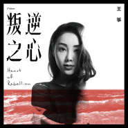

叛逆之心Heart of Rebellion
============================

|  |  |
| :--: | :-- |
| [ 叛逆之心Heart of Rebellion](https://emumo.xiami.com/album/507740653) | **艺人**: [王筝](../index.md) **语种**: 国语 **唱片公司**: 太合麦田 **发行时间**: 2015年01月08日 **专辑类别**: 录音室专辑 **专辑风格**: 电子舞曲 EDM / Electronic Dance Music, 国语流行 Mandarin Pop, 华语唱作人 Chinese Singer-Songwriter **播放数**: 2438493 **收藏数**: 1548 **评论数**: 194  |

## 简介

王筝《叛逆之心》正式发布 文艺女神蜕变之路  
  
太合麦田旗下签约创作才女王筝全新专辑《叛逆之心》正式面世。以清新文艺气质而被乐迷喜爱的王筝，在新专辑中展现了不同于以往的音乐决心，王筝说：“再不疯狂就老了，当了一辈子好孩子，我也想要表达我的另一面。”全新的音乐风格承载着王筝对音乐的探索和追求，呈现出更为开阔从容的音乐格局，这便是王筝叛逆之心所在。  
  
专辑中的首波主打《黑海》、《叛逆之心》是王筝音乐追逐之旅上的又一次突破，又一次涅槃重生，“他们说如果你，喜欢黑色的海，也许就不会怕，死去后的孤单”，“那些猜不透的迷都赤裸给你，我已经没有路可退，这一座城是我的一生，未来的惶恐，你是唯一的不可战胜”， 成长的积淀赋予了王筝完美演绎多种音乐风格的能力，无不透露出一种自由生长的试炼。  
  
《瘦了》和《而你呢》可称为姊妹篇，分别是女声独唱和男女对唱版本。这首歌，词曲由王筝一手包办，一气呵成。“你好像瘦了，头发变长的，从街角走来，看到我愣了” 是诉说幻想旧情人间许久未见心里的想念，始终未曾放下的牵挂；是一首关于你的记忆孤岛，是已经渐行渐远的你，对我再也无法靠岸的遗憾。《瘦了》如一个人的内心独白，自己对自己的呢喃。《而你呢》对唱两人交错的声线，有种孤单的酸涩感觉，萦绕脑海久久不散。  
  
在整张专辑的其他作品中，《旁观者》和《失忆症》是王筝加入太合麦田后推出的EP，也收录在这张专辑中；而《摩天轮》中说唱读白、《与世隔绝》中交互的美声及《漩涡》的情感展现无不彰显作品的良苦用心；另外，王筝包办了专辑的全部歌词创作，并包揽了《瘦了》、《绚烂》、《问候你》词曲创作，展现了其全面的音乐才华。  
  
专辑整体表现的电子律动，厚重的贝斯线条，外放的人声无一不在传达王筝成长的信息，不再局限于固有“好孩子”的温顺，王筝以内在叛逆的感情抒发和多元化的音乐魅力，构成了这一次由内及外的蜕变。

## 曲目

- [黑海](./507740653/mQNV3M50733.md)
- [叛逆之心](./507740653/U5PMol265b5.md)
- [与世隔绝](./507740653/xL8Us513554.md)
- [失忆症MV](./507740653/bqvtWFM39448.md)
- [摩天轮](./507740653/xL8Us6e0f3f.md)
- [瘦了](./507740653/xL8MIBa15c7.md)
- [而你呢](./507740653/mQNDxwdcf48.md)
- [旁观者](./507740653/U5NAtx265de.md)
- [绚烂](./507740653/xL8Us7cec70.md)
- [漩涡MV](./507740653/xL8Us8121e6.md)
- [问候你](./507740653/xL8Us9c1391.md)

## 评论

|  |  |  |
| :-- | :-- | :-- |
|  [虾米用户](https://emumo.xiami.com/u/4544) 我继续，你要随意 2018-03-21 22:37 赞(0) 踩(0) | 
略带学院派气质的转变让王筝摆脱了之前清新民谣的印记，从旋律到歌词都比原来的王筝深奥深邃和内敛很多。歌曲已不再是情爱小调的局限，而扩展到了对人生和岁月的感悟。虽然很多人说并不悦耳和上口，可我觉得这是一张应该静下心来听的唱片，旋律已然已经是次要的了。
 |
|  [虾米用户](https://emumo.xiami.com/u/10460752)  2017-10-27 23:33 赞(1) 踩(0) | 
王筝的蜕变就好像我们自己的成长。曾经青涩的爱情，如今回过头看来，有多少自己的幼稚愚蠢，有多少单纯执着，有多少逃不掉浮华的世界，还有多少残忍的现实与真相。我们不能停在原地，我们终要长大，对同一个人，同一份情感的认识也在心里慢慢变化，不论是你还是我。
 |
|  [虾米用户](https://emumo.xiami.com/u/266738102)  2017-05-09 13:09 赞(0) 踩(0) | 
为什么听不了  
 |
|  [虾米用户](https://emumo.xiami.com/u/201022104)  2016-09-26 23:40 赞(0) 踩(0) | 
666
 |
|  [虾米用户](https://emumo.xiami.com/u/605182) 人人都是精神病 2016-01-16 02:48 赞(0) 踩(0) | 
所以《瘦了》跟《而你呢》到底啥区别？为什么来两遍？
 |
|  [虾米用户](https://emumo.xiami.com/u/4145526)  2015-12-22 15:03 赞(0) 踩(0) | 
筝姐棒棒哒
 |
|  [虾米用户](https://emumo.xiami.com/u/843367)  2015-11-22 17:19 赞(0) 踩(0) | 
四星。打造精致的成人现代乐——讲真，踏踏实实做这种音乐的人也不是很多啦
 |
|  [虾米用户](https://emumo.xiami.com/u/10384607) 空山無人，水流花開。 2015-11-21 01:27 赞(0) 踩(0) | 
作为相似色调替代
 |
|  [虾米用户](https://emumo.xiami.com/u/24345242) 爱谁谁 2015-11-20 22:38 赞(0) 踩(0) | 

 |
|  [虾米用户](https://emumo.xiami.com/u/5755063) 月白白 2015-10-28 21:21 赞(0) 踩(0) | 
能听的也就是我们都是好孩子了，这首歌头一次听到就进了我的心里，忘不了了。剩下的也就剩下了，无病呻吟的感觉。
 |
|  [虾米用户](https://emumo.xiami.com/u/6932802)  2015-05-13 14:16 赞(0) 踩(0) | 
你是怎样做到的
 |
|  [虾米用户](https://emumo.xiami.com/u/4426984) 过眼云烟 2015-05-03 19:27 赞(0) 踩(0) | 
歌都差不多，都一个调调。
 |
|  [虾米用户](https://emumo.xiami.com/u/43835363) 所幸你看不见我表情，不知... 2015-04-24 09:49 赞(0) 踩(0) | 
时隔多年，她依然给我那么多的惊喜，当年的我喜欢她的好孩子，现在的我喜欢现在的她
 |
|  [虾米用户](https://emumo.xiami.com/u/25925960)  2015-04-02 15:48 赞(1) 踩(0) | 
从春风大神曲一路追到现在，怀念之前的王筝也喜欢现在得王筝。这张专辑简直太喜欢了
 |
|  [虾米用户](https://emumo.xiami.com/u/1659406) Look back. 2015-03-21 08:57 赞(1) 踩(0) | 
时隔多年王筝的专辑
 |
|  [虾米用户](https://emumo.xiami.com/u/3475541)  2015-03-20 13:40 赞(2) 踩(0) | 
失忆症最喜欢···太深刻了·······
 |
|  [虾米用户](https://emumo.xiami.com/u/8569424)  2015-03-08 17:56 赞(0) 踩(0) | 
有突破呀！
 |
|  [虾米用户](https://emumo.xiami.com/u/44649992)  2015-03-06 21:23 赞(0) 踩(0) | 
棒极了！！！继《没有人比我更爱你》之后又一张全部都喜欢的专辑！
 |
|  [虾米用户](https://emumo.xiami.com/u/3374486)  2015-03-05 19:15 赞(0) 踩(0) | 
加入了DnB和Dubstep的元素，虽然旋律依然薄弱，但是编曲确实有不少惊喜。
 |
|  [虾米用户](https://emumo.xiami.com/u/1736557)  2015-03-02 20:54 赞(0) 踩(0) | 
仓雁彬，想起了安又琪，尽管不完美，不过依然爱着
 |
|  [虾米用户](https://emumo.xiami.com/u/1126943)  2015-03-01 23:18 赞(0) 踩(0) | 
先尝后买 稍后给分儿:)。。
 |
|  [虾米用户](https://emumo.xiami.com/u/6790910) 做盐，做光。 2015-02-12 08:59 赞(0) 踩(0) | 
我工作日听的音乐几乎是循环《漩涡》。
 |
| ⇒ |  [虾米用户](https://emumo.xiami.com/u/38606543)  2015-02-12 20:15 赞(0) 踩(0) | 
谢谢你！
 |
|  [虾米用户](https://emumo.xiami.com/u/12695120) 周大福气 2015-02-04 13:00 赞(0) 踩(0) | 
～～
 |
|  [虾米用户](https://emumo.xiami.com/u/7831947)  2015-02-01 14:19 赞(0) 踩(0) | 
这张真的太好听了！
 |
|  [虾米用户](https://emumo.xiami.com/u/1162111)  2015-02-01 03:51 赞(0) 踩(0) | 
...
 |
|  [虾米用户](https://emumo.xiami.com/u/45548244)   2015-01-28 20:50 赞(0) 踩(0) | 
很好听  感觉不错
 |
|  [虾米用户](https://emumo.xiami.com/u/3589490)  2015-01-22 11:08 赞(0) 踩(0) | 
不可能永远留在青春里，不可能永远是那个单纯的女孩，不一样的变化，但一样的王筝！这张专辑的曲风变化丰富，但多数都很耐听，加上还是很有深度的词，值得推荐！
 |
|  [虾米用户](https://emumo.xiami.com/u/5411150)  2015-01-21 21:50 赞(0) 踩(0) | 
听了一遍，只喜欢《与世隔绝》和《失忆症》还有《问候你》。加入电几乎成了时下的潮流，可真的有加的必要么
 |
|  [虾米用户](https://emumo.xiami.com/u/13073595)  2015-01-18 12:35 赞(0) 踩(0) | 
挺不错
 |
|  [虾米用户](https://emumo.xiami.com/u/46146717) 甜蜜如初恋 2015-01-18 04:10 赞(1) 踩(0) | 
王筝我们爱你
 |
| ⇒ |  [虾米用户](https://emumo.xiami.com/u/38606543)  2015-02-12 20:15 赞(0) 踩(0) | 
谢谢呢！
 |
|  [虾米用户](https://emumo.xiami.com/u/3839849)  2015-01-16 20:52 赞(1) 踩(0) | 
我这半个月一直在听这张砖，只要跳过失忆症，瘦了，而你呢这三首。特别爽！尤其过马路的时候有种孤注一掷的感觉。
 |
|  [虾米用户](https://emumo.xiami.com/u/8537877) 生活不易，不如快乐。 2015-01-16 14:03 赞(1) 踩(0) | 
这个 专辑 确实好新颖   黑海融合了电子的 Drum&amp;amp;bass曲风 旁观者融合了电子的Dubstep曲风  很赞
 |
|  [虾米用户](https://emumo.xiami.com/u/45888668)  2015-01-15 20:02 赞(1) 踩(0) | 
很不错！好听。
 |
|  [虾米用户](https://emumo.xiami.com/u/6752430) 井盖被偷了 2015-01-14 19:40 赞(0) 踩(0) | 
哪里都能看到口水仗，这世界怎么了，能不能心平气和，客观尊重的说话呢？
 |
|  [虾米用户](https://emumo.xiami.com/u/3475541)  2015-01-14 19:06 赞(1) 踩(0) | 
失忆症好听哦··可以说很久没有在女声情歌里停留··········直到我听到这···········
 |
|  [虾米用户](https://emumo.xiami.com/u/4114839) Music is eve... 2015-01-14 13:16 赞(1) 踩(0) | 
听了几天 一直犹豫要不要发上来 还是喜欢王筝 爱是一种香
 |
|  [虾米用户](https://emumo.xiami.com/u/1169483)  2015-01-13 13:06 赞(0) 踩(0) | 
《我们都是好孩子》是口水歌？那哪些是纯正的？
 |
|  [虾米用户](https://emumo.xiami.com/u/27224237) 永远在寻找能唤醒我耳朵的... 2015-01-13 12:12 赞(0) 踩(0) | 
瘦子还是不错的
 |
|  [虾米用户](https://emumo.xiami.com/u/45621221) 卸载状态。 2015-01-13 02:20 赞(1) 踩(0) | 
唱片公司对包装这块儿，也是无所不用其极，歌手专辑依旧选择自主风向大打文艺牌，但文艺并不是一张掩饰粗劣的万能牌，不是故作空灵的做作唱腔也不是词儿填的好就自身贴金实至名归，王筝的唱功太过一般，且！出道时的那首我们都是好孩子，更让我笃定你只适合唱些低俗的口水歌，最后，请将文艺还给陈绮贞。
 |
|  [虾米用户](https://emumo.xiami.com/u/24964220)   2015-01-13 01:15 赞(0) 踩(0) | 
一直存在.默默无闻.然而我惊奇的发现了一个璀璨华丽的新开始.它在微微发亮.绽放的心意.会使人看到感受到.那种美妙值得眷恋.勇敢去开放不一样.那样不愧于世俗.不凡时光里的生命.
 |
|  [虾米用户](https://emumo.xiami.com/u/10173188)  2015-01-12 22:34 赞(0) 踩(0) | 
《黑海》很特别！
 |
|  [虾米用户](https://emumo.xiami.com/u/10811234) Love Mucic 2015-01-12 21:02 赞(0) 踩(0) | 
编曲还算不错 可带电的王筝还得慢慢适应下 亮点全砸在编曲上 词也一般 在口水乱街的华语市场算不错的砖 但和前作相比并不抢眼 甚至是倒退 现在专辑怎么都喜欢玩花的了 哎
 |
|  [虾米用户](https://emumo.xiami.com/u/4388348) wu 2015-01-12 15:13 赞(1) 踩(0) | 
现在什么歌都带电了 王筝改风格了 是好还是坏？ 我觉得还不错
 |
|  [虾米用户](https://emumo.xiami.com/u/7208075) 隐居修炼 2015-01-12 08:33 赞(1) 踩(0) | 
有才华·！！
 |
|  [虾米用户](https://emumo.xiami.com/u/29356145)  2015-01-12 03:30 赞(1) 踩(0) | 
电音的辽阔！
 |
|  [虾米用户](https://emumo.xiami.com/u/44551220)  2015-01-12 00:34 赞(1) 踩(0) | 
让让352
 |
|  [虾米用户](https://emumo.xiami.com/u/9967897)   2015-01-11 23:42 赞(1) 踩(0) | 
听多了觉得这张专辑很棒啊。
 |
|  [虾米用户](https://emumo.xiami.com/u/45916411)  2015-01-11 23:05 赞(1) 踩(0) | 
超级喜欢与世隔绝！
 |
|  [虾米用户](https://emumo.xiami.com/u/4229948)  2015-01-11 23:04 赞(0) 踩(0) | 
从好孩子的转变，时间在每个人的轨迹中，都留下了痕迹。一起成长的聆听。
 |
|  [虾米用户](https://emumo.xiami.com/u/395437)  2015-01-11 19:59 赞(0) 踩(0) | 
嗓子一如既往的好，音乐也有突破，封面差评！
 |
|  [虾米用户](https://emumo.xiami.com/u/14344008)   2015-01-11 16:48 赞(0) 踩(0) | 
还不错呀~虽然电子乐不那么成熟~
 |
|  [虾米用户](https://emumo.xiami.com/u/45691394) 我还没想好要写什么... 2015-01-11 14:37 赞(0) 踩(0) | 
喜欢了这么久的声音～
 |
|  [虾米用户](https://emumo.xiami.com/u/98348)  2015-01-11 14:09 赞(0) 踩(0) | 
第一首就好听到爆！！！
 |
|  [虾米用户](https://emumo.xiami.com/u/3839849)  2015-01-11 12:51 赞(0) 踩(0) | 
袁惟仁的乱入是个大败笔，而且词曲都和上一首一样，太讨厌了。《失忆症》《瘦了》这两首特别打乱苦心营造出的氛围，特别出戏。叛逆的还不够，宁愿少几首歌，多点《与世隔绝》这样的，才是个好专辑。
 |
|  [虾米用户](https://emumo.xiami.com/u/7786832) 我还没想好要写什么... 2015-01-11 11:31 赞(0) 踩(0) | 
这张专辑是开挂的感觉啊！很不错的呢。比以前那些口水歌好太多了
 |
|  [虾米用户](https://emumo.xiami.com/u/1690081)  2015-01-11 11:10 赞(0) 踩(0) | 
很棒啊，一点学院派的匠气都没有，叛逆的刚刚好！
 |
|  [虾米用户](https://emumo.xiami.com/u/6491765) 我只是个门外汉。 2015-01-10 20:51 赞(0) 踩(0) | 
总有人接受不了一个人的变化，殊不知这也许是这个人平时积累已久的厚积薄发。
 |
|  [虾米用户](https://emumo.xiami.com/u/13741755)  2015-01-10 18:38 赞(0) 踩(0) | 
好听
 |
|  [虾米用户](https://emumo.xiami.com/u/34669293)  2015-01-10 17:58 赞(0) 踩(0) | 
封面美爆了！！！！
 |
|  [虾米用户](https://emumo.xiami.com/u/12832915) 相见且欢娱 2015-01-10 17:40 赞(0) 踩(0) | 
除了专辑名“文艺”得过头，都挺好的。本来作品和音乐人就应该逐渐成长，比起之前的作品，这张有态度多了。开场《黑海》就表明这一张的灰色调和暗藏的能量。《瘦了》《失忆症》这些作品当然也有存在的必要。后半段的《漩涡》呼应《黑海》，是我最爱的一首。
 |
|  [虾米用户](https://emumo.xiami.com/u/45851116)  2015-01-10 16:05 赞(0) 踩(0) | 
很好听，声音很特別
 |
|  [虾米用户](https://emumo.xiami.com/u/9926785)  2015-01-10 16:03 赞(0) 踩(0) | 
喜欢
 |
|  [虾米用户](https://emumo.xiami.com/u/498364)  2015-01-10 14:58 赞(0) 踩(0) | 
这张比好孩子嗲多了..
 |
|  [虾米用户](https://emumo.xiami.com/u/35398542) 公众号：湾辟斯 2015-01-10 13:14 赞(0) 踩(0) | 
太苍凉
 |
|  [虾米用户](https://emumo.xiami.com/u/45262844)  2015-01-10 12:47 赞(0) 踩(0) | 
一直特别喜欢她 怎么一直火不起来呢
 |
|  [虾米用户](https://emumo.xiami.com/u/2086702)  2015-01-10 10:53 赞(0) 踩(0) | 
好孩子女神
 |
|  [虾米用户](https://emumo.xiami.com/u/37399999)   2015-01-10 07:40 赞(0) 踩(0) | 
专封和猫姐新专有点像啊''
 |
|  [虾米用户](https://emumo.xiami.com/u/41456187)  2015-01-10 07:11 赞(0) 踩(0) | 
好听
 |
|  [虾米用户](https://emumo.xiami.com/u/6491765) 我只是个门外汉。 2015-01-10 00:04 赞(0) 踩(0) | 
我觉得王筝本人应该很满意这张专辑。因为我感受到了这其中的爱。
 |
|  [虾米用户](https://emumo.xiami.com/u/1868181) 因早晚都共处便厌倦，回头... 2015-01-09 23:07 赞(0) 踩(0) | 
感觉还不错啊。是个不错的尝试，感觉声音和情感不是很适合这个风格，但是确实让我感到，这个是她吗？惊艳到了！歌曲没有让我很记得住的一首。也许过几天会有新的印象。
 |
|  [虾米用户](https://emumo.xiami.com/u/4544) 我继续，你要随意 2015-01-09 22:50 赞(0) 踩(0) | 
略带学院派气质的转变让王筝摆脱了之前清新民谣的印记，从旋律到歌词都比原来的王筝深奥深邃和内敛很多。歌曲已不再是情爱小调的局限，而扩展到了对人生和岁月的感悟。虽然很多人说并不悦耳和上口，可我觉得这是一张应该静下心来听的唱片，旋律已然已经是次要的了。
 |
|  [虾米用户](https://emumo.xiami.com/u/36378614) 我还没想好要写什么... 2015-01-09 21:06 赞(0) 踩(0) | 
有种大自然和民族风相结合的feel 听完整个人都很放松
 |
|  [虾米用户](https://emumo.xiami.com/u/16068426) 发现音乐 热爱生活 2015-01-09 19:02 赞(0) 踩(0) | 
喜欢王筝~
 |
|  [虾米用户](https://emumo.xiami.com/u/45813029)  2015-01-09 17:32 赞(0) 踩(0) | 
比以前更有味道了
 |
|  [虾米用户](https://emumo.xiami.com/u/69121)  2015-01-09 17:28 赞(0) 踩(0) | 
我们都是好孩子 ，在我看来算比较新的专辑，也根本不是王筝
 |
|  [虾米用户](https://emumo.xiami.com/u/24752567)   2015-01-09 16:18 赞(0) 踩(0) | 
没想到王筝的声音这么好听，和印象中那个《我们都是好孩子》完全不同 喜欢《失忆症》《瘦了》
 |
|  [虾米用户](https://emumo.xiami.com/u/18226145)  2015-01-09 12:55 赞(0) 踩(0) | 
还是《没有人比我更爱你》那张好听
 |
|  [虾米用户](https://emumo.xiami.com/u/7402157) 你先让我躺一会 2015-01-09 12:21 赞(0) 踩(0) | 
五花肉正片叠底
 |
|  [虾米用户](https://emumo.xiami.com/u/6801494)  2015-01-09 11:09 赞(0) 踩(0) | 
声音一直好听
 |
|  [虾米用户](https://emumo.xiami.com/u/72011)  2015-01-09 10:46 赞(0) 踩(0) | 
王筝这张新专辑很惊艳。。。！
 |
|  [虾米用户](https://emumo.xiami.com/u/16416789)  2015-01-09 09:15 赞(0) 踩(0) | 
稀饭
 |
|  [虾米用户](https://emumo.xiami.com/u/454506) 我还没想好要写什么... 2015-01-09 01:13 赞(0) 踩(0) | 
想念的聲音
 |
|  [虾米用户](https://emumo.xiami.com/u/10777356) 看电影 2015-01-08 21:58 赞(0) 踩(0) | 
不一样的风格，质量还是很高的。非常喜欢。谢谢老王
 |
|  [虾米用户](https://emumo.xiami.com/u/2514229) 爱我所爱，斐爱不可！ 2015-01-08 20:56 赞(0) 踩(0) | 
发行时间写错了，应是2015年01月08日。
 |
|  [虾米用户](https://emumo.xiami.com/u/16282435)  2015-01-08 20:50 赞(0) 踩(0) | 
比以前的文艺气息少多了，但是歌曲编曲词曲等方面的精致程度还是没有丢失，唱功也不减当年《没有人比我更爱你》。从《春风》开始就没有让喜欢你的人失望过。
 |
|  [虾米用户](https://emumo.xiami.com/u/1603133)  2015-01-08 20:38 赞(7) 踩(0) | 
如果你还停留在#我们都是好孩子，那就请你把播放器关了吧:）
 |
| ⇒ |  [虾米用户](https://emumo.xiami.com/u/69121)  2015-01-09 17:27 赞(0) 踩(0) | 
我们都是好孩子 ，在我看来算新专辑，也根本不是王筝
 |
| ⇒ |  [虾米用户](https://emumo.xiami.com/u/6491765) 我只是个门外汉。 2015-01-09 23:55 赞(0) 踩(0) | 
～～～抓到你啦
 |
| ⇒ |  [虾米用户](https://emumo.xiami.com/u/8569124) 爱歌 2015-01-10 23:51 赞(0) 踩(0) | 
没听过好孩子的路过……
 |
|  [虾米用户](https://emumo.xiami.com/u/857290)  2015-01-08 18:44 赞(0) 踩(0) | 
很腻害，从没有让我失望过
 |
|  [虾米用户](https://emumo.xiami.com/u/650450)  2015-01-08 18:37 赞(0) 踩(0) | 
值得一听的一张专辑
 |
|  [虾米用户](https://emumo.xiami.com/u/36395702) 很神秘 2015-01-08 18:03 赞(0) 踩(0) | 
听了几首，专辑质量很高~  这个时代，真的要对还在认真做“专辑”的音乐人致敬！！  坚持！！！
 |
|  [虾米用户](https://emumo.xiami.com/u/6362734)   2015-01-08 17:56 赞(0) 踩(0) | 
《To ex 精选》
 |
|  [虾米用户](https://emumo.xiami.com/u/3341571) 暂无签名~ 2015-01-08 17:53 赞(0) 踩(0) | 
我们都是好孩子 我一直以为是网络歌曲
 |
|  [虾米用户](https://emumo.xiami.com/u/6733300) 誩 2015-01-08 16:15 赞(0) 踩(0) | 
虽然近年流行电子，但是，总之听着好烦躁好没好感呢
 |
|  [虾米用户](https://emumo.xiami.com/u/3441582)  2015-01-08 14:46 赞(0) 踩(0) | 
赞!!!
 |
|  [虾米用户](https://emumo.xiami.com/u/9607086) 让世界是世界 2015-01-08 14:39 赞(0) 踩(0) | 
过这么久 我其实好了 听到你名字也不难过 不再愣住 不再发呆躲开 不再偷偷把手指攥破
 |
|  [虾米用户](https://emumo.xiami.com/u/10106301) 我还没想好要写什么... 2015-01-08 14:31 赞(2) 踩(0) | 
學院派每一個音符處理都無懈可擊 深邃動聽……
 |
|  [虾米用户](https://emumo.xiami.com/u/573642) 常不在线请留言 2015-01-08 14:14 赞(1) 踩(0) | 
算是跟着这女歌手长大的。她的声音这么多年都是最棒的。从《我们都是好孩子》到这张。没想到这位人妻、妈妈会出一张这么倔强的专辑。不评价女人在这阶段表现出要强是不是好的现象。对于她的尝试是值得一赞的。不假思索给5星。
 |
|  [虾米用户](https://emumo.xiami.com/u/1936781) 华语流行音乐乐评人，新浪... 2015-01-08 13:23 赞(1) 踩(0) | 
很棒
 |
|  [虾米用户](https://emumo.xiami.com/u/2628538) 外星人请带我走． 2015-01-08 13:22 赞(1) 踩(0) | 
不小气的王筝何以为王筝呢 听完了 也许是我还停留在那个年纪里没有出来吧
 |
|  [虾米用户](https://emumo.xiami.com/u/30025279)  2015-01-08 13:03 赞(0) 踩(0) | 
是这听听，西安老乡。
 |
|  [虾米用户](https://emumo.xiami.com/u/45763613)  2015-01-08 12:30 赞(1) 踩(0) | 
显示，下载失败，为什么不能下载，这不明显骗钱嘛！！！！！！！
 |
|  [虾米用户](https://emumo.xiami.com/u/45081390)  2015-01-08 11:55 赞(0) 踩(0) | 
变了风格，但是仍旧很棒，人总会成长。不要一直给她贴好孩子的标签。这样的王筝也非常吸引人！
 |
|  [虾米用户](https://emumo.xiami.com/u/37140400)  2015-01-08 11:31 赞(0) 踩(0) | 
cool
 |
|  [虾米用户](https://emumo.xiami.com/u/4426984) 过眼云烟 2015-01-08 11:26 赞(1) 踩(0) | 
这张专辑有个问题，不知道大家发现没有，就是为啥每首歌都那么好听呢？
 |
|  [虾米用户](https://emumo.xiami.com/u/770169)  2015-01-08 11:21 赞(0) 踩(0) | 
制作人是谁？
 |
|  [虾米用户](https://emumo.xiami.com/u/2020377)  2015-01-08 10:45 赞(0) 踩(0) | 
全新专辑， 不谢 @有颜色的女青年
 |
|  [虾米用户](https://emumo.xiami.com/u/873681) 我还没想好要写什么... 2015-01-04 16:49 赞(0) 踩(0) | 
新歌哟
 |
|  [虾米用户](https://emumo.xiami.com/u/11409516) ⊙﹏⊙这个女人有点懒~！ 2015-01-04 10:02 赞(0) 踩(0) | 
失忆症不错
 |
| ⇒ |  [虾米用户](https://emumo.xiami.com/u/23804853)  2015-01-09 01:50 赞(0) 踩(0) | 

 |
|  [虾米用户](https://emumo.xiami.com/u/6403327) 作为一个水瓶座，必将以赢... 2015-01-04 08:59 赞(0) 踩(0) | 
好吧，我认了，您转型成功了好吧，快发全长专辑吧。
 |
|  [虾米用户](https://emumo.xiami.com/u/8418839) 我还没想好要写什么... 2015-01-04 01:27 赞(0) 踩(0) | 
和麦当娜新专辑重名了
 |
|  [虾米用户](https://emumo.xiami.com/u/6335745)  2015-01-03 22:23 赞(0) 踩(0) | 
Rebal Heart……
 |
|  [虾米用户](https://emumo.xiami.com/u/45613436)  2015-01-03 21:45 赞(1) 踩(0) | 
判若两人！
 |
|  [虾米用户](https://emumo.xiami.com/u/45592869)  2015-01-03 14:05 赞(0) 踩(0) | 
喜欢
 |
|  [虾米用户](https://emumo.xiami.com/u/6652575) mbz2006 2015-01-03 11:06 赞(0) 踩(0) | 
ok
 |
|  [虾米用户](https://emumo.xiami.com/u/9607086) 让世界是世界 2015-01-02 14:01 赞(0) 踩(0) | 
我让你看我的旧伤痕 这一座城是我的一生
 |
|  [虾米用户](https://emumo.xiami.com/u/55800) 用耳朵倾听生活 2015-01-02 10:38 赞(0) 踩(0) | 
我觉得很好听啊，我其实最喜欢的她以前的一首《春风》
 |
|  [虾米用户](https://emumo.xiami.com/u/42347) 寻找无双 2015-01-01 23:53 赞(0) 踩(0) | 
风格大变……
 |
|  [虾米用户](https://emumo.xiami.com/u/45540679)  2015-01-01 21:51 赞(0) 踩(0) | 
我生日
 |
|  [虾米用户](https://emumo.xiami.com/u/45535140)  2015-01-01 19:44 赞(0) 踩(0) | 
还好
 |
|  [虾米用户](https://emumo.xiami.com/u/45521728)  2015-01-01 13:30 赞(0) 踩(0) | 
hehe
 |
|  [虾米用户](https://emumo.xiami.com/u/31605452) 清宵易惆怅 2015-01-01 13:26 赞(0) 踩(0) | 
更喜欢她和袁惟仁合唱的“而你呢”那版，感觉更符合歌词的意境
 |
|  [虾米用户](https://emumo.xiami.com/u/614163)  2015-01-01 01:22 赞(0) 踩(0) | 
这是正式版封面了吧？很好看啊
 |
|  [虾米用户](https://emumo.xiami.com/u/5861289)   2014-12-31 19:11 赞(0) 踩(0) | 
瘦了不错
 |
|  [虾米用户](https://emumo.xiami.com/u/45059609)  2014-12-31 12:55 赞(0) 踩(0) | 
棒棒的！！！
 |
|  [虾米用户](https://emumo.xiami.com/u/8244559)  2014-12-31 11:22 赞(0) 踩(0) | 
******
 |
|  [虾米用户](https://emumo.xiami.com/u/650450)  2014-12-29 21:00 赞(0) 踩(0) | 
意外的很喜欢
 |
|  [虾米用户](https://emumo.xiami.com/u/37765074)  2014-12-29 19:42 赞(0) 踩(0) | 
有着同样的经历同样的环境同样的际遇啊，清淡幸福的忧伤
 |
|  [虾米用户](https://emumo.xiami.com/u/8244559)  2014-12-29 13:59 赞(0) 踩(0) | 
******
 |
|  [虾米用户](https://emumo.xiami.com/u/6262946)  2014-12-28 17:38 赞(1) 踩(0) | 
这封面……再配合歌名，让我脑洞大开： 王筝在街上偶遇小胖老师，扬起头一脸傲娇的说：“好久不见，我《瘦了》，《而你呢》？” 老师黑线：“才瘦了多少斤就得瑟成什么样了……”
 |
|  [虾米用户](https://emumo.xiami.com/u/478527) 好想跟衣服在洗衣机里滚 2014-12-28 14:40 赞(0) 踩(0) | 
反而觉得后两首比较好，最近国内也开始玩debstep（旁观者）
 |
|  [虾米用户](https://emumo.xiami.com/u/2965368) 如果声音不记得 2014-12-28 11:57 赞(1) 踩(0) | 
以前挺喜欢她的，不过现在这些歌，不能说差，但是连一遍都没办法听完。
 |
|  [虾米用户](https://emumo.xiami.com/u/7708737)   2014-12-27 17:41 赞(1) 踩(0) | 
不觉得自己歌名取得很bitch吗,没听,目测很难听
 |
| ⇒ |  [虾米用户](https://emumo.xiami.com/u/13329011) 我准备向虾米砸重金了 2014-12-27 20:47 赞(0) 踩(0) | 
她唱的不是自己瘦了
 |
|  [虾米用户](https://emumo.xiami.com/u/25925960)  2014-12-27 12:07 赞(0) 踩(0) | 
瘦了主歌太好听，对比显得副歌有点弱
 |
|  [虾米用户](https://emumo.xiami.com/u/43638840)   2014-12-27 10:34 赞(0) 踩(0) | 
瘦了最好听
 |
|  [虾米用户](https://emumo.xiami.com/u/43638840)   2014-12-27 10:33 赞(0) 踩(0) | 
满好的，但是不太喜欢故意在歌词里加一两句英文
 |
|  [虾米用户](https://emumo.xiami.com/u/43638840)   2014-12-27 10:32 赞(1) 踩(0) | 
满棒的
 |
|  [虾米用户](https://emumo.xiami.com/u/44470912)  2014-12-27 01:21 赞(0) 踩(0) | 
歌词比较真实，嗓音不觉得矫情，只是传唱估计不行。只能说第一次听不错。
 |
|  [虾米用户](https://emumo.xiami.com/u/33372574) 旧事如天远 2014-12-26 23:45 赞(0) 踩(0) | 
一直很喜欢她哦
 |
|  [虾米用户](https://emumo.xiami.com/u/45326766)  2014-12-26 22:36 赞(0) 踩(0) | 
啊啊饿
 |
|  [虾米用户](https://emumo.xiami.com/u/32186612) 喂羊吃草 2014-12-26 17:46 赞(0) 踩(0) | 
很舒服，听着！
 |
|  [虾米用户](https://emumo.xiami.com/u/10853749)  2014-12-26 11:50 赞(0) 踩(0) | 
失忆症还是那年初三操场上我们都是好孩子的感觉
 |
|  [虾米用户](https://emumo.xiami.com/u/45161704)  2014-12-26 06:33 赞(1) 踩(0) | 
如果不去听而单看歌词 会觉得这歌定然矫情无比 然而王筝的演唱极富有坚定和力量感 是一首十分值得一听的好歌
 |
|  [虾米用户](https://emumo.xiami.com/u/3223128)  2014-12-26 00:39 赞(12) 踩(0) | 
看了下评论，个人觉得现在的王筝不也很好嘛 王筝其实变成熟了，想起读书时学校总是放那首“我们都是好孩子”时，那时的她你能感觉到青春的青涩吧，今晚听到她的另外一首歌“一直”，当时并不知道是她唱的，后来搜索了一下才知道是她唱的，现在又看到她刚刚出的专辑，听着“失忆症”才发现其实时间都在每一个人身上留下了痕迹与记忆吧……其实这又有什么不好呢
 |
|  [虾米用户](https://emumo.xiami.com/u/43058797)  2014-12-25 22:37 赞(0) 踩(0) | 
瘦了 而你呢
 |
|  [虾米用户](https://emumo.xiami.com/u/42347) 寻找无双 2014-12-25 21:58 赞(0) 踩(0) | 
还是那个调调~
 |
|  [虾米用户](https://emumo.xiami.com/u/24828935) 一起儿悠闲听歌 2014-12-25 16:30 赞(0) 踩(0) | 
听王筝唱歌，每句都好像从心里发出，而不是嗓子，是那么容易打动我
 |
|  [虾米用户](https://emumo.xiami.com/u/7463172) My name is M... 2014-12-25 14:36 赞(1) 踩(0) | 
说hello听起来太low了
 |
| ⇒ |  [虾米用户](https://emumo.xiami.com/u/19462503) 内部装修中…… 2014-12-25 15:37 赞(0) 踩(0) | 
看到你的评论耳边响起了hello hello how low
 |
| ⇒ |  [虾米用户](https://emumo.xiami.com/u/44262838)   2014-12-25 22:42 赞(0) 踩(0) | 
<q><b>素光馀景说：</b></q>
 |
| ⇒ |  [虾米用户](https://emumo.xiami.com/u/7390764)  2014-12-26 22:30 赞(0) 踩(0) | 
哈楼啊～
 |
| ⇒ |  [虾米用户](https://emumo.xiami.com/u/7463172) My name is M... 2014-12-29 21:40 赞(0) 踩(0) | 
<q><b>素光馀景说：</b></q>
 |
|  [虾米用户](https://emumo.xiami.com/u/9607086) 让世界是世界 2014-12-25 14:00 赞(0) 踩(0) | 
一句就唱到了回忆~
 |
|  [虾米用户](https://emumo.xiami.com/u/9607086) 让世界是世界 2014-12-25 13:55 赞(0) 踩(0) | 
一首虐心的歌，听着听着就陷入回忆~
 |
|  [虾米用户](https://emumo.xiami.com/u/2219156)  2014-12-25 13:47 赞(0) 踩(0) | 
封面以为是安又琪。。。。
 |
| ⇒ |  [虾米用户](https://emumo.xiami.com/u/6630660) 猜赢涂口红… 2014-12-25 13:49 赞(0) 踩(0) | 
你不是一个人！！！！！
 |
| ⇒ |  [虾米用户](https://emumo.xiami.com/u/42325985)  2014-12-25 13:53 赞(0) 踩(0) | 
<q><b>哈哈哈哈哈哈哈哈哈哈哈皮说：</b></q>
 |
| ⇒ |  [虾米用户](https://emumo.xiami.com/u/35714790)  2015-01-02 11:48 赞(0) 踩(0) | 
<q><b>yibiabia说：</b></q>
 |
| ⇒ |  [虾米用户](https://emumo.xiami.com/u/2219156)  2015-01-04 17:23 赞(0) 踩(0) | 
<q><b>DJ女婶♛✨⚈้̤͡ ˌ说：</b></q>
 |
| ⇒ |  [虾米用户](https://emumo.xiami.com/u/1736557)  2015-03-02 21:12 赞(0) 踩(0) | 
米奇表示不觉得像，倒是仓雁彬是当初琪琪第一张专辑的作曲
 |
|  [虾米用户](https://emumo.xiami.com/u/6733300) 誩 2014-12-25 13:16 赞(0) 踩(0) | 
王筝是要抛砖么？
 |
|  [虾米用户](https://emumo.xiami.com/u/1960984)   2014-12-25 12:27 赞(13) 踩(0) | 
有些人说得自己好像永远只有18岁。 好像可以一直只吃一盘青菜，好像自己永远穿着开裆裤、背带裤。那个能保持多年不变，永远17 8岁的人是饶雪漫。。。你若听不到她的变化就回去听《没有人比我更爱你》和《顿悟》好了。音乐本来就是一种情绪或心情，高兴或是怎样的。周杰伦都没唱一辈子双截棍，宋祖英也没唱一辈子辣妹子....没别的意思.
 |
| ⇒ |  [虾米用户](https://emumo.xiami.com/u/6409521)  2014-12-30 09:09 赞(0) 踩(0) | 
我是真心烦人说“她变了，再也不爱她了”或者“这么多年都没有变化，完全没有进步”之类的话
 |
|  [虾米用户](https://emumo.xiami.com/u/313539)  2014-12-25 12:01 赞(0) 踩(0) | 
瘦了王筝 肥了老狼
 |
|  [虾米用户](https://emumo.xiami.com/u/4868422)  2014-12-25 11:54 赞(0) 踩(0) | 
你还是好孩子吗？
 |
|  [虾米用户](https://emumo.xiami.com/u/286201)  2014-12-25 11:20 赞(0) 踩(0) | 
“瘦了? 不要太瘦哦~~~~”
 |
|  [虾米用户](https://emumo.xiami.com/u/3069378) 你从海上来 2014-10-07 15:56 赞(0) 踩(0) | 
歌其实不错，但只是因为你是王筝，忽然从创作才女变成都市怨妇，这个落差有点接受不了。
 |
|  [虾米用户](https://emumo.xiami.com/u/31149525) 耶诞快乐. 2014-08-15 18:54 赞(0) 踩(0) | 
想到那个动漫了
 |
|  [虾米用户](https://emumo.xiami.com/u/1737846)  2014-08-14 23:38 赞(0) 踩(0) | 
怎么了？你忘了我们都是好孩子了？
 |
|  [虾米用户](https://emumo.xiami.com/u/27172589)  2014-08-13 21:06 赞(0) 踩(0) | 
棒
 |
|  [虾米用户](https://emumo.xiami.com/u/10414103) 爱音乐爱朱婷！ 2014-08-13 17:25 赞(0) 踩(0) | 
风格变了，嗓音变了。。转型后不习惯啊。。
 |
|  [虾米用户](https://emumo.xiami.com/u/29103340)  2014-08-13 14:35 赞(0) 踩(0) | 
写得词怨妇心态更重了，不容易
 |
|  [虾米用户](https://emumo.xiami.com/u/6403327) 作为一个水瓶座，必将以赢... 2014-08-13 09:03 赞(0) 踩(0) | 
受不了，我要我那小姑娘
 |
|  [虾米用户](https://emumo.xiami.com/u/5406378) 暂无签名~ 2014-08-12 23:03 赞(0) 踩(0) | 
声音干净穿透灵魂，歌词引起失恋人的共鸣，
 |
|  [虾米用户](https://emumo.xiami.com/u/4896642) 已识乾坤大，犹怜草木青 2014-08-12 13:48 赞(0) 踩(0) | 
真的唉嗓音变了-_-||...
 |
|  [虾米用户](https://emumo.xiami.com/u/2108369)   2014-08-12 10:04 赞(0) 踩(0) | 
这首不错
 |
|  [虾米用户](https://emumo.xiami.com/u/3882826)  2014-08-12 09:10 赞(0) 踩(0) | 
嗓音变了，成熟多了，这是倒仓结束的意思吗？
 |
|  [虾米用户](https://emumo.xiami.com/u/38571) Gypsy 2014-08-12 01:05 赞(0) 踩(0) | 
感谢这样温暖的声音一直陪我
 |
|  [虾米用户](https://emumo.xiami.com/u/9241041) 愿世界和平 爸妈长命百岁... 2014-08-11 21:17 赞(0) 踩(0) | 
喜欢王筝的歌。简单纯净，细腻的情感娓娓道来，从西安爱情故事开始至这首失爱的悲情歌，是一种成熟与历经许多后感情的进一步升华。赞，很抓耳很走心。今天听第一遍。
 |
|  [虾米用户](https://emumo.xiami.com/u/37667363) 我已疯骚，无忧亦无惧。 2014-08-11 20:36 赞(0) 踩(0) | 
每次都能被筝姐歌词打动，继续支持。
 |
|  [虾米用户](https://emumo.xiami.com/u/866560) 不要变 永远都不要变 2014-08-11 20:00 赞(1) 踩(0) | 
听了好几遍，感觉有点被歌词戳中，再来支持一下。确实很好。
 |
|  [虾米用户](https://emumo.xiami.com/u/37483509)  2014-08-11 19:13 赞(0) 踩(0) | 
一直很喜欢王筝
 |
|  [虾米用户](https://emumo.xiami.com/u/573642) 常不在线请留言 2014-08-11 18:28 赞(0) 踩(0) | 
有点惊讶结婚生子后的王筝还会写出这样的歌词。。。对于未婚的失爱男女来说这确实是一首治愈之作。王筝的嗓音柔美舒缓，当之无愧是治愈系歌手。只是还是会觉得怪怪的，毕竟我更期待听到她对生活的描述。
 |
|  [虾米用户](https://emumo.xiami.com/u/5035279) 喜乐人生 2014-08-11 16:43 赞(0) 踩(0) | 
对爱过去与未来彻骨的诠释，支持！
 |
|  [虾米用户](https://emumo.xiami.com/u/8244559)  2014-08-11 15:41 赞(0) 踩(0) | 
******
 |
|  [虾米用户](https://emumo.xiami.com/u/2332621) SELF. 2014-08-11 15:24 赞(0) 踩(0) | 
期待新专，很期待。
 |
|  [虾米用户](https://emumo.xiami.com/u/2332621) SELF. 2014-08-11 15:23 赞(0) 踩(0) | 
很棒
 |
|  [虾米用户](https://emumo.xiami.com/u/39558561) 永远的风小筝 2014-08-11 15:15 赞(0) 踩(0) | 
超好听~
 |
|  [虾米用户](https://emumo.xiami.com/u/866560) 不要变 永远都不要变 2014-08-11 15:12 赞(0) 踩(0) | 
抢占沙发，听听看咯~~~
 |
