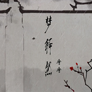

香香
============================

|  |  |
| :--: | :-- |
| [ 香香](https://i.xiami.com/xiangxiang) | **地区**: China 中国大陆 **风格**: 国语流行 Mandarin Pop **播放数**: 22979093 **粉丝数**: 4229 **评论数**: 174  |

## 档案

香香，原名王瑾玫，1984年6月14日出生，内地著名歌手，也是第一位通过网络走红的歌手。1999年以特招生身份进入湖南师范大学攻读音乐专业，入学不到一学期因厌倦学校的美声唱法及民族唱法而退学，后在中央某报驻长沙记者站从事打印工作。 
香香平时酷爱上网和唱歌，并且经常在网上发表自己翻唱歌曲的录音。 她在2004年时凭一曲《老鼠爱大米》以及《猪之歌》于互联网上传遍两岸三地，引起多家唱片公司关注，最终与北京飞乐公司签约，2005年1月推出了个人首张专辑《猪之歌》。 
从一个网络歌手走来，香香一直是那样的随性，她是想颠覆一切传统的精灵，又是带着欢笑唱歌的天使。双子座的女孩，让我们感受到了一份对音乐的执着！ 
姓名：王瑾玫 
艺名：香香 
出生地点：湖南省常德市桃源县 
出生日期：1984年6月14日 
星座：双子座 
血型：B 
身高：163 
体重：44 
兴趣：唱歌 
家中成员：爸爸、妈妈、奶奶 
语言能力：国语、粤语 
个性：外向 
优点：乐观、不记仇 
最崇拜的演员：周星驰 
最喜欢的颜色：黑白、淡绿 
最喜欢的节日：情人节 
最喜欢的季节：秋天 
最喜欢的国家：中国 
自己身体最满意的部位：眉毛 
最喜欢的动物：狗狗

## 专辑

| 名称 | 语种 | 唱片公司 | 发行时间 | 专辑类别 | 专辑风格 |
| :--: | :-- | :-- | :-- | :-- | :-- |
| [ 与风吟](./albums/2104371857.md) | 国语 | 鼎跃科技 | 2018年12月15日 | EP, 单曲 | 国语流行 Mandarin Pop, 古风 GuFeng Music |
| [ 巡疆](./albums/2104260805.md) | 国语 | 唐嘉文化 | 2018年11月22日 | EP, 单曲 | 国语流行 Mandarin Pop |
| [ 梦释然](./albums/2104061378.md) | 国语 | 博轩音乐 | 2018年09月28日 | EP, 单曲 |  |
| [ 胭脂烙魂](./albums/2103754913.md) | 国语 | 青春繁花 | 2018年06月25日 | EP, 单曲 | 国语流行 Mandarin Pop |
| [ 老鼠爱大米 (2017版)](./albums/2102802884.md) | 国语 | 百纳娱乐 | 2017年07月26日 | EP, 单曲 |  |
| [ 落差](./albums/2102778712.md) | 国语 | 百纳娱乐 | 2017年07月07日 | EP, 单曲 | 国语流行 Mandarin Pop |
| [ 炫爱](./albums/2100385722.md) | 国语 | 博轩音乐 | 2016年09月01日 | EP, 单曲 |  |
| [ 牙仙的魔法](./albums/2100244410.md) | 国语 | 烽凰文化 | 2015年12月07日 | EP, 单曲 |  |
| [ 牙仙](./albums/2100218126.md) | 国语 | 烽凰文化 | 2015年10月13日 | EP, 单曲 |  |
| [ 如果心酸](./albums/1413516907.md) | 国语 | 天浩盛世 | 2014年10月20日 | EP, 单曲 |  |
| [ 白鹭](./albums/710423369.md) | 国语 | 天浩盛世 | 2014年09月24日 | EP, 单曲 | 国语流行 Mandarin Pop |
| [ 落单的恋人](./albums/557190.md) | 国语 | 天浩盛世 | 2013年08月20日 | EP, 单曲 | 国语流行 Mandarin Pop |
| [ 彩虹天使](./albums/380965.md) | 国语 | 华友经纪 | 2010年05月14日 | EP, 单曲 | 国语流行 Mandarin Pop |
| [ 万人迷](./albums/327702.md) | 国语 | 飞乐唱片 | 2009年04月29日 | EP, 单曲 | 国语流行 Mandarin Pop |
| [ 恭喜恭喜](./albums/33405.md) | 国语 | 飞乐唱片 | 2008年01月14日 | 合集, 杂锦 | 国语流行 Mandarin Pop |
| [ 情人雨](./albums/2105021371.md) | 国语 | 龙乐世纪 | 2008年01月01日 | EP, 单曲 |  |
| [ 命运·为了爱](./albums/293107.md) | 国语 | 飞乐唱片 | 2007年02月08日 | 精选集 | 国语流行 Mandarin Pop |
| [ 香飘飘 舞曲混音大碟Scent of Love](./albums/12241.md) | 国语 | 华友飞乐 | 2006年08月30日 | 录音室专辑 | 流行舞曲 Dance-Pop, 国语流行 Mandarin Pop |
| [ 香飘飘Scent of Love](./albums/12242.md) | 国语 | 飞乐唱片 | 2006年06月14日 | 录音室专辑 | 国语流行 Mandarin Pop |
| [ 哎呦哎呦对不起](./albums/12243.md) | 国语 | 飞乐唱片 | 2005年10月11日 | 合集, 杂锦 | 国语流行 Mandarin Pop |
| [ 猪之歌](./albums/12245.md) | 国语 | 飞乐唱片 | 2005年01月25日 | 录音室专辑 | 国语流行 Mandarin Pop |

## 评论

|  |  |  |
| :-- | :-- | :-- |
|  [虾米用户](https://emumo.xiami.com/u/446336651)  2021-01-27 16:00 赞(0) 踩(0) | 
我对你最喜欢的也是眉毛
 |
|  [虾米用户](https://emumo.xiami.com/u/422929932) 伯益嘬嘴训鸟兽 低频振声... 2020-11-07 23:17 赞(0) 踩(0) | 
眉毛不错 鼻子最佳
 |
|  [虾米用户](https://emumo.xiami.com/u/10653350)  2020-10-18 09:51 赞(0) 踩(0) | 
太可惜了，被学校耽误了，最后成了打印员
 |
|  [虾米用户](https://emumo.xiami.com/u/278171035)   2020-07-05 23:50 赞(0) 踩(0) | 
岁月如梭啊！
 |
|  [虾米用户](https://emumo.xiami.com/u/277541791) 24/7 2020-05-09 14:59 赞(0) 踩(0) | 
我也是常德的
 |
|  [虾米用户](https://emumo.xiami.com/u/363190913)  2020-05-02 22:34 赞(1) 踩(0) | 
非主流歌手！！
 |
|  [虾米用户](https://emumo.xiami.com/u/342803130)  2020-01-14 01:49 赞(2) 踩(0) | 
收到你的消息，不知道是系统自动回复还是你的互动？
 |
|  [虾米用户](https://emumo.xiami.com/u/345479403) 怕相思，已相思，轮到相思... 2019-11-26 18:53 赞(1) 踩(0) | 
є(･Θ･｡)э猪猪┑(￣Д ￣)┍  怪我咯
 |
|  [虾米用户](https://emumo.xiami.com/u/319688150) 愿经典不被遗忘 2019-11-14 18:45 赞(0) 踩(0) | 

 |
|  [虾米用户](https://emumo.xiami.com/u/418192982)  2019-08-24 20:52 赞(0) 踩(0) | 
香香的声音好听，有的时候让人回到从前
 |
|  [虾米用户](https://emumo.xiami.com/u/358104299) 悲观的唯心存在现实解构虚... 2019-06-24 11:25 赞(0) 踩(0) | 
12414
 |
|  [虾米用户](https://emumo.xiami.com/u/424409589)  2019-06-16 10:31 赞(0) 踩(0) | 
还行，但没tfboys唱的好。
 |
| ⇒ |  [虾米用户](https://emumo.xiami.com/u/38071625)  2019-12-10 03:58 赞(0) 踩(0) | 
人家唱歌的时候你那三小只还在吃奶呢  
 |
| ⇒ |  [虾米用户](https://emumo.xiami.com/u/227860052)   2020-08-24 22:48 赞(0) 踩(0) | 
鸡你太美
 |
|  [虾米用户](https://emumo.xiami.com/u/203240572) 千载勋名身外影   百年... 2019-06-11 19:27 赞(0) 踩(0) | 
 
 |
|  [虾米用户](https://emumo.xiami.com/u/116331532)  2019-05-29 23:14 赞(0) 踩(0) | 
好听
 |
|  [虾米用户](https://emumo.xiami.com/u/412747286)  2019-05-11 17:10 赞(1) 踩(0) | 
永远支持你，
 |
|  [虾米用户](https://emumo.xiami.com/u/362039716) 我还没想好要写什么... 2019-03-13 13:05 赞(0) 踩(0) | 
我没收藏啊
 |
|  [虾米用户](https://emumo.xiami.com/u/420521274) 音乐让生活更美好！ 2019-03-08 15:07 赞(5) 踩(0) | 
《猪之歌》真的是一首不错的歌，有些歌可以忘记，但是这首就不行！
 |
|  [虾米用户](https://emumo.xiami.com/u/412452774) 音乐可以给我带来快乐 2019-01-22 19:18 赞(0) 踩(0) | 
虾米音乐学不会只有MTV 没有单独播放用天猫精灵听不了
 |
|  [虾米用户](https://emumo.xiami.com/u/293692544) 你敢给我说话吗？我咬你 2019-01-14 11:13 赞(1) 踩(0) | 
好听
 |
|  [虾米用户](https://emumo.xiami.com/u/406445362)  2018-10-29 17:46 赞(2) 踩(0) | 
喜欢香香唱的歌 
 |
|  [虾米用户](https://emumo.xiami.com/u/833450) 仁义礼智信 2018-08-21 13:35 赞(3) 踩(0) | 
第一次认识是在蔡依林的音乐不断歌友会 她唱骑士精神里的rap 当时还觉得这个女生有点酷
 |
|  [虾米用户](https://emumo.xiami.com/u/374780498)  2018-06-22 18:06 赞(3) 踩(0) | 
美女，你干嘛整容，以前挺好看的
 |
|  [虾米用户](https://emumo.xiami.com/u/374670730)  2018-06-05 01:43 赞(3) 踩(0) | 
希望香姐越唱越红，能带给粉丝们更多好听的歌曲，努力加油，永远支持你！
 |
|  [虾米用户](https://emumo.xiami.com/u/323987299)  2018-04-19 21:24 赞(2) 踩(0) | 

 |
|  [虾米用户](https://emumo.xiami.com/u/353204555) 爱丽丝&幂蜂&羊毛&千纸... 2018-03-08 13:56 赞(2) 踩(0) | 

 |
|  [虾米用户](https://emumo.xiami.com/u/347754909)  2018-02-05 09:33 赞(1) 踩(0) | 
只要听到这首歌就想跳舞
 |
|  [虾米用户](https://emumo.xiami.com/u/343823917) 李昊民歌歌手，混血跨国恋 2018-01-10 17:37 赞(1) 踩(0) | 
谢谢香香姐为我唱的歌
 |
|  [虾米用户](https://emumo.xiami.com/u/309667177)  2018-01-09 15:48 赞(1) 踩(0) | 

 |
|  [虾米用户](https://emumo.xiami.com/u/7876820)  2017-12-26 12:48 赞(2) 踩(0) | 
好
 |
|  [虾米用户](https://emumo.xiami.com/u/29915677)  2017-11-11 21:23 赞(1) 踩(0) | 
我才发现她阳历和我一天 
 |
|  [虾米用户](https://emumo.xiami.com/u/8384826) 再见，虾米，谢谢！ 2017-10-27 23:26 赞(2) 踩(0) | 
好像记得她叫徐瑾玫，小时候在江苏教育频道看过她的访谈，还有她妈妈
 |
|  [虾米用户](https://emumo.xiami.com/u/329787489)  2017-10-13 01:08 赞(1) 踩(0) | 
香香的歌也蛮好听的，超喜欢听
 |
|  [虾米用户](https://emumo.xiami.com/u/328965847)  2017-10-12 08:16 赞(3) 踩(0) | 
好歌手投了破公司
 |
|  [虾米用户](https://emumo.xiami.com/u/321411283)  2017-08-25 09:57 赞(3) 踩(0) | 
在吗
 |
| ⇒ |  [虾米用户](https://emumo.xiami.com/u/7390764)  2017-09-18 15:07 赞(0) 踩(0) | 
哈哈哈哈哈哈哈哈哈～～～～～～～雷劈一般的笑点～
 |
|  [虾米用户](https://emumo.xiami.com/u/2653030) 好音乐共享群 2017-08-16 17:02 赞(0) 踩(0) | 
好音乐聆听经典【华语百强歌手之香香】
 |
|  [虾米用户](https://emumo.xiami.com/u/2653030) 好音乐共享群 2017-08-16 17:02 赞(0) 踩(0) | 
唱《痛苦的网恋》的香香不知是哪个鬼
 |
|  [虾米用户](https://emumo.xiami.com/u/311253866)  2017-08-15 15:28 赞(0) 踩(0) | 
 听不到  
 |
| ⇒ |  [虾米用户](https://emumo.xiami.com/u/361964735)  2018-04-30 10:27 赞(0) 踩(0) | 
你是不是王俊凯^_^
 |
|  [虾米用户](https://emumo.xiami.com/u/37995595)  2017-08-12 08:54 赞(1) 踩(0) | 
好歌手
 |
|  [虾米用户](https://emumo.xiami.com/u/101322) 不怎么听歌了 2017-07-30 09:31 赞(3) 踩(0) | 
感觉香香素质还不错呀 可惜了没好公司
 |
|  [虾米用户](https://emumo.xiami.com/u/313262270)   2017-07-19 00:46 赞(0) 踩(0) | 
怎么没有恋歌
 |
|  [虾米用户](https://emumo.xiami.com/u/311961144)  2017-07-14 11:58 赞(3) 踩(0) | 
学不会更好听
 |
| ⇒ |  [虾米用户](https://emumo.xiami.com/u/322435672)  2017-09-16 11:13 赞(0) 踩(0) | 
可惜我听不了
 |
|  [虾米用户](https://emumo.xiami.com/u/9275661) 给我一只喵～ 2017-05-23 17:30 赞(0) 踩(0) | 
香飘飘~
 |
|  [虾米用户](https://emumo.xiami.com/u/9275661) 给我一只喵～ 2017-05-23 17:30 赞(0) 踩(0) | 
香飘飘~
 |
|  [虾米用户](https://emumo.xiami.com/u/291604822)  2017-05-21 11:51 赞(0) 踩(0) | 
香香唱的歌可真好听&amp;hellip;       
 |
|  [虾米用户](https://emumo.xiami.com/u/292625885)  2017-04-30 19:06 赞(1) 踩(0) | 
太棒了！么么哒
 |
|  [虾米用户](https://emumo.xiami.com/u/290347678) 走自己的路，让别人说去吧... 2017-04-25 20:19 赞(0) 踩(0) | 
。。。。。。
 |
|  [虾米用户](https://emumo.xiami.com/u/282254946)  2017-03-21 20:11 赞(0) 踩(0) | 
好好听
 |
|  [虾米用户](https://emumo.xiami.com/u/278006614)  2017-03-17 18:35 赞(0) 踩(0) | 
生日0K
 |
|  [虾米用户](https://emumo.xiami.com/u/278006614)  2017-03-17 18:35 赞(0) 踩(0) | 
香香唱歌的吗
 |
|  [虾米用户](https://emumo.xiami.com/u/256812470)  2017-02-01 19:12 赞(0) 踩(0) | 
。。。。。。
 |
|  [虾米用户](https://emumo.xiami.com/u/256812470)  2017-02-01 19:12 赞(0) 踩(0) | 
？？？
 |
|  [虾米用户](https://emumo.xiami.com/u/153590924) 我没有办法为你开满天花瓣 2016-12-08 00:20 赞(0) 踩(0) | 
冬日的星愿真的好难听。。听多了觉得
 |
|  [虾米用户](https://emumo.xiami.com/u/224942264)  2016-10-09 22:37 赞(0) 踩(0) | 
喜欢
 |
|  [虾米用户](https://emumo.xiami.com/u/74361542) 暂无签名~ 2016-07-28 19:25 赞(4) 踩(0) | 
香香唱半妖倾城里面的恋歌，好好听的
 |
|  [虾米用户](https://emumo.xiami.com/u/200545006)  2016-07-13 17:48 赞(0) 踩(0) | 
头像好丑
 |
|  [虾米用户](https://emumo.xiami.com/u/200545006)  2016-07-13 17:48 赞(0) 踩(0) | 
真难听
 |
|  [虾米用户](https://emumo.xiami.com/u/191067863)  2016-06-17 21:11 赞(0) 踩(0) | 
我好喜欢香你的哥歌(⊙o⊙)哦
 |
|  [虾米用户](https://emumo.xiami.com/u/10413482)  2016-02-25 21:18 赞(2) 踩(0) | 
初见爱已晩，什么时候可以在虾米下
 |
|  [虾米用户](https://emumo.xiami.com/u/111177048)  2016-02-10 22:43 赞(0) 踩(0) | 
好听歌声好靓
 |
|  [虾米用户](https://emumo.xiami.com/u/90604746)   2015-12-29 18:59 赞(0) 踩(0) | 
歌很好听，人长得不好看
 |
|  [虾米用户](https://emumo.xiami.com/u/88212114)  2015-12-19 18:43 赞(0) 踩(0) | 
我是你的忠实粉丝。我喜欢听你唱的歌。
 |
|  [虾米用户](https://emumo.xiami.com/u/73646048)  2015-12-04 12:11 赞(0) 踩(0) | 
了0﹉哦哦￧…！！挺
 |
|  [虾米用户](https://emumo.xiami.com/u/573666) 良朋現已失散許多年，但見... 2015-11-20 04:28 赞(1) 踩(0) | 
1999年以特招生身份进入湖南师范大学攻读音乐专业，入学不到一学期因厌倦学校的美声唱法及民族唱法而退学——哈哈，这个履历有点意思
 |
| ⇒ |  [虾米用户](https://emumo.xiami.com/u/73646048)  2015-12-04 12:11 赞(0) 踩(0) | 
mddmW AMTAJ
 |
|  [虾米用户](https://emumo.xiami.com/u/55193074) 还想说啥！听个歌也不开心... 2015-09-19 20:11 赞(2) 踩(0) | 
我觉得她的齐刘海不错哦！
 |
|  [虾米用户](https://emumo.xiami.com/u/2130049) 流尽年华 洗净铅华 2015-08-10 09:04 赞(82) 踩(0) | 
我姓朱，那首猪之歌害死我了......
 |
| ⇒ |  [虾米用户](https://emumo.xiami.com/u/17536204) 自己选的路，跪着也得走下... 2017-07-29 19:37 赞(0) 踩(0) | 
笑死我了
 |
| ⇒ |  [虾米用户](https://emumo.xiami.com/u/346849806)  2018-03-31 14:11 赞(0) 踩(0) | 

 |
| ⇒ |  [虾米用户](https://emumo.xiami.com/u/248268439)  未曾有一事 被无常吞 ... 2018-10-07 07:07 赞(0) 踩(0) | 
看看评论
 |
| ⇒ |  [虾米用户](https://emumo.xiami.com/u/352946313) 朋友们，虾米音乐就要和我... 2019-12-07 12:55 赞(0) 踩(0) | 
好多人身边有一头猪  
 |
| ⇒ |  [虾米用户](https://emumo.xiami.com/u/341025760)  2020-04-15 17:16 赞(0) 踩(0) | 
jjh         
 |
| ⇒ |  [虾米用户](https://emumo.xiami.com/u/341025760)  2020-04-15 17:16 赞(0) 踩(0) | 
                                              我的
 |
| ⇒ |  [虾米用户](https://emumo.xiami.com/u/341025760)  2020-04-15 17:17 赞(0) 踩(0) | 
<q><b>531226799说：</b></q>
 |
| ⇒ |  [虾米用户](https://emumo.xiami.com/u/341025760)  2020-04-15 17:18 赞(0) 踩(0) | 
<q><b>531226799说：</b></q>
 |
|  [虾米用户](https://emumo.xiami.com/u/45557664)  2015-08-01 18:02 赞(0) 踩(0) | 
[手势鼓掌香香唱的太好听了 
 |
|  [虾米用户](https://emumo.xiami.com/u/39665089) 暂无签名~ 2015-07-31 22:10 赞(2) 踩(0) | 
童年啊
 |
| ⇒ |  [虾米用户](https://emumo.xiami.com/u/45557664)  2015-08-01 18:05 赞(0) 踩(0) | 
说的太好了
 |
|  [虾米用户](https://emumo.xiami.com/u/53555091) 对于五线谱的质疑？！ 2015-07-26 21:34 赞(0) 踩(0) | 
当年上学时 无聊在家听着猪之歌这首歌的磁带 现在就在想啊 当年怎么没有去买猪之歌的CD啊 呵呵
 |
|  [虾米用户](https://emumo.xiami.com/u/3882720) 人生如逆旅 我亦是行人 2015-07-18 22:11 赞(14) 踩(0) | 
也算是网络歌手鼻祖了。。且也有那么几首歌火过
 |
|  [虾米用户](https://emumo.xiami.com/u/2174863) 无想 2015-06-10 15:45 赞(1) 踩(0) | 
美腿公主那个。。无力吐槽
 |
|  [虾米用户](https://emumo.xiami.com/u/39788841)  . 2015-06-09 22:57 赞(0) 踩(0) | 
lium
 |
|  [虾米用户](https://emumo.xiami.com/u/43888261)  2015-05-31 15:53 赞(0) 踩(0) | 
摇篮曲很好听！
 |
|  [虾米用户](https://emumo.xiami.com/u/2174863) 无想 2015-05-19 17:22 赞(1) 踩(0) | 
这两天我就在想香香的艺人封面到底像谁，今天想出来了，很像王菀之啊！！尤其是眼睛。
 |
|  [虾米用户](https://emumo.xiami.com/u/8588602) 陈永信 2015-05-04 16:47 赞(0) 踩(0) | 

 |
|  [虾米用户](https://emumo.xiami.com/u/48319001)  2015-03-20 15:51 赞(0) 踩(0) | 
充值成会员了，全部高品质的，哪个月有新歌，哪个月充值，！_  ！
 |
|  [虾米用户](https://emumo.xiami.com/u/41464588) 暂无签名~ 2015-02-13 17:36 赞(2) 踩(0) | 
给香妹子表个白，十几岁时就喜欢你了。
 |
| ⇒ |  [虾米用户](https://emumo.xiami.com/u/6742729) 地球人 2015-03-11 18:32 赞(0) 踩(0) | 
顶这位哥们
 |
|  [虾米用户](https://emumo.xiami.com/u/1989208)  2015-02-13 10:16 赞(0) 踩(0) | 
唱功还可以啊。发现她是211院校毕业的，瞧不上她的人里有几个也是211毕业的？
 |
|  [虾米用户](https://emumo.xiami.com/u/13088981)  2015-02-09 22:03 赞(0) 踩(0) | 
虽然唱了很多口水歌，实力其实不错的
 |
|  [虾米用户](https://emumo.xiami.com/u/44853480)  2015-01-14 10:16 赞(0) 踩(0) | 
喜欢这首摇篮曲，好听
 |
|  [虾米用户](https://emumo.xiami.com/u/32139011)  2015-01-09 23:06 赞(2) 踩(0) | 
香香给我太多的记忆 转眼已经10年了 每次听到猪之歌都感觉自己又年轻一回 那时候刚刚在步入海南的路上 第一次出远门的儿郎 充满了对世界最远大的抱负和憧憬 同时又富着更多的稚嫩 一些美好的开始 大学的青春 想想每个人都是只有那么一次 属于年轻和青春 现在我们都大了 应该做长大该做的事情 有太多的青春都只拿来回忆 一切属于轮回
 |
| ⇒ |  [虾米用户](https://emumo.xiami.com/u/45557664)  2015-08-01 18:13 赞(0) 踩(0) | 

 |
|  [虾米用户](https://emumo.xiami.com/u/25923000)  2014-12-25 23:14 赞(0) 踩(0) | 
三月
 |
|  [虾米用户](https://emumo.xiami.com/u/4018863)  2014-12-19 13:00 赞(2) 踩(0) | 
唱得一般般，但是听着舒服。。。不太喜欢那些唱歌很卖弄技巧的歌手
 |
|  [虾米用户](https://emumo.xiami.com/u/42282006)  2014-11-28 19:51 赞(0) 踩(0) | 
一如既往的喜欢塔的每一首歌
 |
|  [虾米用户](https://emumo.xiami.com/u/36646226) 粉丝多也许是我有魅力吧 2014-11-13 22:50 赞(2) 踩(0) | 
其实香香的歌一直不错，走网络的路线，level比较LOW而已  ❤
 |
|  [虾米用户](https://emumo.xiami.com/u/4271551) 用心听歌是一种境界。 2014-11-13 20:59 赞(0) 踩(0) | 
虽然香香是网络歌手发迹，但是她音色和猪之歌之后都有好听的佳作，大家就别再纠结猪之歌啦。。。多关注她后期的进步，其实她挺坚持也听努力的！
 |
|  [虾米用户](https://emumo.xiami.com/u/41727006)  2014-10-25 03:30 赞(0) 踩(0) | 
力  挺  ing  ⊙▽⊙
 |
|  [虾米用户](https://emumo.xiami.com/u/8384826) 再见，虾米，谢谢！ 2014-10-22 00:11 赞(0) 踩(0) | 
额，不好意思，是王瑾玫，一直在音乐，赞一个
 |
|  [虾米用户](https://emumo.xiami.com/u/38567299)  2014-10-21 23:55 赞(0) 踩(0) | 
很好听了
 |
|  [虾米用户](https://emumo.xiami.com/u/38567299)  2014-10-21 23:54 赞(0) 踩(0) | 

 |
|  [虾米用户](https://emumo.xiami.com/u/5207571) 暂无签名~ 2014-10-21 09:40 赞(0) 踩(0) | 
加油，坚持下去
 |
| ⇒ |  [虾米用户](https://emumo.xiami.com/u/8384826) 再见，虾米，谢谢！ 2014-10-22 00:31 赞(0) 踩(0) | 
^_^，盐城的大虾，很巧啊
 |
| ⇒ |  [虾米用户](https://emumo.xiami.com/u/5207571) 暂无签名~ 2014-10-24 01:53 赞(0) 踩(0) | 
<q><b>钢弦说：</b></q>
 |
|  [虾米用户](https://emumo.xiami.com/u/10410204) ? 2014-10-20 18:55 赞(0) 踩(0) | 
十多年前造她的…她现在也奔四了吧…？
 |
| ⇒ |  [虾米用户](https://emumo.xiami.com/u/8937656) 听... 2014-10-27 23:52 赞(0) 踩(0) | 
才30
 |
| ⇒ |  [虾米用户](https://emumo.xiami.com/u/10410204) ? 2014-11-13 21:29 赞(0) 踩(0) | 
<q><b>这个杀手有点热说：</b></q>
 |
|  [虾米用户](https://emumo.xiami.com/u/12235628) 虾米，你要早点回家 2014-09-30 01:07 赞(0) 踩(0) | 
什么是中国音超
 |
|  [虾米用户](https://emumo.xiami.com/u/9926785)  2014-09-09 09:20 赞(0) 踩(0) | 
喜欢
 |
|  [虾米用户](https://emumo.xiami.com/u/6491765) 我只是个门外汉。 2014-07-07 14:14 赞(0) 踩(0) | 
觉得她和毛慧合作的作品有些古风的我很喜欢。
 |
|  [虾米用户](https://emumo.xiami.com/u/13012891) Musicneverce... 2014-06-22 11:21 赞(0) 踩(0) | 
d d
 |
|  [虾米用户](https://emumo.xiami.com/u/4135931) 拂了一身还满 2014-06-07 19:57 赞(24) 踩(0) | 
好多歌都蛮好听的。。清新脱俗（不要提什么猪之歌了啦）
 |
|  [虾米用户](https://emumo.xiami.com/u/8305765) 人体ETC 2014-04-24 21:44 赞(21) 踩(0) | 
头像PS的吧。
 |
|  [虾米用户](https://emumo.xiami.com/u/25922783) 异乡人 2014-04-24 21:11 赞(0) 踩(0) | 
太可爱了长得，歌也就好听了
 |
|  [虾米用户](https://emumo.xiami.com/u/319923) 也爱做小日日啊 2014-04-03 21:18 赞(1) 踩(0) | 
不屑炫技，想唱就唱。要炫技就去挤破头音乐高考（众多脑残真人唱秀）。。。
 |
| ⇒ |  [虾米用户](https://emumo.xiami.com/u/2174863) 无想 2015-03-09 09:48 赞(0) 踩(0) | 
啊，日日小（想）做爱也（耶）。
 |
|  [虾米用户](https://emumo.xiami.com/u/3439548) long for us 2014-02-17 15:11 赞(0) 踩(0) | 
当年可喜欢了 ···
 |
|  [虾米用户](https://emumo.xiami.com/u/23533523) pok網路夜貓 2014-02-04 22:52 赞(0) 踩(0) | 
1452145
 |
|  [虾米用户](https://emumo.xiami.com/u/24351935)  2014-01-21 07:29 赞(1) 踩(0) | 
声线优美，动听而不失韵味
 |
|  [虾米用户](https://emumo.xiami.com/u/3664254) 看我的唐诗剑法 2013-12-17 09:50 赞(0) 踩(0) | 
中国音超只参加一场就淘汰了，还是全场最低分，太伤心了
 |
| ⇒ |  [虾米用户](https://emumo.xiami.com/u/5025444) 泉水姐姐的迷弟 2013-12-18 21:01 赞(0) 踩(0) | 
她唱功的确不是强项但我很喜欢她
 |
|  [虾米用户](https://emumo.xiami.com/u/1182761) 松任谷由实的迷弟 2013-12-16 01:01 赞(0) 踩(0) | 
要去参加中国音超了。希望能唱《夏虫》
 |
|  [虾米用户](https://emumo.xiami.com/u/1700002) V5_ORZZZZZ 2013-11-20 15:31 赞(0) 踩(0) | 
猪之歌
 |
|  [虾米用户](https://emumo.xiami.com/u/3039463)  2013-11-11 20:56 赞(0) 踩(0) | 
******
 |
| ⇒ |  [虾米用户](https://emumo.xiami.com/u/5025444) 泉水姐姐的迷弟 2013-11-18 00:27 赞(0) 踩(0) | 
香香有很多很棒的作品 听听看排行榜245678
 |
|  [虾米用户](https://emumo.xiami.com/u/25041521)  2013-10-21 18:58 赞(0) 踩(0) | 
一直很喜欢，今后也喜欢。
 |
|  [虾米用户](https://emumo.xiami.com/u/5954486)  2013-10-19 18:50 赞(0) 踩(0) | 
祖籍是一个县的啊，虽然从来没去过湖南
 |
|  [虾米用户](https://emumo.xiami.com/u/3877240)  2013-08-20 00:17 赞(0) 踩(0) | 
聲音好聽^^
 |
|  [虾米用户](https://emumo.xiami.com/u/785251)  2013-08-08 09:41 赞(2) 踩(0) | 
喜欢香香的青春,柔和,还有陪我度过岁月的那些歌...
 |
|  [虾米用户](https://emumo.xiami.com/u/1400536)  2013-06-14 20:55 赞(0) 踩(0) | 
Happy birthday. Wish you are forever young and beautiful.
 |
|  [虾米用户](https://emumo.xiami.com/u/1649092) 山水有清音 2013-06-14 13:17 赞(0) 踩(0) | 
祝香香生日快乐！！！
 |
|  [虾米用户](https://emumo.xiami.com/u/15250411)  2013-06-14 11:36 赞(0) 踩(0) | 
生日快乐
 |
|  [虾米用户](https://emumo.xiami.com/u/11684729) 崩坏の节操 2013-06-14 11:16 赞(0) 踩(0) | 
生日快乐
 |
|  [虾米用户](https://emumo.xiami.com/u/13384331)  2013-06-14 11:11 赞(0) 踩(0) | 
生日快乐
 |
|  [虾米用户](https://emumo.xiami.com/u/4952798) 将来的你，一定会感谢现在 2013-06-14 10:56 赞(0) 踩(0) | 
生日快乐！
 |
|  [虾米用户](https://emumo.xiami.com/u/1182761) 松任谷由实的迷弟 2013-06-14 10:48 赞(0) 踩(0) | 
夏虫~生日快乐
 |
|  [虾米用户](https://emumo.xiami.com/u/11421752)  2013-05-10 10:43 赞(0) 踩(0) | 
好聽
 |
|  [虾米用户](https://emumo.xiami.com/u/279085) 痛觉の残留 2013-03-27 21:41 赞(0) 踩(0) | 
好怀念的歌。。。
 |
|  [虾米用户](https://emumo.xiami.com/u/11622021)  2013-03-17 13:27 赞(0) 踩(0) | 
后期的不错。刚出名那会微村儿啊
 |
|  [虾米用户](https://emumo.xiami.com/u/1182761) 松任谷由实的迷弟 2013-03-10 11:44 赞(0) 踩(0) | 
我始终是喜欢你，喜欢那首《夏虫》
 |
|  [虾米用户](https://emumo.xiami.com/u/2589737)  2013-02-07 16:59 赞(0) 踩(0) | 
好
 |
|  [虾米用户](https://emumo.xiami.com/u/3606998)   2013-02-03 13:26 赞(0) 踩(0) | 
ht ~~
 |
|  [虾米用户](https://emumo.xiami.com/u/9329626)  2012-12-28 18:18 赞(0) 踩(0) | 
豬~
 |
|  [虾米用户](https://emumo.xiami.com/u/1537042) 暂无签名~ 2012-10-17 19:38 赞(0) 踩(0) | 
回忆中那些欢声笑语！
 |
|  [虾米用户](https://emumo.xiami.com/u/1546360) 就是如此清新脱俗 2012-09-24 19:38 赞(0) 踩(0) | 
香姐怎么能不粉。哈哈哈
 |
| ⇒ |  [虾米用户](https://emumo.xiami.com/u/9104118)  2012-10-08 14:40 赞(0) 踩(0) | 
0.0
 |
| ⇒ |  [虾米用户](https://emumo.xiami.com/u/1546360) 就是如此清新脱俗 2012-10-08 18:10 赞(0) 踩(0) | 
<q><b>半梦浮生醉烟雨说：</b></q>
 |
|  [虾米用户](https://emumo.xiami.com/u/7124323) 坚韧的一株草 2012-06-29 14:08 赞(0) 踩(0) | 
香香的声音
 |
|  [虾米用户](https://emumo.xiami.com/u/2692136)  2012-06-14 12:54 赞(0) 踩(0) | 
生日快乐~
 |
|  [虾米用户](https://emumo.xiami.com/u/2204233) 生命是一次旅行 2012-06-14 12:31 赞(0) 踩(0) | 
生日快乐～
 |
|  [虾米用户](https://emumo.xiami.com/u/8255110)  2012-06-14 10:07 赞(0) 踩(0) | 
生日快乐！
 |
|  [虾米用户](https://emumo.xiami.com/u/4952798) 将来的你，一定会感谢现在 2012-06-14 09:13 赞(1) 踩(0) | 
生日快乐！
 |
|  [虾米用户](https://emumo.xiami.com/u/3389673) 音乐爱好的人 2012-05-14 10:26 赞(0) 踩(0) | 
ok
 |
|  [虾米用户](https://emumo.xiami.com/u/8190783) 我还没想好要写什么... 2012-03-08 16:23 赞(0) 踩(0) | 
+1
 |
|  [虾米用户](https://emumo.xiami.com/u/3924372)  2012-03-03 20:48 赞(0) 踩(0) | 
喜欢她的声音和她的长相~~
 |
|  [虾米用户](https://emumo.xiami.com/u/4930938)  2012-02-28 10:59 赞(0) 踩(0) | 
小香
 |
|  [虾米用户](https://emumo.xiami.com/u/7909558)  2012-02-11 21:48 赞(0) 踩(0) | 
好听！
 |
|  [虾米用户](https://emumo.xiami.com/u/4160046) 把时间花在对的人！ 2011-10-27 23:10 赞(0) 踩(0) | 
哈哈~~~~~~
 |
| ⇒ |  [虾米用户](https://emumo.xiami.com/u/3445829) cynki 2012-02-18 23:58 赞(0) 踩(0) | 
哈你妈
 |
| ⇒ |  [虾米用户](https://emumo.xiami.com/u/4160046) 把时间花在对的人！ 2012-02-20 11:15 赞(0) 踩(0) | 
<q><b>cynki0924说：</b></q>
 |
|  [虾米用户](https://emumo.xiami.com/u/1557833) 看客。 2011-07-17 19:53 赞(0) 踩(0) | 
居然很好听。。。。
 |
|  [虾米用户](https://emumo.xiami.com/u/2502245)  2011-05-14 20:39 赞(0) 踩(0) | 
那年网络歌曲刚开始泛滥的时候，我还是在绝望的高三生活中..............
 |
| ⇒ |  [虾米用户](https://emumo.xiami.com/u/4160046) 把时间花在对的人！ 2011-10-27 23:10 赞(0) 踩(0) | 
那是什么时候的~~~~03年的吗!
 |
| ⇒ |  [虾米用户](https://emumo.xiami.com/u/2502245)  2011-10-29 09:46 赞(0) 踩(0) | 
<q><b>你知道你很帅吗说：</b></q>
 |
|  [虾米用户](https://emumo.xiami.com/u/3846875)  2011-05-10 21:14 赞(0) 踩(0) | 
，
 |
|  [虾米用户](https://emumo.xiami.com/u/3395113)   2011-04-29 19:27 赞(0) 踩(0) | 
好听
 |
|  [虾米用户](https://emumo.xiami.com/u/1907903)  2011-03-28 21:03 赞(0) 踩(0) | 
自然
 |
|  [虾米用户](https://emumo.xiami.com/u/522205) 一切很美，音為有你﹏ 2010-12-05 02:59 赞(0) 踩(0) | 
第一个关注到成名的网络翻唱歌手，一直支持。。。
 |
|  [虾米用户](https://emumo.xiami.com/u/63213) 懦弱囚禁人的内心 2010-06-01 12:07 赞(1) 踩(0) | 
Olé Olé 老乡支持一下啊
 |
