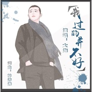

李明原
============================

|  |  |
| :--: | :-- |
| [ 李明原](https://i.xiami.com/hldh) | **播放数**: 2545784 **粉丝数**: 63 **评论数**: 5 **地区**: China 中国大陆 **风格**: 国语流行 Mandarin Pop  |

## 档案

大海，1977年1月28日出生于辽宁东港，典型的水瓶座性格的他自幼热爱音乐，苦于当时社会与家庭原因一直没能从事音乐事业。三十岁时自学音乐与后期。2014年在音乐人华允的帮助下用音乐将自己经历的感情故事写成歌曲，发行第一首单曲《十字街头》2015年选择背景离乡，到北京开始了艰难的北漂生活，有幸加入北京娱动力文化传媒有限公司，跟著名音乐人徐一鸣学习音乐，2016年又转站到了郑州，入职中鑫百灵(北京)影视投资有限公司，2017年经过多年积累的经验，凭借对音乐的热爱与执着。时隔三年与著名音乐创作人李想合作发行第二首单曲《如果当时能够勇敢》。后期制作推广人尝试做歌手，他虽然没有天籁之音，但他却有执着的心。带着梦想一直走在音乐的路上。

## 专辑

| 名称 | 语种 | 唱片公司 | 发行时间 | 专辑类别 | 专辑风格 |
| :--: | :-- | :-- | :-- | :-- | :-- |
| [ 孤独成伤](./albums/2108384015.md) | 国语 | 独立发行 | 2020年04月17日 | 录音室专辑 | 流行 Pop |
| [ 花腰姑娘](./albums/2105665343.md) | 国语 | 独立发行 | 2020年01月02日 | EP, 单曲 | 民谣流行 Folk Pop, 阳光流行 Sunshine Pop |
| [ 向真爱出发](./albums/2105219914.md) | 国语 |  | 2019年09月06日 | EP, 单曲 | 国语流行 Mandarin Pop |
| [ 路过的幸福](./albums/2104902370.md) | 国语 | 独立发行 | 2019年05月16日 | EP, 单曲 | 国语流行 Mandarin Pop |
| [ 男人海](./albums/2104369847.md) | 国语 | 看见文娱 | 2018年12月14日 | EP, 单曲 | 国语流行 Mandarin Pop |
| [ 回忆太心痛](./albums/2104176332.md) | 国语 | 看见文娱 | 2018年11月06日 | EP, 单曲 | 国语流行 Mandarin Pop |
| [ 我过的并不好](./albums/2104089986.md) | 国语 | 独立发行 | 2018年10月10日 | EP, 单曲 | 流行 Pop, 国语流行 Mandarin Pop |
| [ 转回身一无所有](./albums/2103729228.md) | 国语 | HIFIVE | 2018年06月04日 | EP, 单曲 | 国语流行 Mandarin Pop |
| [ 十年](./albums/2103522921.md) | 国语 | HIFIVE | 2018年02月09日 | EP, 单曲 | 流行 Pop, 国语流行 Mandarin Pop |
| [ 几人饮酒醉](./albums/2102915139.md) | 国语 | HIFIVE | 2017年11月06日 | EP, 单曲 | 流行 Pop, 国语流行 Mandarin Pop |
| [ 如果当时能够勇敢](./albums/2102813607.md) | 国语 | 独立发行 | 2017年08月14日 | EP, 单曲 | 国语流行 Mandarin Pop |

## 评论

|  |  |  |  |
| :-- | :-- | :-- | :-- |
|  [虾米用户](https://emumo.xiami.com/u/343982734)  2020-01-21 15:10 赞(0) 踩(0) | 
谢谢你和你的歌曲，非常棒。
 |
|  [虾米用户](https://emumo.xiami.com/u/293692544) 你敢给我说话吗？我咬你 2019-03-23 05:18 赞(1) 踩(0) | 
好听
 |
|  [虾米用户](https://emumo.xiami.com/u/293692544) 你敢给我说话吗？我咬你 2019-03-12 16:56 赞(1) 踩(0) | 
好听
 |
|  [虾米用户](https://emumo.xiami.com/u/16135450)  2016-09-22 23:01 赞(1) 踩(0) | 
db200
 |
|  [虾米用户](https://emumo.xiami.com/u/45653833)  2015-08-13 11:08 赞(3) 踩(0) | 
我刚入驻了虾米音乐人，欢迎大家来我的个人主页，收听我的最新音乐
 |
