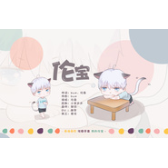

伦宝
============================

|  |  |
| :--: | :-- |
| [ 伦宝](https://emumo.xiami.com/album/2104156407) | **艺人**: [伦桑](../index.md) **语种**: 国语 **唱片公司**: 独立发行 **发行时间**: 2018年10月28日 **专辑类别**: 录音室专辑 **专辑风格**: 流行 Pop **播放数**: 16657 **收藏数**: 37 **评论数**: 7  |

## 简介

作词：伦桑&amp;Bye  
作曲：Bye  
演唱：伦桑  
后期：小吴太太  
画师：魑羽  
P V：南华  
美工：麦浮  
  
唱一首送给你们的歌 

## 曲目

## 评论

|  |  |  |
| :-- | :-- | :-- |
|  [虾米用户](https://emumo.xiami.com/u/426669652) 再见虾米。 2019-07-06 02:18 赞(1) 踩(0) | 
老大好甜！！爱了爱了
 |
|  [虾米用户](https://emumo.xiami.com/u/348077360) 南柯一梦，月翼之灵；落晚... 2019-02-03 00:57 赞(2) 踩(0) | 
爱伦桑大大～么么哒～
 |
|  [虾米用户](https://emumo.xiami.com/u/348077360) 南柯一梦，月翼之灵；落晚... 2019-02-03 00:54 赞(0) 踩(0) | 
爱邓伦大大～么么哒～
 |
|  [虾米用户](https://emumo.xiami.com/u/377708264) 死生契阔，与子成说 2019-02-02 13:07 赞(1) 踩(0) | 
很甜很美好
 |
|  [虾米用户](https://emumo.xiami.com/u/333200090)  2018-11-03 20:00 赞(0) 踩(0) | 
❤
 |
|  [虾米用户](https://emumo.xiami.com/u/328077208) 你是幸福理由 有你就无所... 2018-10-28 23:23 赞(0) 踩(0) | 
板凳 
 |
|  [虾米用户](https://emumo.xiami.com/u/73307718) 你是我不曾听闻的传奇 2018-10-28 18:03 赞(0) 踩(0) | 
该评论仅虾米用户可见！
 |
