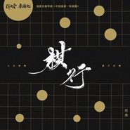

棋行
============================

|  |  |
| :--: | :-- |
| [ 棋行](https://emumo.xiami.com/album/2420330145) | **艺人**: [伦桑](../index.md) **语种**: 国语 **唱片公司**: 网易云音乐 **发行时间**: 2020年02月20日 **专辑类别**: EP, 单曲 **专辑风格**:  **播放数**: 3470 **收藏数**: 3 **评论数**: 0  |

## 简介

记起那年，父亲总教导我看棋。他说棋盘如人生的春秋，规劝我要谦卑隐忍，不可走单骑。但我却沉默抢攻，举兵不回头。后来我走过远方飘与荡，再回首父亲的规劝，才明白其深意，原来他早已在棋盘中为我指明路向，这棋行自然，车马士卒正是人生真相。  
  
温暖男声伦桑全新专辑《棋行》上线，歌曲融合中国象棋与父子关系双重主题，采用国语和粤语两个版本诠释，绵绵深情，娓娓道来。“棋行莽苍，父爱如山不能忘”，歌曲将人生哲理寓于棋道之中，同时也寄寓了对理想中父子关系的憧憬，句句倾情，声声倾意。  
  
棋盘左右，父子二人共赏壮丽棋局，品人生真相，和谐而温馨。

## 曲目

## 评论

