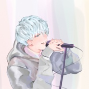
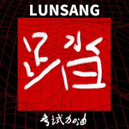
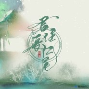
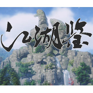
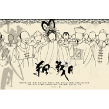
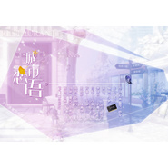
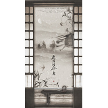

伦桑
============================

|  |  |
| :--: | :-- |
| [ 伦桑](https://i.xiami.com/lunsang) | **地区**: China 中国大陆 **风格**: 网络流行 Cyber Hit, 古风 GuFeng Music, 流行 Pop **播放数**: 22836337 **粉丝数**: 14804 **评论数**: 210  |

## 档案

伦桑，平纱落雁原创音乐团队歌手。2014年12月发行第一张古风原创专辑《桑道伦回》。声线温柔清润，擅长中低音。古风原创歌曲《天地缓缓》《烟雨行舟》《十方天下》《山有木兮》等作品广受好评，并为倩女幽魂，剑网3，天下3，龙之谷等网络游戏演唱歌曲。翻唱作品风格多变，驾驭各种曲风，《人质》《红颜》《告白气球》等翻唱作品个人特色鲜明。

## 专辑

| 名称 | 语种 | 唱片公司 | 发行时间 | 专辑类别 | 专辑风格 |
| :--: | :-- | :-- | :-- | :-- | :-- |
| [ 你看，一剪梅](./albums/5021358231.md) | 国语 | 独立发行 | 2020年08月26日 | 录音室专辑 | 古风 GuFeng Music, 流行说唱 Pop Rap |
| [ 锦衣飞鱼](./albums/5021058729.md) | 国语 | Live Music | 2020年07月09日 | EP, 单曲 | 网络流行 Cyber Hit |
| [ 踏](./albums/5021013475.md) | 国语 | 独立发行 | 2020年07月02日 | 录音室专辑 | 流行说唱 Pop Rap |
| [ 借画](./albums/5020902353.md) | 国语 | 桑海纪工作室 | 2020年06月17日 | EP, 单曲 |  |
| [ 枪声纪元](./albums/5020607355.md) | 国语 | 扭湃哇音乐 | 2020年05月14日 | 录音室专辑 | 流行 Pop |
| [ 春岁永年](./albums/5020678963.md) | 国语 |  | 2020年05月08日 | 录音室专辑 |  |
| [ 都赖你](./albums/2108242828.md) | 国语 | 独立发行 | 2020年03月25日 | 录音室专辑 | 流行 Pop |
| [ 棋行](./albums/2420330145.md) | 国语 | 网易云音乐 | 2020年02月20日 | EP, 单曲 |  |
| [ 君住长江尾](./albums/2106059456.md) | 国语 |  | 2020年02月08日 |  |  |
| [ 江湖鉴剑网3十周年原创](./albums/2104973351.md) | 国语 |  | 2019年07月05日 | 录音室专辑 | 古风 GuFeng Music |
| [ 不赖伦桑](./albums/2104874798.md) | 国语 |  | 2019年05月18日 | 录音室专辑 | 流行说唱 Pop Rap |
| [ 堪堪《宫廷计手游》周年主题曲](./albums/2104733208.md) | 国语 | 平纱落雁音乐团队 | 2019年03月24日 | 录音室专辑 | 古风 GuFeng Music |
| [ 伦望](./albums/2104549677.md) | 国语 | 独立发行 | 2019年01月28日 | 录音室专辑 | 流行 Pop |
| [ 杀风戮月](./albums/2104174171.md) | 国语 | 平纱落雁音乐团队 | 2018年11月04日 | 录音室专辑 | 古风 GuFeng Music |
| [ 伦宝](./albums/2104156407.md) | 国语 | 独立发行 | 2018年10月28日 | 录音室专辑 | 流行 Pop |
| [ 浮花宴春笺](./albums/2104084611.md) | 国语 | 独立发行 | 2018年10月08日 | 录音室专辑 | 古风 GuFeng Music |
| [ 天涯岁月曾多情](./albums/2103901877.md) | 国语 | 独立发行 | 2018年08月06日 | EP, 单曲 | 古风 GuFeng Music |
| [ 【魔道】不可谖兮](./albums/2103751686.md) | 国语 | 独立发行 | 2018年06月17日 | 录音室专辑 | 古风 GuFeng Music |
| [ 城市恋语](./albums/2103755289.md) | 国语 | 平纱落雁音乐团队 | 2018年02月14日 | 合集, 杂锦 | 流行 Pop |
| [ 王者修仙《王者修仙》同名手游主题曲](./albums/2103751940.md) | 国语 | 独立发行 | 2018年01月29日 | EP, 单曲 | 古风 GuFeng Music |
| [ 愿为同命鸟《琅琊榜：风起长林》手游同人曲](./albums/2103751946.md) | 国语 | 独立发行 | 2018年01月17日 | EP, 单曲 | 古风 GuFeng Music |
| [ 沧海仙途橙光OST](./albums/2103464613.md) | 国语 | 橙光游戏 | 2017年12月28日 | 录音室专辑 | 国语流行 Mandarin Pop, 古风 GuFeng Music, 中国风 China-Wave |
| [ 战字当先《血色苍穹》米岚角色歌](./albums/2103751950.md) | 国语 | 独立发行 | 2017年11月11日 | EP, 单曲 | 古风 GuFeng Music |
| [ 风起手游《风暴三国》主题曲](./albums/2103751916.md) | 国语 | 独立发行 | 2017年10月03日 | EP, 单曲 | 古风 GuFeng Music |
| [ 追光者](./albums/2102857589.md) | 国语 | 独立发行 | 2017年09月13日 | EP, 单曲 | 国语流行 Mandarin Pop |
| [ 理想三旬](./albums/2102857596.md) | 国语 | 独立发行 | 2017年09月01日 | EP, 单曲 |  |
| [ 暧昧](./albums/2102819809.md) | 国语 | 独立发行 | 2017年08月24日 | EP, 单曲 |  |
| [ 淬龙谣](./albums/2102819810.md) | 国语 | 独立发行 | 2017年08月09日 | EP, 单曲 | 古风 GuFeng Music |
| [ 戈止庙堂](./albums/2102819811.md) | 国语 | 独立发行 | 2017年07月27日 | EP, 单曲 | 古风 GuFeng Music |
| [ 暗恋](./albums/2102819812.md) | 国语 | 独立发行 | 2017年06月28日 | EP, 单曲 |  |
| [ 弦中歌](./albums/2102819814.md) | 国语 | 独立发行 | 2017年06月24日 | EP, 单曲 | 古风 GuFeng Music |
| [ 青春纪念册](./albums/2102819817.md) | 国语 | 独立发行 | 2017年06月01日 | EP, 单曲 |  |
| [ 神之印记](./albums/2102742104.md) | 国语 | 趣酷 | 2017年05月02日 | EP, 单曲 |  |
| [ 江山兄弟](./albums/2102742116.md) | 国语 | 独立发行 | 2017年04月23日 | EP, 单曲 |  |
| [ 湖光水色调](./albums/2100284180.md) | 国语 | 平纱落雁 | 2016年02月01日 | EP, 单曲 | 古风 GuFeng Music |
| [ 权御天下](./albums/729687179.md) | 国语 | 满汉全席音乐团队 | 2014年04月16日 | 合集, 杂锦 | 古风 GuFeng Music |

## 评论

|  |  |  |
| :-- | :-- | :-- |
|  [虾米用户](https://emumo.xiami.com/u/433206133)  2020-07-11 17:05 赞(1) 踩(0) | 
这声音，太️了  
 |
|  [虾米用户](https://emumo.xiami.com/u/342038768) pucikaka don... 2020-05-03 19:48 赞(1) 踩(0) | 

 |
|  [虾米用户](https://emumo.xiami.com/u/364031101)  2020-03-16 11:13 赞(3) 踩(0) | 
喜欢伦桑这件事真是一件很莫名其妙的一件事
 |
| ⇒ |  [虾米用户](https://emumo.xiami.com/u/322235515) 在音乐里澎湃，在玩笑里开... 2020-12-12 08:28 赞(0) 踩(0) | 
从不喜欢开始了解的人，往往都会不断有惊喜哦～
 |
|  [虾米用户](https://emumo.xiami.com/u/11792905) 只能做一个平凡而不无能的... 2020-03-14 08:15 赞(2) 踩(0) | 
烟雨行舟不是伦桑的吗？为啥突然一搜变女的单曲了？
 |
|  [虾米用户](https://emumo.xiami.com/u/6066908) 光芒与希望 *JazzH... 2020-01-30 17:59 赞(0) 踩(0) | 
有一种周华健的味道
 |
|  [虾米用户](https://emumo.xiami.com/u/427052962)  2019-12-22 17:44 赞(1) 踩(0) | 
曲风多变，可狂、可柔、刀光剑影中鉴儿女情长，笔墨丹青中见烟雨江南。
 |
|  [虾米用户](https://emumo.xiami.com/u/375311355) 猜猜头像是谁 2019-12-18 11:06 赞(2) 踩(0) | 
表白老大/比心~biu~❤️biu~❤️biu~❤️
 |
|  [虾米用户](https://emumo.xiami.com/u/430443463) 我还没想好要写什么... 2019-11-16 12:44 赞(1) 踩(0) | 
Very emotional voice!
 |
|  [虾米用户](https://emumo.xiami.com/u/5806757)  2019-10-30 05:36 赞(1) 踩(0) | 
找不到大神的小蛮腰    
 |
|  [虾米用户](https://emumo.xiami.com/u/306065331) 幸福开始有人选 2019-08-11 17:00 赞(1) 踩(0) | 
路过不要错过
 |
|  [虾米用户](https://emumo.xiami.com/u/290152075) 我现在没有....... 2019-08-02 14:39 赞(0) 踩(0) | 
呵呵
 |
|  [虾米用户](https://emumo.xiami.com/u/375235042) 了解痛苦吧！不了解痛苦的... 2019-07-26 23:16 赞(0) 踩(0) | 
好久没上线了，请原凉
 |
|  [虾米用户](https://emumo.xiami.com/u/426669652) 再见虾米。 2019-07-06 02:15 赞(2) 踩(0) | 
完了完了 自从听了老大的小蛮腰后无论听他的什么歌都会自动脑补小蛮腰了……我是被洗脑了吗……
 |
|  [虾米用户](https://emumo.xiami.com/u/425700064)   2019-06-11 21:42 赞(0) 踩(0) | 
请问怎么才能搞定我那个会打群架的妹妹呀？
 |
|  [虾米用户](https://emumo.xiami.com/u/406258776)  2019-06-07 10:19 赞(0) 踩(0) | 
沧海桑田，轮回不变
 |
|  [虾米用户](https://emumo.xiami.com/u/353107401)  2019-06-07 09:17 赞(1) 踩(0) | 
老大 我们一直都在
 |
|  [虾米用户](https://emumo.xiami.com/u/423697519) 我QQ号：2151830... 2019-05-25 15:28 赞(0) 踩(0) | 
我想问一下你们为什么那么喜欢明星明星也会那个的。
 |
| ⇒ |  [虾米用户](https://emumo.xiami.com/u/426669652) 再见虾米。 2019-07-06 02:15 赞(0) 踩(0) | 
哪个
 |
|  [虾米用户](https://emumo.xiami.com/u/423338871)  2019-04-17 22:39 赞(0) 踩(0) | 
很好听
 |
|  [虾米用户](https://emumo.xiami.com/u/337185561) 后会有期。 2019-04-14 12:44 赞(0) 踩(0) | 
这里的歌少了很多呐可惜可惜 但还是很开心很开心伦老大能在虾米 会一直喜欢你的( ´͈ ⌵ `͈ )σண♡
 |
|  [虾米用户](https://emumo.xiami.com/u/420047672)  2019-03-29 12:38 赞(0) 踩(0) | 
…伦桑的歌好多都么得啊
 |
|  [虾米用户](https://emumo.xiami.com/u/409965915)  2019-03-27 09:48 赞(0) 踩(0) | 
山有木兮真的超级好听
 |
|  [虾米用户](https://emumo.xiami.com/u/11194223) 诶嘿呦诶嘿 2019-03-22 21:02 赞(0) 踩(0) | 
虾米推送的 好听哭了 粉了
 |
|  [虾米用户](https://emumo.xiami.com/u/412037350)  2019-03-17 06:13 赞(0) 踩(0) | 
爱了爱了，我想嫁给他      听声音就美   
 |
|  [虾米用户](https://emumo.xiami.com/u/412037350)  2019-03-17 06:12 赞(0) 踩(0) | 
新粉。可以和声音过一辈子了
 |
|  [虾米用户](https://emumo.xiami.com/u/253432386) 认真生活 2019-03-16 22:40 赞(0) 踩(0) | 
我想听小蛮腰 
 |
|  [虾米用户](https://emumo.xiami.com/u/420562903)  2019-03-06 23:06 赞(0) 踩(0) | 
伦さん 喜欢你的声音(^ ^)
 |
|  [虾米用户](https://emumo.xiami.com/u/177843880) 我拒绝了所有人的青睐，只... 2019-02-16 22:37 赞(0) 踩(0) | 
喜欢的声音一下着迷
 |
|  [虾米用户](https://emumo.xiami.com/u/378823847) 嗨喽 2019-01-17 18:59 赞(0) 踩(0) | 
好听
 |
|  [虾米用户](https://emumo.xiami.com/u/404200284) 保持冷漠 适度撒娇 不动... 2019-01-13 21:40 赞(0) 踩(0) | 
♥很喜欢你的声音
 |
|  [虾米用户](https://emumo.xiami.com/u/314054415)  2018-12-31 16:30 赞(0) 踩(0) | 
小哥哥唱歌好好听鸭 
 |
|  [虾米用户](https://emumo.xiami.com/u/330121598) 爱你 2018-12-09 07:11 赞(1) 踩(0) | 
是因为还不是因为你长得不敢看开始入坑他的声音里。
 |
|  [虾米用户](https://emumo.xiami.com/u/293692544) 你敢给我说话吗？我咬你 2018-12-06 05:07 赞(1) 踩(0) | 
好听
 |
|  [虾米用户](https://emumo.xiami.com/u/409292391)  2018-12-03 20:09 赞(1) 踩(0) | 
真心得好听。
 |
|  [虾米用户](https://emumo.xiami.com/u/340187471)  2018-11-22 19:15 赞(1) 踩(0) | 
好听
 |
|  [虾米用户](https://emumo.xiami.com/u/340187471)  2018-11-22 19:14 赞(1) 踩(0) | 
好听，
 |
|  [虾米用户](https://emumo.xiami.com/u/404200284) 保持冷漠 适度撒娇 不动... 2018-10-28 00:37 赞(13) 踩(0) | 
山有木兮入坑
 |
| ⇒ |  [虾米用户](https://emumo.xiami.com/u/316348949)  2018-11-18 16:12 赞(0) 踩(0) | 
诶嘿，我也是
 |
|  [虾米用户](https://emumo.xiami.com/u/369184799)  2018-09-17 00:38 赞(2) 踩(0) | 
 
 |
|  [虾米用户](https://emumo.xiami.com/u/310665780) 敲喜欢你. 2018-08-26 12:52 赞(4) 踩(0) | 
全世界最好的伦桑 
 |
|  [虾米用户](https://emumo.xiami.com/u/205417537) 听见边伯贤的声音就会窒息 2018-08-12 11:14 赞(10) 踩(0) | 
很好听很喜欢你
 |
|  [虾米用户](https://emumo.xiami.com/u/43445401)  2018-08-11 23:08 赞(2) 踩(0) | 
沧海一声笑为什么这里没有！！！
 |
|  [虾米用户](https://emumo.xiami.com/u/38947137)  2018-06-17 20:55 赞(1) 踩(0) | 
好好听的声音
 |
|  [虾米用户](https://emumo.xiami.com/u/81839118) 我见诸君多有病 料诸君见... 2018-06-16 18:09 赞(4) 踩(0) | 
虾米的艺人简介简单的连字都没有 真草率 【表白我家伦桑】
 |
|  [虾米用户](https://emumo.xiami.com/u/96874456)  2018-06-10 15:24 赞(2) 踩(0) | 
身无彩凤双飞翼，心有灵犀一点通
 |
|  [虾米用户](https://emumo.xiami.com/u/374702447)  2018-06-10 12:09 赞(2) 踩(0) | 
好听
 |
|  [虾米用户](https://emumo.xiami.com/u/374229394)  2018-05-31 20:16 赞(1) 踩(0) | 
疯狂表白我桑桑
 |
|  [虾米用户](https://emumo.xiami.com/u/358025357) 我还没想好要写什么... 2018-05-29 07:48 赞(1) 踩(0) | 
老大加油 
 |
|  [虾米用户](https://emumo.xiami.com/u/363513450)  2018-05-11 21:46 赞(1) 踩(0) | 
像
 |
|  [虾米用户](https://emumo.xiami.com/u/363513450)  2018-05-11 21:45 赞(1) 踩(0) | 
声音和我同学的很想很想
 |
|  [虾米用户](https://emumo.xiami.com/u/204092528) 但愿我可以没成长完全凭直... 2018-05-02 01:56 赞(1) 踩(0) | 
想听你唱《体面》
 |
|  [虾米用户](https://emumo.xiami.com/u/52728415) 忍着言不由衷的段落 2018-04-29 11:53 赞(1) 踩(0) | 
为什么我伦桑的歌这么少呜呜 啊呜我永远喜欢桑桑
 |
| ⇒ |  [虾米用户](https://emumo.xiami.com/u/369471729) 用来听瓦伦桑的歌 2018-05-20 11:59 赞(0) 踩(0) | 
不是的 他的歌超级多 微博或者贴吧都有大量的歌包 特别是YY的录音呀 还有那些现场的商演 他是个能完美驾驭各种曲风的狮子座汉子哦
 |
|  [虾米用户](https://emumo.xiami.com/u/288266954)  2018-04-26 23:13 赞(0) 踩(0) | 
r嗓子不错
 |
|  [虾米用户](https://emumo.xiami.com/u/47907855) 我还没想好要写什么... 2018-04-22 12:24 赞(0) 踩(0) | 
孔雀东南飞呢
 |
|  [虾米用户](https://emumo.xiami.com/u/277517840)  2018-04-16 23:00 赞(0) 踩(0) | 
声音好好听啊啊啊啊啊啊，我受不了了   
 |
|  [虾米用户](https://emumo.xiami.com/u/357372241)  2018-04-11 21:40 赞(1) 踩(0) | 
翻唱合集 是真的好听 可惜虾米没有啊
 |
|  [虾米用户](https://emumo.xiami.com/u/357338059)  2018-04-08 10:29 赞(3) 踩(0) | 
第一次听就觉得这个声音太棒了，好听!
 |
|  [虾米用户](https://emumo.xiami.com/u/356636200) 来生愿化作一棵树，只在你... 2018-04-04 20:26 赞(1) 踩(0) | 
表白老大w
 |
|  [虾米用户](https://emumo.xiami.com/u/203321391)  2018-03-07 07:28 赞(0) 踩(0) | 

 |
|  [虾米用户](https://emumo.xiami.com/u/331330565)  2018-03-01 19:45 赞(1) 踩(0) | 
怎么还没有 我的一个道姑朋友。啊
 |
| ⇒ |  [虾米用户](https://emumo.xiami.com/u/312641460)  2018-11-27 18:03 赞(0) 踩(0) | 
我也想找這首歌
 |
|  [虾米用户](https://emumo.xiami.com/u/37361605)  2018-03-01 09:40 赞(0) 踩(0) | 
声音有感染力
 |
|  [虾米用户](https://emumo.xiami.com/u/27400528)  2018-02-25 23:48 赞(0) 踩(0) | 
很好听，谢谢你
 |
|  [虾米用户](https://emumo.xiami.com/u/335350694)  2018-02-25 01:42 赞(0) 踩(0) | 
老大，加油
 |
|  [虾米用户](https://emumo.xiami.com/u/43628599)   2018-02-21 14:58 赞(2) 踩(0) | 
感觉是gay，朋友
 |
|  [虾米用户](https://emumo.xiami.com/u/270524482)  2018-02-13 22:16 赞(0) 踩(0) | 
表白老大哈，应该会尽最大可能一直听你唱歌的 
 |
|  [虾米用户](https://emumo.xiami.com/u/306028706)  2018-02-12 02:10 赞(1) 踩(0) | 
爱你的声音
 |
|  [虾米用户](https://emumo.xiami.com/u/345135776)  2018-02-11 12:32 赞(1) 踩(0) | 
沧海桑田，轮回不变加入你支持  
 |
|  [虾米用户](https://emumo.xiami.com/u/328346889) 挺好听的歌，交好的朋友 2018-02-05 08:21 赞(0) 踩(0) | 
真有这么好听吗
 |
|  [虾米用户](https://emumo.xiami.com/u/328119875)  2018-02-01 19:21 赞(0) 踩(0) | 
声音好听
 |
|  [虾米用户](https://emumo.xiami.com/u/347057011)  2018-01-31 02:47 赞(0) 踩(0) | 
伦桑好棒♡  如果声音会老去  我们一直在
 |
|  [虾米用户](https://emumo.xiami.com/u/294345355) 此生不悔入夏目，来世愿做... 2018-01-27 15:42 赞(0) 踩(0) | 
沧海桑田，轮回不变，老大最棒 
 |
|  [虾米用户](https://emumo.xiami.com/u/258102292)  2018-01-26 18:00 赞(0) 踩(0) | 
加油桑海桑田  伦回不变
 |
|  [虾米用户](https://emumo.xiami.com/u/300748369) 没钱且节俭。 2018-01-15 01:25 赞(1) 踩(0) | 
声音太好听了啊啊啊
 |
|  [虾米用户](https://emumo.xiami.com/u/15591786)  2018-01-03 13:03 赞(1) 踩(0) | 
想听你唱追梦赤子心
 |
|  [虾米用户](https://emumo.xiami.com/u/39224952) 天地间，冷暖自知。 【荼... 2018-01-02 12:59 赞(1) 踩(0) | 
为伦痴，为伦狂，为伦框框撞大墙。 
 |
|  [虾米用户](https://emumo.xiami.com/u/316588514) 勿忘初心 2017-12-29 15:34 赞(3) 踩(0) | 
老大，加油  
 |
|  [虾米用户](https://emumo.xiami.com/u/100899774)   2017-12-26 22:57 赞(0) 踩(0) | 
伦伦
 |
|  [虾米用户](https://emumo.xiami.com/u/35899239)  2017-12-26 15:34 赞(1) 踩(0) | 
好听
 |
|  [虾米用户](https://emumo.xiami.com/u/333626670) 我怎么敢倒下，我身后空无... 2017-12-25 23:25 赞(1) 踩(0) | 
求老大录自我催眠啊！刚听了直播，超级好听的！！！
 |
|  [虾米用户](https://emumo.xiami.com/u/323458700)  2017-12-20 16:43 赞(0) 踩(0) | 
声音好好听啊
 |
|  [虾米用户](https://emumo.xiami.com/u/338070818)  2017-12-20 02:11 赞(2) 踩(0) | 
声音超苏，因为是声控；耳朵已怀孕，因为唱得超好听；老大超帅，因为喜欢
 |
| ⇒ |  [虾米用户](https://emumo.xiami.com/u/426669652) 再见虾米。 2019-07-13 10:18 赞(0) 踩(0) | 
老大几首歌听下来，我耳朵已经怀了好多胎了
 |
|  [虾米用户](https://emumo.xiami.com/u/42989712) 烟雨却低回，望来终不来。 2017-12-18 16:27 赞(0) 踩(0) | 
天哪  竟然有伦桑
 |
|  [虾米用户](https://emumo.xiami.com/u/290422706) 少年杀生记 2017-12-11 18:46 赞(0) 踩(0) | 
很喜欢你的声音呢 
 |
|  [虾米用户](https://emumo.xiami.com/u/337075888) 嘿嘿嘿~胖迪好可爱~ 2017-11-28 19:08 赞(0) 踩(0) | 
说真哒，伦桑大大唱的歌真的好好听，我还记得有一次在b站桑大被秦美人调戏   
 |
|  [虾米用户](https://emumo.xiami.com/u/328810294) 无论何时，与你共勉。 2017-11-25 22:28 赞(3) 踩(0) | 
知道吗，曾经一首烟雨江南让我为你动心，可时间不允，光阴磨灭，你的声音消散在脑海，一首山有木兮，我怎么找都找不到演唱者，谁能知道我在路上跌跌撞撞，蓦然回首，你还在这里。
 |
|  [虾米用户](https://emumo.xiami.com/u/336542193)  2017-11-21 12:21 赞(0) 踩(0) | 
日常表白老大咯
 |
|  [虾米用户](https://emumo.xiami.com/u/330351332)  2017-11-15 23:33 赞(2) 踩(0) | 
你曾路过我的青春
 |
|  [虾米用户](https://emumo.xiami.com/u/334786026)  2017-11-13 06:37 赞(3) 踩(0) | 
我喜欢你，像风吹走了八万里，不远万里，像雨洒落在极地，不曾歇息，像云漂泊千万里。
 |
|  [虾米用户](https://emumo.xiami.com/u/327870319)   2017-11-06 11:58 赞(1) 踩(0) | 
没有成全
 |
|  [虾米用户](https://emumo.xiami.com/u/283937305) 你追世界 我追逐你背影 2017-10-29 17:19 赞(4) 踩(0) | 
音控的我。。就是好喜欢他的声音！！！
 |
|  [虾米用户](https://emumo.xiami.com/u/284525535)  2017-10-29 11:27 赞(0) 踩(0) | 
这里居然没有故梦？
 |
|  [虾米用户](https://emumo.xiami.com/u/301479829) drop everyth... 2017-10-28 22:45 赞(2) 踩(0) | 
坠入伦桑大大的声音，不愿醒悟  
 |
|  [虾米用户](https://emumo.xiami.com/u/34018343) 我还没想好要写什么... 2017-10-27 23:40 赞(3) 踩(0) | 
伦桑大大的歌为毛没发呢小虾你不要调皮了快把伦桑交粗来～ 
 |
|  [虾米用户](https://emumo.xiami.com/u/331948596)  2017-10-27 17:26 赞(0) 踩(0) | 
太好听了
 |
|  [虾米用户](https://emumo.xiami.com/u/330757948) 山有木兮木有枝，心悦君兮... 2017-10-22 18:23 赞(2) 踩(0) | 
伦桑版的我是你的谁【魂总也行，因为老大唱这歌口胡】尤其想找老大的请不要挑逗我，woc耳朵怀的是龙凤胎
 |
|  [虾米用户](https://emumo.xiami.com/u/324662036) 可爱的冒泡才不断长痘吧！ 2017-10-19 19:23 赞(1) 踩(0) | 
希望可以再虾米听到兔子先生的粤语版
 |
|  [虾米用户](https://emumo.xiami.com/u/317560086)  2017-10-16 21:30 赞(0) 踩(0) | 
声音真好听，桑海桑田轮回不变  男神 
 |
|  [虾米用户](https://emumo.xiami.com/u/281158731)  2017-10-14 19:45 赞(1) 踩(0) | 
桑海桑田❤伦回不变      
 |
|  [虾米用户](https://emumo.xiami.com/u/318068962) 呵呵。 2017-10-13 16:52 赞(0) 踩(0) | 
呵呵呵呵呵呵呵。
 |
|  [虾米用户](https://emumo.xiami.com/u/38696662)  2017-09-29 07:42 赞(0) 踩(0) | 
为什么薛之谦的歌变成你的了？
 |
| ⇒ |  [虾米用户](https://emumo.xiami.com/u/261771525)  2017-10-28 12:48 赞(0) 踩(0) | 
翻唱啊亲
 |
|  [虾米用户](https://emumo.xiami.com/u/299773852)  2017-09-28 20:48 赞(2) 踩(0) | 
超好听的一首歌
 |
|  [虾米用户](https://emumo.xiami.com/u/267724158) 不分手的旅行。 2017-09-28 08:41 赞(0) 踩(0) | 
比簡弘亦的聲音好聽。
 |
|  [虾米用户](https://emumo.xiami.com/u/325705107) 不想再当一个装成女汉子的... 2017-09-25 17:08 赞(2) 踩(0) | 
伦仙永远不毕业  大爱仙鹅和老大  
 |
|  [虾米用户](https://emumo.xiami.com/u/326544886)  2017-09-24 09:06 赞(1) 踩(0) | 
支持老大(ˊ˘ˋ*)♡
 |
|  [虾米用户](https://emumo.xiami.com/u/258004605) 李宗盛 2017-09-20 22:40 赞(2) 踩(0) | 
桑海桑田  伦回不变 
 |
|  [虾米用户](https://emumo.xiami.com/u/91279956) moonlight_ E... 2017-09-15 22:33 赞(1) 踩(0) | 
桑海桑田，伦回不变 老大♡
 |
|  [虾米用户](https://emumo.xiami.com/u/12687090) 开到荼蘼 2017-09-15 15:35 赞(1) 踩(0) | 
桑海桑田伦回不变
 |
|  [虾米用户](https://emumo.xiami.com/u/321911052)  2017-09-11 01:22 赞(1) 踩(0) | 
好听
 |
|  [虾米用户](https://emumo.xiami.com/u/321439608)  2017-09-10 14:51 赞(1) 踩(0) | 
我喜欢长歌行，低音炮的说 
 |
|  [虾米用户](https://emumo.xiami.com/u/321607529)  2017-09-07 23:32 赞(0) 踩(0) | 
桑海桑田，伦回不变
 |
|  [虾米用户](https://emumo.xiami.com/u/323624835)  2017-09-06 14:10 赞(0) 踩(0) | 
唱得好,自然喜歡.
 |
|  [虾米用户](https://emumo.xiami.com/u/323264702)  2017-09-06 12:21 赞(0) 踩(0) | 
感觉比五月天唱的还有感觉
 |
| ⇒ |  [虾米用户](https://emumo.xiami.com/u/186750142) 欲戴王冠，必承其重。 2017-09-10 00:00 赞(0) 踩(0) | 
木有
 |
|  [虾米用户](https://emumo.xiami.com/u/185751218)  2017-09-05 18:35 赞(0) 踩(0) | 
喜欢
 |
|  [虾米用户](https://emumo.xiami.com/u/58707960) 明天你好 2017-09-03 07:44 赞(0) 踩(0) | 
嗓音好听到可以让人中毒  
 |
|  [虾米用户](https://emumo.xiami.com/u/281457015)  2017-08-29 05:55 赞(0) 踩(0) | 
听过伦桑唱过winky的《江南调》比原唱好听，印象好深刻，所以来粉你。这首谦谦的暧昧也很好听，声色好好，支持
 |
|  [虾米用户](https://emumo.xiami.com/u/221007846)  2017-08-27 15:15 赞(0) 踩(0) | 
桑海桑田，伦回不变。永远支持桑大大。爱老大。
 |
|  [虾米用户](https://emumo.xiami.com/u/194307775)   2017-08-15 15:21 赞(1) 踩(0) | 
emmm。。。对不起我看颜 
 |
|  [虾米用户](https://emumo.xiami.com/u/318758147)  2017-08-11 21:00 赞(3) 踩(0) | 
其实看一个APP好不好 我TM就是看伦桑，如果伦桑的歌很全而且小迷妹『弟』多，才说明这个APP还可以，虾米完全不符合，比QQ还low，我还是回我的云村吧  
 |
| ⇒ |  [虾米用户](https://emumo.xiami.com/u/319268219)  2017-08-14 10:28 赞(0) 踩(0) | 
我刚从云村过来，ヽ(&amp;bull;&amp;omega;&amp;bull;。)ノ
 |
|  [虾米用户](https://emumo.xiami.com/u/72866822)   2017-08-10 14:27 赞(0) 踩(0) | 
就喜欢这样的声音款
 |
|  [虾米用户](https://emumo.xiami.com/u/316651624)  2017-08-01 22:07 赞(0) 踩(0) | 
没有最喜欢的烟雨行舟，，这歌也太少了点吧。不开心&amp;amp;gt;_
 |
|  [虾米用户](https://emumo.xiami.com/u/302773132)  2017-07-31 18:33 赞(0) 踩(0) | 
声音好好听 
 |
|  [虾米用户](https://emumo.xiami.com/u/286540627) 享受一个人的音乐…享受音... 2017-07-28 23:54 赞(2) 踩(0) | 
伦桑的歌都不见了&amp;hellip;好桑心&amp;hellip; 果然，听古风音乐只能在网易云或着酷狗&amp;hellip;
 |
| ⇒ |  [虾米用户](https://emumo.xiami.com/u/281457015)  2017-08-29 05:57 赞(0) 踩(0) | 
酷狗歌是多点，可惜我们在海外的人听不到，全灰了。多亏虾米的关照
 |
| ⇒ |  [虾米用户](https://emumo.xiami.com/u/143243198)  2017-09-26 13:06 赞(0) 踩(0) | 
<q><b>、雨落说：</b></q>
 |
| ⇒ |  [虾米用户](https://emumo.xiami.com/u/281457015)  2017-10-27 19:36 赞(0) 踩(0) | 
<q><b>虾仁玉米说：</b></q>
 |
|  [虾米用户](https://emumo.xiami.com/u/269812151)  2017-07-17 02:39 赞(3) 踩(0) | 
没想到老大在虾米上也有号，果断关注！
 |
|  [虾米用户](https://emumo.xiami.com/u/287317756) 没有梦想 何必远方 2017-07-10 22:24 赞(0) 踩(0) | 
呦呦切克闹
 |
|  [虾米用户](https://emumo.xiami.com/u/302459982)  2017-06-07 23:18 赞(3) 踩(0) | 
我的老大！
 |
|  [虾米用户](https://emumo.xiami.com/u/300975168)  2017-06-02 17:29 赞(4) 踩(0) | 
超喜欢你唱的《山有木兮》这首歌
 |
|  [虾米用户](https://emumo.xiami.com/u/224785495) 只适合网络的疯子 2017-05-27 21:05 赞(3) 踩(0) | 
喜欢就是喜欢
 |
|  [虾米用户](https://emumo.xiami.com/u/296444122)  2017-05-15 23:36 赞(30) 踩(0) | 
最爱听老大唱五月天的歌。。敲好听！
 |
| ⇒ |  [虾米用户](https://emumo.xiami.com/u/186477077)  2017-09-06 00:05 赞(0) 踩(0) | 
路过五迷表示已经被你们老大吸引了  
 |
| ⇒ |  [虾米用户](https://emumo.xiami.com/u/330351332)  2017-11-15 23:35 赞(0) 踩(0) | 
如果我们不曾相遇
 |
| ⇒ |  [虾米用户](https://emumo.xiami.com/u/96625214) 跟着游戏规则学着成长 2018-01-12 12:37 赞(0) 踩(0) | 
会是在哪里
 |
| ⇒ |  [虾米用户](https://emumo.xiami.com/u/335350694)  2018-02-25 01:43 赞(0) 踩(0) | 
23333,我是老大的粉丝，同时也是五月天的粉丝 
 |
|  [虾米用户](https://emumo.xiami.com/u/1995528)  2017-05-06 16:09 赞(4) 踩(0) | 
声音好听，秒杀
 |
|  [虾米用户](https://emumo.xiami.com/u/294299378)  2017-05-06 15:58 赞(2) 踩(0) | 
老大 
 |
|  [虾米用户](https://emumo.xiami.com/u/16037926) 艾斯兔一生推 2017-05-01 19:01 赞(3) 踩(0) | 
最近路转粉...声音好苏啊啊
 |
|  [虾米用户](https://emumo.xiami.com/u/254973552) 南风轻轻起，我好喜欢你 2017-05-01 11:09 赞(86) 踩(0) | 
桑海桑田，伦回不变  
 |
|  [虾米用户](https://emumo.xiami.com/u/254973552) 南风轻轻起，我好喜欢你 2017-05-01 11:08 赞(3) 踩(0) | 
大家不要刷xyq和小蛮腰好么？尊重一下歌手  
 |
|  [虾米用户](https://emumo.xiami.com/u/263782666)  2017-04-21 17:24 赞(0) 踩(0) | 
陪伴老大
 |
|  [虾米用户](https://emumo.xiami.com/u/289396433)  2017-04-17 13:28 赞(0) 踩(0) | 
表白老大~同款app23333
 |
|  [虾米用户](https://emumo.xiami.com/u/286132158)  2017-04-17 00:12 赞(0) 踩(0) | 
总之先表白再说！老大棒棒哒～
 |
|  [虾米用户](https://emumo.xiami.com/u/186493421) 我最爱的灿➕白 2017-04-09 22:27 赞(4) 踩(0) | 
我，入粉了&amp;hellip;&amp;hellip;好好听啊！！！
 |
|  [虾米用户](https://emumo.xiami.com/u/199218808) 喜欢  韩流  欧美  ... 2017-04-09 04:11 赞(0) 踩(0) | 
老大~
 |
|  [虾米用户](https://emumo.xiami.com/u/285460225) 祝世界大乱! 2017-04-02 20:28 赞(4) 踩(0) | 
好难过 这里伦桑的歌一点也不全(ಥ_ಥ) 果然古风歌要在网易听 摇滚金属冷门类要在虾米听
 |
| ⇒ |  [虾米用户](https://emumo.xiami.com/u/313144437)  2017-07-21 13:34 赞(0) 踩(0) | 
说啥呢 
 |
|  [虾米用户](https://emumo.xiami.com/u/283648013)  2017-03-29 12:54 赞(62) 踩(0) | 
小蛮腰是过往，请你忘掉春芭和小蛮腰，好好欣赏~
 |
|  [虾米用户](https://emumo.xiami.com/u/84992564)  2017-03-16 22:19 赞(1) 踩(0) | 
伦桑老婆第1024位 
 |
|  [虾米用户](https://emumo.xiami.com/u/268564057)  2017-03-14 00:56 赞(0) 踩(0) | 
第一次听  我的耳朵就怀孕了
 |
|  [虾米用户](https://emumo.xiami.com/u/93226796) 只见雪色映衣袂，抚琴月显... 2017-02-25 18:28 赞(1) 踩(0) | 
男神~我要听你的《孔雀东南飞》为啥没有呢？
 |
|  [虾米用户](https://emumo.xiami.com/u/263783712)  2017-02-23 02:05 赞(0) 踩(0) | 
跪求&amp;ldquo;陶然四季&amp;rdquo;啊！！只有这个版本好听啊
 |
|  [虾米用户](https://emumo.xiami.com/u/265960507) 少年声控+英伦摇+OST... 2017-02-12 02:58 赞(3) 踩(0) | 
伦桑的声音好帅好帅！！！虾米没有故梦不开心！
 |
|  [虾米用户](https://emumo.xiami.com/u/270831072)  2017-02-08 23:15 赞(0) 踩(0) | 
有人要老大的新歌默契么，我发出来
 |
|  [虾米用户](https://emumo.xiami.com/u/270831072)  2017-02-06 11:44 赞(1) 踩(0) | 
沦陷虽然不是官配但我就是推
 |
|  [虾米用户](https://emumo.xiami.com/u/266536496)  2017-01-23 16:11 赞(1) 踩(0) | 
好少。。。感觉不够听 
 |
|  [虾米用户](https://emumo.xiami.com/u/250701952) 南柱赫 2017-01-21 20:12 赞(1) 踩(0) | 
小蛮腰呢？
 |
| ⇒ |  [虾米用户](https://emumo.xiami.com/u/180889878) 努力努力再努力 2017-02-07 04:12 赞(0) 踩(0) | 
要自己找资源下载，我找了好久
 |
|  [虾米用户](https://emumo.xiami.com/u/120460260)  2016-12-10 12:17 赞(1) 踩(0) | 
我需要《天地缓缓》
 |
|  [虾米用户](https://emumo.xiami.com/u/120460260)  2016-12-10 12:17 赞(0) 踩(0) | 
我需要《天地缓缓》
 |
|  [虾米用户](https://emumo.xiami.com/u/252050540)  2016-12-04 15:42 赞(1) 踩(0) | 
可不可以不要在这里刷仙儿，尊重一下歌手好不好
 |
|  [虾米用户](https://emumo.xiami.com/u/248289375)  2016-11-22 10:04 赞(0) 踩(0) | 
这里老大的歌好少啊！
 |
|  [虾米用户](https://emumo.xiami.com/u/246656509)  2016-11-16 22:40 赞(2) 踩(0) | 
老大，只要是你的声音我就满足了嘻嘻嘻 
 |
|  [虾米用户](https://emumo.xiami.com/u/93226796) 只见雪色映衣袂，抚琴月显... 2016-10-22 13:34 赞(1) 踩(0) | 
你的孔雀东南飞呢？我最爱的那首歌啊啊啊
 |
|  [虾米用户](https://emumo.xiami.com/u/93226796) 只见雪色映衣袂，抚琴月显... 2016-10-21 20:27 赞(0) 踩(0) | 
好爱你的歌啊啊~~~~~~
 |
|  [虾米用户](https://emumo.xiami.com/u/98520062)   2016-10-17 13:52 赞(0) 踩(0) | 
大大你的歌都不在了！
 |
|  [虾米用户](https://emumo.xiami.com/u/186842487)  2016-10-08 22:57 赞(1) 踩(0) | 
沧海桑田伦心不变
 |
|  [虾米用户](https://emumo.xiami.com/u/52574203) 二次，cpy文学，cp又... 2016-10-07 12:03 赞(2) 踩(0) | 
求不刷xmy
 |
|  [虾米用户](https://emumo.xiami.com/u/208671429)  2016-09-27 00:52 赞(1) 踩(0) | 
伦仙一生推有木有♪(^∇^*)
 |
|  [虾米用户](https://emumo.xiami.com/u/229982618) just like 2016-09-25 19:43 赞(0) 踩(0) | 
低音炮，好听！
 |
|  [虾米用户](https://emumo.xiami.com/u/52574203) 二次，cpy文学，cp又... 2016-09-10 14:14 赞(1) 踩(0) | 
求更多老大的歌啊啊啊啊啊啊啊
 |
|  [虾米用户](https://emumo.xiami.com/u/178741906) 不知道不明了不想要 2016-06-05 19:40 赞(1) 踩(0) | 
童鞋推荐的 好听(ง •̀_•́)ง 她稀饭老大和仙儿 Nice 
 |
|  [虾米用户](https://emumo.xiami.com/u/20818121)  2016-05-20 23:01 赞(0) 踩(0) | 
即春谣呢!!
 |
|  [虾米用户](https://emumo.xiami.com/u/93185878)   2016-05-14 19:44 赞(0) 踩(0) | 
老大你的天地缓缓呢
 |
|  [虾米用户](https://emumo.xiami.com/u/93226796) 只见雪色映衣袂，抚琴月显... 2016-04-17 08:44 赞(0) 踩(0) | 
对不起哈，我忘了《广寒》不是你唱的
 |
|  [虾米用户](https://emumo.xiami.com/u/93226796) 只见雪色映衣袂，抚琴月显... 2016-04-17 08:42 赞(0) 踩(0) | 
你的《水云谣》呢？还有《广寒》呢？
 |
|  [虾米用户](https://emumo.xiami.com/u/9088393) 我还没想好要写什么... 2016-04-10 17:13 赞(81) 踩(0) | 
伦桑，你的小蛮腰呢
 |
| ⇒ |  [虾米用户](https://emumo.xiami.com/u/180889878) 努力努力再努力 2017-02-07 04:11 赞(0) 踩(0) | 
我也想问后面我找资源自己下载了
 |
| ⇒ |  [虾米用户](https://emumo.xiami.com/u/307233598)  2017-06-25 05:26 赞(0) 踩(0) | 
老大还有许多别的好听的原创歌曲哦～ 宝宝也可以去听听mua
 |
|  [虾米用户](https://emumo.xiami.com/u/5207412) 等待是种奢侈。 2016-04-09 16:33 赞(0) 踩(0) | 
只有两首？？
 |
|  [虾米用户](https://emumo.xiami.com/u/113851230)  2016-04-05 23:58 赞(0) 踩(0) | 
啊啊啊，这样也有伦桑，大大我支持你啊
 |
|  [虾米用户](https://emumo.xiami.com/u/118050124) 从前不会回头 往后不会将... 2016-03-20 11:11 赞(0) 踩(0) | 
来虾米了啊
 |
|  [虾米用户](https://emumo.xiami.com/u/339947) ❤️Hopsin 2016-03-19 19:30 赞(0) 踩(0) | 
无法抗拒的声音！！！
 |
|  [虾米用户](https://emumo.xiami.com/u/124746576)  2016-03-19 11:27 赞(0) 踩(0) | 
你的歌这么好听就这么几首啊 
 |
|  [虾米用户](https://emumo.xiami.com/u/4095473) 我还没想好要写什么... 2016-03-14 23:39 赞(1) 踩(0) | 
为什么木有歌。。。。。QAQ
 |
|  [虾米用户](https://emumo.xiami.com/u/46353928) 少年 孤独穿梭于二三次元 2016-03-13 19:12 赞(0) 踩(0) | 
等一下，有没有小蛮腰！【捂脸大声问】
 |
|  [虾米用户](https://emumo.xiami.com/u/27573061)  2016-02-25 21:56 赞(0) 踩(0) | 
没有什么歌啊...难过 
 |
|  [虾米用户](https://emumo.xiami.com/u/41105474) 别紧张，我不是什么好人 2016-02-16 22:20 赞(0) 踩(0) | 
小蛮腰放进来 
 |
|  [虾米用户](https://emumo.xiami.com/u/45769159) 白刃在喉，其心不改 2015-12-03 23:02 赞(0) 踩(0) | 
老大老大，快来攻占虾米吧
 |
|  [虾米用户](https://emumo.xiami.com/u/300711) 国家退堂鼓一级表演家 2015-10-13 07:48 赞(0) 踩(0) | 
求搬运
 |
|  [虾米用户](https://emumo.xiami.com/u/45769159) 白刃在喉，其心不改 2015-10-06 00:48 赞(0) 踩(0) | 
老大，你是要攻战新战场吗？
 |
|  [虾米用户](https://emumo.xiami.com/u/44644424)  2015-09-28 14:00 赞(37) 踩(0) | 
萧忆情  虾米快点把歌吐出来  我要仙儿
 |
|  [虾米用户](https://emumo.xiami.com/u/68879458)  2015-09-23 20:19 赞(12) 踩(0) | 
我喜欢你的听见下雨的声音
 |
|  [虾米用户](https://emumo.xiami.com/u/5606927) 我只是我 2015-09-01 19:35 赞(0) 踩(0) | 
我以为会有仙儿的歌
 |
|  [虾米用户](https://emumo.xiami.com/u/52597901)  2015-08-17 14:13 赞(0) 踩(0) | 
就一首啊
 |
|  [虾米用户](https://emumo.xiami.com/u/48812260) 你似遥远若能追赶 2015-07-27 13:39 赞(0) 踩(0) | 
⊙▽⊙
 |
|  [虾米用户](https://emumo.xiami.com/u/9335057)  2015-06-28 16:18 赞(0) 踩(0) | 
虾米快吐出来我要听歌
 |
|  [虾米用户](https://emumo.xiami.com/u/3804204)  2015-05-24 20:45 赞(0) 踩(0) | 
默默留个爪_(:з」∠*)_
 |
|  [虾米用户](https://emumo.xiami.com/u/49967669)   2015-05-11 00:31 赞(0) 踩(0) | 
萧忆情是谁
 |
| ⇒ |  [虾米用户](https://emumo.xiami.com/u/208671429)  2016-09-27 00:52 赞(0) 踩(0) | 
仙儿
 |
| ⇒ |  [虾米用户](https://emumo.xiami.com/u/268009234)  2017-01-28 22:59 赞(0) 踩(0) | 
和老大一样，也是满汉的歌手。
 |
|  [虾米用户](https://emumo.xiami.com/u/44882807) 春的临终 2015-05-07 21:03 赞(1) 踩(0) | 
我也要板凳
 |
|  [虾米用户](https://emumo.xiami.com/u/14265718) wx:osakarock... 2015-05-02 10:33 赞(0) 踩(0) | 
沙发!伦桑是我的!【滚
 |
