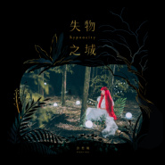
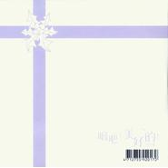
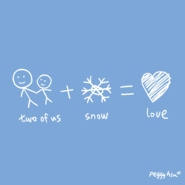

许哲珮
============================

|  |  |
| :--: | :-- |
| [ 许哲珮](https://i.xiami.com/peggyhsu) | **播放数**: 28842610 **粉丝数**: 36456 **评论数**: 740 **地区**: Taiwan, PRC 中国台湾 **风格**: 独立流行 Indie Pop  |

## 档案

许哲珮，英文名Peggy Hsu，台湾歌手、词曲创作者、制作人、POP Radio 广播电台 DJ，1981年2月2日出生于台湾台北，无师自通的Peggy，8岁即写下第一首词曲创作。19岁时将自己的词曲创作《气球》demo放上数位音乐网站《滚石可乐》供网友下载，缔造全年点播冠军的成绩，并因此获得唱片公司合约。外冷内热的个性特质，更让她被外界冠上“冰乐精灵”的封号。 
以钢琴为主要创作及演绎乐器的许哲珮，在2001年发行首张全创作专辑《气球》，专辑同名歌曲远赴北欧冰岛拍摄，成为华人史上首位在冰岛拍摄录像带的歌手。各界对于专辑的好评，迅速让她囊括了包括“内地全球华语榜中榜最佳新人奖”、“新加坡金曲奖最佳新人奖”、“香港国语力最佳新人奖”……等中港台及新马各地奖项，同时也入围了“2002台湾金曲奖最佳新人奖”。 
在发行首张专辑不久之后，由于唱片公司陷入经营危机，导致许哲珮在之后的6年期间无法继续发行专辑，她遂决定沉潜于幕后学习音乐制作，并远赴美国柏克理音乐学院学习爵士声乐，迄今参与制作的华语歌曲超过百余首。2007年更因共同制作独立乐团Tizzy Bac专辑获得了台湾“第十八届金曲奖最佳专辑制作人”的殊荣。同年5月，也终于签入新东家发行了她的第二张全创作专辑《许愿盒》。 
在无法发片的期间，她仍然不减对于音乐表演的热情，2003年由一批年轻好手组成的专属乐团“马戏团”正式成立，回到她最熟悉的河岸留言Live House。从一开始的玩票性质，到现在几乎场场爆满的海内外音乐会，在乐迷的心目中，参与许哲珮的现场演唱已俨然变成生活中最值得拥有的回忆之一。 
对于艺文活动始终有着高度兴趣的她，于2007年受邀与台湾《如果儿童剧团》合作，担纲了首部音乐舞台剧《秘密花园》的女主角演出及谱曲工作。广受好评的演出，让她再次受邀于2008年担纲了年度大型音乐歌舞剧《小花》的女主角演出工作。迅速销售一空的票房好成绩，让剧团决定在隔年三月再次加演，缔造了累积超过3万人次观赏的儿童剧纪录。 
在与前东家约满后，2009年许哲珮成为独立音乐人，转以独立发行方式，从音乐、视觉到包装都亲身包办，于2009年一次发行春夏概念的《美好的》全创作专辑及秋冬概念的《雪人》全创作专辑。仅凭著乐迷间口耳相传的发酵，让《美好的》获得了台湾实体销量榜蝉联多周前5名的成绩之外，还包括了“诚品音乐2009 Top 100”、“内地音乐之声港台TOP榜第一名”、“内地华语音乐传媒大奖10佳专辑”、“内地搜狐2009年度10大华语专辑”及“香港国语力最佳原创歌曲”奖项。《雪人》获得“KKBOX编辑严选2009华语10大专辑”、“内地蒙牛酸酸乳中联港台榜网友投票第一名”、“内地豆瓣网新碟榜第一名”、“内地音乐之声港台TOP榜第一名”等众多奖项。 
许哲珮的音乐里总是借由宛如孩童般的眼睛看着大人的世界，天马行空的创作风格，不难找到如北欧、童话、马戏团、精灵……等元素，作为词曲灵感的来源，并成功的在华语乐坛创立了独树一帜的作品风格。她的词曲作品也经常被收录于流行歌手如林忆莲、梁静茹等人的音乐专辑中。

## 专辑

| 名称 | 语种 | 唱片公司 | 发行时间 | 专辑类别 | 专辑风格 |
| :--: | :-- | :-- | :-- | :-- | :-- |
| [ 失物之城Hypnocity](./albums/2105600158.md) | 国语 | 雪人音乐 | 2019年12月24日 | 录音室专辑 | 国语流行 Mandarin Pop, 华语唱作人 Chinese Singer-Songwriter |
| [ 摇摆电力公司Swing, Inc.](./albums/1928382833.md) | 国语 | 弯的音乐 | 2015年09月10日 | 录音室专辑 | 摇摆乐 Swing, 华语唱作人 Chinese Singer-Songwriter |
| [ 圆舞曲La Valse](./albums/1198192198.md) | 国语 | 弯的音乐 | 2014年05月06日 | 录音室专辑 | 独立流行 Indie Pop, 华语唱作人 Chinese Singer-Songwriter |
| [ 树 (雪后版)The Snow Queen](./albums/824970913.md) | 国语 | 弯的音乐 | 2012年07月22日 | EP, 单曲 | 独立流行 Indie Pop, 华语唱作人 Chinese Singer-Songwriter |
| [ 奇幻精品店Magical Shop](./albums/474084.md) | 国语 | 弯的音乐 | 2011年11月01日 | 录音室专辑 | 独立流行 Indie Pop, 华语唱作人 Chinese Singer-Songwriter |
| [ 马戏团一号Le Cirque](./albums/401358.md) | 国语 | 弯的音乐 | 2010年09月17日 | EP, 单曲 | 独立流行 Indie Pop, 华语唱作人 Chinese Singer-Songwriter |
| [ 雪人](./albums/360797.md) | 国语 | 弯的音乐 | 2009年12月25日 | 录音室专辑 | 独立流行 Indie Pop, 华语唱作人 Chinese Singer-Songwriter |
| [ 唱吧！美好的！](./albums/523916.md) | 国语 | 弯的音乐 | 2009年12月25日 | EP, 单曲 | 独立流行 Indie Pop, 华语唱作人 Chinese Singer-Songwriter |
| [ 美好的](./albums/327032.md) | 国语 | 弯的音乐 | 2009年06月19日 | 录音室专辑 | 独立流行 Indie Pop, 华语唱作人 Chinese Singer-Songwriter |
| [ Peggy 2009 Winter Demo美好的 预购礼](./albums/340298.md) | 国语 | 弯的音乐 | 2009年06月19日 | EP, 单曲 | 独立流行 Indie Pop, 华语唱作人 Chinese Singer-Songwriter |
| [ 雪Two of Us Snow Love](./albums/314341.md) | 国语 | 弯的音乐 | 2008年12月05日 | EP, 单曲 | 独立流行 Indie Pop, 华语唱作人 Chinese Singer-Songwriter |
| [ 许愿盒Peggy's Wish Box](./albums/12591.md) | 国语 | 弯的音乐 | 2007年05月03日 | 录音室专辑 | 独立流行 Indie Pop, 华语唱作人 Chinese Singer-Songwriter |
| [ 气球Balloon](./albums/12592.md) | 国语 | 歌莱美 | 2001年11月01日 | 录音室专辑 | 国语流行 Mandarin Pop, 华语唱作人 Chinese Singer-Songwriter |

## 评论

|  |  |  |  |
| :-- | :-- | :-- | :-- |
|  [虾米用户](https://emumo.xiami.com/u/4971096) 会永远记得这片让你热爱的... 2021-01-08 09:51 赞(0) 踩(0) | 
从大学听到2021
 |
|  [虾米用户](https://emumo.xiami.com/u/358104299) 悲观的唯心存在现实解构虚... 2020-12-13 10:14 赞(0) 踩(0) | 
18701
 |
|  [虾米用户](https://emumo.xiami.com/u/12904036) 。 2020-10-12 05:00 赞(1) 踩(0) | 
我喜欢peggy的14年。是马戏团巡回的微笑对视和没能送出的笔记本。是糖果live的第一排。是签名的系列全专。是会唱的所有你的歌。
 |
|  [虾米用户](https://emumo.xiami.com/u/407263269) 筒单生活，快乐健康 2020-07-23 12:00 赞(1) 踩(0) | 
声音有特色。喜欢，收了   
 |
|  [虾米用户](https://emumo.xiami.com/u/304640418)  2020-01-19 16:15 赞(2) 踩(0) | 
从小听到大
 |
|  [虾米用户](https://emumo.xiami.com/u/356043426) 山不厌高，海不厌深。 2019-12-27 02:02 赞(2) 踩(0) | 
初听即藏 
 |
|  [虾米用户](https://emumo.xiami.com/u/2796166) 最爱莫文蔚..... 2019-12-25 06:42 赞(3) 踩(0) | 
加油~~~~
 |
|  [虾米用户](https://emumo.xiami.com/u/127990) 我还没想好要写什么... 2019-12-24 01:51 赞(3) 踩(0) | 
開開心心的做妳最喜歡的就好 我們都在❤️
 |
|  [虾米用户](https://emumo.xiami.com/u/1561047) 我还没想好要写什么... 2019-12-18 17:46 赞(3) 踩(0) | 
我的宝藏歌手
 |
|  [虾米用户](https://emumo.xiami.com/u/433431465) 桃李春风一杯酒，江湖夜雨... 2019-12-15 15:22 赞(2) 踩(0) | 
我爱《没落贵族》，MV也超棒 
 |
|  [虾米用户](https://emumo.xiami.com/u/355616318) : )大家都好好的 2019-12-13 06:23 赞(2) 踩(0) | 

 |
|  [虾米用户](https://emumo.xiami.com/u/293692544) 你敢给我说话吗？我咬你 2019-11-11 14:27 赞(5) 踩(0) | 
好听
 |
|  [虾米用户](https://emumo.xiami.com/u/3762677) 我还没想好要写什么... 2019-11-02 23:00 赞(3) 踩(0) | 
啥时候出新专辑呀姐姐
 |
|  [虾米用户](https://emumo.xiami.com/u/303187806)  2019-09-10 20:51 赞(4) 踩(0) | 
想听她的疯子
 |
|  [虾米用户](https://emumo.xiami.com/u/641785) 我还没想好要写什么... 2019-07-31 13:03 赞(3) 踩(0) | 
一生的少女感，百听不腻
 |
|  [虾米用户](https://emumo.xiami.com/u/3140019) 天马行空 2019-06-22 15:05 赞(4) 踩(0) | 
女权主义代表，爱
 |
|  [虾米用户](https://emumo.xiami.com/u/424890399)  2019-05-23 11:01 赞(4) 踩(0) | 
你的英文名字是念作:佩奇吗？
 |
|  [虾米用户](https://emumo.xiami.com/u/16859871) N e v e r   ... 2019-04-03 21:07 赞(7) 踩(0) | 
即便你已经变成了一个孩子的妈妈 可在我心里你永远都是那个小少女
 |
|  [虾米用户](https://emumo.xiami.com/u/401549065)  2019-03-24 10:16 赞(3) 踩(0) | 
你好会唱
 |
|  [虾米用户](https://emumo.xiami.com/u/12464012) 这个世界太疯狂 2019-03-07 13:50 赞(3) 踩(0) | 
好久没听妳的歌了，妳还好吗？
 |
|  [虾米用户](https://emumo.xiami.com/u/346885907)  2018-12-02 13:25 赞(3) 踩(0) | 
好听
 |
|  [虾米用户](https://emumo.xiami.com/u/273256901) 音乐可以治愈 2018-11-29 17:09 赞(3) 踩(0) | 
嗓音特好，音质特好，为什么不出名？一是伯乐和经纪人很重要，二是一首好的歌曲足以成名一世，快点寻找好的作曲音乐人吧！个人建议，不好意思了 
 |
|  [虾米用户](https://emumo.xiami.com/u/277133872)  2018-10-29 12:16 赞(2) 踩(0) | 
你的歌总是那么的纯净且纯粹
 |
|  [虾米用户](https://emumo.xiami.com/u/301089474) 隐没于繁星 2018-10-18 14:50 赞(2) 踩(0) | 
Peggy 什么时候出新歌哇。一直在等待哟。从很久很久以前就在听并且喜欢着，（从小女孩到老阿姨，长发到短发再到长发，身边的人来来去去，我在不同时空和空间里穿梭。）从里面感受到的。快乐的治愈着的。支持你。加油，你真的是很棒很棒的。
 |
|  [虾米用户](https://emumo.xiami.com/u/334890390)  2018-10-07 10:11 赞(2) 踩(0) | 
古灵精怪
 |
|  [虾米用户](https://emumo.xiami.com/u/134126396) 百年（ ）（ ） 2018-08-14 14:22 赞(1) 踩(0) | 
嗯
 |
|  [虾米用户](https://emumo.xiami.com/u/334765485)  2018-08-13 23:21 赞(2) 踩(0) | 
气球，把我从过去的时光里一下下拉回，已经记不清是哪一年，大概十年前的歌曲了，却依然那么那么那么好听
 |
|  [虾米用户](https://emumo.xiami.com/u/293692544) 你敢给我说话吗？我咬你 2018-08-07 05:22 赞(1) 踩(0) | 
好听
 |
|  [虾米用户](https://emumo.xiami.com/u/307515489)  2018-08-06 01:17 赞(1) 踩(0) | 
亲爱的 你会红的
 |
|  [虾米用户](https://emumo.xiami.com/u/319054563) 我还没想好要写什么... 2018-07-10 18:49 赞(1) 踩(0) | 
赞
 |
|  [虾米用户](https://emumo.xiami.com/u/550969) 雞翅如我 2018-05-31 10:43 赞(3) 踩(0) | 
佩琦好棒
 |
|  [虾米用户](https://emumo.xiami.com/u/72229668)   2018-04-06 18:40 赞(2) 踩(0) | 
无意间听到这首歌，很安静，很好。希望你能继续加油
 |
|  [虾米用户](https://emumo.xiami.com/u/11457644) 缺胜于丰 2018-02-22 15:28 赞(3) 踩(0) | 
从初中开始喜欢你了，昨天在街头突然哼起了你的歌，就来听了
 |
|  [虾米用户](https://emumo.xiami.com/u/268727134) 。 2018-02-17 10:20 赞(2) 踩(0) | 
记得是小学四五年级的时候看飒漫画，首页会有推荐的歌曲，第一次充满好奇的搜索，奇幻精品店，是我入坑的一首歌现在已经高一了！想想那么多年，真是越来越喜欢你了
 |
|  [虾米用户](https://emumo.xiami.com/u/71310342) 废了还填啥！ 2018-01-16 13:08 赞(4) 踩(0) | 
一首气球，思绪又拉回到大学&amp;hellip;&amp;hellip;
 |
|  [虾米用户](https://emumo.xiami.com/u/492360) 失恋不是自杀的借口 继续... 2018-01-03 11:07 赞(3) 踩(0) | 
Twinkle twinkle little starHow I wonder what you are
 |
|  [虾米用户](https://emumo.xiami.com/u/492360) 失恋不是自杀的借口 继续... 2018-01-03 11:05 赞(1) 踩(0) | 
Little Wishing Star？
 |
|  [虾米用户](https://emumo.xiami.com/u/252529835) Meanwhile in... 2017-12-26 09:12 赞(10) 踩(0) | 
许哲珮居然更新了个人简介！好惊喜！
 |
|  [虾米用户](https://emumo.xiami.com/u/23635743) 酸 2017-11-30 00:44 赞(7) 踩(0) | 
如果说本命歌手 一定是我家Peggy啦
 |
|  [虾米用户](https://emumo.xiami.com/u/8840665) 热爱小提琴和电音。 2017-11-18 22:11 赞(4) 踩(0) | 
很喜欢你的风格，加油啊！
 |
|  [虾米用户](https://emumo.xiami.com/u/256818395)  2017-11-16 18:50 赞(2) 踩(0) | 
挺好听她的声音真的
 |
|  [虾米用户](https://emumo.xiami.com/u/5386201)  2017-10-30 10:04 赞(4) 踩(0) | 
希望Peggy再来北京演出
 |
|  [虾米用户](https://emumo.xiami.com/u/12730895) 不要离开！ 2017-10-28 00:40 赞(2) 踩(0) | 
粉红猪小妹peggy，哈哈
 |
|  [虾米用户](https://emumo.xiami.com/u/2019268)  2017-10-28 00:36 赞(3) 踩(0) | 
差点时间久的都让我忘记这位歌手了 （其实还真的不知道)气球的原唱是谁 以前一段时间也一直在找这首歌 脑海里面以为气球是江美琪演唱的 酷狗里面去收索气球歌名弹出来的是东方神起唱的 这首歌记得是中学时代经常5点钟守候在家里每天看天籁村推荐的一些歌 当然很多歌曲都是陪伴我一起长大的 貌似这位歌手现在没有出什么新的歌曲了嘛
 |
|  [虾米用户](https://emumo.xiami.com/u/1288523) 确实没想好要写什么 2017-10-06 02:06 赞(3) 踩(0) | 
为什么不去拯救那个恶俗的《我是歌手》....
 |
|  [虾米用户](https://emumo.xiami.com/u/221695408) 我还没想好要写什么... 2017-10-01 01:26 赞(2) 踩(0) | 
♪
 |
|  [虾米用户](https://emumo.xiami.com/u/13688294) 我还没想好要写什么... 2017-09-28 00:07 赞(4) 踩(0) | 
恭喜Peggy当妈妈～
 |
|  [虾米用户](https://emumo.xiami.com/u/24814862) - 2017-09-10 08:23 赞(2) 踩(0) | 
-
 |
|  [虾米用户](https://emumo.xiami.com/u/2433636) 肚子 2017-08-04 07:12 赞(2) 踩(0) | 
没落贵族真的个很好听 今天选择这首歌陪伴我整个论文通宵时间
 |
|  [虾米用户](https://emumo.xiami.com/u/93654804)   2017-06-24 16:02 赞(2) 踩(0) | 
青涩回忆里的两位女神之一，我来看你了，你和绮贞永远是我心中的巨星。
 |
|  [虾米用户](https://emumo.xiami.com/u/155874230)  2017-06-04 15:32 赞(0) 踩(0) | 
她是我最爱的女歌手     
 |
|  [虾米用户](https://emumo.xiami.com/u/5386201)  2017-05-10 02:56 赞(3) 踩(0) | 
希望Peggy能再来北京演出，希望大家一起喊，希望Peggy来大陆演出 爱你
 |
|  [虾米用户](https://emumo.xiami.com/u/123260668) 负能量退散！ 2017-04-23 13:44 赞(5) 踩(0) | 
哲珮的心里一定住着一个可爱又有点腹黑的哥特萝莉
 |
|  [虾米用户](https://emumo.xiami.com/u/1406361) 我还没想好要写什么... 2017-02-06 00:08 赞(1) 踩(0) | 
声音好甜我好喜欢
 |
|  [虾米用户](https://emumo.xiami.com/u/260167529) 爱音乐的疯子 2017-01-18 17:07 赞(0) 踩(0) | 
很有特点的创作奇女
 |
|  [虾米用户](https://emumo.xiami.com/u/10162321)  2017-01-16 17:38 赞(0) 踩(0) | 
到底什麼是小清新
 |
|  [虾米用户](https://emumo.xiami.com/u/634749)  2017-01-10 03:07 赞(1) 踩(0) | 
外星人
 |
|  [虾米用户](https://emumo.xiami.com/u/70051074)  2016-11-30 21:12 赞(13) 踩(0) | 
华语乐坛担得起“音乐精灵”这个称号的只许哲佩一人而已！
 |
|  [虾米用户](https://emumo.xiami.com/u/4113012)  2016-07-27 10:53 赞(3) 踩(0) | 
《气球》太厉害了。我读高一的时候偶尔听到，被里面饱满的绝望一波打翻。现在工作了两年，突然被虾米推荐了这首歌，一听还是会炸起满身鸡皮疙瘩。
 |
|  [虾米用户](https://emumo.xiami.com/u/45685307) 没有意义 无所谓方向 不... 2016-07-23 17:07 赞(0) 踩(0) | 
给我们一张正脸好吗
 |
| ⇒ |  [虾米用户](https://emumo.xiami.com/u/124883806) 只不过是庸人自扰的自导自... 2017-05-20 22:32 赞(0) 踩(0) | 
哈哈，第二张应该算是正脸了 
 |
|  [虾米用户](https://emumo.xiami.com/u/38492545) 无论如何，爱音乐 2016-07-14 22:15 赞(0) 踩(0) | 
...................只剩四首
 |
|  [虾米用户](https://emumo.xiami.com/u/2383934)  2016-07-08 13:24 赞(0) 踩(0) | 
可爱可爱可爱可爱可爱！！！！
 |
|  [虾米用户](https://emumo.xiami.com/u/54609140) 彳亍着，踌躇着！ 2016-06-26 16:33 赞(1) 踩(0) | 
相见恨晚，是我眼拙啊
 |
|  [虾米用户](https://emumo.xiami.com/u/634749)  2016-06-21 11:11 赞(0) 踩(0) | 
未来音乐永远的新鲜感
 |
|  [虾米用户](https://emumo.xiami.com/u/68630552) This above a... 2016-06-19 12:35 赞(0) 踩(0) | 
怎么都入驻了还下架啊……
 |
|  [虾米用户](https://emumo.xiami.com/u/109966566) 旋转着的木马重播着昨天。 2016-06-18 13:45 赞(1) 踩(0) | 
超爱 独一无二的歌手
 |
|  [虾米用户](https://emumo.xiami.com/u/50792813) 爱你 虾米 2016-05-18 01:03 赞(1) 踩(0) | 
我哥最喜欢德国下雪了 很久很久没有听 你在那边还好吗
 |
|  [虾米用户](https://emumo.xiami.com/u/34106744)  2016-04-07 12:39 赞(0) 踩(0) | 
喵了个眯的
 |
|  [虾米用户](https://emumo.xiami.com/u/44018214) 我还没想好要写什么... 2016-03-01 08:32 赞(3) 踩(0) | 
2000年…读初一，迷茫的在网吧听到了她的气球…那时候天空灰灰的…像极了她那首MV…后来想找她的歌…一直不知道名字…直到2008年有一次宿舍的人放东方神起的气球…我漫不经心换歌的时候发现那熟悉的歌词…忍住眼泪没有流下来…默默的下到P3里…自己在天台呆了一下午…
 |
|  [虾米用户](https://emumo.xiami.com/u/50427611)  Alferdpacke... 2016-02-22 18:04 赞(19) 踩(0) | 
如果我以后有孩子，我会给他她听许哲珮
 |
|  [虾米用户](https://emumo.xiami.com/u/13189533)  2015-12-10 12:02 赞(1) 踩(0) | 
封面谁传的？美美美！
 |
|  [虾米用户](https://emumo.xiami.com/u/39904335)   2015-10-19 13:04 赞(0) 踩(0) | 
赞一个～喜欢这种感觉～
 |
|  [虾米用户](https://emumo.xiami.com/u/12669583) 记得当时年纪小你爱谈天我... 2015-10-13 22:26 赞(0) 踩(0) | 
我我的少女心咋了……
 |
|  [虾米用户](https://emumo.xiami.com/u/341091) 偶爱我们呢~ 2015-10-09 10:25 赞(1) 踩(0) | 
我居然没收藏她……从初中听起啊……创作才女里最令人期待的，每次看到她出新专都会眼睛发亮，近几年的专辑几乎都是奇幻的，但我知道这些不是她的全部。
 |
|  [虾米用户](https://emumo.xiami.com/u/72209286)  2015-10-06 22:50 赞(0) 踩(0) | 
空灵
 |
|  [虾米用户](https://emumo.xiami.com/u/20602973) ○ω● ＞﹏＜ 2015-10-05 17:05 赞(0) 踩(0) | 
哇好棒~
 |
|  [虾米用户](https://emumo.xiami.com/u/11870332) talk is chea... 2015-09-25 15:12 赞(1) 踩(0) | 
哈哈哈哈觉得她一直都是又可爱又奇特的
 |
|  [虾米用户](https://emumo.xiami.com/u/17719900) 请把我的歌带回你的家 2015-09-21 21:40 赞(0) 踩(0) | 
珮
 |
|  [虾米用户](https://emumo.xiami.com/u/5087129)   2015-09-20 21:27 赞(3) 踩(0) | 
她绝对是才女，能感觉扑面而来的才气和灵动
 |
|  [虾米用户](https://emumo.xiami.com/u/39823316)   2015-09-19 17:56 赞(1) 踩(0) | 
才女，词曲编全包！！
 |
|  [虾米用户](https://emumo.xiami.com/u/47533597)  2015-09-17 22:48 赞(0) 踩(0) | 
图换了
 |
|  [虾米用户](https://emumo.xiami.com/u/37132930)   2015-09-17 21:13 赞(2) 踩(0) | 
喜欢没落贵族，游泳圈和长头发！最喜欢的华语女歌手之一
 |
|  [虾米用户](https://emumo.xiami.com/u/46287668)  2015-09-16 16:53 赞(0) 踩(0) | 
赞
 |
|  [虾米用户](https://emumo.xiami.com/u/2688581)  2015-09-15 22:52 赞(0) 踩(0) | 
新专辑赞一个，适合静静的听
 |
|  [虾米用户](https://emumo.xiami.com/u/774208) 我还没想好要写什么... 2015-09-12 23:02 赞(0) 踩(0) | 
10月5日，许哲佩在上海简单生活节演出，新专辑发行后的内地首演噢！！不能错过大麦：<a href="http://item.damai.cn/85484.html" target="_blank" rel="nofollow noreferrer noopener">http://item.damai.cn/85484.html</a>
 |
|  [虾米用户](https://emumo.xiami.com/u/54893890)  2015-09-11 14:50 赞(0) 踩(0) | 
奇幻精品店！果然还是喜欢这样温柔空灵的声音
 |
|  [虾米用户](https://emumo.xiami.com/u/2925823)   2015-08-27 19:36 赞(0) 踩(0) | 
新专辑快出来了，期待
 |
|  [虾米用户](https://emumo.xiami.com/u/39988799) 做三品女孩：甜品，饮品，... 2015-08-16 07:45 赞(0) 踩(0) | 
啊啊啊啊现在突然想想我喜欢peggy也有快10年整了
 |
|  [虾米用户](https://emumo.xiami.com/u/39988799) 做三品女孩：甜品，饮品，... 2015-08-16 07:44 赞(0) 踩(0) | 
期待新专辑
 |
|  [虾米用户](https://emumo.xiami.com/u/344213) 虾米要活下去！ 2015-07-30 09:54 赞(1) 踩(0) | 
临近毕业那年，我和一双鱼姐们清唱过气球，各种颜色对肺活量是种考验啊。
 |
|  [虾米用户](https://emumo.xiami.com/u/36100852) 使黑色的光芒遍布我的心脏... 2015-05-31 01:12 赞(0) 踩(0) | 
厉害
 |
|  [虾米用户](https://emumo.xiami.com/u/47609690)  2015-05-25 07:31 赞(0) 踩(0) | 
大爱   
 |
|  [虾米用户](https://emumo.xiami.com/u/1132252)  2015-05-07 00:49 赞(0) 踩(0) | 
感觉圆舞曲已经是梦幻曲风的极致了，下一张会转型么
 |
|  [虾米用户](https://emumo.xiami.com/u/39671579) 专听日语歌曲。 2015-05-06 00:09 赞(0) 踩(0) | 
这是我两年前喜欢的歌手   而且是最喜欢的
 |
|  [虾米用户](https://emumo.xiami.com/u/24653742) 幼稚不独立没品味 2015-04-30 17:39 赞(0) 踩(0) | 
我老了。。。。
 |
|  [虾米用户](https://emumo.xiami.com/u/601044)  2015-03-31 18:53 赞(0) 踩(0) | 
3月29号的观众来报道了
 |
|  [虾米用户](https://emumo.xiami.com/u/11289480) 我还没想好要写什么... 2015-03-28 12:23 赞(1) 踩(0) | 
昨晚的Peggy完全是天使！（号泣
 |
|  [虾米用户](https://emumo.xiami.com/u/8133145) o my sky 2015-03-28 02:12 赞(0) 踩(0) | 
刚看完上海的maolivehouse， 音色真棒，现场可爱。
 |
| ⇒ |  [虾米用户](https://emumo.xiami.com/u/6012897) 我还没想好要写什么... 2015-03-28 08:24 赞(0) 踩(0) | 
想知道那个粉红色可以吹的的小键盘是什么乐器
 |
| ⇒ |  [虾米用户](https://emumo.xiami.com/u/3751021) 好羡慕你们小括号里有签名 2015-03-28 16:44 赞(0) 踩(0) | 
<q><b>aprilforu说：</b></q>
 |
| ⇒ |  [虾米用户](https://emumo.xiami.com/u/6501239) 我还没想好要写什么... 2015-03-30 10:53 赞(0) 踩(0) | 
<q><b>aprilforu说：</b></q>
 |
| ⇒ |  [虾米用户](https://emumo.xiami.com/u/6501239) 我还没想好要写什么... 2015-03-30 10:53 赞(0) 踩(0) | 
<q><b>Bluc说：</b></q>
 |
| ⇒ |  [虾米用户](https://emumo.xiami.com/u/3751021) 好羡慕你们小括号里有签名 2015-03-30 15:38 赞(0) 踩(0) | 
<q><b>潮汐能说：</b></q>
 |
|  [虾米用户](https://emumo.xiami.com/u/3751021) 好羡慕你们小括号里有签名 2015-03-28 01:03 赞(1) 踩(0) | 
谁没有谁看完MAO的演出来表达一下鸡冻的心情的
 |
|  [虾米用户](https://emumo.xiami.com/u/6491765) 我只是个门外汉。 2015-03-12 15:31 赞(1) 踩(0) | 
为什么巡演不来成都呢~看来西南地区一直是被遗忘的。。。
 |
|  [虾米用户](https://emumo.xiami.com/u/7945867)  2015-03-10 16:00 赞(0) 踩(0) | 
@@
 |
|  [虾米用户](https://emumo.xiami.com/u/1749408)  2015-03-01 21:26 赞(0) 踩(0) | 
我好喜欢她 她的声音
 |
|  [虾米用户](https://emumo.xiami.com/u/3183736)  2015-02-25 09:20 赞(4) 踩(0) | 
她有一把永远青春甜蜜的声音。听她的歌有点像在看着几米漫画的感觉。
 |
| ⇒ |  [虾米用户](https://emumo.xiami.com/u/20537708) 凉 2015-03-17 21:40 赞(0) 踩(0) | 
这个比喻很到位
 |
|  [虾米用户](https://emumo.xiami.com/u/46638028) 内心住着一个无处安放的老... 2015-02-18 11:28 赞(0) 踩(0) | 
率性就好
 |
|  [虾米用户](https://emumo.xiami.com/u/6058651)  2015-02-07 14:25 赞(0) 踩(0) | 
音乐够纯粹
 |
|  [虾米用户](https://emumo.xiami.com/u/454506) 我还没想好要写什么... 2015-02-07 03:55 赞(0) 踩(0) | 
很喜歡這種自言自語，歇斯底里的性格
 |
|  [虾米用户](https://emumo.xiami.com/u/7874823) 不再沉溺，做个温暖别人的... 2015-02-01 23:46 赞(0) 踩(0) | 
流行歌手里太牛了…词曲编曲全搞定…
 |
|  [虾米用户](https://emumo.xiami.com/u/152262)  2015-01-17 22:05 赞(0) 踩(0) | 
好听
 |
|  [虾米用户](https://emumo.xiami.com/u/9486765)  2015-01-12 22:56 赞(0) 踩(0) | 
才女才女才女
 |
|  [虾米用户](https://emumo.xiami.com/u/39709274)  2015-01-03 21:06 赞(0) 踩(0) | 
。。
 |
|  [虾米用户](https://emumo.xiami.com/u/42837644)  2014-12-26 23:53 赞(0) 踩(0) | 
我就为了 疯子 这首歌，可惜没有、
 |
| ⇒ |  [虾米用户](https://emumo.xiami.com/u/41772659)  2015-03-17 12:54 赞(0) 踩(0) | 
有阿
 |
|  [虾米用户](https://emumo.xiami.com/u/8833102) 伟❤️375882267 2014-12-25 01:21 赞(0) 踩(0) | 
这里的歌真好听圣诞快乐  ！！！
 |
|  [虾米用户](https://emumo.xiami.com/u/31659762)  2014-12-15 11:57 赞(0) 踩(0) | 
精灵
 |
|  [虾米用户](https://emumo.xiami.com/u/7440866)  2014-12-10 20:58 赞(0) 踩(0) | 
当年看宪哥的节目知道了有这么一个人，一直都还蛮喜欢的
 |
|  [虾米用户](https://emumo.xiami.com/u/5826937)  2014-12-09 20:22 赞(0) 踩(0) | 
很喜欢那种奇幻的味道
 |
|  [虾米用户](https://emumo.xiami.com/u/43267716) 暂无签名~ 2014-12-07 13:46 赞(0) 踩(0) | 
最爱Peeggy
 |
|  [虾米用户](https://emumo.xiami.com/u/26490600) 精选集狂人ZQ。 2014-10-27 23:52 赞(0) 踩(0) | 
用心制作每一张精选集，值得你来试听。
 |
|  [虾米用户](https://emumo.xiami.com/u/27280809) life's meant... 2014-10-26 17:13 赞(0) 踩(0) | 
看来是缺了2007年的《许愿盒》这张
 |
|  [虾米用户](https://emumo.xiami.com/u/27280809) life's meant... 2014-10-26 17:04 赞(0) 踩(0) | 
好多歌都没有呢，《玻璃鞋》呢？
 |
|  [虾米用户](https://emumo.xiami.com/u/8035298)  2014-10-02 02:47 赞(1) 踩(0) | 
居然没有疯子那首。。。超爱的啊
 |
| ⇒ |  [虾米用户](https://emumo.xiami.com/u/29887653) 暂无签名~ 2014-10-12 22:16 赞(0) 踩(0) | 
我也想说这个！竟然没有疯子！刚刚突然想到几年前特爱的那首，想来下载的，结果没有
 |
| ⇒ |  [虾米用户](https://emumo.xiami.com/u/8035298)  2014-10-12 22:49 赞(0) 踩(0) | 
<q><b>Dusk说：</b></q>
 |
|  [虾米用户](https://emumo.xiami.com/u/6645440) 黑与白的相遇不一定成灰，... 2014-09-28 13:35 赞(0) 踩(0) | 
曲风特别，半音很多，声音也好听~很有才华啊！
 |
|  [虾米用户](https://emumo.xiami.com/u/11542605) 噢 2014-09-26 07:40 赞(0) 踩(0) | 
为什么没有她的 德国下雪惹 ಠ_ಠ
 |
|  [虾米用户](https://emumo.xiami.com/u/8966202) 我不要死后被珍藏。 2014-09-13 00:13 赞(1) 踩(0) | 
许哲珮。
 |
|  [虾米用户](https://emumo.xiami.com/u/8966202) 我不要死后被珍藏。 2014-09-13 00:11 赞(2) 踩(0) | 
许哲佩就是应该要包揽各种作曲和制作类奖项的那种歌手啊。
 |
|  [虾米用户](https://emumo.xiami.com/u/5882097)  2014-09-12 16:39 赞(0) 踩(0) | 
少了好多歌……疯子什么的
 |
|  [虾米用户](https://emumo.xiami.com/u/41029308) 正在搬砖呢…… 2014-09-10 11:34 赞(0) 踩(0) | 
特立独行耐人寻味
 |
|  [虾米用户](https://emumo.xiami.com/u/40615470)  2014-08-31 14:47 赞(0) 踩(0) | 
很独特的嗓音
 |
|  [虾米用户](https://emumo.xiami.com/u/15991294) 。 2014-08-24 01:41 赞(0) 踩(0) | 
居然没有《疯子》
 |
|  [虾米用户](https://emumo.xiami.com/u/27928027) 日语专业w 2014-08-22 17:18 赞(0) 踩(0) | 
为什么没有芭蕾舞者
 |
|  [虾米用户](https://emumo.xiami.com/u/2732818) 这是啥- - 2014-07-25 20:35 赞(0) 踩(0) | 
许哲珮真的担得起才女这个称号，写的歌每一首都是一个完整的故事
 |
|  [虾米用户](https://emumo.xiami.com/u/34888974) 一件黑色毛衣 两个人的回... 2014-07-23 23:52 赞(0) 踩(0) | 
最喜欢佩的歌了，没一首都像一个故事
 |
|  [虾米用户](https://emumo.xiami.com/u/7663832) 莫使金樽空对月 2014-07-20 21:38 赞(1) 踩(0) | 
既童话又现实的风格，听了之后总会幻想冰雪的画面，透着冬天寂静空灵的感觉，从马戏团一号专辑知道Peggy就一发不可收拾了，曲风真的自成一体！
 |
|  [虾米用户](https://emumo.xiami.com/u/24507633)  2014-07-09 15:49 赞(0) 踩(0) | 
声音青春甜美
 |
|  [虾米用户](https://emumo.xiami.com/u/2803524)   2014-07-05 09:10 赞(0) 踩(0) | 
低调的唱作者，从“气球”那张专辑就开始喜欢听你的歌了
 |
|  [虾米用户](https://emumo.xiami.com/u/13524261)  2014-07-04 01:22 赞(0) 踩(0) | 
xuzhepei
 |
|  [虾米用户](https://emumo.xiami.com/u/28709757)  2014-07-01 08:40 赞(0) 踩(0) | 
小女生的内心奇思~
 |
|  [虾米用户](https://emumo.xiami.com/u/2438528)  2014-06-21 20:21 赞(0) 踩(0) | 
最最喜欢雪人那张。。。新专感觉像翻开一本童话书，也不错
 |
|  [虾米用户](https://emumo.xiami.com/u/4104185)   2014-06-08 21:06 赞(0) 踩(0) | 
赞～才女～她太会写了 水瓶座古灵精怪 满是奇思妙想有自己的小世界～很有想法 羡慕呐～
 |
|  [虾米用户](https://emumo.xiami.com/u/17783464) poet in a ni... 2014-06-07 11:23 赞(0) 踩(0) | 
真的很棒
 |
|  [虾米用户](https://emumo.xiami.com/u/37155445)   2014-06-06 15:31 赞(0) 踩(0) | 
喜欢的台湾女声，独特的曲调
 |
|  [虾米用户](https://emumo.xiami.com/u/35161240)  2014-05-17 00:09 赞(0) 踩(0) | 
还是很有辨识度的
 |
|  [虾米用户](https://emumo.xiami.com/u/32222475) 音乐在流泪 歌词在疗伤 2014-05-13 23:09 赞(0) 踩(0) | 
没有疯子？
 |
|  [虾米用户](https://emumo.xiami.com/u/6248831) 눈_눈 2014-05-09 20:15 赞(0) 踩(0) | 
高中听过一首哲佩的《一个人浪漫》很特别冰雪玲珑的感觉~
 |
| ⇒ |  [虾米用户](https://emumo.xiami.com/u/36634607)  2014-05-19 20:42 赞(0) 踩(0) | 
533 日化8孤帆远影突然8醋有3 437444
 |
|  [虾米用户](https://emumo.xiami.com/u/8384826) 再见，虾米，谢谢！ 2014-05-07 16:19 赞(0) 踩(0) | 
欣赏
 |
|  [虾米用户](https://emumo.xiami.com/u/2102200) When you wis... 2014-05-07 14:01 赞(0) 踩(0) | 
精灵~小确幸~的音乐
 |
|  [虾米用户](https://emumo.xiami.com/u/10231881) 天天UP~~!~~ 2014-05-07 01:00 赞(0) 踩(0) | 
催眠~开口第一句~就让wo想起了当年惊为天“曲”的“消失”！！
 |
| ⇒ |  [虾米用户](https://emumo.xiami.com/u/18748728)  2014-05-07 23:44 赞(0) 踩(0) | 
f
 |
|  [虾米用户](https://emumo.xiami.com/u/9535910) 两只狗 2014-05-06 19:45 赞(0) 踩(0) | 
艾西~
 |
|  [虾米用户](https://emumo.xiami.com/u/36285212)   2014-05-06 14:41 赞(0) 踩(0) | 
喜欢她的曲风，声音，总能给人温暖和长不大的回忆。音乐特别有带入感，总能有身临其境的感觉。
 |
|  [虾米用户](https://emumo.xiami.com/u/35479667)  2014-05-05 21:14 赞(0) 踩(0) | 
声音确实有点像萧潇啊
 |
|  [虾米用户](https://emumo.xiami.com/u/34533881) 暂无签名~ 2014-05-05 20:51 赞(0) 踩(0) | 
好美♥
 |
|  [虾米用户](https://emumo.xiami.com/u/3587364) 微博 ：@鱼柳柳  2014-05-04 12:26 赞(0) 踩(0) | 
其他专辑什么时候才能上架 好想在虾米听到~
 |
|  [虾米用户](https://emumo.xiami.com/u/19298282)  2014-05-04 10:41 赞(1) 踩(0) | 
偶然地听到她的歌，被歌词和旋律打动，她很特别。
 |
|  [虾米用户](https://emumo.xiami.com/u/13902825) 唇语也绽放似昙花一现 2014-05-03 23:35 赞(0) 踩(0) | 
我觉得她的声音像许慧欣、梁静茹、金海心……………………ORZ
 |
|  [虾米用户](https://emumo.xiami.com/u/15430815) 我明知我们没有结果，却还 2014-05-03 12:35 赞(0) 踩(0) | 
小清新的代表家
 |
|  [虾米用户](https://emumo.xiami.com/u/11434231) 我爱故我在 2014-04-30 23:23 赞(0) 踩(0) | 
虾小米连人家名字都写错了，是珮好吗
 |
| ⇒ |  [虾米用户](https://emumo.xiami.com/u/2523233) 太热 2014-04-30 23:37 赞(0) 踩(0) | 
人家微博名 都叫 许哲佩PeggyHsu。。。而且虾米也标注了 许哲珮。。
 |
| ⇒ |  [虾米用户](https://emumo.xiami.com/u/9145709) uNEXpEcTEd 2014-05-03 19:18 赞(0) 踩(0) | 
想纠结的话王字旁也错的，她自己说真正的其实应该是玉字旁。无视这种东西吧...
 |
| ⇒ |  [虾米用户](https://emumo.xiami.com/u/2871) 虾米编辑部唯一官方账号 ... 2014-05-06 13:21 赞(0) 踩(0) | 
原来是“珮”，后来Peggy自己改过来了~
 |
| ⇒ |  [虾米用户](https://emumo.xiami.com/u/11434231) 我爱故我在 2014-05-06 15:52 赞(0) 踩(0) | 
<q><b>虾小编说：</b></q>
 |
| ⇒ |  [虾米用户](https://emumo.xiami.com/u/355865) Let it go, l... 2014-05-06 22:04 赞(0) 踩(0) | 
<q><b>deernina说：</b></q>
 |
|  [虾米用户](https://emumo.xiami.com/u/12742923) JMY要搭上一架会爆炸的... 2014-04-30 16:46 赞(0) 踩(0) | 
还我&amp;lt; 美好的&amp;gt;！！！
 |
|  [虾米用户](https://emumo.xiami.com/u/2307526) 连接比特与像素的造梦师！ 2014-04-29 16:13 赞(1) 踩(0) | 
声音有点像萧萧！
 |
|  [虾米用户](https://emumo.xiami.com/u/7299404)  2014-04-24 21:58 赞(0) 踩(0) | 
小清新
 |
|  [虾米用户](https://emumo.xiami.com/u/9145709) uNEXpEcTEd 2014-04-22 22:19 赞(1) 踩(0) | 
《圆舞曲》太赞了！！！抢先来说这句话^_^
 |
|  [虾米用户](https://emumo.xiami.com/u/5405913)  2014-04-18 18:32 赞(36) 踩(0) | 
其实我真的讨厌在KTV把她的《气球》当神曲去唱的那些人，求求你们这些只知道《气球》的人，就算是《气球》所表达的远不是谁的一口气够长好吗，许哲佩绝对是个音乐奇才，她已经不仅仅是天才了。
 |
|  [虾米用户](https://emumo.xiami.com/u/163856)  2014-04-12 13:56 赞(3) 踩(0) | 
还我《疯子》！！
 |
|  [虾米用户](https://emumo.xiami.com/u/30837528)  2014-04-02 10:24 赞(0) 踩(0) | 
123
 |
|  [虾米用户](https://emumo.xiami.com/u/34528261) 我还没想好要写什么... 2014-03-28 11:30 赞(0) 踩(0) | 
要的就是你！
 |
|  [虾米用户](https://emumo.xiami.com/u/19069467)  2014-03-17 19:28 赞(0) 踩(0) | 
憂傷情感
 |
|  [虾米用户](https://emumo.xiami.com/u/22272097) 李敏镐 2014-03-14 22:45 赞(0) 踩(0) | 
ghbh
 |
|  [虾米用户](https://emumo.xiami.com/u/2358615)  2014-03-08 00:36 赞(1) 踩(0) | 
其实我一直在想为什么peggy的歌的MV不去找比尔贾来拍呢？那种童话风，准确是有些黑色的童话风
 |
|  [虾米用户](https://emumo.xiami.com/u/7663832) 莫使金樽空对月 2014-02-28 18:34 赞(0) 踩(0) | 
peggy终于入驻虾米了，兴奋啊！希望早日出新歌哦~
 |
|  [虾米用户](https://emumo.xiami.com/u/9632708)  2014-02-24 21:43 赞(0) 踩(0) | 
啥时候发新专辑呢
 |
|  [虾米用户](https://emumo.xiami.com/u/12883873) 自信自强 2014-02-23 19:10 赞(0) 踩(0) | 
气球，很好听
 |
|  [虾米用户](https://emumo.xiami.com/u/9714648) 人生，需要揭穿 2014-02-21 17:43 赞(0) 踩(0) | 
欢迎入住，，我最喜欢的是您的《长头发》
 |
|  [虾米用户](https://emumo.xiami.com/u/2361171) 音乐响起.又是美好的一天 2014-02-20 14:35 赞(0) 踩(0) | 
零零散散的 写了 Peggy有关   大约20W字有了她的 部落格 一直在跟进  听歌生涯中 唯一雪藏的专辑  就是 Peggy的跟着她的 足迹 神游奇幻音乐 以及周边 喜爱她喜爱的一切 以及另一个她那个 属于我的‘我’的 ‘她’  在我生命中 画上了彩色的瞬间!~
 |
|  [虾米用户](https://emumo.xiami.com/u/243327) 命短し、恋せよ少女 2014-02-19 16:41 赞(0) 踩(0) | 
大爱Peggy！！！！！！从初中第一次听她的音乐到现在一直没有变过！！！
 |
|  [虾米用户](https://emumo.xiami.com/u/787654)  2014-02-18 14:11 赞(1) 踩(0) | 
都是虾米音乐人了，下架的专辑也该上架了吧。
 |
|  [虾米用户](https://emumo.xiami.com/u/32864135)  2014-02-17 19:40 赞(525) 踩(0) | 
我刚入驻了虾米音乐人，欢迎大家来我的个人主页，收听我的最新音乐
 |
| ⇒ |  [虾米用户](https://emumo.xiami.com/u/9741887)  2014-02-17 20:02 赞(0) 踩(0) | 
wellcome
 |
| ⇒ |  [虾米用户](https://emumo.xiami.com/u/2253831) 我还没想好要写什么... 2014-02-19 00:04 赞(0) 踩(0) | 
姐 随便出个小样也行啊。。。
 |
| ⇒ |  [虾米用户](https://emumo.xiami.com/u/16396825) do you ? 2014-02-28 12:39 赞(0) 踩(0) | 
欢迎
 |
| ⇒ |  [虾米用户](https://emumo.xiami.com/u/2517870) 用乐符铭记永恒 2014-09-20 09:43 赞(0) 踩(0) | 
Hi Peggy! I love your music!
 |
| ⇒ |  [虾米用户](https://emumo.xiami.com/u/4048244)   2015-05-28 23:00 赞(0) 踩(0) | 
声音真的很好听
 |
| ⇒ |  [虾米用户](https://emumo.xiami.com/u/34669743)  2015-07-29 20:31 赞(0) 踩(0) | 
哇本尊吗？很喜欢你的歌
 |
| ⇒ |  [虾米用户](https://emumo.xiami.com/u/1157581)  2015-09-12 22:25 赞(0) 踩(0) | 
棒！
 |
| ⇒ |  [虾米用户](https://emumo.xiami.com/u/4884634)  2017-07-01 10:18 赞(0) 踩(0) | 
你的作品很不错！我喜欢
 |
| ⇒ |  [虾米用户](https://emumo.xiami.com/u/47163542)  2017-08-22 07:07 赞(0) 踩(0) | 
我喜欢你的作品，因为你的自创性。加油哦，继续创造！！
 |
| ⇒ |  [虾米用户](https://emumo.xiami.com/u/310870371) I want my li... 2017-10-22 14:51 赞(0) 踩(0) | 

 |
| ⇒ |  [虾米用户](https://emumo.xiami.com/u/28895562)  2017-11-27 21:41 赞(0) 踩(0) | 
呵呵&amp;hellip;
 |
| ⇒ |  [虾米用户](https://emumo.xiami.com/u/347353355)  2018-02-02 12:19 赞(0) 踩(0) | 
时间能筛出好的音乐 过了许多年 好音乐变得更醇香 更有韵味
 |
| ⇒ |  [虾米用户](https://emumo.xiami.com/u/349433113) 。。。。。 2018-04-03 08:01 赞(0) 踩(0) | 
您回复我了哎，要加油哦，好好听呢，我都听醉了哦。
 |
| ⇒ |  [虾米用户](https://emumo.xiami.com/u/42350240) 天台风好大都吹成傻逼了 2018-04-07 00:01 赞(0) 踩(0) | 
加油！！！
 |
| ⇒ |  [虾米用户](https://emumo.xiami.com/u/17776180)   2018-05-16 07:41 赞(0) 踩(0) | 
同年！气球永远那么经典，时髦，虽然已经10多年了。
 |
| ⇒ |  [虾米用户](https://emumo.xiami.com/u/400602737)  2018-08-19 21:03 赞(0) 踩(0) | 
你在哪里呀？
 |
| ⇒ |  [虾米用户](https://emumo.xiami.com/u/70949328)  2018-12-02 01:50 赞(0) 踩(0) | 
小时候从听到你的气球开始，就一直挺喜欢你，多年未曾听到你的声音，今天才偶然听到。。。我也实现了理想，成为了一名歌手，让我感动的是，你还是那个你，难过的是，我已不是当年的那个我 。。。
 |
| ⇒ |  [虾米用户](https://emumo.xiami.com/u/440686900)  2020-07-22 22:13 赞(0) 踩(0) | 
支持佩奇   
 |
|  [虾米用户](https://emumo.xiami.com/u/66) 六楼后座 2014-02-17 13:34 赞(0) 踩(0) | 
2010年的杭州
 |
|  [虾米用户](https://emumo.xiami.com/u/3467042)  2014-02-17 13:23 赞(0) 踩(0) | 
初中开始听的Peggy，现在已经工作快三年，气球这张还有保存哦~欢迎~
 |
|  [虾米用户](https://emumo.xiami.com/u/2863542) 目前不搞音乐，只被音乐搞 2014-02-17 11:36 赞(0) 踩(0) | 
你来啦。。么么哒。。O(∩_∩)O
 |
|  [虾米用户](https://emumo.xiami.com/u/1182761) 松任谷由实的迷弟 2014-02-17 11:36 赞(0) 踩(0) | 
peggy入驻虾米音乐人啦！！！新专辑指日可待
 |
| ⇒ |  [虾米用户](https://emumo.xiami.com/u/6630660) 猜赢涂口红… 2014-02-18 22:51 赞(0) 踩(0) | 
4月吧
 |
| ⇒ |  [虾米用户](https://emumo.xiami.com/u/1182761) 松任谷由实的迷弟 2014-02-19 09:49 赞(0) 踩(0) | 
<q><b>哈哈哈哈哈哈哈哈哈哈哈皮说：</b></q>
 |
|  [虾米用户](https://emumo.xiami.com/u/29) 耍中偶得 2014-02-17 10:39 赞(0) 踩(0) | 
哇！
 |
|  [虾米用户](https://emumo.xiami.com/u/16396825) do you ? 2014-02-17 10:37 赞(0) 踩(0) | 
欢迎入驻！期待新专辑啊
 |
|  [虾米用户](https://emumo.xiami.com/u/73) 等风景都看透 谁陪我看细... 2014-02-17 10:30 赞(0) 踩(0) | 
欢迎peggy！
 |
|  [虾米用户](https://emumo.xiami.com/u/5737411) rice maple 2014-02-17 10:27 赞(0) 踩(0) | 
欢迎入驻！
 |
|  [虾米用户](https://emumo.xiami.com/u/1182761) 松任谷由实的迷弟 2014-02-02 15:24 赞(0) 踩(0) | 
生日快乐呀，期待今年的新专辑！！！！
 |
|  [虾米用户](https://emumo.xiami.com/u/3624586) 天使微笑 2014-02-02 11:48 赞(0) 踩(0) | 
happy birthday
 |
|  [虾米用户](https://emumo.xiami.com/u/7322777) ∮ 2014-02-02 04:24 赞(1) 踩(0) | 
蝦米通知:生日快樂
 |
|  [虾米用户](https://emumo.xiami.com/u/7029024) 唯爱朱丹戚薇今日子明菜 2014-01-24 08:50 赞(3) 踩(0) | 
五年前因为麦霸英雄汇白静唱了她的《气球》而知道她。然后搜了她的歌听。一听就爱上了无法自拔。我是学音乐的。从三年前开始攻音乐创作，包括作词作曲编曲什么的。当我知道她每一首歌都是自己词曲编曲和声的时候真心惊叹。身材娇小的她有很强大的艺术内涵。Peggy真的很厉害。我很崇拜她。虽然她的童话风在大陆比较冷门，不过真的很独特，每一首歌都很好听。新人一开始听Peggy这种风格可能听不太惯。不过听多了真的就会爱上。除了代表作气球。我还推荐小资爵士风的《该死的高跟鞋》、诡异律动风的《深渊的蝴蝶》、钢琴D大调小清新《长头发》等。细细品味每一首歌，进入Peggy的奇妙童话世界。
 |
|  [虾米用户](https://emumo.xiami.com/u/957179)  2014-01-20 21:52 赞(0) 踩(0) | 
美丽的声线
 |
|  [虾米用户](https://emumo.xiami.com/u/3781923) 别拒绝上帝。 2014-01-14 00:05 赞(0) 踩(0) | 
气球
 |
|  [虾米用户](https://emumo.xiami.com/u/22458952) 发现音乐，陶冶灵魂！ 2014-01-13 23:04 赞(0) 踩(0) | 
创作型个性女歌手
 |
|  [虾米用户](https://emumo.xiami.com/u/8635478) 换个地方思考 2013-12-29 00:50 赞(1) 踩(0) | 
我还记得第一次听到她的气球那天的场景，发生在13年前.
 |
|  [虾米用户](https://emumo.xiami.com/u/4333960) 暂无签名~ 2013-12-17 15:47 赞(0) 踩(0) | 
好特别
 |
|  [虾米用户](https://emumo.xiami.com/u/2417727) Hi~ 2013-12-14 20:27 赞(1) 踩(0) | 
才发现是叫许哲佩不是许佩哲！囧RZ
 |
|  [虾米用户](https://emumo.xiami.com/u/22540251)  2013-12-12 08:42 赞(0) 踩(0) | 
纯净 自然
 |
|  [虾米用户](https://emumo.xiami.com/u/6638261) 已下架。。。。20200... 2013-12-08 12:30 赞(0) 踩(0) | 
气息好足！唱气球我自己估计要断气了
 |
|  [虾米用户](https://emumo.xiami.com/u/13688578) 我还没想好要写什么... 2013-12-05 22:30 赞(0) 踩(0) | 
v
 |
|  [虾米用户](https://emumo.xiami.com/u/4445811)  2013-12-05 15:49 赞(0) 踩(0) | 
好自在~
 |
|  [虾米用户](https://emumo.xiami.com/u/28176927)  2013-11-26 15:37 赞(0) 踩(0) | 
歌好萌
 |
|  [虾米用户](https://emumo.xiami.com/u/27942139)  2013-11-19 09:57 赞(0) 踩(0) | 
&amp;lt;3
 |
|  [虾米用户](https://emumo.xiami.com/u/8651096)  2013-11-17 18:42 赞(0) 踩(0) | 
雪
 |
|  [虾米用户](https://emumo.xiami.com/u/25715728)  2013-10-30 16:58 赞(0) 踩(0) | 
啦啦啦
 |
|  [虾米用户](https://emumo.xiami.com/u/22247545)  2013-10-04 21:04 赞(0) 踩(0) | 
疯子
 |
|  [虾米用户](https://emumo.xiami.com/u/14976639) 积极的虚无 2013-09-30 22:40 赞(0) 踩(0) | 
奇才..
 |
|  [虾米用户](https://emumo.xiami.com/u/1361342)  2013-09-18 02:45 赞(1) 踩(0) | 
非常有才的音乐人。可惜知道的人太少
 |
|  [虾米用户](https://emumo.xiami.com/u/13949306)  2013-09-11 08:43 赞(0) 踩(0) | 
愛啊~~~~~~~
 |
|  [虾米用户](https://emumo.xiami.com/u/15434901)  2013-09-08 21:46 赞(0) 踩(0) | 
iiiii 「緑橋走り 自然を愛す 人となす」、 これ全て日本の心、全て捧げて今こそ入ろう白き門
 |
|  [虾米用户](https://emumo.xiami.com/u/211900)  2013-08-28 23:25 赞(0) 踩(0) | 
0.0
 |
|  [虾米用户](https://emumo.xiami.com/u/20315119)  2013-08-26 17:06 赞(0) 踩(0) | 
like
 |
|  [虾米用户](https://emumo.xiami.com/u/10785706)  2013-08-26 17:06 赞(0) 踩(0) | 
古怪
 |
|  [虾米用户](https://emumo.xiami.com/u/2933219) 艺术 源自生活 取之灵魂 2013-08-17 00:14 赞(1) 踩(0) | 
中国流行乐进步的象征！~找到知音了。。心境好像啊！~~~
 |
|  [虾米用户](https://emumo.xiami.com/u/4795452) 黑色玻璃里有你想要的样子 2013-08-15 09:32 赞(0) 踩(0) | 
天马行空 每首歌都是那么地不同 但又都有着她独特而清晰的印记
 |
|  [虾米用户](https://emumo.xiami.com/u/6430742) 我还没想好要写什么... 2013-08-01 14:57 赞(0) 踩(0) | 
那气球～
 |
|  [虾米用户](https://emumo.xiami.com/u/13622642)  2013-06-27 15:38 赞(0) 踩(0) | 
歌好好听~是我的菜
 |
|  [虾米用户](https://emumo.xiami.com/u/3922034)  2013-06-24 16:37 赞(1) 踩(0) | 
童话一样的歌。
 |
|  [虾米用户](https://emumo.xiami.com/u/16177306)  2013-06-21 22:52 赞(0) 踩(0) | 
sds
 |
|  [虾米用户](https://emumo.xiami.com/u/8292492)  2013-06-18 18:11 赞(0) 踩(0) | 
水瓶座清新华语女歌手~开森~
 |
|  [虾米用户](https://emumo.xiami.com/u/16074410)  2013-06-18 16:42 赞(0) 踩(0) | 
小清新~也是水瓶座哦~
 |
|  [虾米用户](https://emumo.xiami.com/u/12437803)  2013-06-15 19:34 赞(0) 踩(0) | 
音乐精灵
 |
|  [虾米用户](https://emumo.xiami.com/u/16026281) say high~~~~ 2013-06-14 19:04 赞(1) 踩(0) | 
像水果硬糖一样干净又甜蜜的嗓音
 |
|  [虾米用户](https://emumo.xiami.com/u/6250802) EX 2013-06-14 11:32 赞(0) 踩(0) | 
+1
 |
|  [虾米用户](https://emumo.xiami.com/u/12356563)  2013-06-14 11:10 赞(0) 踩(0) | 
小清新
 |
|  [虾米用户](https://emumo.xiami.com/u/7250028)  2013-06-13 10:35 赞(0) 踩(0) | 
1
 |
|  [虾米用户](https://emumo.xiami.com/u/45666)  2013-06-12 18:48 赞(0) 踩(0) | 
知道她是从《滴滴滴》开始的~喜欢她的声音，很治愈~
 |
|  [虾米用户](https://emumo.xiami.com/u/6728540) 我要去到更远的地方 2013-06-12 12:43 赞(1) 踩(0) | 
难得喜欢的华语女歌手，没有之一。
 |
|  [虾米用户](https://emumo.xiami.com/u/8791150)  2013-06-12 09:43 赞(0) 踩(0) | 
喜欢这个调调
 |
|  [虾米用户](https://emumo.xiami.com/u/3730719) 暂无签名~ 2013-06-11 22:52 赞(0) 踩(0) | 
与童话，与顾城有关。
 |
|  [虾米用户](https://emumo.xiami.com/u/3917356) rainny 2013-06-11 16:54 赞(0) 踩(0) | 
balloon....
 |
|  [虾米用户](https://emumo.xiami.com/u/15516071) Liiiii 2013-05-31 10:43 赞(0) 踩(0) | 
嗓音乾淨曲風奇幻
 |
|  [虾米用户](https://emumo.xiami.com/u/8329421) 时光不及你眉眼 2013-05-30 22:14 赞(0) 踩(0) | 
1
 |
|  [虾米用户](https://emumo.xiami.com/u/15367732)  2013-05-21 16:30 赞(0) 踩(0) | 
喜歡氣球
 |
|  [虾米用户](https://emumo.xiami.com/u/415846)  2013-05-18 20:54 赞(0) 踩(0) | 
mark
 |
|  [虾米用户](https://emumo.xiami.com/u/852305) 我还没想好要写什么... 2013-05-15 09:42 赞(0) 踩(0) | 
快出新歌好不好！
 |
|  [虾米用户](https://emumo.xiami.com/u/9634533)   2013-05-11 21:07 赞(0) 踩(0) | 
love peggy:)
 |
|  [虾米用户](https://emumo.xiami.com/u/7901)  2013-05-08 13:27 赞(73) 踩(0) | 
惊奇这样的风格为什么会出现在华语:D
 |
|  [虾米用户](https://emumo.xiami.com/u/8412869)  2013-04-30 12:58 赞(0) 踩(0) | 
喜欢，现场感觉很棒！
 |
|  [虾米用户](https://emumo.xiami.com/u/14275592) Bite me if y... 2013-04-29 20:25 赞(0) 踩(0) | 
每张专辑都喜欢。
 |
|  [虾米用户](https://emumo.xiami.com/u/14062936) Lucky 2013-04-26 14:58 赞(0) 踩(0) | 
喜欢她的《许愿盒》
 |
|  [虾米用户](https://emumo.xiami.com/u/10692632)   2013-04-15 13:47 赞(0) 踩(0) | 
在廣播聽到...一聽就喜歡上了:&amp;gt;
 |
|  [虾米用户](https://emumo.xiami.com/u/2008049)  2013-04-13 16:24 赞(0) 踩(0) | 
很有实力!!!!
 |
|  [虾米用户](https://emumo.xiami.com/u/13916774)  2013-04-11 12:32 赞(0) 踩(0) | 
nice
 |
|  [虾米用户](https://emumo.xiami.com/u/1078822)  2013-04-02 14:07 赞(19) 踩(0) | 
看看她的这些专辑名就能感受到水瓶座女人的古灵精怪，哈哈
 |
|  [虾米用户](https://emumo.xiami.com/u/3121771)  2013-03-26 12:02 赞(0) 踩(0) | 
心底里的音乐
 |
|  [虾米用户](https://emumo.xiami.com/u/13657028) 一刻也不能离开你 2013-03-25 21:45 赞(0) 踩(0) | 
喜欢
 |
|  [虾米用户](https://emumo.xiami.com/u/4876323) 文章 2013-03-19 04:54 赞(0) 踩(0) | 
ok
 |
|  [虾米用户](https://emumo.xiami.com/u/8977910)  2013-03-15 14:53 赞(1) 踩(0) | 
很有才气的一个女子。
 |
|  [虾米用户](https://emumo.xiami.com/u/13414935) Angel 2013-03-14 10:06 赞(0) 踩(0) | 
good
 |
|  [虾米用户](https://emumo.xiami.com/u/13487380)  2013-03-12 09:10 赞(0) 踩(0) | 
喜欢她淡淡的声音，淡淡的情绪
 |
|  [虾米用户](https://emumo.xiami.com/u/299820)  2013-03-03 10:52 赞(0) 踩(0) | 
like
 |
|  [虾米用户](https://emumo.xiami.com/u/13289675)  2013-03-01 19:37 赞(0) 踩(0) | 
疯子
 |
|  [虾米用户](https://emumo.xiami.com/u/5904635) 无 2013-02-27 16:01 赞(0) 踩(0) | 
正喔
 |
|  [虾米用户](https://emumo.xiami.com/u/3920064)  2013-02-25 16:28 赞(0) 踩(0) | 
..............................................................
 |
|  [虾米用户](https://emumo.xiami.com/u/13193128) 守敬 2013-02-23 16:53 赞(0) 踩(0) | 
.........
 |
|  [虾米用户](https://emumo.xiami.com/u/12804354) 乱弹 2013-02-22 15:54 赞(0) 踩(0) | 
不错
 |
|  [虾米用户](https://emumo.xiami.com/u/12982380)  2013-02-10 09:37 赞(0) 踩(0) | 
疯子
 |
|  [虾米用户](https://emumo.xiami.com/u/10231881) 天天UP~~!~~ 2013-02-09 21:08 赞(0) 踩(0) | 
当年和现在的流行路线熟女黑天鹅许慧欣同时期出来！但哲珮相对小众的曲风更能长久打动wo~！她~从未改变！
 |
|  [虾米用户](https://emumo.xiami.com/u/12904036) 。 2013-02-05 22:48 赞(1) 踩(0) | 
最喜欢的歌手，没有之一。
 |
|  [虾米用户](https://emumo.xiami.com/u/12904036) 。 2013-02-05 22:43 赞(0) 踩(0) | 
最喜欢的中文歌手，没有之一。
 |
|  [虾米用户](https://emumo.xiami.com/u/5405913)  2013-02-05 12:51 赞(0) 踩(0) | 
很有想法和自己风格的音乐人
 |
|  [虾米用户](https://emumo.xiami.com/u/3510038) 海天之恋 2013-02-02 21:03 赞(0) 踩(0) | 
今天是你的生日 首页却没有显示
 |
|  [虾米用户](https://emumo.xiami.com/u/9458382) 暂无签名~ 2013-01-30 02:23 赞(0) 踩(0) | 
就是喜欢
 |
|  [虾米用户](https://emumo.xiami.com/u/588121) 我还没想好要写什么... 2013-01-24 20:22 赞(0) 踩(0) | 
气球......咦,,很内涵哦. 邪恶的小气球
 |
|  [虾米用户](https://emumo.xiami.com/u/11144679)  2013-01-23 16:07 赞(0) 踩(0) | 
喜欢她的风格~很舒服~
 |
|  [虾米用户](https://emumo.xiami.com/u/114366)  2013-01-22 21:54 赞(0) 踩(0) | 
回顾了一下，2012年居然没出碟？
 |
| ⇒ |  [虾米用户](https://emumo.xiami.com/u/1182761) 松任谷由实的迷弟 2013-01-31 21:46 赞(0) 踩(0) | 
2012年底，她的《雪后》音乐剧巡演 所以没出。期待2013她能来内地巡演
 |
|  [虾米用户](https://emumo.xiami.com/u/12536385) 一棵白菜 2013-01-20 19:15 赞(0) 踩(0) | 
好听
 |
|  [虾米用户](https://emumo.xiami.com/u/230106)  2013-01-18 05:35 赞(0) 踩(0) | 
竟然和我一天生日。。。水瓶座出人才啊 哈哈！~~
 |
|  [虾米用户](https://emumo.xiami.com/u/11157355) 榕树长青 2013-01-12 18:00 赞(0) 踩(0) | 
好听
 |
|  [虾米用户](https://emumo.xiami.com/u/1182761) 松任谷由实的迷弟 2013-01-05 05:35 赞(143) 踩(0) | 
说许哲珮是小清新的，应该听听她的《蛔虫》《爽约》《蝇》《无赖》《没落贵族》《Ice Hotel》尤其是蛔虫的编曲和和声【另外她的准确名字是“许哲珮”不是“佩”】说这条的原因，只是不希望别人给她打小清新的标签。毕竟在我的认知中，只有一天到晚除了小清新以外什么风格都无法驾驭的，才叫小清新。而且我其实也不嫌弃小清新，只要够可爱。但我不喜欢一成不变吃老本的歌手
 |
| ⇒ |  [虾米用户](https://emumo.xiami.com/u/1786212)  2013-01-22 14:00 赞(0) 踩(0) | 
赞赞赞，，，小清新你妹哦
 |
| ⇒ |  [虾米用户](https://emumo.xiami.com/u/1182761) 松任谷由实的迷弟 2013-01-22 21:07 赞(0) 踩(0) | 
<q><b>一辈子其实也不长说：</b></q>
 |
| ⇒ |  [虾米用户](https://emumo.xiami.com/u/1786212)  2013-01-25 15:01 赞(0) 踩(0) | 
<q><b>tlmgt说：</b></q>
 |
| ⇒ |  [虾米用户](https://emumo.xiami.com/u/1261444)  2013-01-29 12:20 赞(0) 踩(0) | 
<q><b>tlmgt说：</b></q>
 |
| ⇒ |  [虾米用户](https://emumo.xiami.com/u/11435535) 听歌 缺个好耳机 2013-01-31 20:56 赞(0) 踩(0) | 
就是听了你的推荐我才找的蛔虫这首歌，结果，也就真的很一般。还是喜欢经典的《美好的》《气球》
 |
| ⇒ |  [虾米用户](https://emumo.xiami.com/u/1182761) 松任谷由实的迷弟 2013-01-31 21:44 赞(0) 踩(0) | 
<q><b>李故事leos说：</b></q>
 |
| ⇒ |  [虾米用户](https://emumo.xiami.com/u/1182761) 松任谷由实的迷弟 2013-01-31 21:45 赞(0) 踩(0) | 
<q><b>脂肪肝说：</b></q>
 |
| ⇒ |  [虾米用户](https://emumo.xiami.com/u/1182761) 松任谷由实的迷弟 2013-01-31 21:45 赞(0) 踩(0) | 
<q><b>脂肪肝说：</b></q>
 |
| ⇒ |  [虾米用户](https://emumo.xiami.com/u/1182761) 松任谷由实的迷弟 2013-01-31 21:46 赞(0) 踩(0) | 
<q><b>李故事leos说：</b></q>
 |
| ⇒ |  [虾米用户](https://emumo.xiami.com/u/1261444)  2013-02-01 09:13 赞(0) 踩(0) | 
<q><b>tlmgt说：</b></q>
 |
| ⇒ |  [虾米用户](https://emumo.xiami.com/u/338463)  2013-03-30 23:36 赞(0) 踩(0) | 
恩！其实有好多阴暗系，大爱蛔虫！
 |
| ⇒ |  [虾米用户](https://emumo.xiami.com/u/1182761) 松任谷由实的迷弟 2013-03-31 13:09 赞(0) 踩(0) | 
<q><b>小团圆er说：</b></q>
 |
| ⇒ |  [虾米用户](https://emumo.xiami.com/u/1078822)  2013-04-02 14:19 赞(0) 踩(0) | 
是啊，我好喜欢她早期的作品啊，好有实验精神。
 |
| ⇒ |  [虾米用户](https://emumo.xiami.com/u/1182761) 松任谷由实的迷弟 2013-04-02 22:46 赞(0) 踩(0) | 
<q><b>Stella说：</b></q>
 |
| ⇒ |  [虾米用户](https://emumo.xiami.com/u/1078822)  2013-04-03 18:06 赞(0) 踩(0) | 
<q><b>tlmgt说：</b></q>
 |
| ⇒ |  [虾米用户](https://emumo.xiami.com/u/1182761) 松任谷由实的迷弟 2013-04-04 17:14 赞(0) 踩(0) | 
<q><b>Stella说：</b></q>
 |
| ⇒ |  [虾米用户](https://emumo.xiami.com/u/6101377) 淡远虚静 轻舒典雅 2013-04-12 00:26 赞(0) 踩(0) | 
那不是小清新的？
 |
| ⇒ |  [虾米用户](https://emumo.xiami.com/u/1182761) 松任谷由实的迷弟 2013-04-12 00:49 赞(0) 踩(0) | 
<q><b>阡陌之榣说：</b></q>
 |
| ⇒ |  [虾米用户](https://emumo.xiami.com/u/6101377) 淡远虚静 轻舒典雅 2013-04-12 11:07 赞(0) 踩(0) | 
<q><b>tlmgt说：</b></q>
 |
| ⇒ |  [虾米用户](https://emumo.xiami.com/u/1182761) 松任谷由实的迷弟 2013-04-12 17:49 赞(0) 踩(0) | 
<q><b>阡陌之榣说：</b></q>
 |
| ⇒ |  [虾米用户](https://emumo.xiami.com/u/6101377) 淡远虚静 轻舒典雅 2013-04-13 22:19 赞(0) 踩(0) | 
<q><b>tlmgt说：</b></q>
 |
| ⇒ |  [虾米用户](https://emumo.xiami.com/u/1182761) 松任谷由实的迷弟 2013-05-06 23:04 赞(0) 踩(0) | 
<q><b>lucyelva说：</b></q>
 |
| ⇒ |  [虾米用户](https://emumo.xiami.com/u/306307)  2013-06-13 03:58 赞(0) 踩(0) | 
沒介紹錯
 |
| ⇒ |  [虾米用户](https://emumo.xiami.com/u/601044)  2014-05-08 11:33 赞(0) 踩(0) | 
其实她的音乐很有唯美主义的作风
 |
| ⇒ |  [虾米用户](https://emumo.xiami.com/u/17719900) 请把我的歌带回你的家 2015-03-30 22:29 赞(0) 踩(0) | 
「只有一天到晚除了小清新以外什么风格都无法驾驭的，才叫小清新」 好精辟！！
 |
| ⇒ |  [虾米用户](https://emumo.xiami.com/u/1182761) 松任谷由实的迷弟 2015-03-31 11:48 赞(0) 踩(0) | 
<q><b>宁思桥说：</b></q>
 |
| ⇒ |  [虾米用户](https://emumo.xiami.com/u/8953203)  2015-04-12 11:18 赞(0) 踩(0) | 
知道你在說某貞，偷笑
 |
| ⇒ |  [虾米用户](https://emumo.xiami.com/u/1182761) 松任谷由实的迷弟 2015-04-12 11:55 赞(0) 踩(0) | 
<q><b>红色小胡子说：</b></q>
 |
| ⇒ |  [虾米用户](https://emumo.xiami.com/u/65835) 如果没人看着我，该有多快... 2015-10-07 04:50 赞(0) 踩(0) | 
<q><b>tlmgt说：</b></q>
 |
| ⇒ |  [虾米用户](https://emumo.xiami.com/u/86141784) 在音乐的世界里寻找快乐和... 2016-11-02 10:52 赞(0) 踩(0) | 
总是能遇到你 
 |
| ⇒ |  [虾米用户](https://emumo.xiami.com/u/1261444)  2017-10-28 00:32 赞(0) 踩(0) | 
不喜欢他的小清新，最爱疯子。
 |
| ⇒ |  [虾米用户](https://emumo.xiami.com/u/238724) 战斗的独行侠! 2017-10-30 10:11 赞(0) 踩(0) | 
哈哈，还有疯子，这些歌都很“腹黑”！
 |
| ⇒ |  [虾米用户](https://emumo.xiami.com/u/1182761) 松任谷由实的迷弟 2017-10-30 10:12 赞(0) 踩(0) | 
<q><b>狗不理小包说：</b></q>
 |
| ⇒ |  [虾米用户](https://emumo.xiami.com/u/28895562)  2017-11-27 21:41 赞(0) 踩(0) | 
老兄，这么不错的女孩儿就是火不起来&amp;hellip;
 |
|  [虾米用户](https://emumo.xiami.com/u/5019679)  2013-01-03 15:42 赞(1) 踩(0) | 
以为她是洪佩瑜？
 |
|  [虾米用户](https://emumo.xiami.com/u/7063358)  2012-12-27 03:36 赞(0) 踩(0) | 
很喜欢的歌
 |
|  [虾米用户](https://emumo.xiami.com/u/7415014)  2012-12-21 00:36 赞(0) 踩(0) | 
台灣歌手~
 |
|  [虾米用户](https://emumo.xiami.com/u/10083640)  2012-12-17 15:02 赞(0) 踩(0) | 
有創意
 |
|  [虾米用户](https://emumo.xiami.com/u/11910491)  2012-12-13 15:57 赞(0) 踩(0) | 
很童話的歌詞~很有想像空間的曲風~大愛!!!
 |
|  [虾米用户](https://emumo.xiami.com/u/7299214)  2012-12-12 02:26 赞(0) 踩(0) | 
童话……
 |
|  [虾米用户](https://emumo.xiami.com/u/7299214)  2012-12-12 02:23 赞(0) 踩(0) | 
童话……
 |
|  [虾米用户](https://emumo.xiami.com/u/1187450) 给我老实点 2012-12-10 17:50 赞(0) 踩(0) | 
声音好甜好甜那~  恰一口喔
 |
|  [虾米用户](https://emumo.xiami.com/u/645256)  2012-12-07 20:47 赞(0) 踩(0) | 
innr8yunn   y76y65555555555555555555555575ytuyhti5tueeeeuygggdiuddbtgrghygthyhf hhhn 6u66666jrf447jtoyy.t\jbgbghghg9yohoyoyoouoooooooi66666666666676utu97 ug
 |
|  [虾米用户](https://emumo.xiami.com/u/6209181) 没有音乐的世界没有颜色 2012-11-26 00:18 赞(0) 踩(0) | 
气球
 |
|  [虾米用户](https://emumo.xiami.com/u/11606776)  2012-11-23 00:18 赞(0) 踩(0) | 
einsam
 |
|  [虾米用户](https://emumo.xiami.com/u/11606776)  2012-11-23 00:18 赞(0) 踩(0) | 
along
 |
|  [虾米用户](https://emumo.xiami.com/u/11032366)  2012-10-27 17:22 赞(0) 踩(0) | 
很爱~
 |
|  [虾米用户](https://emumo.xiami.com/u/7710874)  2012-10-27 13:24 赞(0) 踩(0) | 
迷住了。
 |
|  [虾米用户](https://emumo.xiami.com/u/7589466)  2012-10-21 02:45 赞(0) 踩(0) | 
带着感情的叨叨。
 |
|  [虾米用户](https://emumo.xiami.com/u/1480564) 我还没想好要写什么... 2012-10-19 10:34 赞(0) 踩(0) | 
干净是声音，不矫情的唱法
 |
|  [虾米用户](https://emumo.xiami.com/u/1480564) 我还没想好要写什么... 2012-10-19 10:33 赞(1) 踩(0) | 
干净的声音加上干净的唱法
 |
|  [虾米用户](https://emumo.xiami.com/u/8895292) 不流浪 2012-10-08 16:11 赞(0) 踩(0) | 
因为想念和气球的封面而喜欢上
 |
|  [虾米用户](https://emumo.xiami.com/u/8914033) 戴了面具的假王子 2012-10-08 14:05 赞(0) 踩(0) | 
❤
 |
|  [虾米用户](https://emumo.xiami.com/u/10534467) 继续无聊，继续听歌 2012-10-02 00:03 赞(0) 踩(0) | 
简单自然的歌曲
 |
|  [虾米用户](https://emumo.xiami.com/u/9714648) 人生，需要揭穿 2012-10-01 23:45 赞(0) 踩(0) | 
简单自然
 |
|  [虾米用户](https://emumo.xiami.com/u/10771580) 最爱 2012-09-24 15:56 赞(0) 踩(0) | 
喜欢她
 |
|  [虾米用户](https://emumo.xiami.com/u/10435106) 听靓歌 2012-09-22 05:11 赞(0) 踩(0) | 
不错，喜欢。
 |
|  [虾米用户](https://emumo.xiami.com/u/2139331)  2012-09-18 11:51 赞(0) 踩(0) | 
喜欢
 |
|  [虾米用户](https://emumo.xiami.com/u/9565791)  2012-09-17 05:30 赞(0) 踩(0) | 
自然的声音。
 |
|  [虾米用户](https://emumo.xiami.com/u/3426368)  2012-09-16 19:57 赞(0) 踩(0) | 
创作鬼才女
 |
|  [虾米用户](https://emumo.xiami.com/u/10435106) 听靓歌 2012-09-09 23:21 赞(0) 踩(0) | 
不错，喜欢。
 |
|  [虾米用户](https://emumo.xiami.com/u/255785) 你和我臭味相投么？ 2012-09-04 22:01 赞(0) 踩(0) | 
喜欢你的声音
 |
|  [虾米用户](https://emumo.xiami.com/u/1509825)  2012-09-03 12:37 赞(0) 踩(0) | 
许哲珮
 |
|  [虾米用户](https://emumo.xiami.com/u/2273158)  2012-08-27 22:52 赞(0) 踩(0) | 
原来叫气球！
 |
|  [虾米用户](https://emumo.xiami.com/u/2429933)   2012-08-27 21:17 赞(0) 踩(0) | 
小学六年级左右听气球，也是到现在唯一听的一首她耳朵歌，为什么到现在还是这首歌最多人听。
 |
|  [虾米用户](https://emumo.xiami.com/u/10262178)  2012-08-22 15:01 赞(0) 踩(0) | 
原来快乐要用悲伤换的
 |
|  [虾米用户](https://emumo.xiami.com/u/9793186)  2012-08-16 10:38 赞(0) 踩(0) | 
******
 |
|  [虾米用户](https://emumo.xiami.com/u/4069663)  2012-08-15 14:45 赞(0) 踩(0) | 
小清新最高~
 |
|  [虾米用户](https://emumo.xiami.com/u/7193275)  2012-07-29 17:36 赞(0) 踩(0) | 
闻其名不如听其声
 |
|  [虾米用户](https://emumo.xiami.com/u/9190917) ぶqi◆onツgル 2012-07-25 11:38 赞(0) 踩(0) | 
喜欢
 |
|  [虾米用户](https://emumo.xiami.com/u/8083776)  2012-07-23 21:27 赞(0) 踩(0) | 
！！
 |
|  [虾米用户](https://emumo.xiami.com/u/9861972) 音楽が大好き 2012-07-20 10:59 赞(0) 踩(0) | 
声线轻盈，音乐个性
 |
|  [虾米用户](https://emumo.xiami.com/u/6906282)  2012-07-17 16:53 赞(0) 踩(0) | 
这个。。。可以哦
 |
|  [虾米用户](https://emumo.xiami.com/u/522644)  2012-07-16 13:36 赞(0) 踩(0) | 
很特别的声音
 |
|  [虾米用户](https://emumo.xiami.com/u/7944228)  2012-07-08 14:34 赞(0) 踩(0) | 
不错
 |
|  [虾米用户](https://emumo.xiami.com/u/7934006)   2012-07-07 17:13 赞(0) 踩(0) | 
第一次就爱上
 |
|  [虾米用户](https://emumo.xiami.com/u/9428878)  2012-06-28 16:04 赞(0) 踩(0) | 
好温柔又灵动的声音，唱进心里，让人很安静的感觉......
 |
|  [虾米用户](https://emumo.xiami.com/u/2450964) 这是一个淫荡是世界 2012-06-28 11:44 赞(0) 踩(0) | 
好心水
 |
|  [虾米用户](https://emumo.xiami.com/u/9424690)  2012-06-17 13:09 赞(0) 踩(0) | 
最喜欢的
 |
|  [虾米用户](https://emumo.xiami.com/u/9412022)  2012-06-08 05:35 赞(0) 踩(0) | 
童话精灵，个性才女
 |
|  [虾米用户](https://emumo.xiami.com/u/4060339)  2012-06-07 10:39 赞(0) 踩(0) | 
声音好好听~
 |
|  [虾米用户](https://emumo.xiami.com/u/3490210) ♥ 女孩與機器人 2012-06-05 16:18 赞(0) 踩(0) | 
♥,
 |
|  [虾米用户](https://emumo.xiami.com/u/8258146)  2012-06-03 03:38 赞(0) 踩(0) | 
发现许哲佩是个小个子女生哦~
 |
|  [虾米用户](https://emumo.xiami.com/u/8420943) 结束十页的笔记。 2012-05-25 14:20 赞(0) 踩(0) | 
虽然不是很了解但是听起来挺好听的。
 |
|  [虾米用户](https://emumo.xiami.com/u/9275104)  2012-05-25 12:50 赞(0) 踩(0) | 
高兴就好喜欢就好
 |
|  [虾米用户](https://emumo.xiami.com/u/6552425) 。。dada。。 2012-05-15 16:45 赞(0) 踩(0) | 
。
 |
|  [虾米用户](https://emumo.xiami.com/u/4915069)  2012-05-15 00:16 赞(0) 踩(0) | 
xihuan
 |
|  [虾米用户](https://emumo.xiami.com/u/9168513)  2012-05-14 01:21 赞(0) 踩(0) | 
优质女声
 |
|  [虾米用户](https://emumo.xiami.com/u/9145709) uNEXpEcTEd 2012-05-14 00:04 赞(0) 踩(0) | 
唯1有共鸣的人
 |
|  [虾米用户](https://emumo.xiami.com/u/5881317)  2012-05-13 10:25 赞(0) 踩(0) | 
：）
 |
|  [虾米用户](https://emumo.xiami.com/u/9129590)  2012-05-10 18:31 赞(0) 踩(0) | 
原创的
 |
|  [虾米用户](https://emumo.xiami.com/u/419126)  2012-05-05 18:48 赞(0) 踩(0) | 
唱气球，毫无压力
 |
| ⇒ |  [虾米用户](https://emumo.xiami.com/u/8145101)  2012-05-11 15:56 赞(0) 踩(0) | 
******
 |
|  [虾米用户](https://emumo.xiami.com/u/9004361) 泛泛 2012-04-27 11:55 赞(0) 踩(0) | 
从气球认识你
 |
|  [虾米用户](https://emumo.xiami.com/u/7805246)  2012-04-24 21:55 赞(0) 踩(0) | 
那首气球……真的秒杀了我~
 |
|  [虾米用户](https://emumo.xiami.com/u/8827404)  2012-04-21 03:34 赞(0) 踩(0) | 
气球的俏皮惹人爱
 |
|  [虾米用户](https://emumo.xiami.com/u/419126)  2012-04-19 20:39 赞(0) 踩(0) | 
可爱
 |
|  [虾米用户](https://emumo.xiami.com/u/8865951)  2012-04-15 22:36 赞(0) 踩(0) | 
会叙述故事的声音
 |
|  [虾米用户](https://emumo.xiami.com/u/6674200) 每个劫数时间会善后。 2012-04-07 18:48 赞(0) 踩(0) | 
记得她可以一口气唱很多词
 |
|  [虾米用户](https://emumo.xiami.com/u/2453082) 多重人格 2012-03-24 14:20 赞(0) 踩(0) | 
声线干净的小才女
 |
|  [虾米用户](https://emumo.xiami.com/u/8557529)  2012-03-23 22:05 赞(0) 踩(0) | 
nice
 |
|  [虾米用户](https://emumo.xiami.com/u/6366140)  2012-03-23 13:58 赞(0) 踩(0) | 
水瓶座
 |
|  [虾米用户](https://emumo.xiami.com/u/8359479)  2012-03-12 17:15 赞(0) 踩(0) | 
东南亚
 |
|  [虾米用户](https://emumo.xiami.com/u/2695324)  2012-03-09 11:39 赞(0) 踩(0) | 
她是81年的啊 。。看起来好嫩
 |
|  [虾米用户](https://emumo.xiami.com/u/8170266) 我还没想好要写什么... 2012-03-08 04:03 赞(0) 踩(0) | 
也许我只是个疯子
 |
|  [虾米用户](https://emumo.xiami.com/u/6498993)  2012-03-07 20:24 赞(0) 踩(0) | 
不是温情治愈的那种拿捏感太喜欢了
 |
|  [虾米用户](https://emumo.xiami.com/u/2273936)  2012-03-01 05:15 赞(0) 踩(0) | 
冰岛
 |
|  [虾米用户](https://emumo.xiami.com/u/8166634)  2012-02-24 19:42 赞(0) 踩(0) | 
新鲜的风格
 |
|  [虾米用户](https://emumo.xiami.com/u/4821002)  2012-02-23 15:02 赞(0) 踩(0) | 
颓废的甜美……竟然如此，算是另类了，我喜欢。
 |
|  [虾米用户](https://emumo.xiami.com/u/6409280) 阿伟 2012-02-20 23:35 赞(0) 踩(0) | 
3
 |
|  [虾米用户](https://emumo.xiami.com/u/5572193)  2012-02-20 03:24 赞(0) 踩(0) | 
once....
 |
|  [虾米用户](https://emumo.xiami.com/u/3909594) 别问我是谁 2012-02-16 18:32 赞(0) 踩(0) | 
hi
 |
|  [虾米用户](https://emumo.xiami.com/u/6004050)  2012-02-12 17:30 赞(0) 踩(0) | 
gd.......................
 |
|  [虾米用户](https://emumo.xiami.com/u/6262238)  2012-02-10 12:34 赞(0) 踩(0) | 
vv
 |
|  [虾米用户](https://emumo.xiami.com/u/7976436)  2012-02-10 00:54 赞(0) 踩(0) | 
清新的好嗓音
 |
|  [虾米用户](https://emumo.xiami.com/u/4926807) 你会变成这样都是我害的 2012-02-07 13:14 赞(0) 踩(0) | 
我心中超越陈绮贞的小清新
 |
|  [虾米用户](https://emumo.xiami.com/u/6689411)  2012-02-01 10:57 赞(0) 踩(0) | 
这是个天马行空古灵精怪的女孩子
 |
|  [虾米用户](https://emumo.xiami.com/u/7846879)  2012-01-30 15:17 赞(0) 踩(0) | 
peggy
 |
|  [虾米用户](https://emumo.xiami.com/u/7708691)  2012-01-29 11:35 赞(0) 踩(0) | 
从气球开始我就很喜欢了。
 |
|  [虾米用户](https://emumo.xiami.com/u/4458644) 如花美眷，似水流年…… 2012-01-15 15:27 赞(0) 踩(0) | 
解放台湾岛，活捉许哲珮！
 |
| ⇒ |  [虾米用户](https://emumo.xiami.com/u/2148816)  2012-01-30 18:25 赞(0) 踩(0) | 
咋谁都活捉呀！
 |
| ⇒ |  [虾米用户](https://emumo.xiami.com/u/4458644) 如花美眷，似水流年…… 2017-10-28 00:20 赞(0) 踩(0) | 
<q><b>撕开龙卷风说：</b></q>
 |
|  [虾米用户](https://emumo.xiami.com/u/988605)  2012-01-13 22:30 赞(0) 踩(0) | 
很舒服
 |
|  [虾米用户](https://emumo.xiami.com/u/852305) 我还没想好要写什么... 2012-01-12 13:43 赞(0) 踩(0) | 
ice hotel !!!大好！
 |
|  [虾米用户](https://emumo.xiami.com/u/2864035)  2012-01-07 16:25 赞(0) 踩(0) | 
她是来自童话世界的音乐精灵！越来越爱听了。
 |
|  [虾米用户](https://emumo.xiami.com/u/7525400)  2012-01-05 20:09 赞(0) 踩(0) | 
超愛她的氣球!!
 |
|  [虾米用户](https://emumo.xiami.com/u/1272247) 我的目光 蒸发成云 再下... 2012-01-04 19:09 赞(0) 踩(0) | 
每首歌都带我去不同的世界
 |
|  [虾米用户](https://emumo.xiami.com/u/7395936)  2012-01-03 22:02 赞(0) 踩(0) | 
甜美
 |
|  [虾米用户](https://emumo.xiami.com/u/1684165)  2012-01-03 20:50 赞(0) 踩(0) | 
...
 |
|  [虾米用户](https://emumo.xiami.com/u/6851025)  2011-12-30 15:57 赞(0) 踩(0) | 
空灵，美妙，自由的声音
 |
|  [虾米用户](https://emumo.xiami.com/u/6892853) 没故事，啥都听。 2011-12-26 15:03 赞(0) 踩(0) | 
很有辨识度的曲风和声音。
 |
|  [虾米用户](https://emumo.xiami.com/u/3895055)  2011-12-23 12:59 赞(0) 踩(0) | 
第一首听的是前女友唱给我听的气球···现在伤心的时候都习惯听她的歌····
 |
|  [虾米用户](https://emumo.xiami.com/u/7096604)  2011-12-17 23:35 赞(0) 踩(0) | 
气球  good
 |
|  [虾米用户](https://emumo.xiami.com/u/2334434)  2011-12-14 18:41 赞(0) 踩(0) | 
声音超好的。
 |
|  [虾米用户](https://emumo.xiami.com/u/6753230)  2011-12-13 21:50 赞(0) 踩(0) | 
就一首气球，小时听着超喜欢
 |
|  [虾米用户](https://emumo.xiami.com/u/7120185)  2011-12-08 06:27 赞(0) 踩(0) | 
听起来很舒服
 |
|  [虾米用户](https://emumo.xiami.com/u/6383468)  2011-12-07 09:53 赞(0) 踩(0) | 
有画面的一首歌。
 |
|  [虾米用户](https://emumo.xiami.com/u/3683478) 爱音乐，爱生活。 2011-12-06 11:30 赞(0) 踩(0) | 
有没有人跟我一样喜欢《没落贵族》的？
 |
|  [虾米用户](https://emumo.xiami.com/u/2691052) 且看那青山綠水別來無恙。 2011-12-05 16:53 赞(0) 踩(0) | 
让人清醒着的小清新
 |
|  [虾米用户](https://emumo.xiami.com/u/1352311)  2011-12-05 16:11 赞(0) 踩(0) | 
喜欢这种感觉……
 |
|  [虾米用户](https://emumo.xiami.com/u/3844565)  2011-12-04 22:03 赞(0) 踩(0) | 
这姑娘是真有才啊~
 |
|  [虾米用户](https://emumo.xiami.com/u/1272143)  2011-12-03 17:32 赞(0) 踩(0) | 
《气球》很惊艳，《美好的》很温暖，《黄昏歌剧院》超有FeeL~必须小清新~支持
 |
|  [虾米用户](https://emumo.xiami.com/u/3838740) 曲高 2011-11-29 15:23 赞(0) 踩(0) | 
会关注的...
 |
|  [虾米用户](https://emumo.xiami.com/u/3870363)   2011-11-21 03:39 赞(0) 踩(0) | 
同样是台湾小清新系女声，我觉得许哲佩比陈绮贞不论曲子还是声音都好太多了，为什么没陈绮贞红？
 |
| ⇒ |  [虾米用户](https://emumo.xiami.com/u/4767561)  2011-12-02 10:47 赞(0) 踩(0) | 
应该是有的歌曲太过阴暗了。不过确实比陈绮贞优秀。
 |
| ⇒ |  [虾米用户](https://emumo.xiami.com/u/3870363)   2011-12-02 21:37 赞(0) 踩(0) | 
<q><b>爽朗的莲子说：</b></q>
 |
| ⇒ |  [虾米用户](https://emumo.xiami.com/u/2691052) 且看那青山綠水別來無恙。 2011-12-05 16:54 赞(0) 踩(0) | 
<q><b>爽朗的莲子说：</b></q>
 |
|  [虾米用户](https://emumo.xiami.com/u/3151216)  2011-11-19 17:16 赞(0) 踩(0) | 
可以清新无邪 也可以悲凉到底
 |
|  [虾米用户](https://emumo.xiami.com/u/5397807) 我还没想好要写什么... 2011-11-14 16:32 赞(0) 踩(0) | 
喜欢新专辑~
 |
|  [虾米用户](https://emumo.xiami.com/u/2242323)  2011-11-13 15:49 赞(0) 踩(0) | 
fantastic
 |
|  [虾米用户](https://emumo.xiami.com/u/5856977)   2011-11-12 13:49 赞(0) 踩(0) | 
声音好听 创作很棒 大爱
 |
|  [虾米用户](https://emumo.xiami.com/u/6722188)  2011-11-11 01:06 赞(0) 踩(0) | 
夢幻音樂國度
 |
|  [虾米用户](https://emumo.xiami.com/u/6649721)  2011-11-10 23:45 赞(0) 踩(0) | 
精灵
 |
|  [虾米用户](https://emumo.xiami.com/u/286296) 要年轻干净的活着 2011-11-10 23:39 赞(0) 踩(0) | 
台湾的冬天也下雪麽？
 |
|  [虾米用户](https://emumo.xiami.com/u/4178207)  2011-11-09 14:40 赞(0) 踩(0) | 
偶然发现的惊喜，所有的调调都那么喜欢相见恨晚
 |
|  [虾米用户](https://emumo.xiami.com/u/6692719)   2011-11-09 00:22 赞(0) 踩(0) | 
气球，第一次听是张敬轩和王苑之翻唱的，今天听原版了
 |
|  [虾米用户](https://emumo.xiami.com/u/3402233)  2011-11-08 20:27 赞(0) 踩(0) | 
从气球开始就喜欢了
 |
|  [虾米用户](https://emumo.xiami.com/u/2765048)  2011-11-08 16:01 赞(0) 踩(0) | 
我怎么那么喜欢你··peggy
 |
|  [虾米用户](https://emumo.xiami.com/u/417810)  2011-11-06 15:33 赞(0) 踩(0) | 
旋律一直动人
 |
|  [虾米用户](https://emumo.xiami.com/u/2409498)   2011-11-06 12:31 赞(0) 踩(0) | 
她是精灵！
 |
|  [虾米用户](https://emumo.xiami.com/u/6339162)  2011-11-02 22:51 赞(0) 踩(0) | 
从小就喜欢那首气球。
 |
|  [虾米用户](https://emumo.xiami.com/u/2502128)  2011-11-02 14:01 赞(0) 踩(0) | 
难听！！
 |
|  [虾米用户](https://emumo.xiami.com/u/4752492)  2011-11-01 14:16 赞(0) 踩(0) | 
Wonderful voice
 |
|  [虾米用户](https://emumo.xiami.com/u/2639751) 我还没想好要写什么... 2011-11-01 12:22 赞(0) 踩(0) | 
不错哦
 |
|  [虾米用户](https://emumo.xiami.com/u/2123366)  2011-11-01 11:17 赞(0) 踩(0) | 
旋转的旋律，可爱的名字，童话一样的生活，喜欢
 |
|  [虾米用户](https://emumo.xiami.com/u/1571511)  2011-11-01 10:56 赞(0) 踩(0) | 
骂脏话都好听的声音
 |
|  [虾米用户](https://emumo.xiami.com/u/2076781)  2011-10-31 16:39 赞(0) 踩(0) | 
风格好
 |
|  [虾米用户](https://emumo.xiami.com/u/6533302)  2011-10-31 15:42 赞(0) 踩(0) | 
小魔女
 |
|  [虾米用户](https://emumo.xiami.com/u/1680414) Sophia。 2011-10-31 11:19 赞(0) 踩(0) | 
你在我心上。恩，在我心上。
 |
|  [虾米用户](https://emumo.xiami.com/u/1680414) Sophia。 2011-10-31 01:07 赞(0) 踩(0) | 
才女
 |
|  [虾米用户](https://emumo.xiami.com/u/5911241)  2011-10-30 21:10 赞(0) 踩(0) | 
精灵童话般的声音，精彩！：）
 |
|  [虾米用户](https://emumo.xiami.com/u/2432380)  2011-10-30 15:37 赞(0) 踩(0) | 
好听的！
 |
|  [虾米用户](https://emumo.xiami.com/u/6507470)  2011-10-30 13:47 赞(0) 踩(0) | 
就像我覺得在我家~ 在台灣念書很大幫助!! 越來越愛台灣
 |
|  [虾米用户](https://emumo.xiami.com/u/1159805)  2011-10-30 10:27 赞(0) 踩(0) | 
舒服
 |
|  [虾米用户](https://emumo.xiami.com/u/2600518)  2011-10-30 09:51 赞(0) 踩(0) | 
有点小忧郁的感觉 喜欢
 |
|  [虾米用户](https://emumo.xiami.com/u/6307202)  2011-10-30 07:34 赞(0) 踩(0) | 
冬季的清冷又鬼魅神秘
 |
|  [虾米用户](https://emumo.xiami.com/u/6271708)  2011-10-29 20:32 赞(0) 踩(0) | 
真好听
 |
|  [虾米用户](https://emumo.xiami.com/u/3852238)  2011-10-29 01:42 赞(0) 踩(0) | 
非常喜欢，听她的歌我觉得自己可以飞起来，是我到现在遇到的最有个性风格的歌手呢
 |
|  [虾米用户](https://emumo.xiami.com/u/6348143)  2011-10-25 21:57 赞(0) 踩(0) | 
i just love the lyrics
 |
|  [虾米用户](https://emumo.xiami.com/u/6422998)  2011-10-25 11:25 赞(0) 踩(0) | 
很独特，有个性
 |
|  [虾米用户](https://emumo.xiami.com/u/5941173)  2011-10-22 20:16 赞(0) 踩(0) | 
很轻松的声音
 |
|  [虾米用户](https://emumo.xiami.com/u/6352585)  2011-10-22 06:36 赞(0) 踩(0) | 
ok
 |
|  [虾米用户](https://emumo.xiami.com/u/2335892)  2011-10-21 03:23 赞(0) 踩(0) | 
挺干净的声音
 |
|  [虾米用户](https://emumo.xiami.com/u/6354469)  2011-10-21 01:42 赞(0) 踩(0) | 
歌声听起来很清爽
 |
|  [虾米用户](https://emumo.xiami.com/u/2142546) 我还没想好要写什么... 2011-10-18 14:54 赞(0) 踩(0) | 
很清新
 |
|  [虾米用户](https://emumo.xiami.com/u/1860756) 一点我就燃 2011-10-15 11:10 赞(0) 踩(0) | 
你要是不一直唱下去   我就不能一直画下去了    靠你了   亲
 |
|  [虾米用户](https://emumo.xiami.com/u/38433)  2011-10-14 23:19 赞(0) 踩(0) | 
像童话故事里的精灵~
 |
|  [虾米用户](https://emumo.xiami.com/u/5492791)  2011-10-13 02:29 赞(0) 踩(0) | 
.
 |
|  [虾米用户](https://emumo.xiami.com/u/3209909)  2011-10-12 22:54 赞(0) 踩(0) | 
豆瓣《许愿盒》
 |
|  [虾米用户](https://emumo.xiami.com/u/5629852)  2011-10-12 22:16 赞(0) 踩(0) | 
有的歌对我来说只适合听，别说唱了，就是哼哼两句气球，都能把自己憋死。。。
 |
|  [虾米用户](https://emumo.xiami.com/u/5454752) 暂无签名~ 2011-10-06 13:07 赞(0) 踩(0) | 
~~
 |
|  [虾米用户](https://emumo.xiami.com/u/5003570)  2011-10-04 20:35 赞(0) 踩(0) | 
声音
 |
|  [虾米用户](https://emumo.xiami.com/u/6094764)  2011-10-03 20:56 赞(0) 踩(0) | 
只为了曾经那张专辑冰岛的封面，高高飘起的白色气球
 |
|  [虾米用户](https://emumo.xiami.com/u/4076389)  2011-10-01 23:17 赞(0) 踩(0) | 
不紅與聲音沒有關連
 |
|  [虾米用户](https://emumo.xiami.com/u/6050299)  2011-09-30 20:29 赞(0) 踩(0) | 
温暖。。。。怪异？
 |
|  [虾米用户](https://emumo.xiami.com/u/5981312)  2011-09-28 11:33 赞(0) 踩(0) | 
她不是最美的，但是她是最用心做唱的歌手之一
 |
|  [虾米用户](https://emumo.xiami.com/u/2780139)  2011-09-26 18:09 赞(0) 踩(0) | 
她的《气球》是我唱K的保留曲目。喜欢她薄雾掩着的清澈的忧伤
 |
|  [虾米用户](https://emumo.xiami.com/u/2070277) 暂无签名~ 2011-09-25 16:33 赞(0) 踩(0) | 
不管是空灵飘渺电子音，还是浪漫宫廷风~只适合安静倾听的女子。
 |
|  [虾米用户](https://emumo.xiami.com/u/5840180)   2011-09-25 07:04 赞(0) 踩(0) | 
喜欢
 |
|  [虾米用户](https://emumo.xiami.com/u/5899494)  2011-09-24 15:26 赞(0) 踩(0) | 
很干净的感觉
 |
|  [虾米用户](https://emumo.xiami.com/u/5939877)  2011-09-23 13:47 赞(0) 踩(0) | 
超级创作才女
 |
|  [虾米用户](https://emumo.xiami.com/u/1664153)  2011-09-20 20:32 赞(0) 踩(0) | 
唱功厉害
 |
|  [虾米用户](https://emumo.xiami.com/u/1542459) 迷失的世界，未知的结局… 2011-09-18 17:21 赞(0) 踩(0) | 
许哲佩
 |
|  [虾米用户](https://emumo.xiami.com/u/3932566) 放弃一切不切实际的幻想 ... 2011-09-15 00:09 赞(0) 踩(0) | 
声音很好听
 |
|  [虾米用户](https://emumo.xiami.com/u/5782071)  2011-09-14 18:01 赞(0) 踩(0) | 
歌曲從可愛到沉靜
 |
|  [虾米用户](https://emumo.xiami.com/u/207724) 快·乐 2011-09-12 00:17 赞(0) 踩(0) | 
声音很舒服
 |
|  [虾米用户](https://emumo.xiami.com/u/4836527)   2011-09-11 13:24 赞(0) 踩(0) | 
像是脑海里淡淡的空气。
 |
|  [虾米用户](https://emumo.xiami.com/u/3766515)  2011-09-10 15:15 赞(0) 踩(0) | 
喜欢没道理
 |
|  [虾米用户](https://emumo.xiami.com/u/1643567) 我还没想好要写什么... 2011-09-07 17:21 赞(0) 踩(0) | 
美好的
 |
|  [虾米用户](https://emumo.xiami.com/u/5387633)  2011-09-07 01:45 赞(0) 踩(0) | 
小精灵
 |
|  [虾米用户](https://emumo.xiami.com/u/5630835)  2011-09-05 23:16 赞(0) 踩(0) | 
汽球、、、
 |
|  [虾米用户](https://emumo.xiami.com/u/5615422)  2011-09-01 21:16 赞(0) 踩(0) | 
great
 |
|  [虾米用户](https://emumo.xiami.com/u/3616883)  2011-08-30 16:16 赞(0) 踩(0) | 
喜欢
 |
|  [虾米用户](https://emumo.xiami.com/u/5017810)   2011-08-29 00:09 赞(0) 踩(0) | 
intro
 |
|  [虾米用户](https://emumo.xiami.com/u/5583746)  2011-08-26 17:07 赞(0) 踩(0) | 
风格
 |
|  [虾米用户](https://emumo.xiami.com/u/4912002) 知黑守白 2011-08-26 00:01 赞(0) 踩(0) | 
许哲佩
 |
|  [虾米用户](https://emumo.xiami.com/u/5507852)  2011-08-21 02:16 赞(0) 踩(0) | 
peggy给我的第一感觉就像一个精灵~古灵精怪却又俏皮可爱的精灵~爱她歌里的小清新小甜蜜小伤感~咱们不需要大红大紫~peggy你一定要直唱下去~温暖我融化我~
 |
|  [虾米用户](https://emumo.xiami.com/u/3159932) 我还没想好要写什么... 2011-08-18 01:16 赞(0) 踩(0) | 
special ~
 |
|  [虾米用户](https://emumo.xiami.com/u/4267100)  2011-08-17 15:00 赞(0) 踩(0) | 
又一个灵魂的声音~~~
 |
|  [虾米用户](https://emumo.xiami.com/u/5432125)  2011-08-15 16:38 赞(0) 踩(0) | 
安静
 |
|  [虾米用户](https://emumo.xiami.com/u/3758923) 我还没想好要写什么... 2011-08-14 13:28 赞(0) 踩(0) | 
许哲珮
 |
|  [虾米用户](https://emumo.xiami.com/u/5416206)  2011-08-14 10:35 赞(0) 踩(0) | 
舒服的声音，能让人沉淀
 |
|  [虾米用户](https://emumo.xiami.com/u/2001055)  2011-08-13 11:14 赞(0) 踩(0) | 
很棒额
 |
|  [虾米用户](https://emumo.xiami.com/u/4100066)  2011-08-13 10:13 赞(0) 踩(0) | 
本人最爱小清新~
 |
|  [虾米用户](https://emumo.xiami.com/u/1181886)  2011-08-12 11:28 赞(0) 踩(0) | 
初中情结~
 |
|  [虾米用户](https://emumo.xiami.com/u/3217008)  2011-08-11 14:29 赞(0) 踩(0) | 
nice
 |
|  [虾米用户](https://emumo.xiami.com/u/5379598)  2011-08-11 13:57 赞(0) 踩(0) | 
气球 是她最经典的专辑了~听到现在都不厌烦~
 |
|  [虾米用户](https://emumo.xiami.com/u/5200024)  2011-08-10 20:49 赞(0) 踩(0) | 
狱血弑家族
 |
|  [虾米用户](https://emumo.xiami.com/u/5197040)  2011-08-10 19:15 赞(0) 踩(0) | 
不知道，但她也算是我的精神支柱之一
 |
|  [虾米用户](https://emumo.xiami.com/u/5201714)  2011-08-10 01:25 赞(0) 踩(0) | 
小清新，曾经年轻的标准
 |
|  [虾米用户](https://emumo.xiami.com/u/3235771)  2011-08-08 10:19 赞(0) 踩(0) | 
童话的世界。
 |
|  [虾米用户](https://emumo.xiami.com/u/1824876) like me or n... 2011-08-04 10:36 赞(0) 踩(0) | 
怪怪女
 |
|  [虾米用户](https://emumo.xiami.com/u/105708)  2011-08-02 04:46 赞(0) 踩(0) | 
DOLL
 |
|  [虾米用户](https://emumo.xiami.com/u/4973025)  2011-07-28 16:47 赞(0) 踩(0) | 
汽球
 |
|  [虾米用户](https://emumo.xiami.com/u/4987878)  2011-07-27 11:30 赞(0) 踩(0) | 
白色婚礼
 |
|  [虾米用户](https://emumo.xiami.com/u/4987878)  2011-07-27 11:29 赞(0) 踩(0) | 
我喜欢的声音。
 |
|  [虾米用户](https://emumo.xiami.com/u/4998213)  2011-07-24 19:05 赞(0) 踩(0) | 
当年一曲气球 惊艳多少人
 |
|  [虾米用户](https://emumo.xiami.com/u/521113)  2011-07-24 18:38 赞(0) 踩(0) | 
糖果的音乐
 |
|  [虾米用户](https://emumo.xiami.com/u/4889956)  2011-07-24 08:07 赞(0) 踩(0) | 
最喜欢疯子和樱花雪~~
 |
|  [虾米用户](https://emumo.xiami.com/u/1426955)   2011-07-17 22:00 赞(0) 踩(0) | 
精灵
 |
|  [虾米用户](https://emumo.xiami.com/u/4849372) 「无暇失恋」. 2011-07-15 00:17 赞(0) 踩(0) | 
个性 不一样 特别歌词
 |
|  [虾米用户](https://emumo.xiami.com/u/4333100)  2011-07-13 09:19 赞(0) 踩(0) | 
气球，小小悲伤
 |
|  [虾米用户](https://emumo.xiami.com/u/4820864) 生活在别处 2011-07-12 16:21 赞(0) 踩(0) | 
永远喜欢，支持不变！！！
 |
|  [虾米用户](https://emumo.xiami.com/u/700870) 爬墙爬过一圈，还是离不开 2011-07-10 10:33 赞(0) 踩(0) | 
听水晶球的时候被狠狠震撼了。这个姑娘的音乐，像在一个庞大而繁复的镜子迷宫里兜转，有各种童话的情节和看不清的面孔。
 |
|  [虾米用户](https://emumo.xiami.com/u/1230762) 什么声音动听 2011-07-10 00:38 赞(0) 踩(0) | 
我听过最好听的女声
 |
|  [虾米用户](https://emumo.xiami.com/u/4084737)  2011-07-09 11:31 赞(0) 踩(0) | 
美好的气球
 |
|  [虾米用户](https://emumo.xiami.com/u/4374969) 颠沛流离的船 2011-07-07 00:09 赞(0) 踩(0) | 
清新而又特别的声音
 |
|  [虾米用户](https://emumo.xiami.com/u/4757869)  2011-07-06 20:44 赞(0) 踩(0) | 
游荡中还是游荡。挣扎中还是挣扎。向往中依然向往。
 |
|  [虾米用户](https://emumo.xiami.com/u/4753174)  2011-07-06 12:16 赞(0) 踩(0) | 
软绵绵的声音。小清新。像是晨间花瓣上的一滴小露珠。
 |
|  [虾米用户](https://emumo.xiami.com/u/4214422)  2011-07-02 19:48 赞(0) 踩(0) | 
和他生日血型都相同！
 |
|  [虾米用户](https://emumo.xiami.com/u/1216267)  2011-07-02 19:44 赞(0) 踩(0) | 
许哲佩\'
 |
|  [虾米用户](https://emumo.xiami.com/u/2432540)  2011-06-30 20:36 赞(0) 踩(0) | 
什么时候出新碟啊啊啊。。。
 |
|  [虾米用户](https://emumo.xiami.com/u/2403528) 你们点赞，我就再听一遍，... 2011-06-29 01:46 赞(0) 踩(0) | 
从高中听她听到工作
 |
|  [虾米用户](https://emumo.xiami.com/u/672481)  2011-06-28 14:41 赞(0) 踩(0) | 
很特别的声音
 |
|  [虾米用户](https://emumo.xiami.com/u/2852075)  2011-06-27 17:23 赞(0) 踩(0) | 
很乾淨的聲音。
 |
|  [虾米用户](https://emumo.xiami.com/u/1754788)  2011-06-27 12:15 赞(0) 踩(0) | 
不错的人
 |
|  [虾米用户](https://emumo.xiami.com/u/4341357) a fangirl ^q... 2011-06-25 17:11 赞(0) 踩(0) | 
樱花雪 雪人 巧克力之吻 都唱得很咱呐~
 |
|  [虾米用户](https://emumo.xiami.com/u/1153678)  2011-06-24 22:26 赞(0) 踩(0) | 
嗓音没有人能够模仿
 |
|  [虾米用户](https://emumo.xiami.com/u/4253147)  2011-06-21 21:53 赞(0) 踩(0) | 
Oh! I just want to keep on swimming in her fairy tales, her music drives me flying into the sky~
 |
|  [虾米用户](https://emumo.xiami.com/u/4032929)  2011-06-20 00:39 赞(0) 踩(0) | 
这些歌之美唱的 很牛
 |
|  [虾米用户](https://emumo.xiami.com/u/2928959)  2011-06-18 19:49 赞(0) 踩(0) | 
感觉
 |
|  [虾米用户](https://emumo.xiami.com/u/2409498)   2011-06-17 17:01 赞(0) 踩(0) | 
从《气球》开始就喜欢上了……
 |
|  [虾米用户](https://emumo.xiami.com/u/1974975) 你就是我的风景 2011-06-17 11:17 赞(0) 踩(0) | 
good
 |
|  [虾米用户](https://emumo.xiami.com/u/4319013)  2011-06-17 10:39 赞(0) 踩(0) | 
好听
 |
|  [虾米用户](https://emumo.xiami.com/u/904009)  2011-06-17 10:07 赞(0) 踩(0) | 
音乐精灵
 |
|  [虾米用户](https://emumo.xiami.com/u/4162626)  2011-06-16 11:18 赞(0) 踩(0) | 
12
 |
|  [虾米用户](https://emumo.xiami.com/u/4060360)  2011-06-13 10:16 赞(0) 踩(0) | 
清新
 |
|  [虾米用户](https://emumo.xiami.com/u/4150609)  2011-06-12 00:12 赞(0) 踩(0) | 
个性、自由。
 |
|  [虾米用户](https://emumo.xiami.com/u/4255224)   2011-06-11 20:14 赞(0) 踩(0) | 
清澈
 |
|  [虾米用户](https://emumo.xiami.com/u/2521095) T 2011-06-09 01:39 赞(0) 踩(0) | 
许哲佩，凡事不张扬...具有吸引周围物质的冷漠...
 |
|  [虾米用户](https://emumo.xiami.com/u/4076531)  2011-06-07 13:11 赞(0) 踩(0) | 
Like
 |
|  [虾米用户](https://emumo.xiami.com/u/4113885)  2011-06-03 19:47 赞(0) 踩(0) | 
喜欢
 |
|  [虾米用户](https://emumo.xiami.com/u/2906882)  2011-06-01 19:10 赞(0) 踩(0) | 
声音很干净!
 |
|  [虾米用户](https://emumo.xiami.com/u/4108884)  2011-05-29 15:34 赞(0) 踩(0) | 
清新甜美的女孩
 |
|  [虾米用户](https://emumo.xiami.com/u/2751638)  2011-05-26 18:19 赞(0) 踩(0) | 
不漂亮的女生 不完美的声音 可是 很好听
 |
|  [虾米用户](https://emumo.xiami.com/u/1504485) 暂无签名~ 2011-05-24 22:49 赞(0) 踩(0) | 
一个会写魔法书的怪仙女
 |
|  [虾米用户](https://emumo.xiami.com/u/2399929)  2011-05-24 12:17 赞(0) 踩(0) | 
許哲佩是特別的，很多人都是先知道她的音樂才知道她的樣子，她乾淨的嗓音很吸引人，像沒有被污染的水。聽她的第一首歌是《氣球》，然後是《白色婚禮》，一直到現在都在聽，她會讓你感受到喧囂世界的另一個樂園。
 |
|  [虾米用户](https://emumo.xiami.com/u/3985902) 我要消失一段時間~~ 2011-05-21 20:51 赞(0) 踩(0) | 
=w=誒～～那啥～好聽～
 |
|  [虾米用户](https://emumo.xiami.com/u/437323)  2011-05-21 13:25 赞(0) 踩(0) | 
喜欢她九年整
 |
|  [虾米用户](https://emumo.xiami.com/u/1231705)  2011-05-20 14:33 赞(0) 踩(0) | 
喜欢这样干净清澈的声音！
 |
|  [虾米用户](https://emumo.xiami.com/u/3973534)  2011-05-17 22:07 赞(0) 踩(0) | 
许愿盒
 |
|  [虾米用户](https://emumo.xiami.com/u/2200086)  2011-05-17 12:51 赞(0) 踩(0) | 
好听的声音
 |
|  [虾米用户](https://emumo.xiami.com/u/3884477)  2011-05-16 21:43 赞(0) 踩(0) | 
喜欢她声音的干净
 |
|  [虾米用户](https://emumo.xiami.com/u/1647606) 爱音乐，爱生活。 2011-05-14 18:40 赞(0) 踩(0) | 
小身体，大力量。
 |
|  [虾米用户](https://emumo.xiami.com/u/773773)  2011-05-14 11:44 赞(0) 踩(0) | 
气球、白色婚礼都好好听
 |
|  [虾米用户](https://emumo.xiami.com/u/3931282) 没有天赋的人生真难捱啊…... 2011-05-13 23:45 赞(0) 踩(0) | 
那样小小的个子却能唱出这样打动人心的歌，稀饭
 |
|  [虾米用户](https://emumo.xiami.com/u/3931282) 没有天赋的人生真难捱啊…... 2011-05-13 23:44 赞(0) 踩(0) | 
小小的个子却能唱出那样打动人心的歌，稀饭
 |
|  [虾米用户](https://emumo.xiami.com/u/3891683)  2011-05-10 01:21 赞(0) 踩(0) | 
爱
 |
|  [虾米用户](https://emumo.xiami.com/u/474574)  2011-05-09 22:52 赞(0) 踩(0) | 
许哲佩不错啊
 |
|  [虾米用户](https://emumo.xiami.com/u/3095193)  2011-05-09 17:33 赞(0) 踩(0) | 
声音很好听，也是创作型歌手。
 |
|  [虾米用户](https://emumo.xiami.com/u/3884099)  2011-05-09 12:08 赞(0) 踩(0) | 
喜欢~
 |
|  [虾米用户](https://emumo.xiami.com/u/2514494) 黎明前的黑暗 2011-05-09 01:41 赞(0) 踩(0) | 
很久以前都喜欢~
 |
|  [虾米用户](https://emumo.xiami.com/u/1593913)  2011-05-08 15:08 赞(0) 踩(0) | 
那首气球 觉得她唱功很了得。
 |
|  [虾米用户](https://emumo.xiami.com/u/3845509) 听听歌儿。 2011-05-07 23:10 赞(0) 踩(0) | 
哈哈
 |
|  [虾米用户](https://emumo.xiami.com/u/3851456)  2011-05-07 12:51 赞(0) 踩(0) | 
甜美小忧伤，纯纯的
 |
|  [虾米用户](https://emumo.xiami.com/u/2090350) Darkness。 2011-05-06 20:28 赞(0) 踩(0) | 
许哲珮
 |
|  [虾米用户](https://emumo.xiami.com/u/2090350) Darkness。 2011-05-06 13:57 赞(0) 踩(0) | 
许哲珮
 |
|  [虾米用户](https://emumo.xiami.com/u/3728396)  2011-05-02 14:47 赞(0) 踩(0) | 
听着好
 |
|  [虾米用户](https://emumo.xiami.com/u/3392695)  2011-04-29 12:35 赞(0) 踩(0) | 
喜欢她的声音
 |
|  [虾米用户](https://emumo.xiami.com/u/3560777)  2011-04-29 12:30 赞(0) 踩(0) | 
听许哲佩的歌很温暖
 |
|  [虾米用户](https://emumo.xiami.com/u/2278742)  2011-04-28 17:38 赞(0) 踩(0) | 
低调的才女声音很像陈绮贞
 |
|  [虾米用户](https://emumo.xiami.com/u/3629748)  2011-04-27 18:41 赞(0) 踩(0) | 
喜欢
 |
|  [虾米用户](https://emumo.xiami.com/u/3406365)  2011-04-26 21:56 赞(0) 踩(0) | 
喜歡淡淡的味道。
 |
|  [虾米用户](https://emumo.xiami.com/u/3662145)  2011-04-25 18:21 赞(0) 踩(0) | 
peggysu
 |
|  [虾米用户](https://emumo.xiami.com/u/3169628)  2011-04-25 15:17 赞(0) 踩(0) | 
安静地在耳边说着少年往事
 |
|  [虾米用户](https://emumo.xiami.com/u/180781)  2011-04-25 11:41 赞(0) 踩(0) | 
清澈灵动，在风中轻轻撞击的玻璃风铃般的感觉。
 |
|  [虾米用户](https://emumo.xiami.com/u/3395113)   2011-04-24 20:08 赞(0) 踩(0) | 
可以
 |
|  [虾米用户](https://emumo.xiami.com/u/816626) Nothing spec... 2011-04-24 17:21 赞(0) 踩(0) | 
忧伤
 |
|  [虾米用户](https://emumo.xiami.com/u/816626) Nothing spec... 2011-04-24 17:18 赞(0) 踩(0) | 
现在的歌好像没有以前那么有灵气了
 |
|  [虾米用户](https://emumo.xiami.com/u/3713861)  2011-04-23 20:36 赞(0) 踩(0) | 
许哲佩
 |
|  [虾米用户](https://emumo.xiami.com/u/3685597)  2011-04-23 16:37 赞(0) 踩(0) | 
许哲珮
 |
|  [虾米用户](https://emumo.xiami.com/u/2545319) 因为爱所以爱 2011-04-17 18:30 赞(0) 踩(0) | 
一样
 |
|  [虾米用户](https://emumo.xiami.com/u/3190156)   2011-04-17 10:04 赞(0) 踩(0) | 
还行
 |
|  [虾米用户](https://emumo.xiami.com/u/3608316) 很俗很文艺 2011-04-15 15:50 赞(0) 踩(0) | 
小学六年后的六年的思念~
 |
|  [虾米用户](https://emumo.xiami.com/u/3046806)  2011-04-14 22:15 赞(0) 踩(0) | 
你的 ，我的，他的，*的，* 的，* 的。。。。。反正是难以得到~
 |
|  [虾米用户](https://emumo.xiami.com/u/502127) 我还没想好要写什么... 2011-04-14 20:08 赞(0) 踩(0) | 
what a voice she got there......
 |
|  [虾米用户](https://emumo.xiami.com/u/3594433)  2011-04-13 19:17 赞(0) 踩(0) | 
灵动的声音
 |
|  [虾米用户](https://emumo.xiami.com/u/3477130)  2011-04-12 17:02 赞(0) 踩(0) | 
声音好听，创作很有风格，喜欢，才女
 |
|  [虾米用户](https://emumo.xiami.com/u/3195133)  2011-04-11 15:30 赞(0) 踩(0) | 
气球 印象很深刻
 |
|  [虾米用户](https://emumo.xiami.com/u/3535839) 暂无签名~ 2011-04-11 09:07 赞(0) 踩(0) | 
动听 清新
 |
|  [虾米用户](https://emumo.xiami.com/u/2508721) 如你看到的这般平凡。 2011-04-10 23:05 赞(0) 踩(0) | 
挺棒的  从疯子开始
 |
|  [虾米用户](https://emumo.xiami.com/u/2741735)  2011-04-10 22:37 赞(0) 踩(0) | 
音乐精灵，有时安静得让人想保护，又是是个咆哮的小疯子
 |
|  [虾米用户](https://emumo.xiami.com/u/3540252) 暂无签名~ 2011-04-10 17:01 赞(0) 踩(0) | 
还行~
 |
|  [虾米用户](https://emumo.xiami.com/u/3497535)  2011-04-09 02:06 赞(0) 踩(0) | 
因为许哲佩
 |
|  [虾米用户](https://emumo.xiami.com/u/3449594)  2011-04-08 19:07 赞(0) 踩(0) | 
简单清脆的声音
 |
|  [虾米用户](https://emumo.xiami.com/u/2930662)  2011-04-08 09:07 赞(0) 踩(0) | 
才
 |
|  [虾米用户](https://emumo.xiami.com/u/3314843)  2011-04-07 21:27 赞(0) 踩(0) | 
清新
 |
|  [虾米用户](https://emumo.xiami.com/u/897658)  2011-04-07 13:30 赞(0) 踩(0) | 
e  妈妈曾经最不喜欢我喜欢她
 |
|  [虾米用户](https://emumo.xiami.com/u/3377641)  2011-04-06 23:35 赞(0) 踩(0) | 
音乐精灵
 |
|  [虾米用户](https://emumo.xiami.com/u/1576856)  2011-04-06 21:08 赞(0) 踩(0) | 
小清新，很久以前喜欢的，现在还是很喜欢
 |
|  [虾米用户](https://emumo.xiami.com/u/3479380)  2011-04-04 18:54 赞(0) 踩(0) | 
很久很久以前，因为气球就爱上了你..可能是是你不多的专辑吧~~
 |
|  [虾米用户](https://emumo.xiami.com/u/3470328)  2011-04-03 23:47 赞(0) 踩(0) | 
喜欢她的声音
 |
|  [虾米用户](https://emumo.xiami.com/u/2278251)  2011-04-03 10:19 赞(0) 踩(0) | 
就是喜欢
 |
|  [虾米用户](https://emumo.xiami.com/u/3341002)  2011-03-31 19:25 赞(0) 踩(0) | 
那首气球，很喜欢，喜欢很多年
 |
|  [虾米用户](https://emumo.xiami.com/u/1337735)  2011-03-31 14:14 赞(0) 踩(0) | 
peggy love
 |
|  [虾米用户](https://emumo.xiami.com/u/3393127)  2011-03-30 16:48 赞(0) 踩(0) | 
ikj;l
 |
|  [虾米用户](https://emumo.xiami.com/u/2437609) 我还没想好要写什么... 2011-03-30 08:20 赞(0) 踩(0) | 
这种风格很好
 |
|  [虾米用户](https://emumo.xiami.com/u/2437609) 我还没想好要写什么... 2011-03-30 08:08 赞(0) 踩(0) | 
浅浅的歌
 |
|  [虾米用户](https://emumo.xiami.com/u/3306875)  2011-03-29 10:01 赞(0) 踩(0) | 
我喜欢
 |
|  [虾米用户](https://emumo.xiami.com/u/355865) Let it go, l... 2011-03-29 00:45 赞(0) 踩(0) | 
Her lyrics are great!!
 |
|  [虾米用户](https://emumo.xiami.com/u/3297628)  2011-03-28 20:09 赞(0) 踩(0) | 
好听，需要理由么、、、
 |
|  [虾米用户](https://emumo.xiami.com/u/3389010)  2011-03-28 11:34 赞(0) 踩(0) | 
不告诉你
 |
|  [虾米用户](https://emumo.xiami.com/u/3369777)  2011-03-26 22:43 赞(0) 踩(0) | 
好
 |
|  [虾米用户](https://emumo.xiami.com/u/3179002)  2011-03-26 19:27 赞(0) 踩(0) | 
喜欢她唱歌的风格呢。浅浅的。。。像是一个说着自己故事的诉说者。
 |
|  [虾米用户](https://emumo.xiami.com/u/279085) 痛觉の残留 2011-03-26 18:47 赞(0) 踩(0) | 
我是循着美好的而来滴。。。
 |
|  [虾米用户](https://emumo.xiami.com/u/3353731)  2011-03-26 11:09 赞(0) 踩(0) | 
喜欢
 |
|  [虾米用户](https://emumo.xiami.com/u/3249559) 我们真不是一无所有，我们... 2011-03-24 23:24 赞(0) 踩(0) | 
如果 你也爱 温暖小女人
 |
|  [虾米用户](https://emumo.xiami.com/u/901180)  2011-03-24 20:48 赞(0) 踩(0) | 
2
 |
|  [虾米用户](https://emumo.xiami.com/u/2400631) 我还没想好要写什么... 2011-03-23 09:58 赞(0) 踩(0) | 
从第一张专辑就开始喜欢你，独立音乐的你，歌词和曲风每次都给我惊喜
 |
|  [虾米用户](https://emumo.xiami.com/u/2246235)  2011-03-23 07:51 赞(0) 踩(0) | 
just love it 4 no reason
 |
|  [虾米用户](https://emumo.xiami.com/u/1689141)  2011-03-23 07:45 赞(0) 踩(0) | 
五彩气球 飘在空中 自由欢乐 令人愉悦
 |
|  [虾米用户](https://emumo.xiami.com/u/1714272) 我还没想好要写什么... 2011-03-22 18:04 赞(0) 踩(0) | 
清新的调调~
 |
|  [虾米用户](https://emumo.xiami.com/u/3104912)  2011-03-20 02:09 赞(0) 踩(0) | 
很喜欢许哲佩那种清新的风格
 |
|  [虾米用户](https://emumo.xiami.com/u/3255788)  2011-03-18 20:04 赞(0) 踩(0) | 
nothing
 |
|  [虾米用户](https://emumo.xiami.com/u/1924508)  2011-03-18 17:23 赞(0) 踩(0) | 
寂静的雪~
 |
|  [虾米用户](https://emumo.xiami.com/u/2376055)  2011-03-18 12:02 赞(0) 踩(0) | 
很特別的曲風
 |
|  [虾米用户](https://emumo.xiami.com/u/1721164)  2011-03-15 14:08 赞(0) 踩(0) | 
超级爱她的声音。
 |
|  [虾米用户](https://emumo.xiami.com/u/3201181)   2011-03-14 10:47 赞(0) 踩(0) | 
因为我的宝贝儿喜欢!
 |
|  [虾米用户](https://emumo.xiami.com/u/3199449)  2011-03-14 01:45 赞(0) 踩(0) | 
个性
 |
|  [虾米用户](https://emumo.xiami.com/u/3171093)  2011-03-12 12:20 赞(0) 踩(0) | 
&amp;gt;///&amp;lt;
 |
|  [虾米用户](https://emumo.xiami.com/u/2296414)  2011-03-11 19:36 赞(0) 踩(0) | 
这妞还是很不错的
 |
|  [虾米用户](https://emumo.xiami.com/u/3157859)  2011-03-11 02:22 赞(0) 踩(0) | 
喜欢
 |
|  [虾米用户](https://emumo.xiami.com/u/2445170)  2011-03-10 11:48 赞(0) 踩(0) | 
清新舒服的声音
 |
|  [虾米用户](https://emumo.xiami.com/u/2339253)  2011-03-10 09:15 赞(0) 踩(0) | 
寿命短短,高兴就好,开心就好,没大不了
 |
|  [虾米用户](https://emumo.xiami.com/u/2881966)  2011-03-10 00:23 赞(0) 踩(0) | 
我就是甜美 独立的女声控 没办法
 |
|  [虾米用户](https://emumo.xiami.com/u/2568911)  2011-03-05 22:21 赞(0) 踩(0) | 
喜欢~
 |
|  [虾米用户](https://emumo.xiami.com/u/2068096) 消失的光年 2011-03-03 19:52 赞(0) 踩(0) | 
额~
 |
|  [虾米用户](https://emumo.xiami.com/u/2068096) 消失的光年 2011-03-03 19:39 赞(0) 踩(0) | 
很独特的她。其实我只是听了疯子而喜欢她的。
 |
|  [虾米用户](https://emumo.xiami.com/u/3047372)  2011-03-02 20:35 赞(0) 踩(0) | 
声音清澈干净
 |
|  [虾米用户](https://emumo.xiami.com/u/2594321)  2011-02-27 12:55 赞(0) 踩(0) | 
声音不错，有点像催眠！！
 |
|  [虾米用户](https://emumo.xiami.com/u/2832165)   2011-02-27 09:37 赞(0) 踩(0) | 
挺好的
 |
|  [虾米用户](https://emumo.xiami.com/u/1111805)  2011-02-26 22:05 赞(0) 踩(0) | 
声音很纯净~~  我稀饭~~~~~
 |
|  [虾米用户](https://emumo.xiami.com/u/2867969)  2011-02-24 12:22 赞(0) 踩(0) | 
我喜欢的，念念不忘的
 |
|  [虾米用户](https://emumo.xiami.com/u/2190434)  2011-02-22 15:55 赞(0) 踩(0) | 
初中时在电视中听到这首歌 现在听还是很好听呀
 |
|  [虾米用户](https://emumo.xiami.com/u/1295096)  2011-02-21 10:56 赞(0) 踩(0) | 
声音很像我滴，嘻嘻。
 |
|  [虾米用户](https://emumo.xiami.com/u/608842)  2011-02-20 18:57 赞(0) 踩(0) | 
好听，喜欢轻快的调调
 |
|  [虾米用户](https://emumo.xiami.com/u/2912200)  2011-02-20 15:45 赞(0) 踩(0) | 
好听
 |
|  [虾米用户](https://emumo.xiami.com/u/2900157)  2011-02-19 15:34 赞(0) 踩(0) | 
蛮舒服~
 |
|  [虾米用户](https://emumo.xiami.com/u/257053) call me cat 2011-02-19 09:29 赞(0) 踩(0) | 
听好
 |
|  [虾米用户](https://emumo.xiami.com/u/1830963)  2011-02-17 15:24 赞(0) 踩(0) | 
她这种小声音我永远发不出来
 |
|  [虾米用户](https://emumo.xiami.com/u/725668)  2011-02-17 14:02 赞(0) 踩(0) | 
很喜欢的调调！
 |
|  [虾米用户](https://emumo.xiami.com/u/725668)  2011-02-17 14:01 赞(0) 踩(0) | 
很喜欢  很喜欢  很喜欢支持下！！
 |
|  [虾米用户](https://emumo.xiami.com/u/1916485)  2011-02-16 22:42 赞(0) 踩(0) | 
很感触
 |
|  [虾米用户](https://emumo.xiami.com/u/2709705) ただ抱きしめる .. 2011-02-16 22:36 赞(0) 踩(0) | 
清新 独立音乐
 |
|  [虾米用户](https://emumo.xiami.com/u/1496581)  2011-02-16 17:08 赞(0) 踩(0) | 
自由，很久没有的小清新，气球。
 |
|  [虾米用户](https://emumo.xiami.com/u/196704)  2011-02-13 20:30 赞(0) 踩(0) | 
一上网就看到这么欢乐的文章，兄弟我不禁虎躯一震。我以前现在将来都不认识作者自插双目，扶墙而出
 |
|  [虾米用户](https://emumo.xiami.com/u/2822216)  2011-02-13 00:42 赞(0) 踩(0) | 
声音很特别~~
 |
|  [虾米用户](https://emumo.xiami.com/u/2765048)  2011-02-10 22:36 赞(0) 踩(0) | 
精灵佩佩~大爱~
 |
|  [虾米用户](https://emumo.xiami.com/u/2765048)  2011-02-10 22:36 赞(0) 踩(0) | 
爱这个精灵~
 |
|  [虾米用户](https://emumo.xiami.com/u/2656305)  2011-02-08 12:01 赞(0) 踩(0) | 
音乐艺术。。。小女生
 |
|  [虾米用户](https://emumo.xiami.com/u/2730360)  2011-02-05 23:41 赞(0) 踩(0) | 
細膩尖銳的個性聲音
 |
|  [虾米用户](https://emumo.xiami.com/u/1960480)  2011-02-05 22:45 赞(0) 踩(0) | 
njc
 |
|  [虾米用户](https://emumo.xiami.com/u/2619974) 聆听你的声音。 2011-02-05 19:00 赞(0) 踩(0) | 
我竟然喜欢她。。
 |
|  [虾米用户](https://emumo.xiami.com/u/950201)  2011-02-05 18:36 赞(0) 踩(0) | 
喜欢，就是喜欢
 |
|  [虾米用户](https://emumo.xiami.com/u/2515491)  2011-02-03 22:31 赞(0) 踩(0) | 
强银 = =
 |
|  [虾米用户](https://emumo.xiami.com/u/2252815)  2011-01-31 15:41 赞(0) 踩(0) | 
一直到现在都还记得初中那会学唱气球。现在唱，气接不上去啦。
 |
|  [虾米用户](https://emumo.xiami.com/u/2686423)  2011-01-31 12:53 赞(0) 踩(0) | 
~
 |
|  [虾米用户](https://emumo.xiami.com/u/2672107)    人活一世真的不能多... 2011-01-31 00:21 赞(0) 踩(0) | 
我疯了 。。。。
 |
|  [虾米用户](https://emumo.xiami.com/u/2684511)  2011-01-30 21:37 赞(0) 踩(0) | 
清澈的声音，高音很给力
 |
|  [虾米用户](https://emumo.xiami.com/u/2639248)  2011-01-27 12:18 赞(0) 踩(0) | 
最喜欢的华语歌手之一
 |
|  [虾米用户](https://emumo.xiami.com/u/2568761)  2011-01-25 19:37 赞(0) 踩(0) | 
就是喜欢
 |
|  [虾米用户](https://emumo.xiami.com/u/2613217)  2011-01-25 15:06 赞(0) 踩(0) | 
美好
 |
|  [虾米用户](https://emumo.xiami.com/u/2595591)  2011-01-24 02:38 赞(0) 踩(0) | 
独立的灵魂，音乐的精灵
 |
|  [虾米用户](https://emumo.xiami.com/u/1330585)  2011-01-23 23:30 赞(0) 踩(0) | 
灵气
 |
|  [虾米用户](https://emumo.xiami.com/u/2559950)  2011-01-23 23:01 赞(0) 踩(0) | 
小声音，大情绪
 |
|  [虾米用户](https://emumo.xiami.com/u/223532)   2011-01-23 13:34 赞(0) 踩(0) | 
精灵啊！！
 |
|  [虾米用户](https://emumo.xiami.com/u/2275360) 我还没想好要写什么... 2011-01-23 10:36 赞(0) 踩(0) | 
甜蜜的伤口、
 |
|  [虾米用户](https://emumo.xiami.com/u/2311090)  2011-01-23 09:50 赞(1) 踩(0) | 
那首《气球》唱到我快断气……
 |
|  [虾米用户](https://emumo.xiami.com/u/2564226)  2011-01-22 20:59 赞(0) 踩(0) | 
嘿嘿，气球..............
 |
|  [虾米用户](https://emumo.xiami.com/u/2576557)  2011-01-22 15:19 赞(0) 踩(0) | 
好
 |
|  [虾米用户](https://emumo.xiami.com/u/1150151)  2011-01-22 14:24 赞(0) 踩(0) | 
终于还是你。。。。
 |
|  [虾米用户](https://emumo.xiami.com/u/2570143)  2011-01-22 13:02 赞(0) 踩(0) | 
喜欢她的疯子
 |
|  [虾米用户](https://emumo.xiami.com/u/1020194)   2011-01-21 02:05 赞(0) 踩(0) | 
❤
 |
|  [虾米用户](https://emumo.xiami.com/u/2534742)  2011-01-19 17:12 赞(0) 踩(0) | 
清新
 |
|  [虾米用户](https://emumo.xiami.com/u/2531480)  2011-01-18 15:20 赞(0) 踩(0) | 
Peggy·s  melody...
 |
|  [虾米用户](https://emumo.xiami.com/u/2502282)  2011-01-16 23:39 赞(0) 踩(0) | 
超爱她有创意的旋律和歌词
 |
|  [虾米用户](https://emumo.xiami.com/u/2516774)  2011-01-16 21:11 赞(0) 踩(0) | 
红的蓝的绿的灰的........喜欢这样的feel...
 |
|  [虾米用户](https://emumo.xiami.com/u/2512822)  2011-01-16 14:17 赞(0) 踩(0) | 
喜欢气球。有耐力的丫
 |
|  [虾米用户](https://emumo.xiami.com/u/2353383) 谁能凭爱意要富士山私有 2011-01-13 17:08 赞(0) 踩(0) | 
气球，一辈子都不会忘记这首歌。
 |
|  [虾米用户](https://emumo.xiami.com/u/1115634)  2011-01-11 13:42 赞(0) 踩(0) | 
第一次被她的声音秒到以及是九年前的是了 何老师主持的音乐节目推荐的 如今依然秒
 |
|  [虾米用户](https://emumo.xiami.com/u/793066) 面对复杂，保持欢喜。 2011-01-09 11:16 赞(0) 踩(0) | 
大爱她的气球啊~~  每次去K歌必点的，一直唱到没气~
 |
|  [虾米用户](https://emumo.xiami.com/u/2128938)  2011-01-08 23:52 赞(0) 踩(0) | 
peggy
 |
|  [虾米用户](https://emumo.xiami.com/u/1493697)  2010-12-21 13:23 赞(0) 踩(0) | 
声音如丝般顺滑，哈哈巧克力
 |
|  [虾米用户](https://emumo.xiami.com/u/1272143)  2010-12-18 12:19 赞(0) 踩(0) | 
她的声音很美好，小资情调很浪漫~
 |
|  [虾米用户](https://emumo.xiami.com/u/1724011)   2010-10-23 20:40 赞(0) 踩(0) | 
浪漫的小资情调，温馨的感情记忆，淡然的情绪，文艺的氛围，一个小女人的大世界。。。
 |
|  [虾米用户](https://emumo.xiami.com/u/1252731)  2010-08-01 12:22 赞(0) 踩(0) | 
最喜欢长头发！
 |
|  [虾米用户](https://emumo.xiami.com/u/1201969)  2010-07-20 19:34 赞(0) 踩(0) | 
黑的白的紅的紫的.....好多氣球 飛呀飛 飛呀飛
 |
|  [虾米用户](https://emumo.xiami.com/u/766710)  2010-05-24 11:39 赞(0) 踩(0) | 
前天去看了美好雪人LIVE哦！！！声音在现场更有力量，很棒！
 |
|  [虾米用户](https://emumo.xiami.com/u/909720)  2010-05-22 10:46 赞(0) 踩(0) | 
以前很少听她的，发现还不错！
 |
|  [虾米用户](https://emumo.xiami.com/u/876297)  2010-05-12 14:40 赞(0) 踩(0) | 
从她的第一张专辑开始喜欢她~想念几年前下午听到的舒服的歌~玻璃丝袜
 |
|  [虾米用户](https://emumo.xiami.com/u/686781)   2010-04-18 10:36 赞(0) 踩(0) | 
最近无意发现的一个挺有感觉的歌手。
 |
|  [虾米用户](https://emumo.xiami.com/u/400499) 暂无签名~ 2010-01-13 12:58 赞(0) 踩(0) | 
气球是我认识她的第一首歌，佩服她。。
 |
|  [虾米用户](https://emumo.xiami.com/u/19861) 圣人不能为时，时至亦不可... 2009-07-08 18:25 赞(0) 踩(0) | 
呵呵 疯子这首给人感觉非常强烈.最近经常听!
 |
|  [虾米用户](https://emumo.xiami.com/u/19861) 圣人不能为时，时至亦不可... 2009-06-27 00:27 赞(0) 踩(0) | 
疯子 这首风格我很喜欢.支持下!
 |
| ⇒ |  [虾米用户](https://emumo.xiami.com/u/184794)  2009-07-01 20:32 赞(0) 踩(0) | 
握手   我听她的第一首歌 疯子
 |
|  [虾米用户](https://emumo.xiami.com/u/7480)  2009-06-02 11:32 赞(2) 踩(0) | 
最美最纯净的声音
 |
