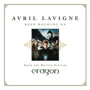

Keep Holding On
============================

|  |  |
| :--: | :-- |
| [ Keep Holding On](https://emumo.xiami.com/album/380817) | **艺人**: [Avril Lavigne](../index.md) **语种**: 英语 **唱片公司**: RCA **发行时间**: 2006年11月27日 **专辑类别**: EP, 单曲 **专辑风格**: 流行朋克 Pop Punk, 欧美流行 Western Pop **播放数**: 318282 **收藏数**: 272 **评论数**: 24  |

## 简介

Avril Lavigne 在靠近2006年末的时候发行最新单曲专辑[Keep Holding On]! 在2006年,Avril Lavigne几乎沉浸在新婚的幸福海洋中(她于7月份与Sum 41的主唱Deryck Whibley结婚) .这首Keep Holding On也是魔幻影片”Eragon-伊拉龙”的主题曲. 这首歌曲由执行制作”Since U Been Gone”的制作人Dr. Luke监制,作品的调调完美契合影片,Lavigne 唱道:”keep holding on/ ‘Cause you know I’ll make it through.” 接招吧,喷火的巨龙们!  
  
"Keep Holding On" is a power ballad recorded by Canadian singer-songwriter Avril Lavigne and is the theme song for the 2006 film Eragon. It also appears as the last track on Lavigne's third studio album, The Best Damn Thing, which was released on April 17, 2007. Lavigne has described the rest of the album as being upbeat and heavy in comparison to "Keep Holding On". Originally, an alternate version was to be included, but the original version made it instead.  
  
The song was written by Lavigne and Lukasz "Dr. Luke" Gottwald; Luke also produced the single. It was the first single from the soundtrack and premiered on radio stations across North America in November 2006, receiving positive reviews from critics. "Keep Holding On" was one of the songs short-listed for the "Best Original Song" category at the 79th Academy Awards, but it was not among the final nominees. The song was also ranked on the iTunes Australia top 500 at 403.（wiki）

## 曲目

## 评论

|  |  |  |
| :-- | :-- | :-- |
|  [虾米用户](https://emumo.xiami.com/u/3781978) 君の涙に触れたいよ。 2019-06-28 20:22 赞(0) 踩(0) | 
当年为了这首歌去找了电影来着
 |
|  [虾米用户](https://emumo.xiami.com/u/310624831)  2019-03-09 16:28 赞(0) 踩(0) | 
好听
 |
|  [虾米用户](https://emumo.xiami.com/u/310624831)  2019-03-09 16:28 赞(0) 踩(0) | 
好听
 |
|  [虾米用户](https://emumo.xiami.com/u/404627987) Long affecti... 2019-02-16 01:00 赞(0) 踩(0) | 
爱
 |
|  [虾米用户](https://emumo.xiami.com/u/20177386) 感谢一切美好的遇见❤️ 2018-04-14 01:52 赞(0) 踩(0) | 

 |
|  [虾米用户](https://emumo.xiami.com/u/7322777) ∮ 2015-10-01 22:07 赞(0) 踩(0) | 
...A...
 |
|  [虾米用户](https://emumo.xiami.com/u/4851378)  2014-02-21 11:43 赞(0) 踩(0) | 
声音有张力。
 |
|  [虾米用户](https://emumo.xiami.com/u/8720305)  2012-04-03 19:31 赞(0) 踩(0) | 
b
 |
|  [虾米用户](https://emumo.xiami.com/u/8151191)  2012-03-21 23:55 赞(0) 踩(0) | 
Good to keep something up!
 |
|  [虾米用户](https://emumo.xiami.com/u/7268527) LosMerengues 2011-12-17 04:05 赞(0) 踩(0) | 
很好听的歌啊~~~
 |
|  [虾米用户](https://emumo.xiami.com/u/4074037)  2011-05-27 23:34 赞(0) 踩(0) | 
龙骑士的主题曲！爱电影，也爱这首歌。哪位好淫送我《帝国》下啊……
 |
| ⇒ |  [虾米用户](https://emumo.xiami.com/u/2348731)   2011-07-23 17:31 赞(0) 踩(0) | 
再等一年左右吧，中文版慢英文版几拍（何止是几拍--）也差不多能出来了。
 |
| ⇒ |  [虾米用户](https://emumo.xiami.com/u/4074037)  2011-07-26 16:50 赞(0) 踩(0) | 
<q><b>VIY说：</b></q>
 |
| ⇒ |  [虾米用户](https://emumo.xiami.com/u/2348731)   2011-07-30 20:05 赞(0) 踩(0) | 
<q><b>kimi说：</b></q>
 |
| ⇒ |  [虾米用户](https://emumo.xiami.com/u/4074037)  2011-07-30 23:41 赞(0) 踩(0) | 
<q><b>VIY说：</b></q>
 |
|  [虾米用户](https://emumo.xiami.com/u/355865) Let it go, l... 2011-05-27 14:06 赞(0) 踩(0) | 
合格320K
 |
|  [虾米用户](https://emumo.xiami.com/u/3762843)  2011-05-06 15:07 赞(0) 踩(0) | 
like
 |
|  [虾米用户](https://emumo.xiami.com/u/3790168)  2011-04-30 23:22 赞(0) 踩(0) | 
喜欢没有为什么
 |
|  [虾米用户](https://emumo.xiami.com/u/2379789)   2011-01-03 14:23 赞(0) 踩(0) | 
keep holding on 是我最喜欢的歌，当我挫败的时候，听这首歌就觉得很有力量
 |
|  [虾米用户](https://emumo.xiami.com/u/877353)  2010-10-12 13:44 赞(0) 踩(0) | 
多出点新歌哇~~~等的好急~~~
 |
|  [虾米用户](https://emumo.xiami.com/u/1495695)  2010-09-19 22:03 赞(0) 踩(0) | 
每次听的时候 都很困
 |
|  [虾米用户](https://emumo.xiami.com/u/788818)  2010-09-19 21:11 赞(0) 踩(0) | 
貌似听过啊~
 |
|  [虾米用户](https://emumo.xiami.com/u/788818)  2010-09-19 21:11 赞(0) 踩(0) | 
有点晕，怎么这么短啊~~
 |
| ⇒ |  [虾米用户](https://emumo.xiami.com/u/355865) Let it go, l... 2010-11-14 15:06 赞(0) 踩(0) | 
第二首是铃音版，只有10秒，没有问题~
 |
