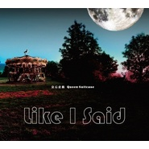

Like I Said
============================

|  |  |
| :--: | :-- |
| [ Like I Said](https://emumo.xiami.com/album/2100243928) | **艺人**: [皇后皮箱](../index.md) **语种**: 国语 **唱片公司**: StreetVoice **发行时间**: 2015年12月04日 **专辑类别**: EP, 单曲 **专辑风格**:  **播放数**: 31870 **收藏数**: 58 **评论数**: 6  |

## 简介

皇后皮箱2008年组团以来的第一张单曲,累积了这两年的智慧,创作出这张全方位的抱怨单曲。就像一部黑色喜剧,用轻鬆幽默的方式带过我们苦闷的生活,这就是皇后皮箱善用的独特诉说方式。

## 曲目

## 评论

|  |  |  |  |
| :-- | :-- | :-- | :-- |
|  [虾米用户](https://emumo.xiami.com/u/416871305) 最难的三个字其实是“无所... 2019-08-04 11:31 赞(0) 踩(0) | 
棒
 |
|  [虾米用户](https://emumo.xiami.com/u/346165752)  2019-03-15 09:01 赞(0) 踩(0) | 
(´▽｀)ノ♪
 |
|  [虾米用户](https://emumo.xiami.com/u/40932624) comfortably ... 2018-10-23 23:46 赞(0) 踩(0) | 
Es muy bueno
 |
|  [虾米用户](https://emumo.xiami.com/u/1606265) 其实我们没有签名啊！ 2015-12-07 11:53 赞(0) 踩(0) | 
大赞！！！
 |
|  [虾米用户](https://emumo.xiami.com/u/11421497) dont act lik... 2015-12-04 18:18 赞(0) 踩(0) | 
马
 |
|  [虾米用户](https://emumo.xiami.com/u/16255463) @Revolution9... 2015-12-04 18:00 赞(0) 踩(0) | 

 |
