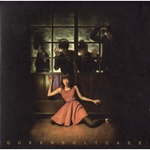

皇后皮箱
============================

|  |  |
| :--: | :-- |
| [ 皇后皮箱](https://i.xiami.com/queensuitcase) | **地区**: Taiwan, PRC 中国台湾 **风格**: 另类摇滚 Alternative Rock **播放数**: 2413063 **粉丝数**: 9513 **评论数**: 116  |

## 档案

台湾的独立乐团，成员包括主唱兼键盘手卡菈、主唱兼吉他手阿怪，与贝斯手黑轮。   2008   年成团，  2010   发行   EP  《  Like I Said  》，  2013   发行   EP  《  Killer.B  》。   2014   年发行首张专辑，带着复古曲风的《超时空歌女的快活》，入围金音创作奖多项奖项，以〈人间惆怅客〉得到最佳摇滚单曲奖。     睽违四年，闭关修行期间受饶富韵味的老庄哲理影响至深，创作随见新意与巧思。将于   2018   十月发行新专辑》。   weibo  ：皇后皮箱

## 专辑

| 名称 | 语种 | 唱片公司 | 发行时间 | 专辑类别 | 专辑风格 |
| :--: | :-- | :-- | :-- | :-- | :-- |
| [ 仙人指路](./albums/2104092515.md) | 国语 | StreetVoice | 2018年10月12日 | 录音室专辑 | 另类摇滚 Alternative Rock |
| [ Killer.B／Maybe It's the Way It Will Be](./albums/2100243940.md) | 国语 | StreetVoice | 2015年12月04日 | EP, 单曲 | 冲浪摇滚 Surf Rock, 摩城 Motown |
| [ Like I Said](./albums/2100243928.md) | 国语 | StreetVoice | 2015年12月04日 | EP, 单曲 |  |
| [ 超时空歌女的快活](./albums/905306176.md) | 国语 | 独立发行 | 2014年07月21日 | 录音室专辑 | 英伦摇滚 Britpop, 迷幻摇滚 Psychedelic Rock, 冲浪摇滚 Surf Rock |

## 评论

|  |  |  |
| :-- | :-- | :-- |
|  [虾米用户](https://emumo.xiami.com/u/340903899) 我还没想好要写什么... 2020-08-14 11:53 赞(0) 踩(0) | 
，
 |
|  [虾米用户](https://emumo.xiami.com/u/215379991) 簽名不重要重要的是你聽什... 2020-07-28 01:10 赞(0) 踩(0) | 
ﻌﻌﻌ❤︎
 |
|  [虾米用户](https://emumo.xiami.com/u/379162683) 我想要记住你们，我想要你... 2020-07-26 16:35 赞(0) 踩(0) | 

 |
|  [虾米用户](https://emumo.xiami.com/u/10400602)  2019-11-19 12:44 赞(0) 踩(0) | 
借鉴一些原曲也挺正常，但还是要自己创作，否则人生不是太单调了吗？
 |
|  [虾米用户](https://emumo.xiami.com/u/27978621)   2019-10-19 00:39 赞(1) 踩(0) | 
好听就行了，抄也是抄的好啊
 |
| ⇒ |  [虾米用户](https://emumo.xiami.com/u/37587235)  2019-10-26 12:27 赞(0) 踩(0) | 
？？？
 |
| ⇒ |  [虾米用户](https://emumo.xiami.com/u/2491956) 我还没想好要写什么... 2019-11-08 01:09 赞(0) 踩(0) | 
三观很变态
 |
| ⇒ |  [虾米用户](https://emumo.xiami.com/u/42825529)  2019-12-12 09:46 赞(0) 踩(0) | 
哇，里这个人？ 问题不是一点点大。
 |
|  [虾米用户](https://emumo.xiami.com/u/20090719)   2019-08-28 00:21 赞(1) 踩(0) | 
copycat
 |
|  [虾米用户](https://emumo.xiami.com/u/32782633) “你心中有多少温柔才不会... 2019-08-04 23:16 赞(0) 踩(0) | 
用鼻子一闻就知道是我的菜～ 
 |
|  [虾米用户](https://emumo.xiami.com/u/439968) -_- 2019-08-03 13:59 赞(1) 踩(0) | 
乐夏请请透明杂志 甜梅号 雀斑他们啊
 |
|  [虾米用户](https://emumo.xiami.com/u/344018512) 我还没想好要写什么... 2019-08-02 08:52 赞(0) 踩(0) | 

 |
|  [虾米用户](https://emumo.xiami.com/u/3057399) 朝闻道，夕死可矣。 2019-07-24 01:55 赞(0) 踩(0) | 
有点冲浪摇滚+迷幻
 |
|  [虾米用户](https://emumo.xiami.com/u/344018512) 我还没想好要写什么... 2019-07-05 00:38 赞(0) 踩(0) | 
D
 |
|  [虾米用户](https://emumo.xiami.com/u/286941754) 无挂碍故，无有恐怖 2019-07-04 23:53 赞(0) 踩(0) | 

 |
|  [虾米用户](https://emumo.xiami.com/u/373322292)  2019-07-03 19:54 赞(0) 踩(0) | 
加油？
 |
|  [虾米用户](https://emumo.xiami.com/u/1450620) 我是玛丽杨 2019-07-01 11:02 赞(1) 踩(0) | 
我去抄的这么明显 你也是很大胆啊！！就是仗着自己不火就乱来？
 |
|  [虾米用户](https://emumo.xiami.com/u/42963872) 我还没想好要写什么... 2019-06-25 14:03 赞(3) 踩(0) | 
希望停止抄袭。谢谢。
 |
| ⇒ |  [虾米用户](https://emumo.xiami.com/u/400556694) 还没想好要说什么 2020-12-03 13:15 赞(0) 踩(0) | 
和白亦初一样
 |
|  [虾米用户](https://emumo.xiami.com/u/359389677)  2019-06-11 18:21 赞(1) 踩(0) | 
何止楼上几位老哥说的那几只……美丽小鸟一去无影踪~
 |
|  [虾米用户](https://emumo.xiami.com/u/3679082)   2019-06-10 05:45 赞(1) 踩(0) | 
原来是抄袭，怪不得觉得歌词跟编曲一点都不协调。哎。
 |
|  [虾米用户](https://emumo.xiami.com/u/5991296)  2019-06-03 00:19 赞(0) 踩(0) | 
會火的
 |
|  [虾米用户](https://emumo.xiami.com/u/43031293) 嗨皮嗨皮～～ 2019-06-02 09:42 赞(1) 踩(0) | 
希望你们有更多自己的东西
 |
|  [虾米用户](https://emumo.xiami.com/u/43031293) 嗨皮嗨皮～～ 2019-06-02 09:41 赞(27) 踩(0) | 
人间惆怅客也跟the lords of the new church的open your eyes一模一样……那么多旋律、曲风可以创作，为啥偏跟这两首一样？说不过去了啊…… 难怪乐队的夏天里节目里，嘉宾评价他们在人间惆怅客里只表现了过去的东西，并没有他们自己的东西，原来是这样，嘉宾真委婉给面子……
 |
| ⇒ |  [虾米用户](https://emumo.xiami.com/u/1450620) 我是玛丽杨 2019-07-01 10:59 赞(0) 踩(0) | 
难怪我觉得这首好耳熟...
 |
| ⇒ |  [虾米用户](https://emumo.xiami.com/u/216784802) 好的音乐最重要的是真实，... 2020-07-10 07:38 赞(0) 踩(0) | 
歌词不是自己的东西吗？
 |
|  [虾米用户](https://emumo.xiami.com/u/327952880) Waldeinsamke... 2019-05-30 18:09 赞(0) 踩(0) | 
广州7.13！
 |
|  [虾米用户](https://emumo.xiami.com/u/340903899) 我还没想好要写什么... 2019-05-29 17:54 赞(0) 踩(0) | 
。
 |
|  [虾米用户](https://emumo.xiami.com/u/603294)  2019-05-27 13:47 赞(0) 踩(0) | 
一个节目救了一支乐队系列
 |
|  [虾米用户](https://emumo.xiami.com/u/302564180) koc 2019-05-26 20:58 赞(37) 踩(0) | 
抄的挺全啊我说 从AM抄到the last shadow puppets 我寻思你们还挺本质粉哈 喜欢人间惆怅客的人建议去听一下经典英摇乐队北极猴的crying lightning 有惊喜哦！
 |
| ⇒ |  [虾米用户](https://emumo.xiami.com/u/35041309) 烦忧无门，惟人自扰。 2019-05-28 10:02 赞(0) 踩(0) | 
不要说出来嘛哈哈哈 
 |
| ⇒ |  [虾米用户](https://emumo.xiami.com/u/2801999) 经常失踪的酱油瓶 2019-06-03 22:01 赞(0) 踩(0) | 
所以张亚东可能也是这个意思？
 |
|  [虾米用户](https://emumo.xiami.com/u/42963872) 我还没想好要写什么... 2019-05-26 18:55 赞(1) 踩(0) | 
卡拉眼睛大大
 |
| ⇒ |  [虾米用户](https://emumo.xiami.com/u/1033648) 魔都摇滚电子老帮瓜 2019-06-24 11:00 赞(0) 踩(0) | 
厄齐尔
 |
|  [虾米用户](https://emumo.xiami.com/u/85148548)  2019-05-26 12:44 赞(0) 踩(0) | 
哇
 |
|  [虾米用户](https://emumo.xiami.com/u/13716085) 一颗被爱的蛋宝宝 2019-05-26 12:07 赞(0) 踩(0) | 
牛了逼了
 |
|  [虾米用户](https://emumo.xiami.com/u/18641890)  2019-05-26 09:57 赞(0) 踩(0) | 
圈粉了
 |
|  [虾米用户](https://emumo.xiami.com/u/38662280) 不懂装懂中度患者 2019-05-25 21:25 赞(1) 踩(0) | 
乐队的夏天翻到的宝，期待未来有机会来南京
 |
|  [虾米用户](https://emumo.xiami.com/u/306397541) 我不配得到自由 2019-05-19 12:25 赞(0) 踩(0) | 
在乐队的夏天加油哦！会红的!
 |
|  [虾米用户](https://emumo.xiami.com/u/30074304) 寄蜉蝣于天地，渺沧海之一... 2019-03-19 12:02 赞(0) 踩(0) | 
✈
 |
|  [虾米用户](https://emumo.xiami.com/u/346165752)  2019-03-15 09:01 赞(0) 踩(0) | 
ヾ(^▽^*)))
 |
|  [虾米用户](https://emumo.xiami.com/u/126730484) 「 能够向你坦诚的只有我... 2019-02-25 13:27 赞(0) 踩(0) | 
来杭州吧！   
 |
|  [虾米用户](https://emumo.xiami.com/u/47552910) 安静点吧 2018-11-14 21:52 赞(1) 踩(0) | 
乐队名字好朋克
 |
|  [虾米用户](https://emumo.xiami.com/u/52395373) 我还没想好要写什么... 2018-11-05 19:17 赞(0) 踩(0) | 
。
 |
|  [虾米用户](https://emumo.xiami.com/u/32054541) 我的知音都死光了。 2018-10-09 04:32 赞(1) 踩(0) | 
期待新专辑！！！爱黑轮呀！！！   
 |
|  [虾米用户](https://emumo.xiami.com/u/13934354) 人民艺术家 2018-10-08 12:31 赞(1) 踩(0) | 
新专辑 冲呀
 |
|  [虾米用户](https://emumo.xiami.com/u/71178106) 塵世や 酒、風呂を抜け ... 2018-10-04 22:50 赞(0) 踩(0) | 
♡
 |
|  [虾米用户](https://emumo.xiami.com/u/11751010) 感謝 人生無常 這回事。 2018-05-26 05:54 赞(1) 踩(0) | 
他們的歌啊 目前來説水平稍微有點參差不齊...不過 有幾首還是非常棒的
 |
|  [虾米用户](https://emumo.xiami.com/u/20177386) 感谢一切美好的遇见❤️ 2018-04-25 17:45 赞(0) 踩(0) | 

 |
|  [虾米用户](https://emumo.xiami.com/u/264283064) bye  2018-02-22 18:24 赞(0) 踩(0) | 
△
 |
|  [虾米用户](https://emumo.xiami.com/u/25986892) 最多12个字符 2017-11-15 21:01 赞(0) 踩(0) | 
有。。。Bambi Molesters的感觉
 |
|  [虾米用户](https://emumo.xiami.com/u/232148750)  2017-11-11 17:13 赞(0) 踩(0) | 

 |
|  [虾米用户](https://emumo.xiami.com/u/247358999) 在荒野上跳舞 2017-10-03 07:31 赞(0) 踩(0) | 

 |
|  [虾米用户](https://emumo.xiami.com/u/83893196) 我还没想好要写什么... 2017-08-15 19:12 赞(0) 踩(0) | 

 |
|  [虾米用户](https://emumo.xiami.com/u/188827502)  2017-06-22 17:20 赞(1) 踩(0) | 
牛逼
 |
|  [虾米用户](https://emumo.xiami.com/u/211088760) 我还没想好要写什么... 2017-04-09 11:20 赞(1) 踩(0) | 
大爱
 |
|  [虾米用户](https://emumo.xiami.com/u/49748006) Fly me to th... 2017-02-16 17:43 赞(1) 踩(0) | 
“”
 |
|  [虾米用户](https://emumo.xiami.com/u/16135450)  2016-12-22 00:15 赞(0) 踩(0) | 
6802
 |
|  [虾米用户](https://emumo.xiami.com/u/13601734) 分享你 2016-12-06 02:17 赞(0) 踩(0) | 
猴
 |
|  [虾米用户](https://emumo.xiami.com/u/61284900) 快乐生活 2016-10-24 23:43 赞(0) 踩(0) | 
惊叹
 |
|  [虾米用户](https://emumo.xiami.com/u/45385073) 爱虾米期待再相遇为新：t... 2016-07-17 21:10 赞(0) 踩(0) | 
get
 |
|  [虾米用户](https://emumo.xiami.com/u/11957803)  2016-05-16 22:37 赞(0) 踩(0) | 
主唱眼睛好大~~
 |
|  [虾米用户](https://emumo.xiami.com/u/17326367) 爱就是极快速的能量振动 2016-04-19 23:35 赞(0) 踩(0) | 
哈哈 简直了
 |
|  [虾米用户](https://emumo.xiami.com/u/56750)  2016-03-27 23:05 赞(2) 踩(0) | 
Arctic Monkeys——Crying Lightning跟人间惆怅客，如此相似？<a href="http://www.xiami.com/widget/56750_1773348105/singlePlayer.swf" target="_blank" rel="nofollow noreferrer noopener">http://www.xiami.com/widget/56750_1773348105/singlePlayer.swf</a>
 |
|  [虾米用户](https://emumo.xiami.com/u/7719989) 保持距離。 2016-03-24 10:34 赞(0) 踩(0) | 

 |
|  [虾米用户](https://emumo.xiami.com/u/31894565) 转移了 2016-03-17 12:25 赞(0) 踩(0) | 
实在不喜欢主唱特别湾湾的吐字
 |
| ⇒ |  [虾米用户](https://emumo.xiami.com/u/7375384) Ծ ̮ Ծ 好好听歌 听... 2016-06-17 02:49 赞(0) 踩(0) | 
捉
 |
|  [虾米用户](https://emumo.xiami.com/u/51489347) 嘘  只准偷偷看我 2016-03-14 22:07 赞(1) 踩(0) | 
加油！好听
 |
|  [虾米用户](https://emumo.xiami.com/u/6262351) 这家伙很聪明什么也没留下... 2016-03-12 15:04 赞(0) 踩(0) | 
又miss掉了一场好live 
 |
|  [虾米用户](https://emumo.xiami.com/u/32667975) 暂无签名~ 2016-03-05 13:03 赞(0) 踩(0) | 
唱腔不炫技的乐队。好听
 |
|  [虾米用户](https://emumo.xiami.com/u/32667975) 暂无签名~ 2016-03-05 13:02 赞(0) 踩(0) | 
最爱人间惆怅客的词和唱
 |
|  [虾米用户](https://emumo.xiami.com/u/51865794) 我还没想好要写什么... 2016-02-26 23:16 赞(0) 踩(0) | 
:-\
 |
|  [虾米用户](https://emumo.xiami.com/u/54583815) 一点都不神圣 2016-02-23 01:42 赞(1) 踩(0) | 
感觉很配昆汀的电影
 |
|  [虾米用户](https://emumo.xiami.com/u/47365062) windy 2016-01-02 13:14 赞(1) 踩(0) | 
总觉得中文歌比英文歌好 
 |
|  [虾米用户](https://emumo.xiami.com/u/8192862) 诗人和先知。vchat:... 2015-11-25 12:19 赞(1) 踩(0) | 
相见恨晚啊丢！ 1031竟然去了SD。就这样错过了。捶胸。
 |
|  [虾米用户](https://emumo.xiami.com/u/37116263) 揸緊中指，摇擺 2015-11-21 14:47 赞(2) 踩(0) | 
jim老占推荐听的，女声包括曲风让我想起了台湾女歌手林晓培她有部份曲风类似，这队音乐玩得像大牌非常成熟，特别是编曲方面耐听性极高要细品
 |
|  [虾米用户](https://emumo.xiami.com/u/16255463) @Revolution9... 2015-10-21 21:33 赞(2) 踩(0) | 
主唱光环
 |
|  [虾米用户](https://emumo.xiami.com/u/33124004) EXO-L 2015-10-15 13:29 赞(1) 踩(0) | 
这大概是我听过第四个叫「偶 len」的人了 。
 |
|  [虾米用户](https://emumo.xiami.com/u/10217548) Hi ：） 2015-10-06 11:29 赞(1) 踩(0) | 
黑轮好帅！
 |
|  [虾米用户](https://emumo.xiami.com/u/7926830)   淘氣 2015-10-06 11:24 赞(0) 踩(0) | 

 |
|  [虾米用户](https://emumo.xiami.com/u/1728101) 离线 2015-09-28 16:13 赞(9) 踩(0) | 
10月30日 香港 HIDDEN AGENDA 10月31日 广州 SD Livehouse 11月1日 长沙 红咖Livehouse 11月3日 武汉 VOX Livehouse 11月4日 苏州 后街酒吧 11月6日 上海 ON STAGE
 |
| ⇒ |  [虾米用户](https://emumo.xiami.com/u/1871959)   2017-06-30 12:27 赞(0) 踩(0) | 
今年还有咩
 |
| ⇒ |  [虾米用户](https://emumo.xiami.com/u/445929898)  2020-11-13 10:25 赞(0) 踩(0) | 
姜育恒都
 |
|  [虾米用户](https://emumo.xiami.com/u/33892529) 孤独终老 独善其身 2015-09-01 18:33 赞(0) 踩(0) | 
特别 复古
 |
|  [虾米用户](https://emumo.xiami.com/u/17326367) 爱就是极快速的能量振动 2015-08-29 09:39 赞(1) 踩(0) | 
总想为他们写点什么啊！
 |
|  [虾米用户](https://emumo.xiami.com/u/8439356) 呦喂搞什么 2015-08-01 03:13 赞(0) 踩(0) | 
最爱复古风！！！
 |
|  [虾米用户](https://emumo.xiami.com/u/48621783) 微信联系 Sacred-... 2015-07-31 21:44 赞(0) 踩(0) | 
补√
 |
|  [虾米用户](https://emumo.xiami.com/u/9080508) 可知道 你的光 耀了我 2015-05-26 20:33 赞(0) 踩(0) | 
❤
 |
|  [虾米用户](https://emumo.xiami.com/u/50240021)  2015-05-26 05:15 赞(66) 踩(0) | 
我刚入驻了虾米音乐人，欢迎大家来我的个人主页，收听我的最新音乐
 |
| ⇒ |  [虾米用户](https://emumo.xiami.com/u/9214331)  2015-06-12 17:35 赞(0) 踩(0) | 
欢迎啊～支持你们哦！
 |
| ⇒ |  [虾米用户](https://emumo.xiami.com/u/5132011) 我繼續  你要隨意 2015-07-10 16:43 赞(0) 踩(0) | 
好~~
 |
| ⇒ |  [虾米用户](https://emumo.xiami.com/u/50544094) 不管遇到什么事，❤都不会... 2015-07-30 12:35 赞(0) 踩(0) | 
喜欢这种风格 加油～
 |
| ⇒ |  [虾米用户](https://emumo.xiami.com/u/35753135)  2015-10-23 14:49 赞(0) 踩(0) | 

 |
| ⇒ |  [虾米用户](https://emumo.xiami.com/u/42428041)  2017-12-25 17:25 赞(0) 踩(0) | 
好听！
 |
| ⇒ |  [虾米用户](https://emumo.xiami.com/u/320865992) 我还没想好要写什么... 2019-03-14 13:35 赞(0) 踩(0) | 
三年前的你、今天的我、刚听到的歌，使我决定了，喜欢上你们乐队风格，come on!
 |
|  [虾米用户](https://emumo.xiami.com/u/119477) 我还没想好要写什么... 2015-05-22 20:49 赞(0) 踩(0) | 
欢迎
 |
|  [虾米用户](https://emumo.xiami.com/u/1223357) 疲于抒情后的抒情方式 2015-05-05 03:51 赞(1) 踩(0) | 
有点tizzy bac的感觉？
 |
| ⇒ |  [虾米用户](https://emumo.xiami.com/u/36165303) 喜欢李沧东的薄荷糖 也喜... 2015-09-21 22:13 赞(0) 踩(0) | 
Tizzy Bac比他们好多了好咩_(:зゝ∠)_
 |
| ⇒ |  [虾米用户](https://emumo.xiami.com/u/8192862) 诗人和先知。vchat:... 2015-11-25 12:18 赞(0) 踩(0) | 
不是同一个风格的惹。
 |
|  [虾米用户](https://emumo.xiami.com/u/27686739) 报之以歌 2015-03-27 13:33 赞(1) 踩(0) | 
炒鸡棒
 |
|  [虾米用户](https://emumo.xiami.com/u/9378804) 活成狗 2015-03-26 19:40 赞(1) 踩(0) | 
会火的
 |
|  [虾米用户](https://emumo.xiami.com/u/31749205)  2014-12-14 20:44 赞(0) 踩(0) | 
******
 |
|  [虾米用户](https://emumo.xiami.com/u/4400366) 再也不见 2014-11-07 01:07 赞(0) 踩(0) | 
。
 |
|  [虾米用户](https://emumo.xiami.com/u/16396825) do you ? 2014-09-29 16:38 赞(0) 踩(0) | 
0.0
 |
|  [虾米用户](https://emumo.xiami.com/u/6204062)  2014-09-19 15:26 赞(0) 踩(0) | 
让我深深以为我是一颗70年代的灵魂
 |
|  [虾米用户](https://emumo.xiami.com/u/3865034) ig:linkinhay... 2014-09-07 05:09 赞(0) 踩(0) | 
快来大陆快来深圳
 |
|  [虾米用户](https://emumo.xiami.com/u/4370951)  2014-08-07 10:05 赞(0) 踩(0) | 
对胃口的调调~
 |
|  [虾米用户](https://emumo.xiami.com/u/665580)   2014-07-25 16:41 赞(0) 踩(0) | 
终于有专辑了~
 |
|  [虾米用户](https://emumo.xiami.com/u/18940951) 上个月说的话这个月看了就... 2014-06-20 13:11 赞(2) 踩(0) | 
慵懒迷幻我的菜
 |
|  [虾米用户](https://emumo.xiami.com/u/166121) 不正疑惑 2013-05-10 14:34 赞(1) 踩(0) | 
<a href="http://www.indievo" target="_blank" rel="nofollow noreferrer noopener">http://www.indievo</a>**m/disc/5789，抢先试听
 |
|  [虾米用户](https://emumo.xiami.com/u/12522623)  2013-01-19 21:22 赞(2) 踩(0) | 
歌聲美，音樂搭配好，風格讚
 |
|  [虾米用户](https://emumo.xiami.com/u/11006553)  2012-10-24 20:20 赞(44) 踩(0) | 
主唱是我的國中同學XD
 |
| ⇒ |  [虾米用户](https://emumo.xiami.com/u/2370328)  2013-05-23 10:26 赞(0) 踩(0) | 
咦 台湾人民也上虾米
 |
| ⇒ |  [虾米用户](https://emumo.xiami.com/u/216784802) 好的音乐最重要的是真实，... 2018-09-06 08:30 赞(0) 踩(0) | 
<q><b>炭炭说：</b></q>
 |
|  [虾米用户](https://emumo.xiami.com/u/5753900)  2011-09-13 23:03 赞(0) 踩(0) | 
通过黑市音乐那张合辑认识的乐队 女主唱的懒懒音调 像是鱼里的青花椒 挺入味儿的
 |
|  [虾米用户](https://emumo.xiami.com/u/317561) 一天早上，听见有人敲了敲... 2011-08-12 11:27 赞(1) 踩(0) | 
怎么没歌的？~
 |
