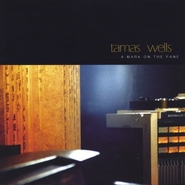

A Mark On the Pane
============================

|  |  |
| :--: | :-- |
| [ A Mark On the Pane](https://emumo.xiami.com/album/168520) | **艺人**: [Tamas Wells](../index.md) **语种**: 英语 **唱片公司**: 口袋唱片 **发行时间**: 2004年01月01日 **专辑类别**: 录音室专辑 **专辑风格**: 民谣流行 Folk Pop, 根源唱作人 Singer-Songwriter **播放数**: 521023 **收藏数**: 1391 **评论数**: 63  |

## 简介

tamas wells的第一张个人专辑，经过口袋音乐的引进，与Popboomerang发行的版本相比，增加了六首歌。  
《amas wells：A MARK ON THE PAN》纤静，优美，耳目一新。听着Tamas Wells总是容易想起那些骑着单车四处游荡无忧无虑的校园时光，如此纯净美好的声音，不着迷都不行。04年第一张专辑"A Mark On The Pane"曾被评为当年最美的唱片之一，绝对值得听一听。

## 曲目

## 评论

|  |  |  |  |
| :-- | :-- | :-- | :-- |
|  [虾米用户](https://emumo.xiami.com/u/210797776)  2017-07-14 15:17 赞(0) 踩(0) | 
今天晚上，八点，厦门现场见
 |
|  [虾米用户](https://emumo.xiami.com/u/284823948)  2017-06-22 11:36 赞(0) 踩(0) | 
清风拂面，听出了随心所欲的感觉1
 |
|  [虾米用户](https://emumo.xiami.com/u/7322777) ∮ 2015-10-05 04:24 赞(0) 踩(0) | 
...A...
 |
|  [虾米用户](https://emumo.xiami.com/u/30194412) 我还没想好要写什么... 2014-09-20 19:23 赞(0) 踩(0) | 
wow....
 |
|  [虾米用户](https://emumo.xiami.com/u/6782681)  2014-09-17 16:11 赞(0) 踩(0) | 
舒缓音乐
 |
|  [虾米用户](https://emumo.xiami.com/u/37661533)  2014-06-16 21:51 赞(0) 踩(0) | 
清新,早上放
 |
|  [虾米用户](https://emumo.xiami.com/u/1028480)  2014-05-11 22:11 赞(0) 踩(0) | 
空灵的声音
 |
|  [虾米用户](https://emumo.xiami.com/u/11829694) 永远年轻，永远热泪盈眶 2014-02-14 10:09 赞(0) 踩(0) | 
下一曲，就是你 （听歌列表）
 |
|  [虾米用户](https://emumo.xiami.com/u/4757808)  2013-11-27 20:42 赞(0) 踩(0) | 
tamas wells的第一张个人专辑,
 |
|  [虾米用户](https://emumo.xiami.com/u/26004763)  2013-11-09 12:33 赞(0) 踩(0) | 
如此好听
 |
|  [虾米用户](https://emumo.xiami.com/u/16753750) 梅 2013-10-11 13:47 赞(0) 踩(0) | 
听了才舒服，心如止水。
 |
|  [虾米用户](https://emumo.xiami.com/u/20995337)  2013-09-28 18:41 赞(0) 踩(0) | 
心如止水
 |
|  [虾米用户](https://emumo.xiami.com/u/15511079) 咖喱饭哦_(￣0￣)_ 2013-05-30 23:53 赞(0) 踩(0) | 
对声音因一见钟情
 |
|  [虾米用户](https://emumo.xiami.com/u/15369060)  2013-05-30 21:36 赞(0) 踩(0) | 
Tamas Wells 的第一张个人专辑
 |
|  [虾米用户](https://emumo.xiami.com/u/13548423)  2013-04-14 10:55 赞(0) 踩(0) | 
轻。忧伤
 |
|  [虾米用户](https://emumo.xiami.com/u/13728904)  2013-04-07 23:40 赞(0) 踩(0) | 
最美的专辑
 |
|  [虾米用户](https://emumo.xiami.com/u/10294893) XXX 2013-02-05 20:47 赞(0) 踩(0) | 
41 Union Drive和stitch in time不错
 |
|  [虾米用户](https://emumo.xiami.com/u/4164633)  2012-10-28 20:41 赞(0) 踩(0) | 
tamas wells
 |
|  [虾米用户](https://emumo.xiami.com/u/7806545)  2012-09-20 20:51 赞(0) 踩(0) | 
jj
 |
|  [虾米用户](https://emumo.xiami.com/u/10294893) XXX 2012-08-20 21:29 赞(0) 踩(0) | 
发觉进口的几首好听。
 |
|  [虾米用户](https://emumo.xiami.com/u/6326042) 幻象长廊 夏日迷津 2012-08-15 08:43 赞(0) 踩(0) | 
moe project
 |
|  [虾米用户](https://emumo.xiami.com/u/7675421) 立志成为一名职业鼓手 2012-08-09 13:27 赞(0) 踩(0) | 
好赞
 |
|  [虾米用户](https://emumo.xiami.com/u/8529763)  2012-07-15 22:45 赞(0) 踩(0) | 
一首歌的寻找
 |
|  [虾米用户](https://emumo.xiami.com/u/8652349)  2012-05-19 01:06 赞(0) 踩(0) | 
简单舒缓的旋律 轻柔动人的嗓音 最美的专辑。
 |
|  [虾米用户](https://emumo.xiami.com/u/8819856)  2012-04-21 00:31 赞(0) 踩(0) | 
清新的民谣
 |
|  [虾米用户](https://emumo.xiami.com/u/5905291)  2012-03-17 14:29 赞(0) 踩(0) | 
好听
 |
|  [虾米用户](https://emumo.xiami.com/u/601978)  2012-03-06 13:04 赞(0) 踩(0) | 
tamas wells的第一张专辑。
 |
|  [虾米用户](https://emumo.xiami.com/u/6762360)  2012-02-25 19:12 赞(0) 踩(0) | 
好听
 |
|  [虾米用户](https://emumo.xiami.com/u/6121541) 暂无签名~ 2012-01-20 16:08 赞(0) 踩(0) | 
like  it~
 |
|  [虾米用户](https://emumo.xiami.com/u/7052092)  2011-12-08 21:42 赞(0) 踩(0) | 
好听~
 |
|  [虾米用户](https://emumo.xiami.com/u/3210136)  2011-11-30 10:53 赞(0) 踩(0) | 
轻弹轻唱
 |
|  [虾米用户](https://emumo.xiami.com/u/3583943)  2011-11-20 22:12 赞(0) 踩(0) | 
来自05的回忆
 |
|  [虾米用户](https://emumo.xiami.com/u/6156282)  2011-10-16 18:52 赞(0) 踩(0) | 
很喜欢！
 |
|  [虾米用户](https://emumo.xiami.com/u/5998402)  2011-10-15 17:40 赞(0) 踩(0) | 
好听的声音 和舒服的调调
 |
|  [虾米用户](https://emumo.xiami.com/u/6162025)  2011-10-09 10:39 赞(0) 踩(0) | 
嘎嘎
 |
|  [虾米用户](https://emumo.xiami.com/u/6146879)  2011-10-08 15:29 赞(0) 踩(0) | 
最美的唱片
 |
|  [虾米用户](https://emumo.xiami.com/u/6076105)  2011-10-03 14:11 赞(0) 踩(0) | 
quiet songs for noisy worldsometimes i lost myself and like a fish out of pond，the peaceful rhythm can lead me find my way,
 |
|  [虾米用户](https://emumo.xiami.com/u/3876667) 阳光的午后，我们遗失了什... 2011-09-02 16:36 赞(0) 踩(0) | 
绝对史上最小的小清新，不听准后悔
 |
|  [虾米用户](https://emumo.xiami.com/u/5060729)  2011-07-29 20:50 赞(0) 踩(0) | 
民谣风，小清新，治愈- -很赞
 |
|  [虾米用户](https://emumo.xiami.com/u/1121339) 我还没想好要写什么... 2011-07-26 11:26 赞(0) 踩(0) | 
最美的专辑你不能不听~
 |
|  [虾米用户](https://emumo.xiami.com/u/3890275) ありがとう 2011-07-08 19:43 赞(0) 踩(0) | 
四张专辑只有这张未收录了。。。
 |
|  [虾米用户](https://emumo.xiami.com/u/1042382) 我还没想好要写什么... 2011-06-27 23:05 赞(0) 踩(0) | 
晚上想安静点还是听tamas wells的东西，04年的第一张个人专辑~~每天都需要一定时间的麻醉，有时候需要打击乐有时候需要tamas wells，不知道什么时候形成的习惯了，下个月是没有音乐的日子~~~~死的心都有了~
 |
|  [虾米用户](https://emumo.xiami.com/u/1042382) 我还没想好要写什么... 2011-06-27 23:02 赞(0) 踩(0) | 
tamas wells
 |
|  [虾米用户](https://emumo.xiami.com/u/2842053)  2011-05-30 00:28 赞(0) 踩(0) | 
很喜欢！！！
 |
|  [虾米用户](https://emumo.xiami.com/u/1079792)  2011-04-16 16:17 赞(0) 踩(0) | 
清新曲风
 |
|  [虾米用户](https://emumo.xiami.com/u/3244464)  2011-03-19 17:36 赞(0) 踩(0) | 
清新，经典
 |
|  [虾米用户](https://emumo.xiami.com/u/3226603)  2011-03-18 23:21 赞(0) 踩(0) | 
爱
 |
|  [虾米用户](https://emumo.xiami.com/u/647248)   2011-02-25 16:40 赞(0) 踩(0) | 
温柔的民谣。
 |
|  [虾米用户](https://emumo.xiami.com/u/2912055)  2011-02-20 23:47 赞(0) 踩(0) | 
就爱小清新
 |
|  [虾米用户](https://emumo.xiami.com/u/2767614)  2011-02-08 16:37 赞(0) 踩(0) | 
1
 |
|  [虾米用户](https://emumo.xiami.com/u/2623193)  2011-01-28 10:05 赞(0) 踩(0) | 
干净，小清新
 |
|  [虾米用户](https://emumo.xiami.com/u/1455180)  2010-11-20 11:52 赞(0) 踩(0) | 
早晨起来听， 感觉好舒服~
 |
|  [虾米用户](https://emumo.xiami.com/u/683075)  2010-04-04 12:39 赞(0) 踩(0) | 
好喜欢他的声音 是咖啡的味道
 |
|  [虾米用户](https://emumo.xiami.com/u/564786)  2009-12-09 20:33 赞(0) 踩(0) | 
安静温柔的声音~~
 |
|  [虾米用户](https://emumo.xiami.com/u/564786)  2009-12-09 20:33 赞(0) 踩(0) | 
安静温柔的声音~~
 |
|  [虾米用户](https://emumo.xiami.com/u/514618)  2009-11-16 14:16 赞(0) 踩(0) | 
暖暖的，柔柔的，像喝着醇厚的咖啡！
 |
|  [虾米用户](https://emumo.xiami.com/u/417581)  2009-10-31 23:06 赞(0) 踩(0) | 
真的很想买到他的碟
 |
|  [虾米用户](https://emumo.xiami.com/u/343188) 我还没想好要写什么... 2009-10-24 18:43 赞(0) 踩(0) | 
非常安静，是阳光的味道
 |
|  [虾米用户](https://emumo.xiami.com/u/275013)  2009-08-19 21:11 赞(0) 踩(0) | 
温柔
 |
|  [虾米用户](https://emumo.xiami.com/u/334527)  2009-08-19 18:01 赞(0) 踩(0) | 
how peaceful..
 |
|  [虾米用户](https://emumo.xiami.com/u/97808)  2009-03-31 19:32 赞(0) 踩(0) | 
不要后悔，去听吧
 |
|  [虾米用户](https://emumo.xiami.com/u/89686)  2009-03-23 23:01 赞(0) 踩(0) | 
小感觉~
 |
|  [虾米用户](https://emumo.xiami.com/u/9814)  2008-12-21 13:58 赞(0) 踩(0) | 
i like guitar!
 |
